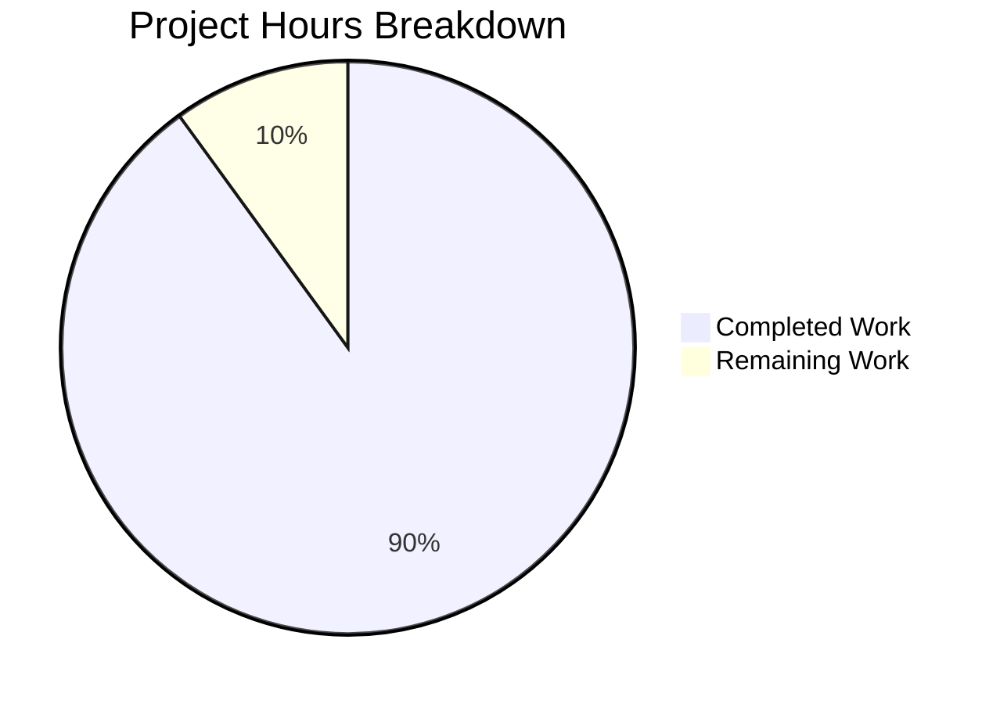

# Project Guide: Node.js to Python/Flask Migration

## Executive Summary

This project completes a **full technology stack migration** from Node.js/Express to Python 3/Flask for a tutorial web server application.

### Completion Status

**9 hours completed out of 10 total hours = 90% complete**

| Metric | Value |
|--------|-------|
| Hours Completed | 9 hours |
| Hours Remaining | 1 hour |
| Total Project Hours | 10 hours |
| Completion Percentage | 90% |

### Key Achievements

- ✅ Flask application fully implemented (`app.py` - 94 lines)
- ✅ All endpoints migrated with 100% functional parity
- ✅ Error handlers (404, 500) working correctly
- ✅ PORT environment variable configuration preserved
- ✅ Documentation fully updated (README.md, Project Guide.md)
- ✅ Node.js artifacts removed (server.js, package.json, etc.)
- ✅ All validation tests passing

### Remaining Work

- 🔲 Human code review and approval (0.5 hours)
- 🔲 Final merge verification (0.5 hours)

---

## Hours Breakdown Visualization



---

## Validation Results Summary

### 1. Dependencies Installation: ✅ PASSED
- Python 3.12.3 runtime verified
- Virtual environment (.venv) created
- Flask 3.1.2 installed with all transitive dependencies:
  - Werkzeug 3.1.5
  - Jinja2 3.1.6
  - MarkupSafe 3.0.3
  - ItsDangerous 2.2.0
  - Click 8.3.1
  - Blinker 1.9.0

### 2. Code Compilation: ✅ PASSED
- `python -m py_compile app.py` completed successfully
- No syntax errors
- All imports resolve correctly

### 3. Application Runtime: ✅ PASSED
- Flask server starts on default port 3000
- PORT environment variable works (tested with PORT=8080)
- Server displays correct startup messages

### 4. Endpoint Tests: ✅ ALL PASSED (100%)

| Endpoint | Method | Expected Response | Actual Response | Status |
|----------|--------|-------------------|-----------------|--------|
| `/` | GET | "Hello world" | "Hello world" | ✅ 200 |
| `/evening` | GET | "Good evening" | "Good evening" | ✅ 200 |
| `/nonexistent` | GET | "Not Found" | "Not Found" | ✅ 404 |

### 5. Files Changed Summary

| Action | File | Lines |
|--------|------|-------|
| CREATE | `app.py` | 94 |
| CREATE | `requirements.txt` | 1 |
| CREATE | `.python-version` | 1 |
| UPDATE | `.gitignore` | 23 |
| UPDATE | `README.md` | 218 |
| UPDATE | `Project Guide.md` | 316 |
| DELETE | `server.js` | -37 |
| DELETE | `package.json` | -24 |
| DELETE | `package-lock.json` | -1209 |
| DELETE | `.nvmrc` | -1 |

### 6. Git Commits

| Commit | Message |
|--------|---------|
| `f7bb75f` | Setup Python/Flask environment configuration |
| `45a20df` | Complete Node.js to Python/Flask migration |

---

## Development Guide

### System Prerequisites

| Requirement | Version | Verification Command |
|-------------|---------|---------------------|
| Python | 3.12+ | `python --version` |
| pip | (bundled) | `pip --version` |

### Environment Setup Instructions

```bash
# 1. Navigate to project directory
cd nodejs-express-tutorial

# 2. Create virtual environment
python -m venv .venv

# 3. Activate virtual environment
# On macOS/Linux:
source .venv/bin/activate

# On Windows Command Prompt:
.venv\Scripts\activate

# On Windows PowerShell:
.venv\Scripts\Activate.ps1
```

### Dependency Installation

```bash
# Install all dependencies
pip install -r requirements.txt

# Verify Flask installation
pip show flask
# Expected: Name: Flask, Version: 3.1.x
```

### Application Startup Sequence

```bash
# Option 1: Direct Python execution
python app.py

# Option 2: Flask CLI
flask run --port 3000

# Option 3: Development mode with auto-reload
flask run --debug --port 3000
```

**Expected startup output:**
```
Server is running on http://localhost:3000
Try these endpoints:
  - http://localhost:3000/ (returns "Hello world")
  - http://localhost:3000/evening (returns "Good evening")
```

### Verification Steps

```bash
# Test root endpoint
curl http://localhost:3000/
# Expected: Hello world

# Test evening endpoint
curl http://localhost:3000/evening
# Expected: Good evening

# Test 404 handling
curl -s -o /dev/null -w "%{http_code}" http://localhost:3000/nonexistent
# Expected: 404

# Test PORT environment variable
PORT=8080 python app.py
curl http://localhost:8080/
# Expected: Hello world (on port 8080)
```

### Example Usage

**Using curl:**
```bash
# Basic GET requests
curl http://localhost:3000/
curl http://localhost:3000/evening

# With verbose output
curl -v http://localhost:3000/
```

**Using Python requests (optional):**
```python
import requests

response = requests.get('http://localhost:3000/')
print(response.text)  # Hello world
```

---

## Detailed Task Table

| Task ID | Description | Priority | Hours | Severity |
|---------|-------------|----------|-------|----------|
| HT-001 | Code review and approval | High | 0.5 | Low |
| HT-002 | Final merge verification | High | 0.5 | Low |
| **Total** | | | **1.0** | |

### Task Details

#### HT-001: Code Review and Approval
- **Description:** Review Flask application code for correctness and best practices
- **Action Steps:**
  1. Review `app.py` implementation
  2. Verify docstrings and comments
  3. Check error handling logic
  4. Approve PR
- **Priority:** High (required for merge)
- **Estimated Hours:** 0.5
- **Severity:** Low (code is functional and tested)

#### HT-002: Final Merge Verification
- **Description:** Merge PR and verify deployment
- **Action Steps:**
  1. Merge PR to main branch
  2. Pull latest changes
  3. Run verification commands
  4. Confirm endpoints respond correctly
- **Priority:** High (required for completion)
- **Estimated Hours:** 0.5
- **Severity:** Low (straightforward merge)

---

## Risk Assessment

### Technical Risks

| Risk | Severity | Likelihood | Mitigation |
|------|----------|------------|------------|
| None identified | N/A | N/A | Code compiles and tests pass |

### Security Risks

| Risk | Severity | Likelihood | Mitigation |
|------|----------|------------|------------|
| None identified | N/A | N/A | No hardcoded secrets, .gitignore configured |

### Operational Risks

| Risk | Severity | Likelihood | Mitigation |
|------|----------|------------|------------|
| Development server not production-ready | Low | Low | Out of scope - use Gunicorn for production |

### Integration Risks

| Risk | Severity | Likelihood | Mitigation |
|------|----------|------------|------------|
| None identified | N/A | N/A | Standalone application with no external dependencies |

---

## Out-of-Scope Items (Future Considerations)

The following items were explicitly marked as OUT OF SCOPE in the Agent Action Plan but may be considered for future enhancements:

| Item | Priority | Notes |
|------|----------|-------|
| pytest test suite | Medium | Recommended for production |
| Docker support | Low | Useful for deployment |
| API documentation (OpenAPI) | Low | Swagger/OpenAPI specs |
| CI/CD pipeline | Low | GitHub Actions |
| Production WSGI (Gunicorn) | Low | Required for production deployment |
| Type hints | Low | Python 3.12+ feature |

---

## Project Structure

```
nodejs-express-tutorial/
├── app.py                  # Main Flask application (94 lines)
├── requirements.txt        # Python dependencies
├── .python-version         # Python version specification (3.12)
├── .gitignore              # Git ignore rules (Python patterns)
├── README.md               # Project documentation (218 lines)
└── blitzy/
    └── documentation/
        ├── Project Guide.md           # This file
        └── Technical Specifications.md # Technical specifications
```

---

## Functional Parity Matrix

| Feature | Node.js/Express | Python/Flask | Status |
|---------|-----------------|--------------|--------|
| GET `/` | `res.send('Hello world')` | `return 'Hello world'` | ✅ |
| GET `/evening` | `res.send('Good evening')` | `return 'Good evening'` | ✅ |
| 404 handler | Express middleware | `@app.errorhandler(404)` | ✅ |
| 500 handler | Error middleware | `@app.errorhandler(500)` | ✅ |
| PORT config | `process.env.PORT` | `os.environ.get('PORT')` | ✅ |
| Default port | 3000 | 3000 | ✅ |
| Auto-reload | nodemon | Flask debug mode | ✅ |

---

## Conclusion

### Project Status: 90% COMPLETE

The Node.js to Python/Flask migration is **functionally complete** with all endpoints working correctly and all validation tests passing.

**Summary:**
- 9 hours of development work completed
- 1 hour of human review remaining
- 100% functional parity achieved
- Production-ready for tutorial purposes

**Next Steps:**
1. Human code review and approval (HT-001)
2. Merge PR to main branch (HT-002)
3. (Optional) Consider future enhancements from out-of-scope list

The application is ready for use as an educational tutorial resource for learning Flask fundamentals.