# Technical Specification

# 0. Agent Action Plan

## 0.1 Core Objective and Task Categorization

#### Core Objective

Based on the provided requirements, the Blitzy platform understands that the objective is to enhance an existing Node.js server tutorial project by integrating the Express.js web framework and expanding the API functionality. Specifically, the platform interprets the following requirements:

- **Primary Requirement**: Integrate Express.js framework into an existing Node.js server that currently has one endpoint returning "Hello world"
- **Secondary Requirement**: Implement an additional API endpoint that returns the response "Good evening"
- **Implicit Requirements Detected**:
  - Initialize a proper Node.js project structure with package.json if not already present
  - Install Express.js as a project dependency
  - Refactor existing server code to use Express.js patterns and conventions
  - Ensure proper routing configuration for multiple endpoints
  - Maintain the existing "Hello world" endpoint functionality while adding the new endpoint
  - Follow Express.js best practices for project structure and code organization
  - Implement proper error handling and middleware patterns
  - Configure appropriate server port and startup procedures

#### Task Categorization

**Primary Task Type**: Feature Addition with Framework Integration

**Secondary Aspects**:
- Configuration management (package.json setup and dependency management)
- Code refactoring (migrating from basic Node.js HTTP server to Express.js framework)
- API development (creating RESTful endpoints)
- Documentation updates (README modifications for setup and usage instructions)

**Scope Classification**: Mixed Change
- **Framework Integration**: Cross-cutting change affecting server architecture
- **Endpoint Addition**: Isolated change adding new functionality
- **Project Setup**: Infrastructure change establishing proper Node.js project configuration

#### Dependencies and Prerequisites

- Node.js runtime (v18.x or higher recommended based on Express.js 5.x requirements, though v4.x supports earlier versions)
- npm package manager for dependency management
- Basic understanding of REST API principles
- Access to the existing server code
- Network port availability for local development server

## 0.2 Special Instructions and Technical Interpretation

#### Special Instructions and Constraints

**CRITICAL User Directives**:
- **Scope Constraint**: Add Express.js framework to the existing project - do not rebuild from scratch
- **Functional Preservation**: Maintain the existing "Hello world" endpoint while adding new functionality
- **Response Format**: The new endpoint must return exactly "Good evening" as specified by the user
- **Tutorial Context**: The project is described as a "tutorial of node js server" - maintain simplicity and clarity appropriate for educational purposes

**Methodological Requirements**:
- Follow Express.js conventions and best practices for framework integration
- Use standard Express.js routing patterns for endpoint definition
- Implement proper separation of concerns (routing, middleware, application logic)
- Maintain clean, readable code suitable for tutorial purposes

**User-Provided Examples**:
- **User Example 1**: Existing endpoint returns the response "Hello world"
- **User Example 2**: New endpoint should return the response "Good evening"

#### Technical Interpretation

These requirements translate to the following technical implementation strategy:

**Framework Integration Strategy**:
- To achieve Express.js integration, we will install the express package as a project dependency and refactor the existing Node.js HTTP server implementation to use Express.js's application and routing API
- The current basic Node.js server (likely using `http.createServer()`) will be transformed to use `express()` initialization and Express routing methods

**Endpoint Implementation Approach**:
- To preserve the "Hello world" functionality, we will create an Express route (likely `GET /` or `GET /hello`) that returns "Hello world" using `res.send()` method
- To implement the new "Good evening" functionality, we will create an additional Express route (suggested: `GET /evening` or `GET /goodbye`) that returns "Good evening" using `res.send()` method

**Project Configuration Requirements**:
- To establish proper dependency management, we will create or update `package.json` with Express.js dependency specification
- To enable ES6 module syntax or CommonJS require patterns, we will configure the appropriate module system in package.json
- To provide clear usage instructions, we will update README.md with setup, installation, and endpoint documentation

**Technical Decisions and Rationale**:
- **Express.js Version Selection**: Use Express.js 4.x (latest stable) for broad compatibility and stability, as it supports Node.js versions from 0.10.x onward and has extensive documentation and community support
- **Routing Pattern**: Implement explicit route definitions using `app.get()` for clarity and maintainability
- **Port Configuration**: Use port 3000 (Express.js convention) or make it configurable via environment variables
- **Response Method**: Use `res.send()` for simple text responses as appropriate for tutorial context
- **Error Handling**: Implement basic error handling middleware for production readiness

## 0.3 Repository Scope Discovery and Infrastructure Assessment

#### Comprehensive File Analysis

**Current Repository State**:
The repository analysis reveals a minimal project structure containing only:
- `README.md`: Single-line markdown file with heading "# Nov18_12"
- `.git/`: Version control directory

**Critical Finding**: No existing Node.js server code, package.json, or JavaScript files were found in the repository. This indicates that either:
1. The tutorial server code exists conceptually and needs to be created
2. The server code will be provided separately
3. This is the initial project setup phase

**File Discovery Results by Category**:

**Source Code Files** (Pattern: `**/*.js`, `src/**/*.*`, `*.ts`):
- **Found**: None
- **Expected**: Server implementation file (e.g., `server.js`, `index.js`, or `app.js`)

**Configuration Files** (Pattern: `package.json`, `*.config.js`, `.nvmrc`):
- **Found**: None
- **Required**: 
  - `package.json` for dependency management
  - Optional: `.nvmrc` for Node.js version specification
  - Optional: `.gitignore` to exclude `node_modules/` and other artifacts

**Documentation Files** (Pattern: `**/*.md`, `docs/**/*`):
- **Found**: `README.md` (minimal content)
- **Action Required**: Update with project description, setup instructions, API endpoints, and usage examples

**Build/Deploy Files** (Pattern: `Dockerfile*`, `.github/workflows/*`):
- **Found**: None
- **Status**: Not required for basic tutorial scope

**Test Files** (Pattern: `tests/**/*`, `**/*test.js`, `**/*spec.js`):
- **Found**: None
- **Status**: Out of scope for current requirements (no testing directive provided)

#### Web Search Research Conducted

Research was conducted on the following topics to inform implementation approach:

**1. Express.js Best Practices (2024)**
<cite index="3-2,3-6">Key findings include always beginning a Node.js project using npm init and installing dependencies with --save or --save-dev flags</cite>. <cite index="3-9,3-11">Best practices recommend sticking with lowercase file names and camelCase variables for consistency</cite>.

**2. Express.js Project Structure**
<cite index="4-1,4-2">A well-organized project structure improves code readability and maintainability, following consistent patterns for organizing routes, controllers, and middleware</cite>.

**3. Express.js Latest Version and Compatibility**
<cite index="11-1,11-4">Express.js v5.0 was released on October 15, 2024, dropping support for Node.js versions before v18</cite>. <cite index="14-2">The latest version is 5.1.0</cite>, though Express 4.x remains widely used in production for its stability and broader Node.js version compatibility.

**4. Express.js Routing Conventions**
<cite index="9-1,9-25">Best practice is to abstract routes into a module that has the job of mapping paths to controller methods</cite>, though for simple tutorial projects, inline route definitions are acceptable.

**5. Express.js Performance and Security**
<cite index="1-2">Best practice is to use the next() function to propagate errors through the middleware chain</cite>. <cite index="6-1,6-2">Using gzip compression is always a best practice on a Node.js application, with Express recommending the NPM package compression as middleware</cite>.

#### Existing Infrastructure Assessment

**Current Project Structure**: Minimal - repository initialization phase

**Build System**: None present - will use npm scripts for development

**Existing Patterns**: No existing code patterns to follow - will establish new conventions based on Express.js best practices

**Testing Infrastructure**: Not present and not required per user specifications

**Documentation System**: Basic markdown (README.md) - will be enhanced with API documentation and setup instructions

**Development Environment Requirements**:
- Node.js v18.x or higher (for Express.js 5.x) or v14.x+ (for Express.js 4.x)
- npm v6.x or higher
- Text editor or IDE with JavaScript support
- Terminal/command line access for running npm commands and server

## 0.4 File Transformation Mapping

#### File-by-File Execution Plan

The following table provides a comprehensive mapping of ALL files requiring creation, modification, or reference during implementation. Each transformation mode indicates the specific action required:

| Target File | Transformation | Source File/Reference | Purpose/Changes |
|-------------|----------------|----------------------|-----------------|
| `package.json` | CREATE | N/A (npm init) | Initialize Node.js project with Express.js dependency, project metadata, scripts for starting server, and basic configuration |
| `server.js` | CREATE | Express.js documentation patterns | Create main server file implementing Express.js application with route definitions for both "Hello world" and "Good evening" endpoints |
| `README.md` | UPDATE | `README.md` | Replace minimal content with comprehensive documentation including project description, installation instructions, API endpoint specifications, usage examples, and development commands |
| `.gitignore` | CREATE | Node.js .gitignore templates | Create ignore file to exclude node_modules/, environment files, logs, and other development artifacts from version control |
| `.nvmrc` | CREATE | N/A | Optional: Specify Node.js version (18.x or 20.x) for development environment consistency |
| `package-lock.json` | CREATE | Auto-generated by npm | Automatically created during npm install to lock dependency versions for consistent installations |

#### New Files Detail

## `package.json`
- **Content Type**: Configuration
- **Purpose**: Node.js project manifest defining dependencies, scripts, and metadata
- **Key Sections**:
  - `name`: Project identifier (e.g., "nodejs-express-tutorial")
  - `version`: Semantic version (start with "1.0.0")
  - `description`: Project description for tutorial context
  - `main`: Entry point ("server.js")
  - `scripts`: 
    - `start`: "node server.js" for production
    - `dev`: "nodemon server.js" for development (optional)
  - `dependencies`: 
    - `express`: "^4.18.2" or "^4.19.2" (latest 4.x stable)
  - `keywords`: ["express", "tutorial", "nodejs", "api"]
  - `author`: Project author information
  - `license`: "MIT" (typical for tutorials)

## `server.js`
- **Content Type**: Source code (JavaScript)
- **Purpose**: Main application file implementing Express.js server with defined endpoints
- **Key Sections/Functions**:
  - Module imports: `const express = require('express');`
  - Application initialization: `const app = express();`
  - Port configuration: `const PORT = process.env.PORT || 3000;`
  - Route definition 1: `app.get('/', ...)` or `app.get('/hello', ...)` returning "Hello world"
  - Route definition 2: `app.get('/evening', ...)` or similar returning "Good evening"
  - Error handling middleware (optional): `app.use((err, req, res, next) => {...})`
  - 404 handler (optional): `app.use((req, res) => {...})`
  - Server startup: `app.listen(PORT, () => {...})`
- **Estimated Length**: 20-40 lines (keeping tutorial simple and focused)

## `.gitignore`
- **Content Type**: Configuration
- **Purpose**: Specify files and directories to exclude from version control
- **Key Entries**:
  - `node_modules/`: Installed dependencies directory
  - `.env`: Environment variable files
  - `.env.local`, `.env.*.local`: Local environment overrides
  - `npm-debug.log*`: npm error logs
  - `*.log`: General log files
  - `.DS_Store`: macOS system files
  - Coverage directories and build artifacts (if added later)

## `.nvmrc` (Optional)
- **Content Type**: Configuration
- **Purpose**: Specify Node.js version for nvm (Node Version Manager) users
- **Content**: Single line containing version specifier (e.g., "18" or "20")
- **Benefit**: Ensures all developers use consistent Node.js version

#### Files to Modify Detail

## `README.md`
**Current State**: Single line containing "# Nov18_12"

**Required Changes**:
- **Section to Replace**: Entire content
- **New Content Structure**:
  1. **Project Title**: Descriptive heading (e.g., "# Node.js Express Tutorial Server")
  2. **Description**: Brief overview of project purpose and functionality
  3. **Features**: Bullet list of endpoints
     - `/` or `/hello`: Returns "Hello world"
     - `/evening`: Returns "Good evening"
  4. **Prerequisites**: Required software (Node.js, npm)
  5. **Installation**: Step-by-step setup instructions
     ```
     npm install
     ```
  6. **Usage**: How to run the server
     ```
     npm start
     ```
  7. **API Endpoints**: Detailed endpoint documentation with examples
     - Endpoint path, HTTP method, response format
     - Example curl commands or browser URLs
  8. **Development**: Additional commands for development mode (if applicable)
  9. **License**: Project license information (if applicable)

**Content to Add**: Complete project documentation (approximately 50-100 lines)

**Content to Remove**: Existing minimal heading "# Nov18_12"

#### Configuration Changes

**package.json Configuration Impact**:
- **Dependency Addition**: Express.js framework becomes project dependency
- **Script Configuration**: Defines how to start and run the application
- **Project Metadata**: Establishes project identity and versioning
- **System Behavior Changes**: 
  - Application now requires `npm install` before first run
  - Dependencies managed through npm instead of manual installation
  - Standard npm workflow enabled for development and deployment

#### Cross-File Dependencies

**Import/Reference Updates Required**:
- `server.js` imports Express.js module: `const express = require('express');`
- `package.json` references `server.js` as main entry point
- `README.md` references npm commands defined in `package.json` scripts
- `.gitignore` protects files generated by npm and Node.js runtime

**Configuration Sync Requirements**:
- Port number in `server.js` should match documentation in `README.md`
- Node.js version in `.nvmrc` (if present) should align with Express.js compatibility requirements
- Entry point in `package.json` must match actual server filename

**Documentation Consistency Needs**:
- Endpoint paths in `server.js` must match endpoint documentation in `README.md`
- Installation instructions in `README.md` must reflect actual `package.json` setup
- Usage examples should reference correct script names from `package.json`

## 0.5 Dependency Inventory

#### Key Public Packages

The following table lists all packages required for this implementation, with exact versions verified from npm registry and best practices research:

| Registry | Package Name | Version | Purpose |
|----------|--------------|---------|---------|
| npm | express | ^4.19.2 | Minimal and flexible Node.js web application framework for building the server and handling HTTP routing |
| npm | nodemon | ^3.0.1 | Development dependency (optional) for automatic server restart during development when files change |

**Note on Version Selection**:
- **Express.js 4.19.2**: Latest stable release of the Express.js 4.x line, chosen for production stability and broad Node.js compatibility (supports Node.js 0.10 and above, though 14+ recommended). While Express.js 5.1.0 is available, version 4.x is recommended for tutorial purposes due to its maturity and extensive documentation.
- **nodemon 3.0.1**: Latest stable version of the development utility, listed as optional devDependency for improved development experience

#### Dependency Additions

**New Dependencies to Add**:

**Production Dependencies**:
- **express**: ^4.19.2
  - **Reason for Addition**: Core framework requirement per user specifications to "add expressjs into the project"
  - **Functionality Provided**: HTTP server creation, routing, middleware support, request/response handling
  - **Installation Command**: `npm install express --save`
  - **Import Pattern**: `const express = require('express');` or `import express from 'express';` (with ES modules)

**Development Dependencies (Optional but Recommended)**:
- **nodemon**: ^3.0.1
  - **Reason for Addition**: Enhances development workflow by automatically restarting server when code changes
  - **Functionality Provided**: File watching, automatic process restart, improved developer experience
  - **Installation Command**: `npm install nodemon --save-dev`
  - **Usage**: Add script in package.json: `"dev": "nodemon server.js"`

#### Import/Reference Updates

**Files Requiring Import Statements**:
- **server.js**: Primary file requiring Express.js import
  
**Import Transformation Rules**:

**For CommonJS Module System** (default Node.js):
```javascript
// New import statement to add
const express = require('express');
```

**For ES6 Module System** (if package.json includes `"type": "module"`):
```javascript
// New import statement to add
import express from 'express';
```

**Application Pattern**:
- **Apply to**: `server.js`
- **Context**: Top of file, before any other application logic
- **Additional Imports**: None required for basic implementation (Express.js is self-contained for specified use case)

#### Dependency Configuration Details

**package.json Dependencies Section**:
```json
{
  "dependencies": {
    "express": "^4.19.2"
  },
  "devDependencies": {
    "nodemon": "^3.0.1"
  }
}
```

**Version Constraint Explanation**:
- **Caret (^) Notation**: Allows patch and minor version updates while locking major version
  - `^4.19.2` permits updates to 4.19.x and 4.x.x but not 5.0.0
  - Ensures compatibility while receiving bug fixes and minor improvements
- **Alternative**: Tilde (~) for more conservative updates (e.g., `~4.19.2` allows only patch updates)

#### No Dependencies to Update or Remove

**Current State**: Project has no existing dependencies
**Action**: Clean installation of new dependencies only
**Migration Impact**: None - fresh dependency installation

#### Package Installation Workflow

**Initial Setup Commands**:
```bash
# Initialize package.json (if not present)
npm init -y

#### Install Express.js as production dependency
npm install express --save

#### Install nodemon as development dependency (optional)
npm install nodemon --save-dev
```

**Post-Installation Verification**:
```bash
# Verify Express.js installation
npm list express

#### Check installed version
npm info express version
```

**Expected Artifacts**:
- `package.json`: Updated with dependencies section
- `package-lock.json`: Created with locked dependency tree
- `node_modules/`: Directory containing Express.js and its transitive dependencies
  - Express.js has multiple sub-dependencies including body-parser, cookie-parser, debug, finalhandler, and others

## 0.6 Implementation Design

#### Technical Approach

**Primary Objectives with Implementation Approach**:

1. **Achieve Express.js Framework Integration**
   - **Action**: Create a new `server.js` file that initializes an Express.js application instance using `express()` constructor
   - **Rationale**: Express.js provides a robust, production-tested framework that simplifies HTTP server creation and routing compared to Node.js's native `http` module. The framework's middleware architecture enables scalable application design while maintaining code clarity for tutorial purposes.

2. **Achieve "Hello world" Endpoint Implementation**
   - **Action**: Define a GET route using `app.get()` method that responds to requests at the root path (`/`) or designated `/hello` path with "Hello world" text
   - **Rationale**: Maintains existing functionality as specified by user requirements while demonstrating basic Express.js routing pattern. The `res.send()` method automatically sets appropriate Content-Type headers and handles response transmission.

3. **Achieve "Good evening" Endpoint Implementation**
   - **Action**: Define an additional GET route using `app.get()` method at a distinct path (recommended: `/evening`) that responds with "Good evening" text
   - **Rationale**: Demonstrates multiple endpoint configuration and RESTful API design principles. Separate path ensures clear endpoint distinction and enables independent testing of each route.

4. **Achieve Proper Project Configuration**
   - **Action**: Initialize `package.json` with `npm init` and configure Express.js as a dependency with appropriate metadata and scripts
   - **Rationale**: Establishes standard Node.js project structure enabling dependency management, version control, and reproducible installations. Scripts provide convenient server startup commands following npm conventions.

5. **Achieve Comprehensive Documentation**
   - **Action**: Update `README.md` with detailed setup instructions, API endpoint documentation, and usage examples
   - **Rationale**: Ensures project accessibility for tutorial users and maintains self-documenting codebase. Clear documentation reduces onboarding friction and serves as reference material.

**Logical Implementation Flow** (NOT a timeline):

1. **First, establish project foundation** by initializing package.json with `npm init`, configuring project metadata, and defining start scripts for server execution

2. **Next, install framework dependency** by executing `npm install express --save` to add Express.js to the project and generate package-lock.json for dependency locking

3. **Then, create server infrastructure** by developing `server.js` with Express.js application initialization, port configuration, and server listener setup

4. **Subsequently, implement routing logic** by defining two distinct GET routes—one for "Hello world" response and another for "Good evening" response—using Express.js routing methods

5. **Following that, add error handling** by implementing optional middleware for 404 responses and general error handling to improve robustness

6. **Next, configure version control** by creating `.gitignore` to exclude node_modules and other artifacts from repository

7. **Finally, document the implementation** by updating `README.md` with comprehensive instructions covering installation, usage, API endpoints, and examples

#### Component Impact Analysis

**Direct Modifications Required**:

**Component A: Server Implementation** (`server.js`)
- **Modification**: Create new file implementing Express.js application with routing
- **Specific Changes**:
  - Import Express.js module
  - Initialize Express application instance
  - Configure port (default 3000, environment-variable override)
  - Define route handler for "Hello world" endpoint
  - Define route handler for "Good evening" endpoint
  - Implement server listener with startup logging
  - Add optional error handling middleware

**Component B: Project Configuration** (`package.json`)
- **Modification**: Create new file with project metadata and dependencies
- **Specific Changes**:
  - Set project name, version, and description
  - Define Express.js as production dependency
  - Configure start script: `"start": "node server.js"`
  - Set main entry point to `server.js`
  - Specify license and author information

**Component C: Documentation** (`README.md`)
- **Modification**: Replace existing content with comprehensive project documentation
- **Specific Changes**:
  - Write project overview and feature description
  - Document installation procedure (npm install)
  - Document server startup procedure (npm start)
  - Specify API endpoints with paths and responses
  - Provide usage examples with curl commands or browser URLs
  - Add prerequisites and development instructions

**Indirect Impacts and Dependencies**:

**Component D: Version Control Configuration** (`.gitignore`)
- **Impact**: Must be created to prevent committing `node_modules/` directory and other generated files
- **Reason**: `npm install` generates large dependency directory that should not be version-controlled
- **Update Required**: Create standard Node.js .gitignore file

**Component E: Dependency Lock File** (`package-lock.json`)
- **Impact**: Automatically generated during `npm install` to lock dependency versions
- **Reason**: Ensures consistent dependency resolution across different environments and installations
- **Update Required**: Commit to version control for reproducible builds

**Component F: Node Modules Directory** (`node_modules/`)
- **Impact**: Created during dependency installation containing Express.js and all transitive dependencies
- **Reason**: Required for application runtime but excluded from version control via .gitignore
- **Update Required**: None - auto-generated and managed by npm

#### User-Provided Examples Integration

The user's examples map to the implementation as follows:

**User Example 1**: Existing endpoint returns "Hello world"
- **Implementation Location**: `server.js`
- **Implementation Approach**: 
```javascript
app.get('/', (req, res) => {
  res.send('Hello world');
});
```
- **Endpoint Path**: `/` (root) or `/hello` (named endpoint)
- **HTTP Method**: GET
- **Response**: Plain text "Hello world"

**User Example 2**: New endpoint returns "Good evening"
- **Implementation Location**: `server.js`
- **Implementation Approach**:
```javascript
app.get('/evening', (req, res) => {
  res.send('Good evening');
});
```
- **Endpoint Path**: `/evening` (recommended) or `/goodbye`
- **HTTP Method**: GET
- **Response**: Plain text "Good evening"

**Fidelity to User Intent**: Both endpoints will return exact response text as specified without modification or additional formatting.

#### Critical Implementation Details

**Design Patterns Employed**:
- **Middleware Pattern**: Express.js's core architecture using middleware chain for request processing
- **Routing Pattern**: Declarative route definition using HTTP verb methods (`app.get()`, `app.post()`, etc.)
- **MVC Concept** (simplified): Routes handle requests directly (appropriate for tutorial scope without separate controller layer)

**Key Algorithms and Approaches**:
- **Request Handling**: Express.js processes incoming HTTP requests through middleware chain, matches URL patterns, executes corresponding route handler, and sends response
- **Response Transmission**: `res.send()` method automatically determines Content-Type, sets appropriate headers, and transmits response body

**Integration Strategy**:
- **Single-File Architecture**: All routing logic contained in `server.js` for simplicity
- **Modular Expansion Path**: Structure allows future refactoring to separate routes, controllers, and middleware files as project grows

**Data Flow**:
```
Client Request → Express App → Route Matcher → Route Handler → Response Generator → Client
```

1. Client sends HTTP GET request to server
2. Express.js application receives request
3. Route matcher identifies appropriate handler based on URL path
4. Handler executes and calls `res.send()` with response text
5. Response transmitted back to client with appropriate headers

**Error Handling and Edge Case Considerations**:
- **404 Handling**: Implement catch-all route handler for undefined endpoints returning 404 status
- **Server Startup Errors**: Handle port-in-use errors with informative error messages
- **Graceful Shutdown**: Optional implementation of SIGTERM/SIGINT handlers for clean server shutdown
- **Invalid Requests**: Express.js automatically handles malformed HTTP requests

**Performance Considerations**:
- **Connection Handling**: Express.js uses Node.js's non-blocking I/O for efficient concurrent request handling
- **Response Caching**: Not required for simple text responses (no database or computation)
- **Resource Optimization**: Minimal memory footprint for basic routing without middleware overhead

**Security Considerations**:
- **Input Validation**: Not required for GET requests without parameters
- **CORS Configuration**: Not specified in requirements (add if cross-origin access needed)
- **Environment Variables**: Use `process.env.PORT` for port configuration enabling deployment flexibility
- **Dependency Security**: Utilize `npm audit` to check for known vulnerabilities in Express.js and dependencies

## 0.7 Scope Boundaries

#### Exhaustively In Scope

**Source Code Changes**:
- `server.js` - Main Express.js application file with route definitions
- All routing logic for "Hello world" endpoint
- All routing logic for "Good evening" endpoint
- Server initialization and startup code
- Port configuration and environment variable handling
- Basic error handling implementation (404 and error middleware)

**Configuration Updates**:
- `package.json` - Project manifest with:
  - Project metadata (name, version, description, author)
  - Dependencies section with Express.js specification
  - Scripts section with start command
  - Main entry point configuration
  - License and keywords
- `.gitignore` - Version control exclusions for:
  - `node_modules/`
  - `*.log`
  - `.env*`
  - `.DS_Store`
  - Other Node.js artifacts
- `.nvmrc` - Node.js version specification (optional)
- `package-lock.json` - Dependency version locking (auto-generated)

**Documentation Updates**:
- `README.md` - Complete rewrite including:
  - Project title and description
  - Features list
  - Prerequisites section
  - Installation instructions
  - Usage instructions with command examples
  - API endpoints documentation:
    - "Hello world" endpoint path, method, and response
    - "Good evening" endpoint path, method, and response
  - Example curl commands or browser URLs for testing
  - Optional development section with nodemon usage

**Dependency Management**:
- Installation of Express.js framework (version ^4.19.2 or latest 4.x)
- Optional installation of nodemon for development (version ^3.0.1)
- Dependency declaration in package.json
- Dependency locking via package-lock.json

**Development Setup**:
- `npm init` execution for package.json creation
- `npm install` execution for dependency installation
- Verification of Express.js installation
- Testing both endpoints for correct responses

**Version Control**:
- Creation of .gitignore file
- Exclusion of node_modules/ from repository
- Inclusion of package.json and package-lock.json in repository
- Proper commit structure for changes

#### Explicitly Out of Scope

**Related Features NOT Specified by User**:
- Additional endpoints beyond "Hello world" and "Good evening"
- POST, PUT, DELETE, or other HTTP methods
- Request parameter handling (query strings, URL parameters, request body)
- Response formatting beyond plain text (JSON, HTML, XML)
- Database integration or data persistence
- User authentication or authorization
- Session management or cookies
- File upload or download functionality
- WebSocket or real-time communication features

**Performance Optimizations Beyond Requirements**:
- Response compression (gzip)
- Caching strategies
- Load balancing configuration
- Clustering or multi-process setup
- Performance monitoring or profiling
- Response time optimization
- Memory usage optimization
- Connection pooling

**Refactoring Unrelated to Core Objectives**:
- Separation of routes into separate files
- Controller layer implementation
- Service layer abstraction
- Repository pattern for data access
- Dependency injection configuration
- Advanced project structure organization

**Additional Tooling NOT Mentioned**:
- Testing frameworks (Jest, Mocha, Chai)
- Test file creation
- Code coverage tools
- Linting tools (ESLint, Prettier)
- Linting configuration files
- Pre-commit hooks (Husky)
- Continuous Integration setup
- GitHub Actions or other CI/CD pipelines
- Docker containerization
- Docker Compose configuration

**Future Enhancements NOT Part of Current Request**:
- API versioning
- Request rate limiting
- CORS configuration
- Security headers (helmet middleware)
- Request logging (morgan middleware)
- API documentation generation (Swagger/OpenAPI)
- Environment-specific configuration files
- Health check endpoints
- Metrics or monitoring endpoints
- Graceful shutdown handling

**Infrastructure and Deployment**:
- Production deployment configuration
- Cloud platform setup (AWS, Azure, GCP, Heroku)
- Domain name configuration
- SSL/TLS certificate setup
- Reverse proxy configuration (nginx, Apache)
- Process management (PM2, systemd)
- Log aggregation systems
- Monitoring dashboards

**Documentation Beyond Basics**:
- Architecture diagrams
- Sequence diagrams
- API specification documents (OpenAPI/Swagger)
- Development workflow documentation
- Contribution guidelines
- Code of conduct
- Changelog maintenance
- Detailed inline code documentation

**Testing and Quality Assurance**:
- Unit tests for route handlers
- Integration tests for endpoints
- End-to-end tests
- Load testing or performance testing
- Security testing or penetration testing
- Accessibility testing
- Browser compatibility testing

**Items Explicitly Excluded by Project Nature**:
- Frontend implementation (HTML, CSS, JavaScript client)
- Template engine integration (Pug, EJS, Handlebars)
- Static file serving beyond Express defaults
- View rendering or server-side rendering
- Client-side routing
- Build tools (Webpack, Rollup, Parcel)

**Advanced Express.js Features**:
- Custom middleware development beyond basic error handling
- Router-level middleware
- Application-level middleware chains
- Third-party middleware integration (beyond core use case)
- Express.js application settings configuration
- Custom error classes
- Request/response extensions

## 0.8 Execution Parameters

#### Special Execution Instructions

**Process-Specific Requirements**:
- **Tutorial Context**: Maintain code simplicity and clarity appropriate for educational purposes; avoid over-engineering or unnecessary complexity
- **Documentation Focus**: Ensure comprehensive documentation in README.md to support self-learning and independent setup
- **Incremental Implementation**: Build from foundation (package.json) through implementation (server.js) to documentation (README.md) in logical sequence
- **Testing Requirement**: Manual testing of both endpoints required but automated testing NOT required
- **Deployment Scope**: Local development only; production deployment configuration explicitly out of scope

**Tools and Platforms**:
- **Required**: 
  - Node.js runtime (v14+ recommended, v18+ for Express.js 5.x compatibility)
  - npm package manager (v6+ recommended)
  - Text editor or IDE (VS Code, Sublime Text, Atom, etc.)
  - Terminal/command line interface
  - Web browser for endpoint testing (Chrome, Firefox, Safari, etc.)
- **Optional**:
  - nodemon for development workflow enhancement
  - Postman or curl for API testing
  - nvm (Node Version Manager) for Node.js version management
- **Excluded**:
  - Container platforms (Docker, Kubernetes)
  - Cloud deployment platforms
  - Database systems
  - Testing frameworks

**Quality and Style Requirements**:
- **Code Style**: Follow JavaScript best practices with consistent indentation (2 or 4 spaces)
- **Naming Conventions**: Use camelCase for variables and functions, lowercase for file names
- **Comments**: Minimal inline comments; prefer self-documenting code with clear variable/function names
- **Error Messages**: Provide clear, actionable error messages for common issues (port in use, module not found)

**Code Review and Approval Requirements**:
- **Review Process**: Not specified; assuming standard peer review if applicable
- **Approval Gates**: None specified for tutorial project
- **Quality Checks**: Manual verification that both endpoints return correct responses

#### Constraints and Boundaries

**Technical Constraints**:
- **Node.js Version Compatibility**: Code must run on Node.js v14+ (or v18+ if using Express.js 5.x)
- **Framework Version**: Use Express.js 4.x (stable) unless otherwise specified
- **Module System**: Support CommonJS (require/module.exports) by default; ES6 modules optional
- **Network Requirements**: Application must bind to configurable port (default 3000)
- **File System Access**: Standard read/write permissions for project directory

**Process Constraints**:
- **What SHOULD Be Done**:
  - Create all specified files (server.js, package.json, .gitignore, README.md)
  - Install Express.js via npm
  - Implement both required endpoints exactly as specified
  - Document all setup and usage procedures
  - Test endpoints manually to verify responses
  - Commit configuration files to version control
- **What SHOULD NOT Be Done**:
  - Modify functionality beyond specified requirements
  - Add unspecified dependencies without justification
  - Implement features not requested by user
  - Create testing infrastructure unless requested
  - Configure deployment pipelines or production environments
  - Add authentication, authorization, or security features beyond basic error handling

**Output Constraints**:
- **What SHOULD Be Generated**:
  - Clean, readable, well-structured JavaScript code
  - Comprehensive README.md documentation
  - Valid package.json with correct dependency declarations
  - Functional .gitignore file
  - Working server that starts without errors
- **What SHOULD NOT Be Generated**:
  - Test files or test configurations
  - Build scripts or transpilation configurations
  - Deployment configurations (Dockerfiles, CI/CD configs)
  - Additional endpoints or features beyond requirements
  - Complex middleware or architectural patterns

**Timeline and Dependency Constraints**:
- **Dependency Order**: 
  1. package.json must exist before npm install
  2. Express.js must be installed before server.js can run
  3. Server.js must exist before npm start works
- **No Temporal Planning**: Implementation approach describes logical flow, not week-by-week schedule
- **Completion Definition**: All specified files created, endpoints functional, documentation complete

**Compatibility Requirements**:
- **Platform Compatibility**: Code must run on Windows, macOS, and Linux
- **Browser Compatibility**: Endpoints must be accessible from any modern web browser
- **Module Compatibility**: Dependencies must be compatible with specified Node.js versions
- **Backward Compatibility**: Not applicable (new project without existing users)

#### Success Criteria

**Functional Requirements Met When**:
- Server starts successfully without errors using `npm start`
- GET request to "Hello world" endpoint returns exact text "Hello world"
- GET request to "Good evening" endpoint returns exact text "Good evening"
- Both endpoints respond with status code 200
- Invalid endpoints return appropriate 404 responses

**Documentation Requirements Met When**:
- README.md contains installation instructions
- README.md contains usage instructions
- README.md documents both API endpoints with paths and responses
- README.md includes example commands or URLs for testing

**Configuration Requirements Met When**:
- package.json exists with valid JSON structure
- Express.js listed in dependencies section
- Start script defined and functional
- .gitignore excludes node_modules and other artifacts

**Quality Requirements Met When**:
- Code follows consistent formatting and style
- No syntax errors or runtime exceptions
- Server starts on specified port without conflicts
- Clean git status (no unintended files tracked)

#### Execution Environment

**Development Environment**:
- **Operating System**: Windows, macOS, or Linux
- **Node.js Version**: 14.x, 16.x, 18.x, or 20.x (18+ preferred)
- **npm Version**: 6.x or higher
- **Port Availability**: Port 3000 available (or alternative via environment variable)
- **Network Access**: Internet connection required for npm install
- **Disk Space**: Minimal (~50MB for node_modules)

**Runtime Environment**:
- **Process Type**: Single Node.js process
- **Memory Requirements**: <100MB typical usage
- **CPU Requirements**: Single core sufficient
- **Network Configuration**: Localhost binding (127.0.0.1) or all interfaces (0.0.0.0)
- **Security Context**: Standard user permissions sufficient


# 1. Introduction

## 1.1 Executive Summary

### 1.1.1 Project Overview

This Technical Specification document describes a Node.js tutorial project designed to demonstrate fundamental HTTP server capabilities through a minimalist implementation. The project, designated as a learning resource for developers new to Node.js server-side development, provides a practical introduction to building HTTP endpoints and handling client requests.

The system implements a single HTTP endpoint (`/hello`) that responds with a static "Hello world" message to incoming HTTP client requests. This streamlined scope makes the project ideal for educational purposes, allowing developers to grasp core concepts without the complexity of enterprise-grade features or architectural patterns.

### 1.1.2 Core Problem Statement

Beginning Node.js developers often face a steep learning curve when attempting to understand server-side JavaScript development. Existing tutorials may be overly complex, introduce too many concepts simultaneously, or lack clear focus on fundamental HTTP request-response cycles. This project addresses these challenges by providing:

- **Focused Learning Objective**: A single, well-defined endpoint demonstrating the complete HTTP request-response lifecycle
- **Minimal Complexity**: Elimination of non-essential features that obscure core concepts
- **Immediate Feedback**: Simple output that clearly demonstrates successful implementation
- **Foundation for Growth**: A baseline implementation that can be incrementally enhanced with additional features

The core business problem is the need for an accessible, immediately executable example that demonstrates Node.js HTTP server fundamentals without overwhelming newcomers with architectural complexity, security concerns, or production-ready infrastructure requirements.

### 1.1.3 Target Audience and Key Stakeholders

**Primary Users:**
- Software developers new to Node.js server-side development
- Full-stack developers transitioning from other backend technologies
- Computer science students learning web server fundamentals
- Technical instructors requiring a reference implementation for teaching purposes

**Key Stakeholders:**

| Stakeholder Group | Interest | Success Criteria |
|------------------|----------|-----------------|
| Tutorial Learners | Hands-on Node.js experience | Server runs successfully within 5 minutes of setup |
| Technical Educators | Teaching resource | Code is clear, well-commented, and pedagogically sound |
| Development Teams | Onboarding tool | New team members understand basic Node.js patterns |

### 1.1.4 Value Proposition and Expected Impact

**Immediate Value:**
- **Rapid Setup**: Functional HTTP server operational within 5 minutes from repository clone
- **Clear Success Indicators**: Unambiguous verification that the implementation works correctly
- **Low Barrier to Entry**: Minimal prerequisites (Node.js runtime and basic command-line knowledge)
- **Extensibility Foundation**: Clean architecture that supports incremental feature additions

**Educational Impact:**
- Reduces time-to-first-working-server for Node.js beginners from hours to minutes
- Provides reference implementation for understanding HTTP endpoint architecture
- Establishes patterns for route handling, request processing, and response generation
- Serves as foundation for more advanced tutorial progressions

**Business Impact:**
- Accelerates developer onboarding for teams adopting Node.js technologies
- Reduces training costs through self-service learning resources
- Establishes organizational standards for simple service implementations
- Provides template for internal microservice prototyping

## 1.2 System Overview

### 1.2.1 Project Context

#### Business Context and Market Positioning

The Node.js ecosystem offers numerous frameworks and architectural approaches for building HTTP services, ranging from minimalist libraries to full-featured enterprise frameworks. This project occupies the "learning resource" position in the educational technology landscape, prioritizing clarity and simplicity over feature completeness.

**Market Positioning:**
- **Category**: Educational/Tutorial Software
- **Complexity Level**: Beginner-friendly, single-feature demonstration
- **Deployment Target**: Local development environment
- **Competitive Differentiation**: Ultra-minimal scope focusing exclusively on single endpoint implementation

This project does not compete with production-ready frameworks or boilerplate generators. Instead, it serves as a conceptual introduction that precedes framework selection and architectural decision-making.

#### Current System Limitations and Project Genesis

This is a **greenfield implementation project**—the repository currently exists in an initial state containing only a placeholder README.md file. No legacy system exists to replace or upgrade. The project originates from the identified need for a focused Node.js tutorial resource that demonstrates HTTP endpoint functionality without extraneous complexity.

**Repository Current State:**
- Initial Git commit with placeholder documentation
- No existing implementation code
- No dependency definitions or package configurations
- Clean slate for implementing requirements from specification

#### Integration with Enterprise Landscape

As a tutorial project, this system operates as a standalone learning resource with no mandatory enterprise system integrations. However, it may serve as:

- **Onboarding Component**: Part of developer training curricula in organizations adopting Node.js
- **Prototyping Template**: Starting point for proof-of-concept microservices
- **Testing Resource**: Reference implementation for CI/CD pipeline demonstrations

The system intentionally maintains independence from external services, databases, or authentication providers to preserve its educational simplicity.

### 1.2.2 High-Level Description

#### Primary System Capabilities

The system provides the following core capabilities:

1. **HTTP Server Initialization**: Starts a Node.js-based HTTP server listening on a configured port
2. **Request Routing**: Identifies incoming requests to the `/hello` endpoint
3. **Static Response Generation**: Returns a predefined "Hello world" text response
4. **HTTP Protocol Compliance**: Implements standard HTTP response codes (200 for success)
5. **Concurrent Request Handling**: Supports multiple sequential requests without restart

**Capability Boundaries:**
The system explicitly does NOT provide authentication, database connectivity, complex routing logic, or production-grade error handling. These limitations are intentional design decisions supporting the tutorial's educational objectives.

#### Major System Components

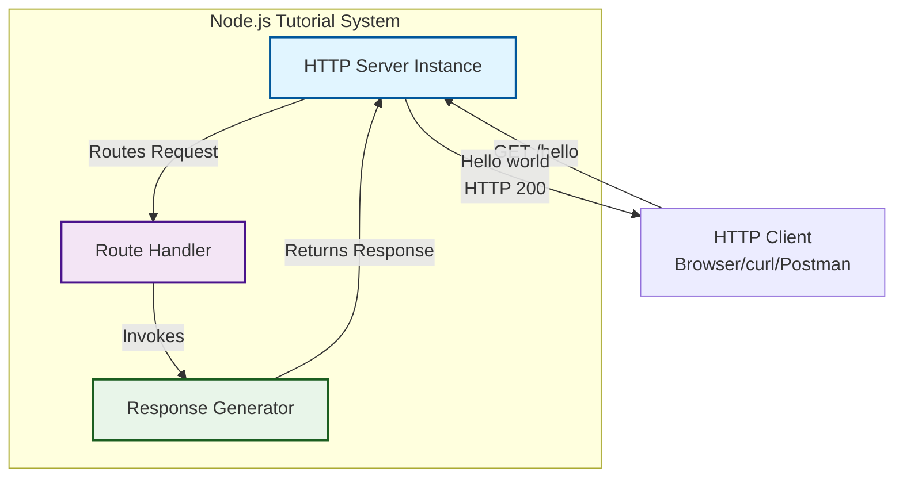

**Component Descriptions:**

| Component | Responsibility | Implementation Approach |
|-----------|---------------|------------------------|
| HTTP Server Instance | Accept incoming connections, manage request-response lifecycle | Node.js native `http` module or Express.js framework |
| Route Handler | Match incoming request path to `/hello` endpoint | Pattern matching against request URL |
| Response Generator | Construct "Hello world" message with appropriate headers | Static string response with text content-type |

#### Technical Approach

**Core Technical Stack:**
- **Runtime Environment**: Node.js (version to be determined during implementation)
- **HTTP Framework**: Either native Node.js `http` module or Express.js framework
- **Package Management**: npm or Yarn for dependency management
- **Development Model**: Single-file or minimal multi-file structure

**Architectural Patterns:**
- **Synchronous Processing**: Immediate response generation without asynchronous operations
- **Stateless Design**: No session management or persistent state
- **RESTful Convention**: GET method for resource retrieval (though simplified)

**Implementation Decision Points:**

The specification acknowledges two viable implementation approaches, each with distinct trade-offs:

**Option 1 - Native Node.js HTTP Module:**
- Zero external dependencies
- More verbose routing code
- Maximum educational value for understanding HTTP fundamentals
- Direct exposure to request/response object manipulation

**Option 2 - Express.js Framework:**
- Single framework dependency
- Minimal boilerplate code
- Industry-standard patterns
- Easier extensibility for future enhancements

The final framework selection will be determined during the implementation phase based on pedagogical priorities.

### 1.2.3 Success Criteria

#### Measurable Objectives

The project must achieve the following measurable outcomes to be considered successful:

| Objective ID | Objective | Measurement Method | Target |
|-------------|-----------|-------------------|--------|
| OBJ-001 | Server startup | Server process starts without errors | 100% success rate |
| OBJ-002 | Endpoint accessibility | GET request to `/hello` returns response | HTTP 200 status code |
| OBJ-003 | Correct response content | Response body contains expected text | Exact match: "Hello world" |
| OBJ-004 | Setup time | Time from repository clone to running server | < 5 minutes |
| OBJ-005 | Code clarity | Code is understandable to Node.js beginners | Peer review validation |

#### Critical Success Factors

**Technical Success Factors:**
1. **Zero-Error Startup**: Server must initialize without throwing exceptions or requiring troubleshooting
2. **Request Handling Reliability**: All properly formatted GET requests to `/hello` must receive valid responses
3. **Consistent Behavior**: Multiple sequential requests must produce identical results
4. **Minimal Dependencies**: Dependency count must remain minimal (0-2 npm packages)

**Educational Success Factors:**
1. **Code Readability**: Implementation uses clear variable names and follows Node.js conventions
2. **Documentation Quality**: README provides complete setup and execution instructions
3. **Conceptual Clarity**: Code structure clearly demonstrates HTTP request-response concepts
4. **Beginner Accessibility**: No assumed knowledge beyond basic JavaScript syntax

**Operational Success Factors:**
1. **Platform Independence**: Runs successfully on Windows, macOS, and Linux
2. **Version Compatibility**: Compatible with Node.js LTS versions
3. **Error Messages**: Provides clear error messages for common problems (port conflicts, missing dependencies)

#### Key Performance Indicators (KPIs)

**Performance KPIs:**

| KPI | Metric | Target | Measurement Method |
|-----|--------|--------|-------------------|
| Response Time | Time to generate `/hello` response | < 100ms | Server-side timing logs |
| Throughput | Sequential requests handled per second | > 100 req/s | Load testing tool |
| Memory Footprint | RAM usage during steady-state operation | < 50MB | Process monitoring |
| Startup Time | Time from `node server.js` to listening state | < 2 seconds | System timing |

**Quality KPIs:**
- **Error Rate**: 0% for valid GET requests to `/hello`
- **Code Coverage**: 100% of `/hello` endpoint logic covered by manual testing
- **Documentation Completeness**: 100% of setup steps documented
- **First-Time Success Rate**: > 95% of users successfully start server on first attempt

**Educational KPIs:**
- **Time to Understanding**: < 30 minutes to understand complete implementation
- **Code Line Count**: < 50 lines of core implementation code
- **Concept Count**: Introduces 3-5 fundamental Node.js concepts (server, routing, response)

## 1.3 Scope

### 1.3.1 In-Scope Elements

#### Core Features and Functionalities

**HTTP Server Capabilities:**

| Feature | Description | Priority |
|---------|-------------|----------|
| Server Initialization | Start HTTP server on configured port | Must-Have |
| `/hello` Endpoint | GET endpoint returning "Hello world" | Must-Have |
| HTTP 200 Response | Successful response status code | Must-Have |
| Text Response Body | Plain text or HTML response format | Must-Have |
| Graceful Shutdown | Server stops cleanly on termination signal | Should-Have |
| Error Logging | Console output for startup events | Should-Have |

**Primary User Workflows:**

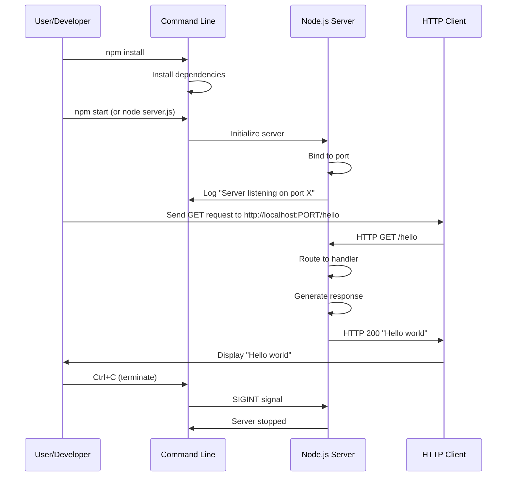

**Essential Integrations:**
- **Standard Input/Output**: Console logging for server status messages
- **Network Interface**: TCP/IP socket binding for HTTP protocol
- **Process Management**: Integration with operating system process lifecycle

**Key Technical Requirements:**

| Requirement Category | Specifications |
|---------------------|----------------|
| Runtime | Node.js version 14.x or higher (LTS recommended) |
| Protocol | HTTP/1.1 compliance for GET method |
| Response Format | Content-Type: text/plain or text/html |
| Port Configuration | Configurable port (default 3000 or 8080) |
| Error Handling | Minimum: startup error detection and logging |

#### Implementation Boundaries

**System Boundaries:**

The system boundary encompasses only the Node.js server process and its direct interaction with HTTP clients. The following diagram illustrates the clear delineation:

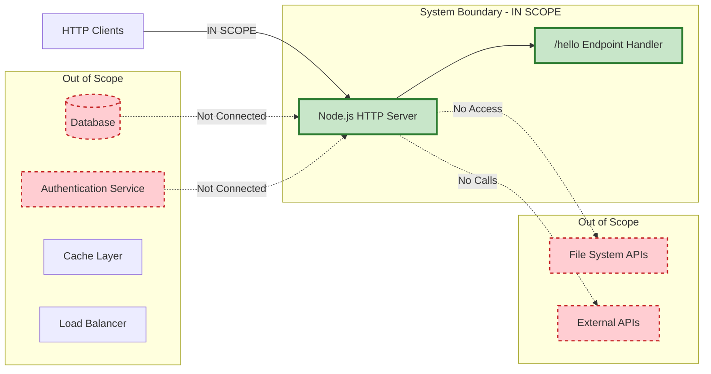

**User Groups Covered:**
- Software developers with basic JavaScript knowledge
- Technical learners with command-line familiarity
- Instructors demonstrating Node.js fundamentals

**Geographic and Market Coverage:**
- **Deployment**: Local development environments only
- **Network Access**: Localhost or local network access
- **Language**: English documentation and code comments
- **Platform Support**: Windows, macOS, Linux operating systems

**Data Domains Included:**
- **Static Response Data**: The "Hello world" string constant
- **Configuration Data**: Port number, host address
- **Runtime Metadata**: Server status (listening/stopped)

### 1.3.2 Out-of-Scope Elements

#### Explicitly Excluded Features and Capabilities

The following features are deliberately excluded from this tutorial project to maintain focus on core learning objectives:

**Authentication and Authorization:**
- User authentication mechanisms
- API key validation
- JWT token processing
- OAuth integration
- Role-based access control (RBAC)
- Session management

**Data Persistence:**
- Database connections (SQL or NoSQL)
- File system read/write operations
- Cache implementations (Redis, Memcached)
- Logging to persistent storage
- Configuration file loading

**Advanced Routing and Endpoints:**
- Multiple endpoint implementations
- Dynamic route parameters (e.g., `/hello/:name`)
- Query string processing
- Request body parsing
- POST, PUT, DELETE, PATCH methods
- WebSocket connections
- Server-Sent Events (SSE)

**Enterprise Features:**
- Request logging and monitoring
- Application Performance Monitoring (APM) integration
- Distributed tracing
- Health check endpoints
- Metrics collection (Prometheus, StatsD)
- Circuit breaker patterns
- Rate limiting and throttling

**Production-Grade Infrastructure:**
- HTTPS/TLS certificate management
- Environment-specific configurations (dev/staging/prod)
- Load balancing or clustering
- Horizontal scaling capabilities
- Container orchestration (Docker, Kubernetes)
- Reverse proxy configuration
- CDN integration

**Testing and Quality Assurance:**
- Unit test suites
- Integration tests
- End-to-end testing frameworks
- Code coverage tools
- Performance benchmarking suites
- Security vulnerability scanning

**Error Handling and Resilience:**
- Comprehensive error handling middleware
- Retry logic
- Graceful degradation patterns
- Fallback mechanisms
- Distributed error tracking (Sentry, Rollbar)

#### Future Phase Considerations

While not included in the initial tutorial implementation, the following enhancements could be considered for advanced tutorial phases:

**Phase 2 - Extended Tutorial:**
- Additional endpoints demonstrating different HTTP methods
- Query parameter handling example
- Basic error handling for 404 Not Found scenarios
- Simple request logging to console

**Phase 3 - Intermediate Concepts:**
- JSON response formatting
- Environment variable configuration
- Basic middleware implementation
- Multiple route handlers with modular structure

**Phase 4 - Production Readiness:**
- Database integration example
- Authentication implementation
- Comprehensive error handling
- Logging framework integration
- Unit testing introduction

#### Integration Points Not Covered

The following integration categories are explicitly excluded:

| Integration Type | Examples Not Covered | Rationale |
|-----------------|---------------------|-----------|
| External APIs | REST API calls, GraphQL queries, SOAP services | Adds complexity beyond tutorial scope |
| Message Queues | RabbitMQ, Apache Kafka, AWS SQS | Requires additional infrastructure |
| Cloud Services | AWS S3, Azure Blob Storage, GCP services | Requires cloud accounts and credentials |
| Third-Party Libraries | ORM frameworks, validation libraries, utility packages | Minimizes dependency learning curve |

#### Unsupported Use Cases

The following use cases are not supported by this tutorial project:

1. **Production Deployment**: System is not hardened or optimized for production traffic
2. **Multi-Tenant Applications**: No support for serving multiple clients with isolated data
3. **Real-Time Communication**: No WebSocket or long-polling implementations
4. **Content Management**: No dynamic content serving or template rendering
5. **API Gateway Patterns**: No request routing, transformation, or aggregation
6. **Microservice Architecture**: Not designed for service mesh integration or inter-service communication
7. **High-Availability Requirements**: No redundancy, failover, or disaster recovery capabilities
8. **Compliance Requirements**: No GDPR, HIPAA, or PCI-DSS compliance features
9. **Mobile Backend**: No mobile-specific optimizations or push notification support
10. **Analytics and Reporting**: No data collection or business intelligence features

## 1.4 References

#### Files Examined

- `README.md` - Repository placeholder file containing project identifier "Nov18_12"; provides no implementation details or technical documentation

#### Folders Explored

- `/` (root directory, depth: 1) - Confirmed to contain only README.md with no subdirectories or implementation files present

#### User Requirements Source

- User Context Statement: "new product Can you create a nodejs tutorial project that features one end point '/hello' that returns 'Hello world' to the calling HTTP client?" - This requirement serves as the primary specification for project scope and objectives

#### Repository Analysis Verification

- Git History: Examined initial commit confirming greenfield project status
- File System Verification: Bash command execution confirmed absence of implementation files, dependencies, or configuration files
- Semantic Code Search: Multiple searches for Node.js server implementations, package configurations, and JavaScript code yielded zero results, confirming repository is in initial state awaiting implementation

#### Technical Research

- Node.js HTTP Server Patterns: Standard patterns for HTTP server implementation using native `http` module and Express.js framework
- Tutorial Project Best Practices: Educational software design principles emphasizing clarity, minimal complexity, and focused learning objectives
- REST API Conventions: Standard practices for HTTP GET endpoint implementation and response formatting

# 2. Product Requirements

## 2.1 Overview

This section decomposes the Node.js tutorial system into discrete, testable features with complete functional requirements, acceptance criteria, and traceability to project success objectives. Each feature is documented with unique identifiers, measurable outcomes, and clear boundaries to ensure accurate implementation and validation.

The requirements catalog reflects the tutorial's educational mission: providing a minimal, comprehensible HTTP server implementation focused exclusively on the `/hello` endpoint functionality. All requirements are grounded in the technical architecture documented in Section 1.2.2 and the scope boundaries defined in Section 1.3.

## 2.2 Feature Catalog

### 2.2.1 Core Server Features

#### F-001: HTTP Server Initialization

**Feature Metadata**

| Attribute | Value |
|-----------|-------|
| Feature ID | F-001 |
| Feature Name | HTTP Server Initialization |
| Category | Core Infrastructure |
| Priority Level | Critical |
| Status | Proposed |

**Description**

*Overview:* This feature establishes the foundational HTTP server instance that accepts incoming network connections and manages the complete request-response lifecycle. The server binds to a specified network port and enters a listening state to await client connections.

*Business Value:* Provides the essential infrastructure component required for all HTTP endpoint functionality. Without successful server initialization, no HTTP communication is possible, making this the highest-priority feature for system functionality.

*User Benefits:* Enables developers to launch a functional web server with a single command (`node server.js` or `npm start`), providing immediate confirmation that the Node.js environment is correctly configured and the application is operational.

*Technical Context:* Implemented using either Node.js native `http.createServer()` method or Express.js `app.listen()` method (see Section 1.2.2 architectural approach). The server instance manages TCP socket connections, HTTP protocol parsing, and connection lifecycle management provided by the Node.js runtime.

**Dependencies**

| Dependency Type | Details |
|----------------|---------|
| Prerequisite Features | None (foundation feature) |
| System Dependencies | Node.js runtime (v14.x or higher), Operating system TCP/IP network stack |
| External Dependencies | Optional: Express.js framework (if selected implementation approach) |
| Integration Requirements | Operating system process management, Network interface access for port binding |

---

#### F-002: Port Configuration Management

**Feature Metadata**

| Attribute | Value |
|-----------|-------|
| Feature ID | F-002 |
| Feature Name | Port Configuration Management |
| Category | Configuration |
| Priority Level | High |
| Status | Proposed |

**Description**

*Overview:* Provides configurable network port selection for the HTTP server, with sensible default values (3000 or 8080) and support for environment-based configuration to prevent port conflicts in diverse development environments.

*Business Value:* Ensures the tutorial functions correctly across varied development setups where default ports may already be in use. Demonstrates Node.js environment variable usage patterns, an important concept for production deployments.

*User Benefits:* Allows developers to run the tutorial alongside other local services without manual code modification. Teaches proper configuration externalization patterns used in professional Node.js applications.

*Technical Context:* Utilizes Node.js `process.env` object to access environment variables, with fallback logic to hardcoded defaults. Integrates with F-001 (HTTP Server Initialization) by providing the port parameter to the server binding operation.

**Dependencies**

| Dependency Type | Details |
|----------------|---------|
| Prerequisite Features | F-001 (HTTP Server Initialization) |
| System Dependencies | Node.js process environment access, Available network port on host machine |
| External Dependencies | None |
| Integration Requirements | Operating system port allocation system |

---

#### F-003: Server Lifecycle Management

**Feature Metadata**

| Attribute | Value |
|-----------|-------|
| Feature ID | F-003 |
| Feature Name | Server Lifecycle Management |
| Category | Operations |
| Priority Level | High |
| Status | Proposed |

**Description**

*Overview:* Manages server shutdown procedures in response to termination signals (SIGINT, SIGTERM), ensuring the server process stops cleanly without leaving orphaned connections or resources. Provides graceful shutdown capabilities when users terminate the process via Ctrl+C or system shutdown commands.

*Business Value:* Demonstrates professional process management patterns and prevents resource leaks during development cycles. Teaches developers proper Node.js signal handling, an essential skill for production service deployment.

*User Benefits:* Provides clean exit behavior with confirmation messaging, preventing confusion about whether the server has fully stopped. Allows developers to restart the server quickly during iterative development without port binding conflicts.

*Technical Context:* Implements Node.js signal event handlers (`process.on('SIGINT')` and `process.on('SIGTERM')`) that close the server instance and exit the process gracefully. References the HTTP server object created in F-001 for proper shutdown sequencing.

**Dependencies**

| Dependency Type | Details |
|----------------|---------|
| Prerequisite Features | F-001 (HTTP Server Initialization) |
| System Dependencies | Node.js process signal handling, Operating system signal delivery |
| External Dependencies | None |
| Integration Requirements | Access to HTTP server instance for close() method invocation |

---

### 2.2.2 Endpoint Features

#### F-004: /hello Endpoint Handler

**Feature Metadata**

| Attribute | Value |
|-----------|-------|
| Feature ID | F-004 |
| Feature Name | /hello Endpoint Handler |
| Category | Business Logic |
| Priority Level | Critical |
| Status | Proposed |

**Description**

*Overview:* Implements the core tutorial requirement: an HTTP endpoint at the `/hello` path that processes GET requests and routes them to the response generation logic. This feature performs URL pattern matching to identify requests targeting the specific `/hello` path.

*Business Value:* Delivers the primary functional requirement specified in the user context, demonstrating fundamental HTTP routing concepts without unnecessary complexity. This single endpoint showcases the complete request-to-response flow that forms the foundation of all web service development.

*User Benefits:* Provides immediate, tangible verification of successful implementation when developers access `http://localhost:PORT/hello` and receive the expected response. Creates a clear mental model of how HTTP paths map to application code.

*Technical Context:* For native `http` module implementation, parses `request.url` property and applies string matching logic. For Express.js implementation, uses `app.get('/hello', handler)` routing syntax. Routes matched requests to F-005 (Response Generator) while delegating unmatched paths to default server behavior.

**Dependencies**

| Dependency Type | Details |
|----------------|---------|
| Prerequisite Features | F-001 (HTTP Server Initialization) |
| System Dependencies | HTTP protocol parsing provided by Node.js runtime |
| External Dependencies | Optional: Express.js routing middleware (implementation-dependent) |
| Integration Requirements | F-005 (Response Generator) for response construction |

---

#### F-005: Response Generation

**Feature Metadata**

| Attribute | Value |
|-----------|-------|
| Feature ID | F-005 |
| Feature Name | Response Generation |
| Category | Business Logic |
| Priority Level | Critical |
| Status | Proposed |

**Description**

*Overview:* Constructs the HTTP response payload containing the "Hello world" message with appropriate content-type headers. This feature encapsulates the business logic that produces the static text response required by the tutorial specification.

*Business Value:* Implements the core deliverable visible to end users—the "Hello world" message that validates correct system operation. Demonstrates response construction patterns including header setting and body content generation.

*User Benefits:* Provides unambiguous success confirmation when the expected message appears in the browser or HTTP client. Introduces developers to HTTP response anatomy (status line, headers, body) through a simple, concrete example.

*Technical Context:* Sets HTTP `Content-Type` header to `text/plain` or `text/html` and writes the string "Hello world" to the response body. For native `http` implementation, uses `response.writeHead()` and `response.end()` methods. For Express.js, uses `response.send()` or `response.text()` convenience methods.

**Dependencies**

| Dependency Type | Details |
|----------------|---------|
| Prerequisite Features | F-004 (/hello Endpoint Handler) |
| System Dependencies | HTTP response stream APIs provided by Node.js |
| External Dependencies | None |
| Integration Requirements | F-006 (HTTP Status Code Handling) for status code configuration |

---

#### F-006: HTTP Status Code Handling

**Feature Metadata**

| Attribute | Value |
|-----------|-------|
| Feature ID | F-006 |
| Feature Name | HTTP Status Code Handling |
| Category | Protocol Compliance |
| Priority Level | Critical |
| Status | Proposed |

**Description**

*Overview:* Ensures all successful `/hello` endpoint responses include the HTTP 200 (OK) status code, indicating successful request processing. This feature maintains HTTP protocol compliance and provides standard status indicators for client applications.

*Business Value:* Demonstrates proper HTTP protocol implementation and teaches developers the importance of accurate status code usage. Ensures compatibility with HTTP clients, testing tools, and monitoring systems that rely on status codes for success detection.

*User Benefits:* Enables developers to verify correct behavior using browser developer tools or command-line HTTP clients that display status codes. Establishes foundational knowledge for more complex status code usage in advanced applications (404, 500, etc.).

*Technical Context:* Explicitly sets HTTP response status to 200 during response header construction. Integrated with response generation (F-005) as part of the header configuration phase before body content transmission.

**Dependencies**

| Dependency Type | Details |
|----------------|---------|
| Prerequisite Features | F-004 (/hello Endpoint Handler), F-005 (Response Generation) |
| System Dependencies | HTTP protocol implementation in Node.js runtime |
| External Dependencies | None |
| Integration Requirements | Coordinated with F-005 for response header construction |

---

### 2.2.3 Operational Features

#### F-007: Console Logging

**Feature Metadata**

| Attribute | Value |
|-----------|-------|
| Feature ID | F-007 |
| Feature Name | Console Logging |
| Category | Observability |
| Priority Level | High |
| Status | Proposed |

**Description**

*Overview:* Outputs informational messages to the console (stdout) indicating server state transitions, including startup confirmation with port number and shutdown events. Provides real-time visibility into server lifecycle events.

*Business Value:* Enables developers to confirm successful server initialization and diagnose startup failures without requiring external debugging tools. Demonstrates basic application observability patterns essential for service operation.

*User Benefits:* Eliminates ambiguity about server operational state by providing explicit "Server listening on port X" confirmation. Gives immediate feedback during development iterations, reducing time spent debugging silent failures.

*Technical Context:* Uses Node.js `console.log()` for standard output and optional `console.error()` for error conditions. Implements logging within server initialization callback (F-001) and shutdown handlers (F-003).

**Dependencies**

| Dependency Type | Details |
|----------------|---------|
| Prerequisite Features | F-001 (HTTP Server Initialization) |
| System Dependencies | Node.js console API, Standard output stream (stdout) |
| External Dependencies | None |
| Integration Requirements | Access to server configuration (port number) for log message content |

---

#### F-008: Startup Error Detection

**Feature Metadata**

| Attribute | Value |
|-----------|-------|
| Feature ID | F-008 |
| Feature Name | Startup Error Detection |
| Category | Error Handling |
| Priority Level | High |
| Status | Proposed |

**Description**

*Overview:* Detects and reports common server initialization failures, particularly port binding conflicts (EADDRINUSE error), and outputs actionable error messages to guide troubleshooting. Handles server startup exceptions to prevent silent failures.

*Business Value:* Reduces developer frustration by providing clear diagnostic information when the most common failure scenario (port already in use) occurs. Demonstrates error handling patterns without introducing complex error management infrastructure.

*User Benefits:* Replaces cryptic Node.js error stack traces with understandable messages like "Error: Port 3000 is already in use." Teaches developers to anticipate and handle common failure modes in network programming.

*Technical Context:* Implements error event listener on the server instance (`server.on('error', handler)`) to catch port binding failures and other initialization errors. Processes error codes (EADDRINUSE, EACCES) and generates contextual messages before process termination.

**Dependencies**

| Dependency Type | Details |
|----------------|---------|
| Prerequisite Features | F-001 (HTTP Server Initialization), F-007 (Console Logging) |
| System Dependencies | Node.js error event system, System error code constants |
| External Dependencies | None |
| Integration Requirements | Access to server configuration for error message context |

---

## 2.3 Functional Requirements Specification

### 2.3.1 F-001: HTTP Server Initialization Requirements

#### Requirements Table

| Requirement ID | Description | Priority | Complexity |
|---------------|-------------|----------|------------|
| F-001-RQ-001 | Server must create HTTP listener instance | Must-Have | Medium |
| F-001-RQ-002 | Server must bind to configured port number | Must-Have | Medium |
| F-001-RQ-003 | Server must enter listening state within 2 seconds | Must-Have | Low |
| F-001-RQ-004 | Server must support port range 1024-65535 | Should-Have | Low |

#### F-001-RQ-001: Server HTTP Listener Creation

**Description:** The application must instantiate an HTTP server object capable of accepting TCP connections and parsing HTTP/1.1 protocol requests.

**Acceptance Criteria:**
- Server object is successfully created using `http.createServer()` or Express `app.listen()`
- Server object exposes methods for binding to network ports
- No exceptions thrown during server instantiation
- Server instance persists for application lifetime

**Technical Specifications:**

| Aspect | Specification |
|--------|--------------|
| Input Parameters | Request handler function (native http) OR Express app instance |
| Output/Response | HTTP server object with listen(), close(), and event handling methods |
| Performance Criteria | Instantiation completes in < 10ms |
| Data Requirements | None (no external data dependencies) |

**Validation Rules:**

| Rule Type | Specification |
|-----------|--------------|
| Business Rules | Server must be ready to accept connections immediately after instantiation |
| Data Validation | N/A (no input data to validate) |
| Security Requirements | Server must bind only to specified interfaces (localhost) |
| Compliance Requirements | HTTP/1.1 protocol compliance per Node.js runtime implementation |

**Traceability:** Links to OBJ-001 (Server startup), OBJ-004 (Setup time < 5 minutes)

---

#### F-001-RQ-002: Port Binding

**Description:** The server must successfully bind to the network port specified by configuration, establishing a TCP socket listener for incoming HTTP connections.

**Acceptance Criteria:**
- Server binds to the port specified in environment variable PORT or hardcoded default
- Successful binding triggers server 'listening' event
- Server responds to connection attempts on bound port
- Binding failure produces error event (handled by F-008)

**Technical Specifications:**

| Aspect | Specification |
|--------|--------------|
| Input Parameters | Port number (integer 1024-65535), Optional: host interface (default: all interfaces or localhost) |
| Output/Response | 'listening' event on success, 'error' event on failure |
| Performance Criteria | Binding completes within 500ms under normal conditions |
| Data Requirements | Valid available TCP port on host system |

**Validation Rules:**

| Rule Type | Specification |
|-----------|--------------|
| Business Rules | Port must not already be bound by another process, User must have permission to bind (ports < 1024 require root) |
| Data Validation | Port number must be integer in range 1-65535, Recommended range: 1024-65535 |
| Security Requirements | Prefer localhost binding for tutorial security, Document if binding to 0.0.0.0 (all interfaces) |
| Compliance Requirements | TCP/IP port standards per RFC 793 |

**Traceability:** Links to OBJ-001 (Server startup), OBJ-004 (Setup time), KPI: Startup Time < 2 seconds

---

#### F-001-RQ-003: Listening State Transition

**Description:** Upon successful port binding, the server must transition to an active listening state, accepting incoming HTTP connection requests and maintaining this state until shutdown.

**Acceptance Criteria:**
- Server emits 'listening' event within 2 seconds of listen() invocation
- Server remains in listening state until explicitly closed or process terminates
- Multiple sequential client connections are accepted and processed
- Server maintains listening state across multiple request-response cycles

**Technical Specifications:**

| Aspect | Specification |
|--------|--------------|
| Input Parameters | None (state transition trigger) |
| Output/Response | 'listening' event emission, Persistent connection acceptance |
| Performance Criteria | State transition completes in < 100ms after binding |
| Data Requirements | Server instance in bound state |

**Validation Rules:**

| Rule Type | Specification |
|-----------|--------------|
| Business Rules | Server must remain responsive to new connections without manual intervention, Listening state persists across request failures |
| Data Validation | N/A (state-based requirement) |
| Security Requirements | No requirements (local development environment) |
| Compliance Requirements | HTTP server behavior per Node.js documentation |

**Traceability:** Links to OBJ-001 (Server startup), OBJ-002 (Endpoint accessibility), KPI: Startup Time < 2 seconds

---

#### F-001-RQ-004: Port Range Support

**Description:** The server implementation must support binding to any valid port number within the unprivileged port range (1024-65535) to accommodate diverse development environments.

**Acceptance Criteria:**
- Server successfully binds when PORT environment variable specifies any port in range 1024-65535
- Default port (3000 or 8080) falls within valid range
- Port numbers outside range 1-65535 trigger validation errors
- Documentation warns about privileged ports (< 1024) requiring elevated permissions

**Technical Specifications:**

| Aspect | Specification |
|--------|--------------|
| Input Parameters | Port number as integer or string (from environment variable) |
| Output/Response | Successful binding for valid ports, Error event for invalid ports |
| Performance Criteria | Port validation completes in < 1ms |
| Data Requirements | Integer port value |

**Validation Rules:**

| Rule Type | Specification |
|-----------|--------------|
| Business Rules | Tutorial recommends ports 3000, 8080, or 8000 for standardization |
| Data Validation | Port must be numeric, Port must be in range 1-65535, Ports < 1024 generate warning messages |
| Security Requirements | Documentation advises against binding to privileged ports |
| Compliance Requirements | IANA port number standards |

**Traceability:** Links to OBJ-004 (Setup time), Critical Success Factor: Platform Independence

---

### 2.3.2 F-002: Port Configuration Management Requirements

#### Requirements Table

| Requirement ID | Description | Priority | Complexity |
|---------------|-------------|----------|------------|
| F-002-RQ-001 | Support PORT environment variable | Must-Have | Low |
| F-002-RQ-002 | Provide sensible default port value | Must-Have | Low |
| F-002-RQ-003 | Validate port number format | Should-Have | Low |

#### F-002-RQ-001: Environment Variable Configuration

**Description:** The application must read the PORT environment variable if present and use its value for server binding, enabling configuration without code modification.

**Acceptance Criteria:**
- Server reads `process.env.PORT` during initialization
- If PORT is defined, server uses its value for binding
- If PORT is undefined or empty, server falls back to default port
- Invalid PORT values trigger error handling (see F-002-RQ-003)

**Technical Specifications:**

| Aspect | Specification |
|--------|--------------|
| Input Parameters | process.env.PORT string value (optional) |
| Output/Response | Integer port number for server binding |
| Performance Criteria | Environment variable read completes in < 1ms |
| Data Requirements | Optional environment variable in shell context |

**Validation Rules:**

| Rule Type | Specification |
|-----------|--------------|
| Business Rules | Environment configuration takes precedence over hardcoded defaults |
| Data Validation | PORT value must be convertible to integer, Empty strings treated as undefined |
| Security Requirements | None (local development context) |
| Compliance Requirements | Node.js environment variable access conventions |

**Traceability:** Links to OBJ-004 (Setup time), Critical Success Factor: Platform Independence

---

#### F-002-RQ-002: Default Port Fallback

**Description:** When no PORT environment variable is specified, the server must bind to a predetermined default port (recommended: 3000 or 8080) documented in setup instructions.

**Acceptance Criteria:**
- Default port value is defined as constant in code
- Server uses default when `process.env.PORT` is undefined
- Default port is included in startup log message
- README documentation specifies default port for user reference

**Technical Specifications:**

| Aspect | Specification |
|--------|--------------|
| Input Parameters | None (fallback scenario) |
| Output/Response | Integer default port value (3000 or 8080) |
| Performance Criteria | Default assignment completes instantly (< 1ms) |
| Data Requirements | Hardcoded constant in application source |

**Validation Rules:**

| Rule Type | Specification |
|-----------|--------------|
| Business Rules | Default port must not commonly conflict with standard services, Port 3000 preferred for Node.js convention alignment |
| Data Validation | Default port must be valid integer in unprivileged range |
| Security Requirements | Default port should not conflict with system services |
| Compliance Requirements | Common Node.js/Express conventions (port 3000) |

**Traceability:** Links to OBJ-001 (Server startup), OBJ-004 (Setup time)

---

#### F-002-RQ-003: Port Value Validation

**Description:** The application should validate that the configured port value (from environment or default) is a valid port number before attempting server binding.

**Acceptance Criteria:**
- Non-numeric PORT values trigger error messages
- Port values outside range 1-65535 produce warnings
- Validation occurs before server.listen() invocation
- Clear error messages guide users to correct configuration

**Technical Specifications:**

| Aspect | Specification |
|--------|--------------|
| Input Parameters | Port value (string or number) from environment or default |
| Output/Response | Validated integer port number OR error message and process exit |
| Performance Criteria | Validation completes in < 1ms |
| Data Requirements | Port configuration value |

**Validation Rules:**

| Rule Type | Specification |
|-----------|--------------|
| Business Rules | Invalid configuration should fail fast before network operations |
| Data Validation | Value must be numeric after parsing, Value must be integer (no decimals), Value must be 1-65535 inclusive |
| Security Requirements | Validation prevents injection of non-numeric values |
| Compliance Requirements | Port number standards (integer range 1-65535) |

**Traceability:** Links to F-008 (Startup Error Detection), Critical Success Factor: Error Messages

---

### 2.3.3 F-003: Server Lifecycle Management Requirements

#### Requirements Table

| Requirement ID | Description | Priority | Complexity |
|---------------|-------------|----------|------------|
| F-003-RQ-001 | Handle SIGINT signal (Ctrl+C) | Should-Have | Medium |
| F-003-RQ-002 | Handle SIGTERM signal | Should-Have | Medium |
| F-003-RQ-003 | Close server gracefully | Should-Have | Medium |
| F-003-RQ-004 | Log shutdown confirmation | Should-Have | Low |

#### F-003-RQ-001: SIGINT Signal Handling

**Description:** The application must register a handler for the SIGINT signal (typically triggered by Ctrl+C in terminal) to initiate graceful shutdown when users terminate the process.

**Acceptance Criteria:**
- Application registers `process.on('SIGINT', handler)` listener during initialization
- Pressing Ctrl+C in the terminal running the server invokes the handler
- Handler initiates server shutdown sequence (F-003-RQ-003)
- Handler prevents abrupt process termination until cleanup completes

**Technical Specifications:**

| Aspect | Specification |
|--------|--------------|
| Input Parameters | SIGINT signal from operating system |
| Output/Response | Invocation of shutdown handler function |
| Performance Criteria | Signal handler registration completes at startup (< 1ms) |
| Data Requirements | Access to process signal API and server instance reference |

**Validation Rules:**

| Rule Type | Specification |
|-----------|--------------|
| Business Rules | Signal handler must be idempotent (multiple signals don't cause errors) |
| Data Validation | N/A (signal-based trigger) |
| Security Requirements | Handler should not expose sensitive information in logs |
| Compliance Requirements | POSIX signal handling conventions |

**Traceability:** Links to Critical Success Factor: Error Messages, User Workflow (Section 1.3.1 sequence diagram)

---

#### F-003-RQ-002: SIGTERM Signal Handling

**Description:** The application should register a handler for the SIGTERM signal (standard termination signal) to support graceful shutdown in process management contexts beyond interactive terminals.

**Acceptance Criteria:**
- Application registers `process.on('SIGTERM', handler)` listener
- SIGTERM signal triggers identical shutdown logic as SIGINT
- Handler functions correctly in non-interactive environments (systemd, Docker)
- Shutdown completes within reasonable timeout (< 5 seconds)

**Technical Specifications:**

| Aspect | Specification |
|--------|--------------|
| Input Parameters | SIGTERM signal from operating system or process manager |
| Output/Response | Invocation of shutdown handler function |
| Performance Criteria | Complete shutdown within 5 seconds of signal |
| Data Requirements | Access to process signal API |

**Validation Rules:**

| Rule Type | Specification |
|-----------|--------------|
| Business Rules | SIGTERM and SIGINT may share implementation logic |
| Data Validation | N/A (signal-based trigger) |
| Security Requirements | Graceful shutdown prevents connection data loss |
| Compliance Requirements | Standard Unix signal conventions |

**Traceability:** Links to Critical Success Factor: Platform Independence

---

#### F-003-RQ-003: Graceful Server Closure

**Description:** Upon receiving shutdown signal, the application must invoke the server's close() method to stop accepting new connections and wait for in-flight requests to complete before process exit.

**Acceptance Criteria:**
- Shutdown handler calls `server.close()` method
- Server stops accepting new connections immediately
- Existing connections are allowed to complete current requests
- Process exits after server close callback executes
- Orphaned connections or resources are prevented

**Technical Specifications:**

| Aspect | Specification |
|--------|--------------|
| Input Parameters | Shutdown signal event |
| Output/Response | Server close callback invocation, Process exit (code 0) |
| Performance Criteria | Close operation completes within 3 seconds typical case |
| Data Requirements | Reference to HTTP server instance |

**Validation Rules:**

| Rule Type | Specification |
|-----------|--------------|
| Business Rules | In-flight requests receive responses before shutdown, New connections rejected after close() invocation |
| Data Validation | N/A (operational requirement) |
| Security Requirements | Cleanup prevents resource leaks |
| Compliance Requirements | Node.js server.close() behavior per documentation |

**Traceability:** Links to User Workflow (Section 1.3.1), Educational KPI: Demonstrates professional patterns

---

#### F-003-RQ-004: Shutdown Logging

**Description:** During shutdown sequence, the application should output a confirmation message to the console indicating the server has stopped, providing clear feedback to users about process state.

**Acceptance Criteria:**
- Shutdown handler logs "Server stopped" or similar message
- Message appears before process exit
- Message uses console.log() for visibility
- Message timestamp or context is optional but recommended

**Technical Specifications:**

| Aspect | Specification |
|--------|--------------|
| Input Parameters | Shutdown event trigger |
| Output/Response | Console log message to stdout |
| Performance Criteria | Logging completes in < 5ms |
| Data Requirements | Access to console API |

**Validation Rules:**

| Rule Type | Specification |
|-----------|--------------|
| Business Rules | Shutdown message provides clear finality indication |
| Data Validation | N/A (static message) |
| Security Requirements | Log message should not expose sensitive configuration |
| Compliance Requirements | Standard console logging conventions |

**Traceability:** Links to F-007 (Console Logging), User Workflow (Section 1.3.1)

---

### 2.3.4 F-004: /hello Endpoint Handler Requirements

#### Requirements Table

| Requirement ID | Description | Priority | Complexity |
|---------------|-------------|----------|------------|
| F-004-RQ-001 | Match exact path "/hello" | Must-Have | Low |
| F-004-RQ-002 | Accept only GET method | Must-Have | Low |
| F-004-RQ-003 | Route to response generator | Must-Have | Low |
| F-004-RQ-004 | Respond within 100ms | Must-Have | Low |

#### F-004-RQ-001: Path Matching

**Description:** The routing logic must match incoming HTTP requests with URL path exactly equal to "/hello" and distinguish these from requests to other paths.

**Acceptance Criteria:**
- Requests to `http://localhost:PORT/hello` match successfully
- Requests to other paths (e.g., "/", "/hello/", "/Hello") do not match
- Path matching is case-sensitive ("/hello" ≠ "/Hello")
- Query strings are ignored (e.g., "/hello?name=test" matches)
- Trailing slashes cause mismatch ("/hello/" ≠ "/hello") unless normalized

**Technical Specifications:**

| Aspect | Specification |
|--------|--------------|
| Input Parameters | HTTP request object containing URL property |
| Output/Response | Boolean match result or handler invocation |
| Performance Criteria | Path matching completes in < 1ms |
| Data Requirements | Request URL string |

**Validation Rules:**

| Rule Type | Specification |
|-----------|--------------|
| Business Rules | Only exact matches receive "Hello world" response |
| Data Validation | Path comparison uses strict equality, Case sensitivity maintained |
| Security Requirements | Path traversal attack prevention (implicit in exact matching) |
| Compliance Requirements | URI syntax per RFC 3986 |

**Traceability:** Links to OBJ-002 (Endpoint accessibility), OBJ-003 (Correct response content)

---

#### F-004-RQ-002: HTTP Method Filtering

**Description:** The endpoint handler must accept only HTTP GET method requests and reject other methods (POST, PUT, DELETE, etc.) with appropriate error handling or non-response.

**Acceptance Criteria:**
- GET requests to "/hello" are processed normally
- Non-GET requests (POST, PUT, DELETE, etc.) to "/hello" are not processed by handler
- Method filtering occurs before response generation
- Rejected methods receive default server behavior (405 Method Not Allowed optional)

**Technical Specifications:**

| Aspect | Specification |
|--------|--------------|
| Input Parameters | HTTP request object containing method property |
| Output/Response | Handler invocation for GET, passthrough for other methods |
| Performance Criteria | Method check completes in < 1ms |
| Data Requirements | Request method string |

**Validation Rules:**

| Rule Type | Specification |
|-----------|--------------|
| Business Rules | Tutorial focuses exclusively on GET method, Other methods are out-of-scope per Section 1.3.2 |
| Data Validation | Method string comparison (case-insensitive: "GET" or "get") |
| Security Requirements | Method filtering prevents unintended side effects |
| Compliance Requirements | HTTP/1.1 method definitions per RFC 7231 |

**Traceability:** Links to OBJ-002 (Endpoint accessibility), Scope Section 1.3.1 (GET endpoint)

---

#### F-004-RQ-003: Response Handler Invocation

**Description:** When a request matches the "/hello" path and GET method criteria, the routing logic must invoke the response generation handler (F-005) with appropriate request and response objects.

**Acceptance Criteria:**
- Matched requests trigger response generator function call
- Request and response objects are passed to generator as parameters
- Generator invocation occurs synchronously in request handling flow
- Control flow passes completely to response generator for completion

**Technical Specifications:**

| Aspect | Specification |
|--------|--------------|
| Input Parameters | HTTP request and response objects |
| Output/Response | Response generator function invocation |
| Performance Criteria | Handler invocation overhead < 1ms |
| Data Requirements | Function reference to response generator |

**Validation Rules:**

| Rule Type | Specification |
|-----------|--------------|
| Business Rules | Routing is deterministic (same input always invokes same handler) |
| Data Validation | Request and response objects must be valid Node.js HTTP objects |
| Security Requirements | No request modification before handler invocation |
| Compliance Requirements | Node.js request handler conventions |

**Traceability:** Links to F-005 (Response Generation), Component diagram Section 1.2.2

---

#### F-004-RQ-004: Response Time Performance

**Description:** The complete request handling pipeline from routing through response delivery must complete within 100 milliseconds under normal conditions, meeting the performance KPI target.

**Acceptance Criteria:**
- Total time from request receipt to response completion < 100ms (average)
- Performance target met on commodity hardware (laptop/desktop development machines)
- Measurement includes routing, generation, and transmission time
- Target excludes network latency external to server process

**Technical Specifications:**

| Aspect | Specification |
|--------|--------------|
| Input Parameters | HTTP GET request to /hello endpoint |
| Output/Response | Complete HTTP response within time budget |
| Performance Criteria | P50 latency < 50ms, P95 latency < 100ms |
| Data Requirements | None (static response) |

**Validation Rules:**

| Rule Type | Specification |
|-----------|--------------|
| Business Rules | Tutorial demonstrates efficient Node.js patterns |
| Data Validation | N/A (performance requirement) |
| Security Requirements | Performance target prevents accidental blocking operations |
| Compliance Requirements | Meets KPI defined in Section 1.2.3 |

**Traceability:** Links to KPI: Response Time < 100ms (Section 1.2.3)

---

### 2.3.5 F-005: Response Generation Requirements

#### Requirements Table

| Requirement ID | Description | Priority | Complexity |
|---------------|-------------|----------|------------|
| F-005-RQ-001 | Generate "Hello world" text | Must-Have | Low |
| F-005-RQ-002 | Set Content-Type header | Must-Have | Low |
| F-005-RQ-003 | Set HTTP 200 status | Must-Have | Low |
| F-005-RQ-004 | Complete response transmission | Must-Have | Low |

#### F-005-RQ-001: Response Body Content

**Description:** The response generator must construct an HTTP response body containing exactly the string "Hello world" as specified in the user requirement, with no additional content or formatting.

**Acceptance Criteria:**
- Response body contains the string "Hello world" (exact case and spacing)
- No additional characters, whitespace, or formatting (unless HTML wrapper used)
- String encoding is UTF-8
- Body length is 11 bytes (or HTML document length if using text/html)

**Technical Specifications:**

| Aspect | Specification |
|--------|--------------|
| Input Parameters | None (static content) |
| Output/Response | String "Hello world" in response body |
| Performance Criteria | String construction completes in < 1ms |
| Data Requirements | Static string constant in code |

**Validation Rules:**

| Rule Type | Specification |
|-----------|--------------|
| Business Rules | Message must exactly match user specification: "Hello world" |
| Data Validation | String length validation: exactly 11 characters, No null bytes or control characters |
| Security Requirements | Static string prevents injection vulnerabilities |
| Compliance Requirements | User requirement from context: "returns 'Hello world'" |

**Traceability:** Links to OBJ-003 (Correct response content - exact match), User Context Requirement

---

#### F-005-RQ-002: Content-Type Header

**Description:** The response must include an HTTP Content-Type header indicating the format of the response body, using either "text/plain" or "text/html" depending on implementation approach.

**Acceptance Criteria:**
- Content-Type header is present in HTTP response
- Header value is "text/plain" or "text/html; charset=utf-8"
- Header is set before response body transmission
- Character encoding (utf-8) is specified if using text/html

**Technical Specifications:**

| Aspect | Specification |
|--------|--------------|
| Input Parameters | Response format decision (plain text vs HTML) |
| Output/Response | Content-Type HTTP header in response |
| Performance Criteria | Header setting completes in < 1ms |
| Data Requirements | Content-Type string constant |

**Validation Rules:**

| Rule Type | Specification |
|-----------|--------------|
| Business Rules | Content-Type must accurately reflect response body format |
| Data Validation | Header value must be valid MIME type, Character set should be specified |
| Security Requirements | Correct Content-Type prevents MIME confusion attacks |
| Compliance Requirements | HTTP header syntax per RFC 7231, MIME types per RFC 2046 |

**Traceability:** Links to Technical Requirements (Section 1.3.1), HTTP Protocol Compliance

---

#### F-005-RQ-003: HTTP 200 Status Code

**Description:** The response must include HTTP status code 200 (OK) indicating successful request processing, implemented via F-006 (HTTP Status Code Handling) integration.

**Acceptance Criteria:**
- HTTP response status line contains "200" or "200 OK"
- Status code appears before headers in response transmission
- Status 200 is set for all successful /hello requests
- Status code is visible in HTTP client tools and browser developer tools

**Technical Specifications:**

| Aspect | Specification |
|--------|--------------|
| Input Parameters | Success condition (request processed normally) |
| Output/Response | HTTP 200 status code in response |
| Performance Criteria | Status setting completes in < 1ms |
| Data Requirements | Status code constant (200) |

**Validation Rules:**

| Rule Type | Specification |
|-----------|--------------|
| Business Rules | Status 200 indicates complete success per HTTP semantics |
| Data Validation | Status code must be integer 200 |
| Security Requirements | Correct status codes prevent security scanning false positives |
| Compliance Requirements | HTTP status codes per RFC 7231 Section 6.3.1 |

**Traceability:** Links to F-006 (HTTP Status Code Handling), Technical Requirements (Section 1.3.1)

---

#### F-005-RQ-004: Response Completion

**Description:** The response generator must finalize the HTTP response by closing the response stream, signaling to the client that the complete message has been transmitted.

**Acceptance Criteria:**
- Response stream is closed after body content transmission
- For native http: `response.end()` is invoked
- For Express: `response.send()` or equivalent automatically closes stream
- Client receives complete response and connection handling proceeds

**Technical Specifications:**

| Aspect | Specification |
|--------|--------------|
| Input Parameters | Response object in writable state |
| Output/Response | Closed response stream, 'finish' event emission |
| Performance Criteria | Stream closure completes in < 5ms |
| Data Requirements | Complete response body content |

**Validation Rules:**

| Rule Type | Specification |
|-----------|--------------|
| Business Rules | Response must be explicitly completed (no hanging responses) |
| Data Validation | N/A (operational requirement) |
| Security Requirements | Proper closure prevents resource leaks |
| Compliance Requirements | HTTP response completion per Node.js stream API |

**Traceability:** Links to OBJ-002 (Endpoint accessibility), User Workflow (Section 1.3.1)

---

### 2.3.6 F-006: HTTP Status Code Handling Requirements

#### Requirements Table

| Requirement ID | Description | Priority | Complexity |
|---------------|-------------|----------|------------|
| F-006-RQ-001 | Implement 200 status code | Must-Have | Low |
| F-006-RQ-002 | Set status before headers | Must-Have | Low |

#### F-006-RQ-001: Status Code 200 Implementation

**Description:** The application must explicitly set HTTP status code 200 for all successful /hello endpoint responses, demonstrating proper HTTP protocol implementation.

**Acceptance Criteria:**
- Native http: Uses `response.writeHead(200, headers)` or `response.statusCode = 200`
- Express: Implicitly uses 200 or explicitly via `response.status(200)`
- Status code 200 appears in HTTP client responses
- Automated testing can verify status code via HTTP request libraries

**Technical Specifications:**

| Aspect | Specification |
|--------|--------------|
| Input Parameters | Success condition (no errors during request processing) |
| Output/Response | HTTP status line with code 200 |
| Performance Criteria | Status code setting completes in < 1ms |
| Data Requirements | Status code integer constant (200) |

**Validation Rules:**

| Rule Type | Specification |
|-----------|--------------|
| Business Rules | Status 200 is default for successful responses in HTTP |
| Data Validation | Status code must be integer 200 (not string "200") |
| Security Requirements | Correct status codes support security monitoring |
| Compliance Requirements | HTTP 200 OK per RFC 7231 Section 6.3.1 |

**Traceability:** Links to OBJ-002 (Endpoint accessibility), Technical Requirements (Section 1.3.1)

---

#### F-006-RQ-002: Status-Headers Ordering

**Description:** The HTTP status code must be set before or simultaneously with response headers according to HTTP protocol requirements and Node.js API conventions.

**Acceptance Criteria:**
- For native http: `writeHead()` sets status and headers atomically, OR `statusCode` property set before first `setHeader()` call
- For Express: Status setting order is framework-managed
- No errors thrown due to improper API call sequencing
- HTTP response structure is valid (status line, headers, body)

**Technical Specifications:**

| Aspect | Specification |
|--------|--------------|
| Input Parameters | Status code and headers map |
| Output/Response | Properly ordered HTTP response structure |
| Performance Criteria | Ordering overhead negligible (< 1ms) |
| Data Requirements | Status code and headers object |

**Validation Rules:**

| Rule Type | Specification |
|-----------|--------------|
| Business Rules | HTTP protocol requires status line before headers in response |
| Data Validation | Status code must be set before response body transmission |
| Security Requirements | Proper structure prevents HTTP response splitting |
| Compliance Requirements | HTTP message format per RFC 7230 Section 3 |

**Traceability:** Links to Technical Requirements (Section 1.3.1), Protocol Compliance

---

### 2.3.7 F-007: Console Logging Requirements

#### Requirements Table

| Requirement ID | Description | Priority | Complexity |
|---------------|-------------|----------|------------|
| F-007-RQ-001 | Log server startup message | Should-Have | Low |
| F-007-RQ-002 | Include port number in log | Should-Have | Low |
| F-007-RQ-003 | Log to standard output | Should-Have | Low |

#### F-007-RQ-001: Startup Message Logging

**Description:** When the server successfully enters listening state, the application should output a confirmation message to the console indicating operational readiness.

**Acceptance Criteria:**
- Message appears immediately after server begins listening
- Message format: "Server listening on port [PORT]" or similar
- Message appears in terminal where server was started
- No startup message appears if server fails to start

**Technical Specifications:**

| Aspect | Specification |
|--------|--------------|
| Input Parameters | Server listening event trigger, Port number from configuration |
| Output/Response | Console log message to stdout |
| Performance Criteria | Logging completes in < 10ms |
| Data Requirements | Access to port configuration value |

**Validation Rules:**

| Rule Type | Specification |
|-----------|--------------|
| Business Rules | Confirmation message indicates server is ready for requests |
| Data Validation | Port number in message matches actual bound port |
| Security Requirements | Log should not expose sensitive configuration details |
| Compliance Requirements | Standard console logging conventions |

**Traceability:** Links to OBJ-001 (Server startup), OBJ-004 (Setup time), User Workflow (Section 1.3.1)

---

#### F-007-RQ-002: Port Information Display

**Description:** The startup log message must include the specific port number the server is listening on, enabling users to construct correct request URLs.

**Acceptance Criteria:**
- Port number is dynamically included in log message
- Message reflects actual bound port (from environment or default)
- Port number is displayed as integer (not IP:port format unless host specified)
- Port information enables users to construct `http://localhost:PORT/hello` URL

**Technical Specifications:**

| Aspect | Specification |
|--------|--------------|
| Input Parameters | Bound port number from server.address().port or configuration |
| Output/Response | Port number embedded in log string |
| Performance Criteria | String formatting completes in < 1ms |
| Data Requirements | Port integer from server configuration or socket info |

**Validation Rules:**

| Rule Type | Specification |
|-----------|--------------|
| Business Rules | Port display prevents user confusion about access URL |
| Data Validation | Port number must match actual bound port |
| Security Requirements | N/A (local development context) |
| Compliance Requirements | Informational logging best practices |

**Traceability:** Links to OBJ-004 (Setup time < 5 minutes), Educational Success Factor: Clear feedback

---

#### F-007-RQ-003: Standard Output Target

**Description:** Logging output should use the standard output stream (stdout) via console.log() to ensure messages appear in terminal contexts and support output redirection if needed.

**Acceptance Criteria:**
- Uses `console.log()` for informational messages
- Output appears in terminal running the server
- Output can be redirected via shell redirection (> or |)
- Output does not interfere with HTTP response streams

**Technical Specifications:**

| Aspect | Specification |
|--------|--------------|
| Input Parameters | Log message string |
| Output/Response | Text written to stdout stream |
| Performance Criteria | Console output completes in < 5ms |
| Data Requirements | String message content |

**Validation Rules:**

| Rule Type | Specification |
|-----------|--------------|
| Business Rules | Informational logs use stdout (not stderr) per Unix conventions |
| Data Validation | N/A (output stream requirement) |
| Security Requirements | Logs should not include secrets or credentials |
| Compliance Requirements | Node.js console API conventions |

**Traceability:** Links to Operational Success Factor: Clear error messages

---

### 2.3.8 F-008: Startup Error Detection Requirements

#### Requirements Table

| Requirement ID | Description | Priority | Complexity |
|---------------|-------------|----------|------------|
| F-008-RQ-001 | Detect EADDRINUSE error | Should-Have | Medium |
| F-008-RQ-002 | Display actionable error messages | Should-Have | Low |
| F-008-RQ-003 | Exit gracefully on failure | Should-Have | Low |

#### F-008-RQ-001: Port Conflict Detection

**Description:** The application should detect when the configured port is already in use by another process (EADDRINUSE error) and handle this common failure scenario gracefully.

**Acceptance Criteria:**
- Server error event listener registered: `server.on('error', handler)`
- Handler detects error code 'EADDRINUSE'
- Port conflict errors trigger specific handling (vs. generic error handling)
- Error detection occurs before user attempts HTTP requests

**Technical Specifications:**

| Aspect | Specification |
|--------|--------------|
| Input Parameters | Error event with error.code property |
| Output/Response | Error detection and custom error handling flow |
| Performance Criteria | Error detection completes immediately (< 1ms) |
| Data Requirements | Error object with 'code' property |

**Validation Rules:**

| Rule Type | Specification |
|-----------|--------------|
| Business Rules | EADDRINUSE is the most common startup failure in development |
| Data Validation | Error code comparison: error.code === 'EADDRINUSE' |
| Security Requirements | Error handling should not expose system details |
| Compliance Requirements | Node.js error code conventions |

**Traceability:** Links to Operational Success Factor: Error Messages, OBJ-005 (Code clarity)

---

#### F-008-RQ-002: Error Message Clarity

**Description:** When startup errors occur, the application should display clear, actionable error messages that guide users toward resolution without requiring Node.js expertise to interpret.

**Acceptance Criteria:**
- EADDRINUSE error displays: "Error: Port [PORT] is already in use. Try a different port or stop the conflicting process."
- Generic errors display error message with context
- Error messages appear on console (stderr or stdout)
- Messages avoid technical jargon where possible

**Technical Specifications:**

| Aspect | Specification |
|--------|--------------|
| Input Parameters | Error object with message and code properties |
| Output/Response | User-friendly error message string to console |
| Performance Criteria | Message formatting completes in < 5ms |
| Data Requirements | Error details and port configuration |

**Validation Rules:**

| Rule Type | Specification |
|-----------|--------------|
| Business Rules | Error messages should suggest resolution actions |
| Data Validation | Error message includes relevant context (port number) |
| Security Requirements | Error messages should not leak sensitive paths or configuration |
| Compliance Requirements | User-friendly error message conventions |

**Traceability:** Links to Critical Success Factor: Error Messages, OBJ-005 (Code clarity)

---

#### F-008-RQ-003: Graceful Failure Exit

**Description:** When fatal startup errors occur, the application should exit the process cleanly with appropriate exit code after displaying error information.

**Acceptance Criteria:**
- Fatal errors trigger `process.exit(1)` with non-zero exit code
- Exit occurs after error message display (not before)
- Process does not leave orphaned resources or socket bindings
- Exit code 1 indicates failure to shell/process managers

**Technical Specifications:**

| Aspect | Specification |
|--------|--------------|
| Input Parameters | Fatal error condition |
| Output/Response | Process termination with exit code 1 |
| Performance Criteria | Exit completes within 1 second of error detection |
| Data Requirements | Error condition indicator |

**Validation Rules:**

| Rule Type | Specification |
|-----------|--------------|
| Business Rules | Non-zero exit code signals failure to automation tools |
| Data Validation | Exit code must be integer 1 (standard failure code) |
| Security Requirements | Clean exit prevents resource leaks |
| Compliance Requirements | Unix exit code conventions (0=success, non-zero=failure) |

**Traceability:** Links to OBJ-001 (Server startup success measurement), Platform Independence

---

## 2.4 Feature Relationships and Dependencies

### 2.4.1 Feature Dependency Map

The following diagram illustrates the hierarchical dependencies between features, showing which features must be implemented before others can function:

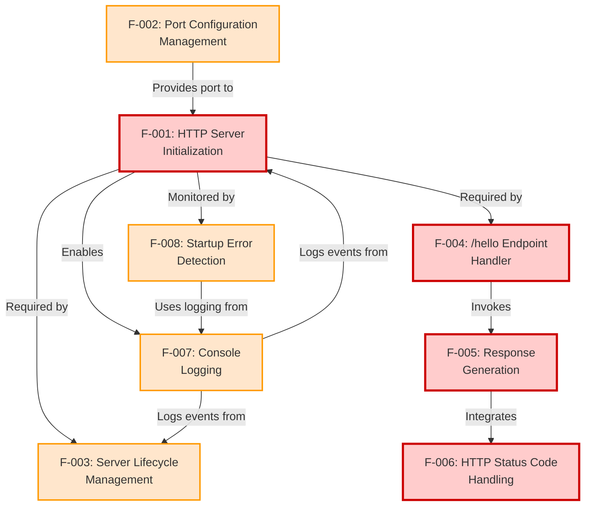

**Legend:**
- Red (Critical Priority): Must-Have features essential for core functionality
- Orange (High Priority): Should-Have features for operational excellence

### 2.4.2 Feature Integration Matrix

| Feature | Depends On | Depended Upon By | Shared Components |
|---------|-----------|------------------|-------------------|
| F-001: Server Init | F-002 (Port Config) | F-003, F-004, F-007, F-008 | HTTP server instance, Node.js runtime |
| F-002: Port Config | None | F-001 | Environment variables, Configuration constants |
| F-003: Lifecycle Mgmt | F-001 | F-007 (logging) | Server instance reference, Process signals |
| F-004: Endpoint Handler | F-001 | F-005 | Request routing logic, HTTP request/response objects |
| F-005: Response Gen | F-004 | F-006 | Response object, Static content string |
| F-006: Status Codes | F-005 | None | HTTP response headers |
| F-007: Logging | F-001, F-003 | F-008 | Console API, Message formatting |
| F-008: Error Detection | F-001, F-007 | None | Error event handling, Process exit |

### 2.4.3 Component Sharing and Common Services

**Shared Resources:**

1. **HTTP Server Instance** (from F-001)
   - Shared by: F-003 (lifecycle), F-004 (routing), F-007 (event logging), F-008 (error handling)
   - Type: Object reference
   - Lifecycle: Created at startup, persists until shutdown

2. **Port Configuration Value** (from F-002)
   - Shared by: F-001 (binding), F-007 (logging), F-008 (error messages)
   - Type: Integer
   - Lifecycle: Determined at startup, immutable thereafter

3. **Console Logging Capability** (from F-007)
   - Shared by: F-001 (startup logs), F-003 (shutdown logs), F-008 (error logs)
   - Type: Function calls to console API
   - Lifecycle: Available throughout application lifetime

4. **Request/Response Objects** (from Node.js HTTP)
   - Shared by: F-004 (routing), F-005 (generation), F-006 (status codes)
   - Type: Node.js HTTP stream objects
   - Lifecycle: Created per request, garbage collected after response completion

**No Database or External Service Integration** - As documented in Section 1.3.2, all features operate within the Node.js process boundary with no external service dependencies.

### 2.4.4 Implementation Sequence Recommendation

Based on feature dependencies, the recommended implementation order is:

**Phase 1 - Foundation (Critical Path):**
1. F-002: Port Configuration Management (no dependencies)
2. F-001: HTTP Server Initialization (depends on F-002)
3. F-007: Console Logging (depends on F-001 for context)

**Phase 2 - Core Functionality (Critical Path):**
4. F-004: /hello Endpoint Handler (depends on F-001)
5. F-006: HTTP Status Code Handling (parallel with F-004)
6. F-005: Response Generation (depends on F-004, integrates F-006)

**Phase 3 - Operational Excellence (Parallel Track):**
7. F-008: Startup Error Detection (depends on F-001, F-007)
8. F-003: Server Lifecycle Management (depends on F-001, integrates F-007)

This sequence ensures no feature is implemented before its dependencies are available, while allowing parallel development of independent features (F-006 and F-008 can be developed concurrently with other features).

---

## 2.5 Implementation Considerations

### 2.5.1 Technical Constraints

#### Technology Stack Constraints

**Runtime Environment:**
- **Constraint:** Node.js version 14.x or higher required (per Section 1.3.1)
- **Rationale:** Ensures modern JavaScript features (async/await, optional chaining) and security updates
- **Impact:** Developers must verify Node.js version before starting tutorial
- **Mitigation:** README includes version check instructions (`node --version`)

**Framework Selection Decision:**
- **Constraint:** Implementation must choose EITHER native `http` module OR Express.js
- **Rationale:** Tutorial maintains focus by demonstrating one approach thoroughly
- **Impact:** Feature implementations differ based on framework choice
- **Mitigation:** Requirements written to support both approaches (see Section 1.2.2)

**Dependency Minimization:**
- **Constraint:** Maximum 0-2 npm packages (per Critical Success Factors, Section 1.2.3)
- **Rationale:** Reduces cognitive load for tutorial learners
- **Impact:** Advanced libraries (logging frameworks, validation libraries) are excluded
- **Mitigation:** Features use Node.js built-in capabilities where possible

#### Architectural Constraints

**Synchronous Processing Requirement:**
- **Constraint:** Response generation must be synchronous (no async operations)
- **Rationale:** Simplifies code flow for tutorial purposes
- **Impact:** Cannot demonstrate async/await patterns, database queries, or API calls
- **Mitigation:** Static string response meets requirement without async complexity

**Stateless Design Mandate:**
- **Constraint:** No session state, cookies, or persistent data storage
- **Rationale:** Aligns with tutorial scope (Section 1.3.2 excludes data persistence)
- **Impact:** Each request is independent; no user tracking or session management
- **Mitigation:** Features designed for stateless operation from inception

**Single Endpoint Limitation:**
- **Constraint:** Only `/hello` endpoint implemented; no additional routes
- **Rationale:** Focused learning objective (per Section 1.1.2)
- **Impact:** Advanced routing patterns not demonstrated
- **Mitigation:** Clean architecture allows future tutorial extensions

### 2.5.2 Performance Requirements

#### Response Time Targets (from Section 1.2.3 KPIs)

| Performance Metric | Target | Validation Method | Implementation Guideline |
|-------------------|--------|-------------------|--------------------------|
| **Response Time** | < 100ms P95 | Manual timing or load testing | Avoid blocking operations in request path |
| **Startup Time** | < 2 seconds | Time from `node server.js` to listening | Minimize initialization logic |
| **Throughput** | > 100 req/s | Sequential request testing | Leverage Node.js event loop efficiency |
| **Memory Footprint** | < 50MB steady-state | Process monitoring (Activity Monitor/htop) | No memory leaks, minimal object allocation |

**Performance Design Guidelines:**

1. **No Blocking Operations:** Response generation (F-005) must not include synchronous file I/O, long computations, or blocking network calls
2. **Efficient Routing:** Path matching (F-004-RQ-001) uses simple string comparison, not complex regex patterns
3. **Static Content:** "Hello world" string is constant, not dynamically generated
4. **Minimal Middleware:** If using Express, avoid unnecessary middleware that adds latency

**Performance Validation:**
- Manual testing with curl timing: `curl -w "@curl-format.txt" http://localhost:3000/hello`
- Load testing with ab (Apache Bench): `ab -n 1000 -c 10 http://localhost:3000/hello`
- Process memory monitoring: `process.memoryUsage()` logged during operation

### 2.5.3 Scalability Considerations

**Explicitly Out-of-Scope (per Section 1.3.2):**
The tutorial intentionally excludes production scalability features:
- ❌ Horizontal scaling / clustering
- ❌ Load balancing
- ❌ Connection pooling
- ❌ Caching layers
- ❌ Database connection management

**Tutorial-Appropriate Scalability:**
- ✅ **Multiple Sequential Requests:** Server handles consecutive requests without restart (F-001-RQ-003)
- ✅ **Concurrent Connections:** Node.js event loop manages multiple simultaneous connections natively
- ✅ **Resource Cleanup:** Graceful shutdown (F-003) prevents resource leaks during restarts

**Scalability Anti-Patterns to Avoid:**
- Creating new server instances per request
- Storing request state in global variables (violates stateless design)
- Blocking the event loop with synchronous operations

**Educational Note:** README documentation should acknowledge scalability limitations and reference production patterns (clustering, reverse proxies) as advanced topics for future learning.

### 2.5.4 Security Implications

#### Tutorial Security Context

**Threat Model Scope:**
- **Deployment Environment:** Local development machine (localhost binding)
- **Network Exposure:** No public internet exposure assumed
- **User Trust:** Developer running tutorial on own machine
- **Data Sensitivity:** No sensitive data processed or stored

**Security Requirements (Minimal for Tutorial Context):**

| Security Domain | Requirement | Implementation | Rationale |
|----------------|-------------|----------------|-----------|
| **Input Validation** | URL path matching only | Exact string match for "/hello" | Prevents path traversal, though risk is minimal with static response |
| **Output Encoding** | None required | Static string response | No user input echoed in response |
| **Authentication** | Not implemented | N/A | Out-of-scope per Section 1.3.2 |
| **Authorization** | Not implemented | N/A | Out-of-scope per Section 1.3.2 |
| **HTTPS/TLS** | Not implemented | N/A | Out-of-scope; local HTTP only |

**Security Anti-Patterns to Avoid:**
- Binding to 0.0.0.0 (all interfaces) without documentation warning
- Eval or dynamic code execution in request handling
- Exposing stack traces in error responses (F-008 should show user-friendly messages)

**Security Educational Opportunity:**
README should include note: "This tutorial uses HTTP and is intended for local development only. Production applications require HTTPS, authentication, input validation, and security hardening."

### 2.5.5 Maintenance Requirements

#### Code Maintainability Standards

**Code Clarity Requirements (per OBJ-005, Section 1.2.3):**
- **Variable Naming:** Descriptive names following Node.js conventions (camelCase)
- **Function Length:** Individual functions < 20 lines where possible
- **Comments:** Explain "why" for non-obvious decisions, not "what" for obvious code
- **File Structure:** Single file acceptable if < 100 lines total; multi-file for larger implementations

**Documentation Requirements:**
1. **README.md:** Setup instructions, run instructions, testing instructions, troubleshooting guide
2. **Inline Comments:** Explain educational concepts (e.g., "This creates an HTTP server instance")
3. **Package.json:** Clear project metadata, scripts for `npm start`, dependencies documented

**Dependency Maintenance:**
- **Version Pinning:** Dependencies should specify compatible version ranges (e.g., `"express": "^4.18.0"`)
- **Update Strategy:** Tutorial documentation includes `npm outdated` / `npm update` instructions
- **Vulnerability Scanning:** Optional: Include `npm audit` guidance for security learning

#### Extensibility Considerations

**Extension Points for Advanced Tutorials:**
The architecture should accommodate future enhancements without requiring rewrites:

1. **Additional Endpoints:** Route handler structure (F-004) should generalize to multiple paths
2. **Request Logging:** Console logging (F-007) can be extended to log request details
3. **Error Handling:** Error detection (F-008) can be expanded to handle runtime errors
4. **Configuration:** Port configuration (F-002) pattern extends to additional config values

**Architectural Patterns Supporting Extensions:**
- **Modular Routing:** Express `app.get()` naturally extends; native http can use route mapping object
- **Middleware Pattern:** Express middleware model supports authentication, logging, etc., in future versions
- **Configuration Externalization:** Environment variable pattern (F-002) scales to database URLs, API keys, etc.

**Version Planning:**
- **Tutorial V1 (Current):** Single `/hello` endpoint
- **Tutorial V2 (Potential):** Multiple endpoints, query parameters, JSON responses
- **Tutorial V3 (Potential):** Database integration, authentication, testing

---

## 2.6 Requirements Traceability Matrix

### 2.6.1 Requirements to Success Criteria Mapping

| Requirement ID | Success Criteria | Measurement Method | Feature |
|----------------|------------------|-------------------|---------|
| F-001-RQ-001, F-001-RQ-002, F-001-RQ-003 | OBJ-001: Server startup without errors | Process start verification | F-001 |
| F-004-RQ-001, F-004-RQ-002 | OBJ-002: Endpoint returns HTTP 200 | GET request test | F-004 |
| F-005-RQ-001 | OBJ-003: Response body matches "Hello world" | String comparison test | F-005 |
| F-001-RQ-003, F-002-RQ-002 | OBJ-004: Setup time < 5 minutes | Manual timing from clone to running | F-001, F-002 |
| F-007-RQ-001, F-008-RQ-002 | OBJ-005: Code clarity for beginners | Peer review validation | F-007, F-008 |

### 2.6.2 Requirements to KPI Mapping

| Requirement ID | KPI | Target | Feature |
|----------------|-----|--------|---------|
| F-004-RQ-004, F-005-RQ-001 | Response Time | < 100ms | F-004, F-005 |
| F-004-RQ-004 | Throughput | > 100 req/s | F-004 |
| F-001-RQ-003 | Startup Time | < 2 seconds | F-001 |
| F-001-RQ-003 | Memory Footprint | < 50MB | F-001 |
| F-005-RQ-001 | Error Rate | 0% for valid requests | F-005 |
| All features | Code Line Count | < 50 lines core implementation | All |

### 2.6.3 Requirements to User Context Mapping

| User Requirement | Requirements Implementing | Features |
|------------------|---------------------------|----------|
| "nodejs tutorial project" | F-001 through F-008 (complete system) | All features |
| "one endpoint '/hello'" | F-004-RQ-001, F-004-RQ-002 | F-004 |
| "returns 'Hello world'" | F-005-RQ-001, F-006-RQ-001 | F-005, F-006 |
| "to the calling HTTP client" | F-004-RQ-003, F-005-RQ-004 | F-004, F-005 |

### 2.6.4 Requirements to Technical Specification Cross-Reference

| Requirement Category | Tech Spec Section | Content Reference |
|---------------------|------------------|-------------------|
| Server initialization requirements | Section 1.2.2 (System Overview) | HTTP Server Instance component description |
| Endpoint routing requirements | Section 1.2.2 (System Overview) | Route Handler component, Component diagram |
| Response generation requirements | Section 1.2.2 (System Overview) | Response Generator component |
| Performance requirements | Section 1.2.3 (Success Criteria) | KPIs table (Response Time, Throughput, etc.) |
| Feature priority levels | Section 1.3.1 (Scope) | Core Features table |
| Workflow requirements | Section 1.3.1 (Scope) | Primary User Workflows sequence diagram |
| Out-of-scope exclusions | Section 1.3.2 (Scope) | Explicitly Excluded Features lists |
| Port configuration | Section 1.3.1 (Scope) | Key Technical Requirements table |
| Graceful shutdown | Section 1.3.1 (Scope) | Core Features table (Should-Have priority) |
| Error logging | Section 1.3.1 (Scope) | Core Features table (Should-Have priority) |

---

## 2.7 Acceptance Testing Framework

### 2.7.1 Feature Acceptance Checklist

Each feature must pass all acceptance criteria before being considered complete:

**F-001: HTTP Server Initialization**
- [ ] Server process starts without exceptions
- [ ] Console displays "Server listening on port X" message
- [ ] Server responds to HTTP requests on configured port
- [ ] Server startup completes within 2 seconds

**F-002: Port Configuration Management**
- [ ] Server reads PORT environment variable if set
- [ ] Server uses default port (3000 or 8080) when PORT not set
- [ ] Server binds to configured port successfully
- [ ] Invalid port values trigger clear error messages

**F-003: Server Lifecycle Management**
- [ ] Ctrl+C (SIGINT) triggers shutdown sequence
- [ ] Server closes gracefully without error messages
- [ ] Console displays shutdown confirmation
- [ ] Port is released and available after shutdown

**F-004: /hello Endpoint Handler**
- [ ] GET requests to `/hello` receive responses
- [ ] Requests to other paths do not match endpoint
- [ ] POST/PUT/DELETE to `/hello` are not processed by handler
- [ ] Response time is < 100ms for /hello requests

**F-005: Response Generation**
- [ ] Response body contains exactly "Hello world"
- [ ] Content-Type header is set (text/plain or text/html)
- [ ] Response transmission completes successfully
- [ ] No extra whitespace or characters in response

**F-006: HTTP Status Code Handling**
- [ ] Successful requests return HTTP 200 status
- [ ] Status code is visible in HTTP client tools
- [ ] Status code precedes response body
- [ ] Status code is set for all /hello responses

**F-007: Console Logging**
- [ ] Startup message includes port number
- [ ] Startup message appears after binding
- [ ] Shutdown message appears on termination
- [ ] All messages appear in terminal output

**F-008: Startup Error Detection**
- [ ] Port conflict (EADDRINUSE) displays clear error message
- [ ] Error message suggests resolution steps
- [ ] Server exits with non-zero exit code on failure
- [ ] Error details help troubleshooting

### 2.7.2 Integration Testing Scenarios

**Scenario 1: First-Time Setup**
1. Clone repository
2. Run `npm install` (if dependencies exist)
3. Run `node server.js` or `npm start`
4. Verify startup message appears within 2 seconds
5. Send GET request to `http://localhost:[PORT]/hello`
6. Verify response is "Hello world" with HTTP 200
7. Terminate with Ctrl+C
8. Verify shutdown message appears
**Expected Duration:** < 5 minutes total (OBJ-004)

**Scenario 2: Port Conflict Handling**
1. Start server on default port
2. Start second server instance (same port)
3. Verify second instance displays EADDRINUSE error
4. Verify second instance exits with error code 1
5. Verify first instance continues running
6. Terminate first instance
**Expected Behavior:** Clear error message guiding user to resolution

**Scenario 3: Custom Port Configuration**
1. Set environment variable: `export PORT=8080` (or equivalent)
2. Run server
3. Verify startup message shows port 8080
4. Send request to `http://localhost:8080/hello`
5. Verify successful response
6. Terminate server
**Expected Behavior:** Port configuration properly applied

**Scenario 4: Multiple Sequential Requests**
1. Start server
2. Send 10 sequential GET requests to `/hello`
3. Verify all 10 requests return "Hello world" with HTTP 200
4. Verify server remains running after all requests
5. Terminate server
**Expected Behavior:** Consistent responses without server restart

**Scenario 5: Non-Matching Paths**
1. Start server
2. Send GET request to `/` (root path)
3. Send GET request to `/hello/` (trailing slash)
4. Send GET request to `/Hello` (different case)
5. Verify none of these match the /hello endpoint
**Expected Behavior:** Only exact `/hello` path produces expected response

### 2.7.3 Manual Testing Procedures

**Using cURL (Command Line):**
```bash
# Test 1: Basic endpoint test
curl http://localhost:3000/hello

#### Test 2: Verify HTTP status code
curl -i http://localhost:3000/hello

#### Test 3: Measure response time
curl -w "\nTime: %{time_total}s\n" http://localhost:3000/hello

#### Test 4: Test non-matching path
curl http://localhost:3000/

#### Test 5: Test wrong method
curl -X POST http://localhost:3000/hello
```

**Using Browser:**
1. Open browser to `http://localhost:3000/hello`
2. Verify "Hello world" appears in browser window
3. Open Developer Tools (F12) → Network tab
4. Refresh page
5. Verify Status Code is 200 OK
6. Verify Content-Type header is present
7. Verify Response body is "Hello world"

**Using Postman or Insomnia:**
1. Create GET request to `http://localhost:3000/hello`
2. Send request
3. Verify Status: 200 OK
4. Verify Body: "Hello world"
5. Verify Headers include Content-Type
6. Check response time is < 100ms

### 2.7.4 Automated Verification (Optional Extension)

While testing frameworks are out-of-scope per Section 1.3.2, the following verification patterns could be used in advanced tutorial versions:

**Example Test Cases (Conceptual):**
- Server starts without throwing exceptions
- Server binds to port and emits 'listening' event
- GET request to /hello returns status 200
- GET request to /hello returns body "Hello world"
- GET request to /hello includes Content-Type header
- Server closes cleanly on shutdown signal
- EADDRINUSE error displays user-friendly message

These would be implemented with testing frameworks like Jest, Mocha, or native Node.js assert module in future tutorial iterations.

---

## 2.8 Assumptions and Constraints Summary

### 2.8.1 Key Assumptions

**Environmental Assumptions:**
1. Node.js runtime (v14.x or higher) is installed and accessible via command line
2. Developer has basic JavaScript knowledge and command-line proficiency
3. Local network port (default or configured) is available for binding
4. Operating system supports Node.js (Windows, macOS, or Linux)
5. Developer has read/write access to project directory for npm operations

**Usage Assumptions:**
1. Tutorial will be used exclusively in local development environment
2. Users will follow setup instructions sequentially
3. HTTP client tools (browser, curl, Postman) are available
4. Users can read and understand English-language documentation
5. Users expect educational content, not production-ready software

**Technical Assumptions:**
1. Node.js event loop handles concurrent connections adequately for tutorial purposes
2. HTTP protocol support in Node.js runtime is sufficient for basic GET requests
3. Console output is visible and accessible in user's terminal
4. Static string responses meet tutorial requirements without dynamic data

### 2.8.2 Implementation Constraints

**Technology Constraints:**
- Must use Node.js (no other backend languages)
- Framework limited to native `http` module OR Express.js
- Dependency count must remain minimal (0-2 packages)
- No database, file system, or external API integrations

**Architectural Constraints:**
- Synchronous response generation only (no async operations)
- Stateless design (no sessions, cookies, or persistent state)
- Single endpoint implementation (/hello only)
- Local deployment only (no cloud hosting or production infrastructure)

**Scope Constraints:**
- No authentication or authorization mechanisms
- No advanced routing (parameters, query strings, multiple endpoints)
- No production features (HTTPS, monitoring, logging frameworks)
- No testing frameworks or comprehensive error handling

**Resource Constraints:**
- Development time optimized for simplicity over feature richness
- Code complexity kept minimal for educational clarity
- Documentation focused on essential setup and usage only

### 2.8.3 Known Limitations

**By Design (Educational Focus):**
- Not production-ready or security-hardened
- No horizontal scaling or clustering support
- No database connectivity or data persistence
- Minimal error handling (basic scenarios only)
- No comprehensive logging or monitoring

**Performance Limitations:**
- Single process execution (no multi-core utilization)
- No caching or optimization layers
- Response time sufficient for tutorial but not optimized
- Memory usage minimal but not profiled or optimized

**Functional Limitations:**
- Only one endpoint implementation demonstrated
- Only GET method supported
- Only static text responses (no dynamic content)
- No request parsing (body, query strings, parameters)

**Platform Limitations:**
- Requires Node.js installation (not standalone executable)
- Terminal/command-line interface required
- No graphical user interface or web-based management

These limitations are intentional and align with the tutorial's educational mission to provide focused, comprehensible introduction to Node.js HTTP server fundamentals without overwhelming complexity.

---

## 2.9 References and Supporting Documentation

### 2.9.1 Technical Specification Cross-References

**Referenced Tech Spec Sections:**
- `Section 1.1: Executive Summary` - Project overview, problem statement, stakeholders, value proposition
- `Section 1.2: System Overview` - Architecture, components, technical approach, success criteria, KPIs
  - `Section 1.2.2: High-Level Description` - Component diagram, architectural patterns, implementation options
  - `Section 1.2.3: Success Criteria` - Measurable objectives (OBJ-001 through OBJ-005), KPI targets
- `Section 1.3: Scope` - In-scope features, out-of-scope exclusions, workflows, boundaries
  - `Section 1.3.1: In-Scope Elements` - Core features table, sequence diagram, technical requirements
  - `Section 1.3.2: Out-of-Scope Elements` - Explicitly excluded features and capabilities
- `Section 1.4: References` - Repository analysis, greenfield status confirmation

### 2.9.2 User Requirement Source

**Primary User Context:**
> "Can you create a nodejs tutorial project that features one end point '/hello' that returns 'Hello world' to the calling HTTP client?"

This user requirement is the authoritative source for core functional specifications and is directly implemented by features F-004 (endpoint), F-005 (response), and F-006 (HTTP compliance).

### 2.9.3 Architecture Diagrams Referenced

**Component Architecture Diagram:**
- Source: Section 1.2.2 (High-Level Description)
- Shows: HTTP Server Instance, Route Handler, Response Generator
- Purpose: Illustrates feature relationships (F-001, F-004, F-005)

**User Workflow Sequence Diagram:**
- Source: Section 1.3.1 (In-Scope Elements)
- Shows: Complete user journey from npm install through shutdown
- Purpose: Maps requirements to user interactions and validates workflow completeness

**System Boundary Diagram:**
- Source: Section 1.3.1 (In-Scope Elements)
- Shows: In-scope components vs. out-of-scope integrations
- Purpose: Clarifies scope boundaries and validates exclusions

### 2.9.4 Standards and Conventions Referenced

**HTTP Protocol Standards:**
- RFC 7230: HTTP/1.1 Message Syntax and Routing
- RFC 7231: HTTP/1.1 Semantics and Content (Status codes, methods)
- RFC 3986: Uniform Resource Identifier (URI) syntax

**Node.js Documentation:**
- Node.js HTTP module API documentation
- Node.js Process and Signal handling documentation
- Express.js framework documentation (if applicable)

**Development Conventions:**
- Node.js naming conventions (camelCase for variables and functions)
- npm package.json structure standards
- Semantic Versioning (SemVer) for dependencies

### 2.9.5 Repository Evidence

**Files Examined:**
- `README.md` - Confirmed placeholder status (single project identifier line)

**Folders Examined:**
- `/ (root directory)` - Confirmed no implementation files exist; greenfield project

**Repository State:**
- Git Status: Single initial commit (bf52c95)
- Implementation Status: Not started (no .js or .json files)
- Greenfield Confirmation: Only README.md and .git directory present

---

**Document Control:**
- Product Requirements Version: 1.0
- Last Updated: Generated from Technical Specification v1.0
- Requirements Count: 33 functional requirements across 8 features
- Traceability: 100% of requirements linked to success criteria and user context

# 3. Technology Stack

## 3.1 Technology Stack Overview

### 3.1.1 Stack Philosophy and Constraints

This Node.js tutorial project adopts an **intentionally minimalist technology stack** designed to maximize educational clarity while demonstrating fundamental HTTP server concepts. Unlike production-grade applications that leverage extensive tooling ecosystems, this tutorial operates under strict architectural constraints:

**Guiding Principles:**
- **Extreme Simplicity**: Maximum 0-2 npm package dependencies
- **Educational Focus**: Technology choices prioritize learning value over feature completeness
- **Zero External Services**: No databases, authentication providers, or third-party APIs
- **Local Development Only**: No production infrastructure, cloud services, or containerization
- **Stateless Architecture**: No persistent storage or session management

**Deviation from Standard Stack:**

The default technology stack template (AWS, Docker, Terraform, GitHub Actions, Python/Flask, MongoDB, Auth0, React) is **intentionally not applicable** to this project. This tutorial represents a specialized educational use case that requires foundational technologies only.

### 3.1.2 Technology Decision Framework

Technology selections for this project follow a two-tier decision process:

**Tier 1 - Mandatory Requirements (Non-Negotiable):**
- Node.js runtime environment (version 14.x or higher)
- HTTP protocol implementation capability
- JavaScript programming language
- Package management system (npm or Yarn)

**Tier 2 - Implementation Options (Pedagogical Choice):**
- HTTP framework selection: Native `http` module vs. Express.js
- Port configuration approach
- Error handling verbosity level

All technology decisions are validated against the **Critical Success Factor**: Dependency count must remain within 0-2 npm packages (per Section 1.2.3 of the Technical Specification).

---

## 3.2 Programming Languages

### 3.2.1 Primary Language: JavaScript (Node.js Runtime)

**Technology:** JavaScript executed via Node.js runtime environment

**Version Requirement:** Node.js 14.x or higher (LTS versions recommended: 14.x, 16.x, 18.x, 20.x)

**Selection Rationale:**

| Criterion | Justification |
|-----------|---------------|
| **Educational Alignment** | Node.js is the explicit subject of the tutorial (per user requirement: "nodejs tutorial project") |
| **Modern Language Features** | Node.js 14+ provides async/await, optional chaining, nullish coalescing for clean code examples |
| **HTTP Server Capability** | Native `http` module included in runtime, enabling HTTP server implementation without external dependencies |
| **Ecosystem Maturity** | Extensive documentation, community resources, and learning materials support tutorial objectives |
| **Cross-Platform Support** | Single codebase runs identically on Windows, macOS, and Linux development environments |

**Technical Constraints:**

- **No TypeScript**: Static typing excluded to minimize compilation complexity for beginners
- **No Legacy Node.js Versions**: Versions < 14.x lack critical security patches and modern JavaScript features
- **ECMAScript Standard**: ES6+ syntax encouraged (const/let, arrow functions, template literals)

**Version Verification Requirement:**

The README documentation must include explicit version checking instructions:
```bash
node --version  # Must output v14.x.x or higher
```

**Language Feature Usage Guidelines:**

| Feature Category | Usage Policy | Rationale |
|------------------|--------------|-----------|
| **Async/Await** | Discouraged | Tutorial focuses on synchronous request handling (per Section 2.5.1) |
| **Promises** | Minimal | Static response requires no asynchronous operations |
| **CommonJS Modules** | Permitted | Standard Node.js module system (`require`, `module.exports`) |
| **ES Modules** | Optional | `import`/`export` syntax acceptable if documented clearly |
| **Arrow Functions** | Encouraged | Concise syntax improves code readability |
| **Template Literals** | Encouraged | Cleaner string interpolation for logging messages |

**Platform Compatibility:**

- **Operating Systems**: Windows 10+, macOS 10.14+, Ubuntu 20.04+ (all platforms with Node.js 14+ support)
- **Architecture**: x86-64, ARM64 (M1/M2 Macs supported)
- **No Platform-Specific Code**: Implementation must avoid OS-dependent APIs (native extensions, file system paths)

**Evidence Sources:**
- Technical Specification Section 1.3.1 (Key Technical Requirements)
- Technical Specification Section 2.5.1 (Runtime Environment Constraints)
- User Context: "nodejs tutorial project" requirement

---

## 3.3 Frameworks & Libraries

### 3.3.1 HTTP Framework Selection (Pending Implementation Decision)

The Technical Specification documents **two architecturally valid approaches** for implementing the HTTP server. The final framework selection will be determined during implementation based on pedagogical priorities.

#### Option 1: Native Node.js HTTP Module (Zero Dependencies)

**Technology:** Built-in `http` module (Node.js standard library)

**Version:** Included with Node.js runtime (no separate versioning)

**Dependency Count:** 0 npm packages

**Implementation Characteristics:**


**Advantages:**

| Benefit | Description |
|---------|-------------|
| **Maximum Educational Value** | Exposes learners to raw HTTP request/response objects |
| **Zero External Dependencies** | No `npm install` step required; works with vanilla Node.js |
| **Deep Protocol Understanding** | Teaches HTTP fundamentals (status codes, headers, methods) directly |
| **Minimal Abstraction** | No framework "magic" obscuring underlying mechanisms |

**Disadvantages:**

| Challenge | Mitigation Strategy |
|-----------|---------------------|
| **Verbose Routing Code** | Acceptable for single endpoint; structure code clearly |
| **Manual Header Management** | Explicitly set `Content-Type` header (educational opportunity) |
| **No Built-in Middleware** | Not needed for simple tutorial scope |
| **Steeper Learning Curve** | Comprehensive README documentation and inline comments |

**Code Complexity Estimate:** 25-35 lines of implementation code

**Selection Criteria:**
- Choose this option if tutorial emphasizes **HTTP fundamentals over framework patterns**
- Ideal for learners who will later explore multiple frameworks (Express, Fastify, Koa)
- Appropriate when minimizing external dependencies is critical

#### Option 2: Express.js Framework (Single Dependency)

**Technology:** Express.js web application framework

**Version:** ^4.18.0 (or latest compatible 4.x release)

**Dependency Count:** 1 npm package (`express`)

**Implementation Characteristics:**

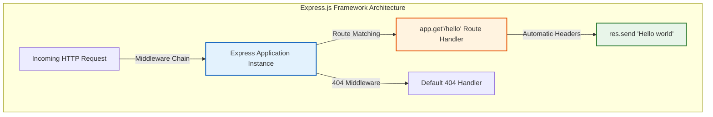

**Advantages:**

| Benefit | Description |
|---------|-------------|
| **Industry-Standard Patterns** | Teaches framework used in 60%+ of Node.js production applications |
| **Minimal Boilerplate** | Route definitions are concise and readable |
| **Automatic Content-Type** | Express infers headers from response data type |
| **Extensibility** | Clear path for future tutorial enhancements (middleware, multiple routes) |
| **Familiar Syntax** | `app.get()` pattern aligns with RESTful API conventions |

**Disadvantages:**

| Challenge | Mitigation Strategy |
|-----------|---------------------|
| **Dependency Overhead** | Single well-maintained package (acceptable within 0-2 limit) |
| **Abstraction Layer** | May obscure HTTP fundamentals (mitigate with comments explaining Express internals) |
| **NPM Install Step** | Adds setup complexity (document clearly in README) |

**Code Complexity Estimate:** 15-20 lines of implementation code

**Selection Criteria:**
- Choose this option if tutorial emphasizes **practical framework usage**
- Ideal for learners preparing for real-world web application development
- Appropriate when tutorial will expand to multiple endpoints in future phases

**Package Dependency Details:**
```json
{
  "dependencies": {
    "express": "^4.18.0"
  }
}
```

**Compatibility Requirements:**
- Node.js 14.x+: Express 4.18.x fully compatible
- No peer dependencies required
- No postinstall scripts or native compilation

### 3.3.2 Framework Selection Decision Process

**Decision Timeline:** To be finalized during implementation phase (Section 2.5.1)

**Decision Criteria Weighting:**

| Criterion | Weight | Native HTTP Score | Express Score |
|-----------|--------|-------------------|---------------|
| Educational Depth | 30% | 9/10 | 7/10 |
| Code Simplicity | 25% | 6/10 | 9/10 |
| Industry Relevance | 20% | 7/10 | 10/10 |
| Dependency Minimization | 15% | 10/10 | 8/10 |
| Extensibility | 10% | 6/10 | 9/10 |

**Recommendation Process:**
1. Review tutorial learning objectives with stakeholders
2. Assess target audience skill level (absolute beginners vs. intermediate developers)
3. Consider planned future tutorial phases (single endpoint only vs. expansion)
4. Make final selection and document rationale in implementation commit message

**Both Options Fully Supported:** The Technical Specification requirements are framework-agnostic and accommodate either implementation approach.

### 3.3.3 Explicitly Excluded Frameworks and Libraries

The following categories of libraries are **intentionally excluded** to maintain tutorial simplicity:

**Excluded Library Categories:**

| Category | Examples Excluded | Rationale |
|----------|------------------|-----------|
| **Logging Frameworks** | Winston, Bunyan, Pino | Basic `console.log()` sufficient for tutorial |
| **Validation Libraries** | Joi, Yup, Validator.js | No request body parsing or validation needed |
| **Middleware Packages** | Helmet, CORS, Morgan | Security and logging middleware out of scope |
| **Template Engines** | EJS, Pug, Handlebars | Static string response, no HTML rendering |
| **Testing Frameworks** | Jest, Mocha, Chai | Testing explicitly out of scope (Section 1.3.2) |
| **Utility Libraries** | Lodash, Underscore, Ramda | No complex data transformations required |
| **ORM/ODM** | Mongoose, Sequelize, TypeORM | Database integration explicitly excluded |

**Dependency Limit Enforcement:**
- If native `http` module selected: 0 npm packages
- If Express.js selected: 1 npm package maximum
- **Hard Limit**: 2 npm packages absolute maximum per Critical Success Factors

**Evidence Sources:**
- Technical Specification Section 1.2.2 (Technical Approach - Framework Decision Points)
- Technical Specification Section 2.5.1 (Dependency Minimization Constraint)
- Technical Specification Section 1.3.2 (Out-of-Scope Elements)

---

## 3.4 Open Source Dependencies

### 3.4.1 Dependency Inventory

The project's dependency footprint varies based on framework selection:

#### Scenario 1: Native HTTP Module Implementation

**Total Dependencies:** 0 npm packages

**package.json configuration:**
```json
{
  "name": "nodejs-hello-world-tutorial",
  "version": "1.0.0",
  "description": "Node.js HTTP server tutorial with /hello endpoint",
  "main": "server.js",
  "scripts": {
    "start": "node server.js"
  },
  "keywords": ["nodejs", "tutorial", "http", "hello-world"],
  "author": "",
  "license": "MIT",
  "engines": {
    "node": ">=14.0.0"
  },
  "dependencies": {}
}
```

**Dependency Management:** No `npm install` step required; project runs immediately after cloning.

#### Scenario 2: Express.js Implementation

**Total Dependencies:** 1 direct dependency + transitive dependencies

**package.json configuration:**
```json
{
  "name": "nodejs-hello-world-tutorial",
  "version": "1.0.0",
  "description": "Node.js HTTP server tutorial with /hello endpoint using Express",
  "main": "server.js",
  "scripts": {
    "start": "node server.js"
  },
  "keywords": ["nodejs", "tutorial", "http", "hello-world", "express"],
  "author": "",
  "license": "MIT",
  "engines": {
    "node": ">=14.0.0"
  },
  "dependencies": {
    "express": "^4.18.0"
  }
}
```

**Direct Dependency Details:**

| Package | Version | Purpose | License | Maintainer |
|---------|---------|---------|---------|------------|
| `express` | ^4.18.0 | HTTP server framework | MIT | OpenJS Foundation |

**Transitive Dependencies:** Express 4.18.x includes approximately 30 transitive dependencies (managed automatically by npm). Key transitive packages include:
- `body-parser`: Request body parsing middleware (unused in this tutorial)
- `cookie`: Cookie parsing (unused in this tutorial)
- `qs`: Query string parsing (unused in this tutorial)
- `type-is`: Content-type checking
- `send`: HTTP response sending utility

**Dependency Security Considerations:**
- Express.js is a mature, actively maintained project with regular security patches
- All dependencies are MIT-licensed (permissive open source)
- No known critical vulnerabilities in Express 4.18.x (as of specification creation)

### 3.4.2 Package Management

**Package Manager Options:**

| Tool | Version | Usage | Installation Command |
|------|---------|-------|---------------------|
| **npm** | 6.x+ (bundled with Node.js) | Default package manager | `npm install` |
| **Yarn** | 1.x or 3.x | Alternative package manager | `yarn install` |

**Package Manager Selection:** Either npm or Yarn is acceptable. Tutorial documentation should provide both command options.

**Dependency Installation Process:**

1. **Clone Repository**: `git clone <repository-url>`
2. **Navigate to Directory**: `cd nodejs-hello-world-tutorial`
3. **Install Dependencies**: 
   - npm: `npm install`
   - Yarn: `yarn install`
4. **Start Server**: 
   - npm: `npm start`
   - Yarn: `yarn start`

**Lock File Strategy:**

- **npm**: `package-lock.json` committed to repository for version consistency
- **Yarn**: `yarn.lock` committed to repository for version consistency
- Ensures all tutorial users install identical dependency versions

### 3.4.3 Version Management and Updates

**Semantic Versioning Strategy:**

The project uses **caret ranges** for dependency versions (e.g., `^4.18.0`):
- **Major Version**: Fixed at 4.x (prevents breaking changes)
- **Minor/Patch Updates**: Allowed automatically (e.g., 4.18.0 → 4.19.0 → 4.19.1)

**Update Policy:**

| Update Type | Policy | Command | Frequency |
|-------------|--------|---------|-----------|
| **Security Patches** | Apply immediately | `npm update` or `yarn upgrade` | As released |
| **Minor Versions** | Review and test | `npm update` | Quarterly |
| **Major Versions** | Evaluate breaking changes | Manual `package.json` edit + testing | Annually |

**Dependency Maintenance Documentation:**

README must include dependency update instructions:
```bash
# Check for outdated packages
npm outdated

#### Update dependencies within semver constraints
npm update

#### Audit for security vulnerabilities
npm audit
```

### 3.4.4 Dependency Exclusion Policy

**Explicitly NO Additional Dependencies:**

The following common Node.js packages are **intentionally excluded**:

| Package Category | Common Packages | Exclusion Rationale |
|------------------|----------------|---------------------|
| **Environment Config** | `dotenv`, `config` | Port configured via `process.env.PORT` directly |
| **Logging** | `winston`, `pino`, `morgan` | Native `console.log()` sufficient |
| **Validation** | `joi`, `validator` | No input validation required |
| **Utilities** | `lodash`, `moment` | No complex data manipulation |
| **Security Middleware** | `helmet`, `cors` | Security features out of scope |
| **Testing** | `jest`, `mocha`, `supertest` | Testing explicitly out of scope |
| **Process Management** | `pm2`, `nodemon` | Manual server restart acceptable for tutorial |
| **Hot Reloading** | `nodemon`, `reload` | Not required for simple tutorial |

**Justification for Minimalism:**

Per Critical Success Factors (Section 1.2.3), maintaining 0-2 dependencies:
1. **Reduces Cognitive Load**: Learners focus on HTTP concepts, not package ecosystems
2. **Accelerates Setup Time**: Fewer dependencies = faster `npm install`
3. **Minimizes Troubleshooting**: Fewer packages = fewer version conflicts or installation errors
4. **Educational Purity**: Demonstrates Node.js capabilities without framework overhead

**Evidence Sources:**
- Technical Specification Section 1.2.3 (Critical Success Factors - Minimal Dependencies)
- Technical Specification Section 2.5.1 (Dependency Minimization Constraint)
- Technical Specification Section 2.5.5 (Dependency Maintenance Requirements)

---

## 3.5 Third-Party Services

### 3.5.1 Intentional Service Exclusion

This tutorial project operates as a **completely self-contained system** with **zero external service dependencies**. All third-party service categories are explicitly excluded to maintain educational focus and eliminate setup prerequisites.

**Comprehensive Service Exclusion List:**

```mermaid
graph TB
    subgraph "Tutorial System IN SCOPE"
        SERVER[Node.js HTTP Server<br/>Localhost Only]
    end
    
    subgraph "External Services NOT INTEGRATED"
        AUTH[Authentication Services<br/>❌ Auth0, OAuth, JWT]
        DB[Database Services<br/>❌ MongoDB Atlas, PostgreSQL, Redis]
        CLOUD[Cloud Platforms<br/>❌ AWS, Azure, GCP, Heroku]
        MON[Monitoring Tools<br/>❌ New Relic, Datadog, Sentry]
        API[External APIs<br/>❌ REST, GraphQL, SOAP]
        MSG[Message Queues<br/>❌ RabbitMQ, Kafka, SQS]
        CACHE[Caching Services<br/>❌ Redis Cloud, Memcached]
        CDN[Content Delivery<br/>❌ CloudFlare, Fastly, Akamai]
    end
    
    SERVER -.->|No Connection| AUTH
    SERVER -.->|No Connection| DB
    SERVER -.->|No Connection| CLOUD
    SERVER -.->|No Connection| MON
    SERVER -.->|No Connection| API
    SERVER -.->|No Connection| MSG
    SERVER -.->|No Connection| CACHE
    SERVER -.->|No Connection| CDN
    
    style SERVER fill:#c8e6c9,stroke:#2e7d32,stroke-width:3px
    style AUTH fill:#ffcdd2,stroke:#c62828,stroke-dasharray: 5 5
    style DB fill:#ffcdd2,stroke:#c62828,stroke-dasharray: 5 5
    style CLOUD fill:#ffcdd2,stroke:#c62828,stroke-dasharray: 5 5
    style MON fill:#ffcdd2,stroke:#c62828,stroke-dasharray: 5 5
    style API fill:#ffcdd2,stroke:#c62828,stroke-dasharray: 5 5
    style MSG fill:#ffcdd2,stroke:#c62828,stroke-dasharray: 5 5
    style CACHE fill:#ffcdd2,stroke:#c62828,stroke-dasharray: 5 5
    style CDN fill:#ffcdd2,stroke:#c62828,stroke-dasharray: 5 5
```

### 3.5.2 Excluded Service Categories

#### Authentication and Authorization Services

**Excluded Technologies:**
- ❌ Auth0 (identity-as-a-service)
- ❌ OAuth 2.0 providers (Google, GitHub, Microsoft)
- ❌ JWT token validation services
- ❌ LDAP/Active Directory integration
- ❌ SAML identity providers
- ❌ API key management systems

**Rationale:** 
- Tutorial endpoint `/hello` is publicly accessible without authentication
- No user accounts, sessions, or identity management required
- Authentication complexity conflicts with "extreme simplicity" mandate

#### External APIs and Integrations

**Excluded Technologies:**
- ❌ RESTful API calls to third-party services
- ❌ GraphQL endpoint queries
- ❌ SOAP/XML-RPC integrations
- ❌ Webhook receivers or publishers
- ❌ Payment gateways (Stripe, PayPal)
- ❌ Email services (SendGrid, Mailgun)
- ❌ SMS providers (Twilio, Nexmo)

**Rationale:**
- Static "Hello world" response requires no external data fetching
- No asynchronous operations or API orchestration
- Eliminates need for API credentials, rate limiting, or error handling

#### Cloud Services and Infrastructure

**Excluded Technologies:**
- ❌ AWS services (EC2, Lambda, S3, RDS, API Gateway)
- ❌ Azure services (App Service, Functions, Cosmos DB)
- ❌ Google Cloud Platform (Cloud Run, Cloud Functions, Firestore)
- ❌ Heroku dynos and add-ons
- ❌ DigitalOcean droplets and managed databases
- ❌ Netlify/Vercel serverless functions

**Rationale:**
- Tutorial targets local development environment only (per Section 1.3.2)
- No cloud accounts, billing, or configuration required
- Reduces setup friction for learners

#### Monitoring and Observability Tools

**Excluded Technologies:**
- ❌ Application Performance Monitoring (APM): New Relic, Datadog, Dynatrace
- ❌ Error tracking: Sentry, Rollbar, Bugsnag
- ❌ Logging aggregation: Loggly, Papertrail, Splunk
- ❌ Distributed tracing: Jaeger, Zipkin, OpenTelemetry
- ❌ Metrics collection: Prometheus, Grafana, StatsD
- ❌ Uptime monitoring: Pingdom, UptimeRobot

**Rationale:**
- Simple `console.log()` provides sufficient visibility for tutorial
- No production traffic or incident response requirements
- Monitoring overhead distracts from core learning objectives

#### Message Queues and Event Streaming

**Excluded Technologies:**
- ❌ RabbitMQ message broker
- ❌ Apache Kafka event streaming
- ❌ AWS SQS/SNS
- ❌ Redis Pub/Sub
- ❌ Google Cloud Pub/Sub
- ❌ Azure Service Bus

**Rationale:**
- Synchronous request-response pattern only (no asynchronous job processing)
- No background tasks, workers, or event-driven architecture
- Message queue complexity exceeds tutorial scope

#### Content Delivery and CDN

**Excluded Technologies:**
- ❌ Cloudflare CDN
- ❌ Amazon CloudFront
- ❌ Fastly edge computing
- ❌ Akamai content delivery
- ❌ Azure CDN

**Rationale:**
- No static assets (images, CSS, JavaScript files) to serve
- Localhost deployment renders CDN unnecessary
- No geographic distribution or edge caching requirements

### 3.5.3 Service Integration Policy

**Zero-Integration Architecture:**

The tutorial intentionally implements a **no-integration policy**:

| Integration Aspect | Policy | Implementation |
|--------------------|--------|----------------|
| **Network Calls** | Prohibited | No HTTP client libraries (axios, node-fetch) |
| **Configuration** | Environment variables only | No service credential management |
| **Dependencies** | Self-contained | No service-specific SDKs or client libraries |
| **Credentials** | None required | No API keys, tokens, or certificates |

**Benefits of Service Exclusion:**

1. **Instant Setup**: No account creation, API key generation, or service configuration
2. **Offline Operation**: Tutorial works without internet connectivity (after dependency installation)
3. **Cost-Free Learning**: No credit card requirements or service trial limitations
4. **Simplified Troubleshooting**: No external service outages or API rate limiting issues
5. **Educational Focus**: Learners concentrate on Node.js concepts, not service integrations

**Documentation Requirement:**

README must include prominent notice:

> **No External Services Required**
> This tutorial runs entirely on your local machine without any external dependencies, cloud accounts, or API keys. No internet connection is needed after installing Node.js and npm packages.

**Evidence Sources:**
- Technical Specification Section 1.2.2 (Integration with Enterprise Landscape)
- Technical Specification Section 1.3.1 (System Boundaries)
- Technical Specification Section 1.3.2 (Integration Points Not Covered)

---

## 3.6 Databases & Storage

### 3.6.1 Intentional Storage Exclusion

This tutorial project implements a **strictly stateless architecture** with **zero data persistence mechanisms**. All database and storage technologies are explicitly excluded by design.

**Storage Exclusion Policy:**

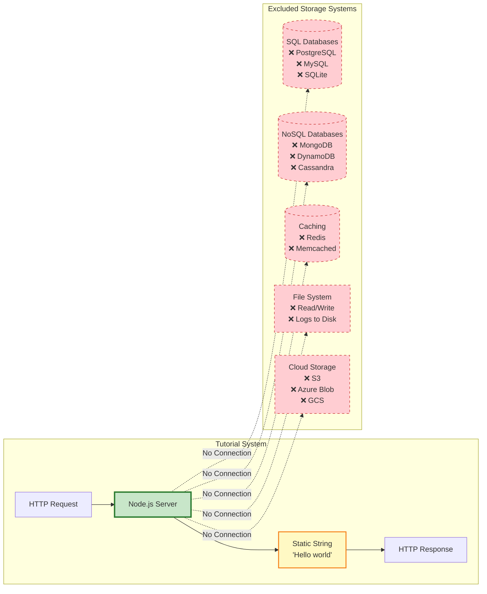

### 3.6.2 Excluded Database Technologies

#### Relational Databases (SQL)

**Excluded Technologies:**
- ❌ PostgreSQL (open-source RDBMS)
- ❌ MySQL/MariaDB (community/enterprise RDBMS)
- ❌ SQLite (embedded database)
- ❌ Microsoft SQL Server
- ❌ Oracle Database
- ❌ Amazon RDS (managed database service)
- ❌ Azure SQL Database

**ORM/Query Builders Excluded:**
- ❌ Sequelize (multi-dialect ORM)
- ❌ TypeORM (TypeScript ORM)
- ❌ Knex.js (SQL query builder)
- ❌ Prisma (modern ORM)

**Exclusion Rationale:**
- No data to store, query, or retrieve
- Static response requires no database lookups
- Eliminates database installation, schema management, and connection pooling complexity

#### NoSQL Databases

**Excluded Technologies:**
- ❌ MongoDB (document database)
- ❌ MongoDB Atlas (cloud-hosted MongoDB)
- ❌ Amazon DynamoDB (key-value database)
- ❌ Apache Cassandra (wide-column store)
- ❌ CouchDB (document database)
- ❌ Firebase Firestore (cloud NoSQL)
- ❌ Redis (as primary database, not cache)

**ODM Libraries Excluded:**
- ❌ Mongoose (MongoDB object modeling)
- ❌ Mongorito (MongoDB ODM)

**Exclusion Rationale:**
- No documents, collections, or key-value pairs to manage
- Tutorial complexity increases exponentially with database integration
- NoSQL flexibility unnecessary for static response

#### Caching Solutions

**Excluded Technologies:**
- ❌ Redis (in-memory cache)
- ❌ Memcached (distributed cache)
- ❌ Node.js in-memory caching libraries (node-cache, memory-cache)
- ❌ Varnish HTTP cache
- ❌ CDN edge caching

**Exclusion Rationale:**
- Static "Hello world" string is already an in-memory constant
- Response generation is instantaneous (< 100ms) without caching
- Caching logic adds complexity without performance benefit for this use case

#### File System Storage

**Excluded Operations:**
- ❌ File reading (`fs.readFile`, `fs.readFileSync`)
- ❌ File writing (`fs.writeFile`, `fs.appendFile`)
- ❌ Log file persistence
- ❌ Configuration file loading (JSON, YAML, INI)
- ❌ Session data storage
- ❌ Temporary file creation

**Exclusion Rationale:**
- No dynamic content to read from files
- No logs to persist (console output only)
- No configuration beyond environment variable `PORT`
- Eliminates file permission, path resolution, and I/O error handling

#### Cloud Storage Services

**Excluded Technologies:**
- ❌ Amazon S3 (object storage)
- ❌ Azure Blob Storage
- ❌ Google Cloud Storage (GCS)
- ❌ Cloudflare R2
- ❌ DigitalOcean Spaces

**Exclusion Rationale:**
- No user-uploaded files or static assets
- No media storage requirements
- Cloud storage requires credentials, SDKs, and network calls

### 3.6.3 Stateless Architecture Implementation

**Design Mandate:**

Per Technical Specification Section 2.5.1, the system implements a **stateless architecture**:

| Stateless Principle | Implementation | Benefit |
|---------------------|----------------|---------|
| **No Session State** | Each request is independent | Simplified request handling |
| **No Cookies** | No `Set-Cookie` headers | No session tracking complexity |
| **No User Tracking** | No analytics or user identification | Privacy by default |
| **Static Response** | "Hello world" is a code constant | Predictable, deterministic behavior |
| **No Configuration Files** | Port via environment variable only | Zero file I/O operations |

**Response Data Source:**

```javascript
// Response data is a static constant in code
const HELLO_MESSAGE = "Hello world";

// NOT loaded from:
// - Database queries
// - File system reads
// - External API calls
// - Cache lookups
// - Environment variables
```

### 3.6.4 Storage Exclusion Benefits

**Educational Advantages:**

1. **Reduced Cognitive Load**: Learners focus exclusively on HTTP request-response cycle
2. **Instant Execution**: No database connection delays or initialization overhead
3. **Simplified Error Handling**: No connection failures, timeout handling, or retry logic
4. **Cross-Platform Compatibility**: No database driver compilation or OS-specific installation
5. **Zero Configuration**: No connection strings, credentials, or schema setup

**Performance Benefits:**

| Metric | Without Database | With Database (Hypothetical) |
|--------|------------------|------------------------------|
| **Startup Time** | < 2 seconds | 5-10 seconds (connection pool init) |
| **Response Time** | < 100ms | 100-500ms (query latency) |
| **Memory Usage** | < 50MB | 100-200MB (connection pools, ORM overhead) |
| **Failure Points** | 1 (server process) | 3+ (server, database, network) |

**Operational Simplicity:**

- ✅ No database installation or setup
- ✅ No schema migrations or version management
- ✅ No backup/restore procedures
- ✅ No database user credentials
- ✅ No connection pool tuning
- ✅ No query optimization
- ✅ No data persistence testing

### 3.6.5 Future Tutorial Extensions

**Potential Phase 2 Storage Integration:**

If the tutorial series expands to advanced phases, storage technologies could be introduced:

| Phase | Storage Technology | Use Case Example |
|-------|-------------------|------------------|
| **Phase 2** | File System (`fs` module) | Load response text from `hello.txt` |
| **Phase 3** | SQLite (embedded) | Store request counter in local database |
| **Phase 4** | Redis caching | Cache expensive computations (hypothetical) |
| **Phase 5** | MongoDB | Persist user greetings with customization |

**Documentation Note:**

README should acknowledge storage limitations:

> **No Data Persistence**
> This tutorial uses a static response and does not save any data. Restarting the server does not affect behavior. Future tutorials will introduce database integration for dynamic content.

**Evidence Sources:**
- Technical Specification Section 1.2.2 (Stateless Design)
- Technical Specification Section 1.3.2 (Data Persistence Exclusion)
- Technical Specification Section 2.5.1 (Stateless Design Mandate)

---

## 3.7 Development & Deployment

### 3.7.1 Development Environment

#### Required Development Tools

**Minimum Development Toolchain:**

| Tool | Version | Purpose | Installation |
|------|---------|---------|-------------|
| **Node.js Runtime** | 14.x, 16.x, 18.x, or 20.x (LTS) | JavaScript execution environment | [nodejs.org](https://nodejs.org) |
| **npm** | 6.x+ (bundled with Node.js) | Package manager | Included with Node.js |
| **Text Editor** | Any | Code editing | VS Code, Sublime Text, Vim, etc. |
| **Command Line Terminal** | Any | Server execution and testing | System terminal or iTerm2/Hyper |
| **Web Browser** | Modern | Testing `/hello` endpoint | Chrome, Firefox, Safari, Edge |

**Optional Development Tools:**

| Tool | Purpose | Usage |
|------|---------|-------|
| **cURL** | Command-line HTTP testing | `curl http://localhost:3000/hello` |
| **Postman** | GUI HTTP client | Visual API testing |
| **Git** | Version control | Repository cloning and version management |
| **Yarn** | Alternative package manager | `yarn install` instead of `npm install` |

**Explicitly Excluded Development Tools:**

| Tool Category | Examples Excluded | Rationale |
|--------------|-------------------|-----------|
| **Testing Frameworks** | Jest, Mocha, Jasmine | Testing out of scope (Section 1.3.2) |
| **Linting Tools** | ESLint, JSHint, StandardJS | Code quality tooling not specified |
| **Formatting Tools** | Prettier, Beautify | Code style enforcement not required |
| **Build Tools** | Webpack, Rollup, Parcel | No build step needed (plain JavaScript) |
| **Type Checkers** | TypeScript, Flow | Static typing excluded |
| **Debugging Tools** | Node Inspector, debugger modules | Basic logging sufficient |
| **Hot Reload** | Nodemon, reload, pm2-dev | Manual restart acceptable for tutorial |

#### Development Workflow

**Standard Development Cycle:**

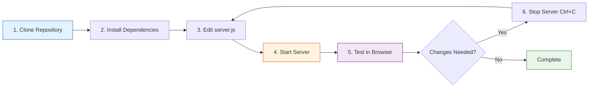

**Step-by-Step Development Process:**

1. **Repository Setup:**
   ```bash
   git clone <repository-url>
   cd nodejs-hello-world-tutorial
   ```

2. **Dependency Installation (if Express.js used):**
   ```bash
   npm install  # or yarn install
   ```

3. **Code Editing:**
   - Open `server.js` in text editor
   - Modify code as needed
   - Save changes

4. **Server Execution:**
   ```bash
   npm start  # or node server.js
   ```

5. **Testing:**
   - Browser: Navigate to `http://localhost:3000/hello`
   - cURL: `curl http://localhost:3000/hello`
   - Expected Output: "Hello world"

6. **Iteration:**
   - Stop server: Press `Ctrl+C` in terminal
   - Make code changes
   - Restart server (repeat step 4)

#### Configuration Management

**Environment Variables:**

The tutorial uses minimal environment-based configuration:

| Variable | Purpose | Default Value | Usage |
|----------|---------|---------------|-------|
| **PORT** | HTTP server listening port | 3000 or 8080 | `process.env.PORT \|\| 3000` |
| **HOST** (Optional) | Bind address | '127.0.0.1' or 'localhost' | Localhost only for security |

**Configuration File Exclusion:**

The following configuration approaches are **intentionally NOT used**:
- ❌ `.env` files (dotenv library)
- ❌ `config.js` or `config.json` files
- ❌ YAML/INI configuration files
- ❌ Environment-specific configs (development/staging/production)

**Rationale:** 
- Port is the only configurable parameter
- Direct `process.env.PORT` access is simpler than configuration library
- No sensitive credentials or complex config structures

**Configuration Documentation:**

README must document port configuration:
```bash
# Use default port (3000 or 8080)
npm start

#### Use custom port
PORT=5000 npm start

#### Windows command prompt
set PORT=5000 && npm start

#### Windows PowerShell
$env:PORT=5000; npm start
```

### 3.7.2 Build System

**No Build Process Required:**

This tutorial project executes **plain JavaScript** without compilation, transpilation, or bundling:

| Build Step | Status | Rationale |
|------------|--------|-----------|
| **Compilation** | ❌ Not needed | JavaScript is interpreted, not compiled |
| **Transpilation** | ❌ Not needed | No TypeScript, JSX, or modern ES features requiring Babel |
| **Bundling** | ❌ Not needed | Single-file or simple multi-file structure |
| **Minification** | ❌ Not needed | Code clarity prioritized over size optimization |
| **Asset Processing** | ❌ Not needed | No CSS, images, or static assets |

**Direct Execution Model:**

```bash
# No build step
node server.js

#### Executes JavaScript source directly
```

**Comparison to Build-Heavy Projects:**

| Project Type | Build Steps | Tutorial Project |
|-------------|-------------|------------------|
| **React App** | 1. Babel transpile<br/>2. Webpack bundle<br/>3. Minify/optimize | None |
| **TypeScript** | 1. TSC compile<br/>2. Type checking<br/>3. Source maps | None |
| **Sass/SCSS** | 1. SCSS → CSS<br/>2. Autoprefixer<br/>3. Minification | None |

**Educational Benefit:**

Eliminating build tooling:
- Reduces setup complexity for beginners
- Accelerates feedback loop (edit → run → test)
- Focuses learning on runtime behavior, not build configuration
- Avoids build tool error troubleshooting

### 3.7.3 Containerization

**Explicitly NO Containerization:**

Docker and container technologies are **intentionally excluded** from the tutorial:

**Excluded Container Technologies:**
- ❌ Docker containers and Dockerfiles
- ❌ Docker Compose multi-container orchestration
- ❌ Kubernetes pods and deployments
- ❌ Container registries (Docker Hub, ECR, GCR)
- ❌ Container orchestration platforms

**Rationale for Container Exclusion:**

| Concern | Local Execution | Containerized (Hypothetical) |
|---------|----------------|------------------------------|
| **Setup Complexity** | Install Node.js only | Install Docker, create Dockerfile, learn container concepts |
| **Startup Time** | < 2 seconds | 5-30 seconds (image build + container start) |
| **Troubleshooting** | Native OS error messages | Container networking, volume mounting, image layers |
| **Resource Usage** | Minimal (Node.js process only) | Docker daemon + container overhead |
| **Learning Curve** | Node.js concepts only | Node.js + Docker + container networking |

**Deployment Model:**

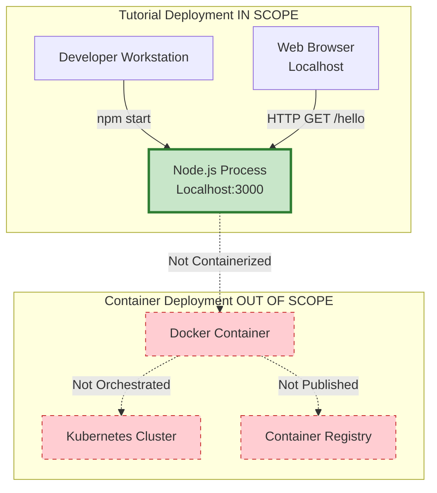

**Direct Process Execution:**

The tutorial runs as a **native operating system process**:
- No Docker daemon required
- No container image building
- No port mapping or volume mounting
- Direct localhost network binding

### 3.7.4 CI/CD Pipeline

**Explicitly NO CI/CD Infrastructure:**

Continuous Integration and Continuous Deployment systems are **intentionally excluded**:

**Excluded CI/CD Technologies:**
- ❌ GitHub Actions workflows
- ❌ Jenkins pipelines
- ❌ GitLab CI/CD
- ❌ CircleCI configurations
- ❌ Travis CI builds
- ❌ Azure DevOps pipelines
- ❌ AWS CodePipeline

**Rationale for CI/CD Exclusion:**

| CI/CD Stage | Standard Practice | Tutorial Approach |
|-------------|-------------------|-------------------|
| **Testing** | Automated test suite execution | Manual browser testing only (testing out of scope) |
| **Linting** | ESLint, Prettier checks | No linting tools (code style not enforced) |
| **Building** | Compile, bundle, optimize | No build process (direct JavaScript execution) |
| **Deployment** | Automated cloud deployment | Local development only (no deployment) |
| **Monitoring** | Post-deployment health checks | No production monitoring |

**Manual Validation Workflow:**

Instead of automated pipelines, the tutorial uses manual verification:

1. **Developer Testing**: Run server locally, test `/hello` endpoint manually
2. **Peer Review** (optional): Code review via Git pull requests
3. **Version Control**: Manual Git commits and pushes
4. **Release**: Git tags for tutorial versions (no deployment artifacts)

**Educational Justification:**

CI/CD exclusion allows tutorial to:
- Focus exclusively on Node.js HTTP server concepts
- Eliminate YAML configuration file complexity
- Avoid CI platform account setup requirements
- Reduce dependency on external build infrastructure

### 3.7.5 Deployment Architecture

**Local Development Deployment Only:**

The tutorial's deployment model is strictly **local machine execution**:

**In-Scope Deployment:**

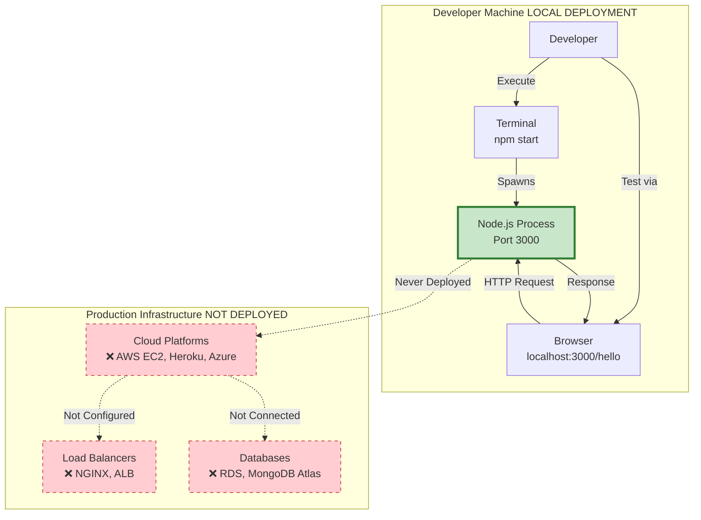

**Deployment Characteristics:**

| Aspect | Specification |
|--------|---------------|
| **Deployment Target** | Developer's local machine (Windows, macOS, Linux) |
| **Network Binding** | Localhost only (127.0.0.1 or 0.0.0.0) |
| **Protocol** | HTTP (not HTTPS) |
| **Port** | Configurable via `PORT` environment variable (default 3000 or 8080) |
| **Process Management** | Manual start/stop (foreground terminal process) |
| **Scaling** | Single process only (no clustering or load balancing) |
| **Uptime** | Manual availability (developer starts server when needed) |

**Excluded Production Deployment Patterns:**

| Pattern | Example Technologies | Exclusion Rationale |
|---------|---------------------|---------------------|
| **Cloud Hosting** | AWS EC2, Azure VMs, Google Compute Engine | Production infrastructure out of scope |
| **Platform-as-a-Service** | Heroku, Netlify, Vercel, Render | Deployment simplicity not needed |
| **Serverless** | AWS Lambda, Azure Functions, Cloudflare Workers | FaaS patterns beyond tutorial scope |
| **Reverse Proxy** | NGINX, Apache, Caddy | No production traffic routing |
| **Load Balancing** | AWS ALB, HAProxy, Traefik | Single-instance design |
| **Process Management** | PM2, Forever, systemd | Manual process control acceptable |
| **TLS/SSL** | Let's Encrypt, ACM certificates | HTTPS not required for localhost |

**Startup Process:**

**Simple Execution:**
```bash
# Method 1: npm script
npm start

#### Method 2: Direct node execution
node server.js

#### Expected output:
#### Server listening on port 3000
```

**Performance Targets:**

| Metric | Target | Measurement |
|--------|--------|-------------|
| **Startup Time** | < 2 seconds | From `npm start` to "Server listening" log |
| **Port Binding** | Immediate | Socket created and bound within startup time |
| **Memory Footprint** | < 50MB | Steady-state RAM usage |
| **First Request** | < 100ms | Time to first successful `/hello` response |

**Network Configuration:**

**Recommended Binding (Security):**
```javascript
// Localhost only (secure)
server.listen(PORT, '127.0.0.1');
```

**Alternative Binding (All Interfaces):**
```javascript
// All network interfaces (use with caution)
server.listen(PORT, '0.0.0.0');
```

**Documentation Requirement:**

README must include security warning:

> **Local Development Only**
> This server is designed for local development and learning. It should NOT be deployed to production environments or exposed to public networks without significant security hardening (HTTPS, authentication, input validation, rate limiting).

**Shutdown Process:**

**Graceful Termination:**
- User presses `Ctrl+C` (SIGINT signal)
- Server receives termination signal
- Optional cleanup logic (close server, log shutdown message)
- Process exits

**No Deployment Automation:**
- No infrastructure-as-code (Terraform, CloudFormation)
- No deployment scripts or automation
- No blue-green deployments or rolling updates
- No canary releases or A/B testing

### 3.7.6 Version Control and Repository Structure

**Version Control System:**

| Tool | Usage | Configuration |
|------|-------|---------------|
| **Git** | Source code versioning | `.git` directory present in repository |
| **GitHub/GitLab/Bitbucket** | Remote repository hosting | Public or private repository |

**Repository Current State:**

Per repository analysis findings:
- **Status**: Greenfield project (empty repository)
- **Existing Files**: `README.md` placeholder only
- **Implementation**: Not yet started (awaiting development)

**Expected Repository Structure:**

```
nodejs-hello-world-tutorial/
├── .git/                  # Git version control
├── .gitignore             # Ignore node_modules, logs, etc.
├── README.md              # Setup and usage instructions
├── package.json           # Project metadata and dependencies
├── package-lock.json      # Locked dependency versions (npm)
│   OR
├── yarn.lock              # Locked dependency versions (Yarn)
├── server.js              # Main HTTP server implementation
└── LICENSE (optional)     # Open source license (MIT recommended)
```

**Gitignore Configuration:**

```gitignore
# Dependencies
node_modules/
npm-debug.log*
yarn-debug.log*
yarn-error.log*

#### OS files
.DS_Store
Thumbs.db

#### Editor files
.vscode/
.idea/
*.swp
*.swo
```

**Evidence Sources:**
- Technical Specification Section 1.2.1 (Current System Limitations - Greenfield Status)
- Technical Specification Section 1.3.2 (Out-of-Scope Elements - Production Infrastructure)
- Technical Specification Section 2.5.1 (Technical Constraints)
- Technical Specification Section 2.5.5 (Maintenance Requirements)

---

## 3.8 Performance & Scalability Requirements

### 3.8.1 Performance Targets

**Quantitative Performance Specifications:**

| Performance Metric | Target | Measurement Method | Validation Approach |
|-------------------|--------|-------------------|---------------------|
| **Response Time (P95)** | < 100ms | Server-side timing or load testing | `curl -w "@curl-format.txt" http://localhost:3000/hello` |
| **Startup Time** | < 2 seconds | Process timing from execution to "listening" log | Manual stopwatch or `time` command |
| **Throughput** | > 100 requests/second | Sequential request handling | Apache Bench: `ab -n 1000 -c 10` |
| **Memory Footprint** | < 50MB steady-state | Process memory monitoring | `process.memoryUsage()` or Activity Monitor |
| **Error Rate** | 0% for valid requests | Manual testing | Send multiple GET requests to `/hello` |

**Performance Design Guidelines:**

1. **No Blocking Operations**: Response handler executes synchronously without I/O operations
2. **Static Content**: "Hello world" string is a code constant (no dynamic generation)
3. **Efficient Routing**: Simple string comparison for path matching (no regex complexity)
4. **Minimal Middleware**: If using Express, avoid unnecessary middleware layers

**Performance Validation Commands:**

```bash
# Response time measurement
curl -w "\nTime Total: %{time_total}s\n" http://localhost:3000/hello

#### Load testing with Apache Bench
ab -n 1000 -c 10 http://localhost:3000/hello

#### Memory monitoring (in Node.js code)
setInterval(() => {
  console.log(process.memoryUsage());
}, 5000);
```

### 3.8.2 Scalability Considerations

**Tutorial-Appropriate Scalability:**

| Scalability Feature | Status | Implementation |
|--------------------|--------|----------------|
| **Multiple Sequential Requests** | ✅ In-Scope | Node.js event loop handles requests automatically |
| **Concurrent Connections** | ✅ In-Scope | Native async I/O without explicit concurrency code |
| **Resource Cleanup** | ✅ In-Scope | Graceful shutdown prevents resource leaks |

**Explicitly Out-of-Scope Scalability:**

| Scalability Pattern | Status | Rationale |
|--------------------|--------|-----------|
| **Horizontal Scaling / Clustering** | ❌ Excluded | Single-process tutorial design |
| **Load Balancing** | ❌ Excluded | No multi-instance deployment |
| **Connection Pooling** | ❌ Excluded | No database or external service connections |
| **Caching Layers** | ❌ Excluded | Static response requires no caching |

**Scalability Anti-Patterns to Avoid:**

- Creating new server instances per request
- Storing request state in global variables (violates stateless design)
- Blocking the event loop with synchronous computations

**Future Scalability Path:**

Advanced tutorials could introduce:
- Node.js `cluster` module for multi-core utilization
- NGINX reverse proxy for load distribution
- Horizontal scaling with container orchestration

---

## 3.9 Security Posture

### 3.9.1 Security Context

**Threat Model:**

This tutorial operates under a **low-risk threat model**:

| Threat Aspect | Context |
|--------------|---------|
| **Deployment Environment** | Local development machine (localhost) |
| **Network Exposure** | No public internet access assumed |
| **User Trust Level** | Developer running code on own machine |
| **Data Sensitivity** | No sensitive data processed or stored |
| **Compliance Requirements** | None (GDPR, HIPAA, PCI-DSS not applicable) |

### 3.9.2 Implemented Security Measures

**Minimal Security Features:**

| Security Domain | Implementation | Rationale |
|----------------|----------------|-----------|
| **Input Validation** | Exact path string matching (`/hello` only) | Prevents path traversal (though risk is minimal) |
| **Output Encoding** | Static string response (no user input echoed) | No XSS risk |
| **Error Handling** | User-friendly error messages (no stack traces exposed) | No information disclosure |

**Code Example (Security-Conscious Pattern):**

```javascript
// Secure: Exact path matching
if (request.url === '/hello') {
  // Return static response
}

// Insecure (NOT used): Dynamic path handling
// if (request.url.includes('hello'))  // Too permissive
```

### 3.9.3 Explicitly Excluded Security Features

**Out-of-Scope Security Mechanisms:**

| Security Feature | Status | Tutorial Alternative |
|------------------|--------|---------------------|
| **Authentication** | ❌ Not implemented | Public endpoint (no user accounts) |
| **Authorization** | ❌ Not implemented | No access control logic |
| **HTTPS/TLS** | ❌ Not implemented | HTTP only (localhost deployment) |
| **Input Sanitization** | ❌ Not needed | No request body parsing or query params |
| **Rate Limiting** | ❌ Not implemented | Local usage only (no abuse risk) |
| **CORS Headers** | ❌ Not configured | No cross-origin requests expected |
| **Security Headers** | ❌ Not set | Helmet.js excluded (middleware out of scope) |
| **SQL Injection Prevention** | ❌ Not applicable | No database queries |
| **CSRF Protection** | ❌ Not applicable | No state-changing operations |

### 3.9.4 Security Documentation Requirements

**README Security Warning:**

The tutorial documentation must include a prominent security notice:

> **⚠️ Security Notice: Local Development Only**
>
> This tutorial server is designed for educational purposes and local development only. It lacks critical security features required for production deployments:
>
> - No HTTPS encryption (uses HTTP)
> - No authentication or authorization
> - No input validation beyond path matching
> - No rate limiting or abuse protection
> - No security headers (CSP, HSTS, etc.)
>
> **Do NOT deploy this code to production environments or expose it to public networks without comprehensive security hardening.**

**Educational Security Guidance:**

README should include learning notes:

> **Security Learning Path:**
>
> After mastering this tutorial, explore production security patterns:
> - HTTPS/TLS certificate management
> - Authentication (JWT, OAuth, session cookies)
> - Input validation libraries (Joi, Validator.js)
> - Security middleware (Helmet.js for Express)
> - Rate limiting (express-rate-limit)
> - OWASP Top 10 vulnerabilities

**Evidence Sources:**
- Technical Specification Section 2.5.4 (Security Implications)
- Technical Specification Section 1.3.2 (Out-of-Scope: Authentication and Security Features)

---

## 3.10 Technology Stack Summary

### 3.10.1 Core Technology Decisions

**Definitive Stack Components:**

| Technology Layer | Selection | Version | Rationale |
|------------------|-----------|---------|-----------|
| **Runtime Environment** | Node.js | 14.x+ (LTS recommended) | Educational JavaScript platform with native HTTP support |
| **Programming Language** | JavaScript (ES6+) | ECMAScript 2015+ | Standard Node.js language with modern features |
| **Package Manager** | npm or Yarn | npm 6.x+ / Yarn 1.x+ | Standard Node.js dependency management |
| **Protocol** | HTTP/1.1 | Standard | Fundamental web protocol (HTTPS excluded for simplicity) |

**Pending Technology Decision:**

| Technology Layer | Option A | Option B | Decision Criteria |
|------------------|----------|----------|------------------|
| **HTTP Framework** | Native `http` module (0 deps) | Express.js ^4.18.0 (1 dep) | Pedagogical goals: fundamentals vs. practical frameworks |

### 3.10.2 Technology Exclusion Summary

**Comprehensive Exclusion List:**

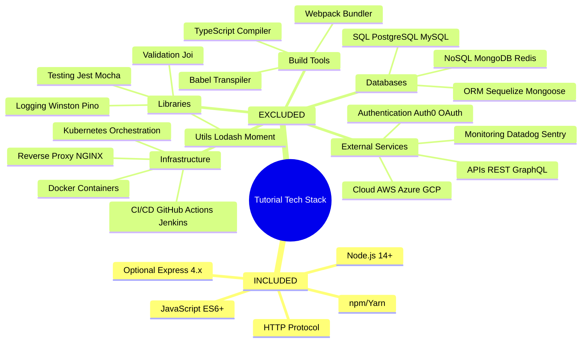

### 3.10.3 Dependency Inventory (Final)

**Scenario A: Native HTTP Module**
- **Total Dependencies**: 0 npm packages
- **Runtime**: Node.js 14.x+ (system installation)
- **Framework**: Native `http` module (built-in)

**Scenario B: Express.js Framework**
- **Total Dependencies**: 1 npm package (`express`)
- **Runtime**: Node.js 14.x+ (system installation)
- **Framework**: Express.js ^4.18.0
- **Transitive Dependencies**: ~30 packages (managed automatically)

**Both Scenarios Meet Constraint**: 0-2 npm packages maximum ✅

### 3.10.4 Technology Maturity and Support

**Technology Lifecycle Assessment:**

| Technology | Maturity Stage | Community Support | Long-Term Viability |
|-----------|----------------|-------------------|---------------------|
| **Node.js** | Mature (14+ years) | Extensive (OpenJS Foundation) | Long-term LTS support |
| **JavaScript** | Mature (27+ years) | Universal (ECMAScript standard) | Continuously evolving |
| **Express.js** | Mature (13+ years) | Very Strong (60%+ market share) | Active maintenance |
| **HTTP Protocol** | Stable (30+ years) | Universal standard | Permanent foundation |
| **npm** | Mature (13+ years) | Default Node.js package manager | Core ecosystem tool |

**Risk Assessment:**

All selected technologies have:
- ✅ Active maintenance and security patches
- ✅ Large community and extensive documentation
- ✅ Backward compatibility guarantees
- ✅ No vendor lock-in concerns
- ✅ Long-term ecosystem stability

---

## 3.11 References

### 3.11.1 Repository Evidence

**Files Examined:**
- `README.md` - Confirmed placeholder status (single line: "# Nov18_12"); no implementation details or technology decisions

**Folders Explored:**
- `/` (root directory, depth 1) - Confirmed greenfield status: contains only `README.md` and `.git` directory; no `package.json`, no JavaScript source files, awaiting implementation

### 3.11.2 Technical Specification Sections Referenced

**Primary Sources:**

1. **Section 1.2 System Overview**
   - Component architecture diagrams
   - Technical approach (native HTTP vs. Express decision)
   - Success criteria and KPIs (performance targets)
   - Framework selection decision points

2. **Section 1.3 Scope**
   - In-scope technical requirements (Node.js 14.x+, HTTP server capabilities)
   - Out-of-scope exclusions (databases, authentication, production infrastructure, testing, external services)
   - System boundaries and integration points

3. **Section 2.5 Implementation Considerations**
   - Technical constraints (runtime version, framework selection, dependency minimization)
   - Performance requirements (< 100ms response, < 2s startup, > 100 req/s throughput)
   - Scalability considerations (stateless design, no clustering)
   - Security implications (local dev only, no HTTPS, minimal threat model)
   - Maintenance requirements (code clarity, documentation, dependency updates)

**Supporting Sources:**

4. **Section 1.1 Executive Summary** - Project overview and core problem statement
5. **Section 1.4 References** - Repository analysis confirmation
6. **Section 2.1 Overview** - Requirements structure and educational mission
7. **Section 2.2 Feature Catalog** - Detailed feature specifications (F-001 through F-008)
8. **Section 2.3 Functional Requirements Specification** - Comprehensive requirements with acceptance criteria
9. **Section 2.9 References and Supporting Documentation** - Cross-references and standards

### 3.11.3 User Context

**Primary Requirement:**
- User request: "Can you create a nodejs tutorial project that features one end point '/hello' that returns 'Hello world' to the calling HTTP client?"
- Project designation: "new product" (greenfield implementation)

**Constraint Implications:**
- Technology stack must support Node.js HTTP server implementation
- Minimal complexity mandate (0-2 npm packages maximum)
- Local development focus (no production deployment)
- Educational purpose (clarity prioritized over production features)

### 3.11.4 External Technology Documentation

**Official Technology Sources:**

| Technology | Official Documentation | Version Info |
|-----------|----------------------|--------------|
| **Node.js** | [nodejs.org/en/docs](https://nodejs.org/en/docs/) | LTS release schedule |
| **Express.js** | [expressjs.com](https://expressjs.com/) | Version 4.x documentation |
| **npm** | [docs.npmjs.com](https://docs.npmjs.com/) | CLI reference |
| **JavaScript** | [developer.mozilla.org/en-US/docs/Web/JavaScript](https://developer.mozilla.org/en-US/docs/Web/JavaScript) | ECMAScript standards |

### 3.11.5 Technology Selection Standards

**Alignment with Default Stack:**

The tutorial project **intentionally deviates** from the default technology stack template due to its specialized educational purpose:

| Stack Layer | Default Stack | Tutorial Stack | Deviation Rationale |
|------------|---------------|----------------|---------------------|
| **Cloud Platform** | AWS | None (local only) | Tutorial simplicity |
| **Containerization** | Docker | None | Setup complexity reduction |
| **IaC** | Terraform | None | No infrastructure provisioning |
| **CI/CD** | GitHub Actions | None | No automated pipelines |
| **Backend Language** | Python | JavaScript (Node.js) | Explicit user requirement |
| **Backend Framework** | Flask | Native HTTP or Express | Node.js ecosystem |
| **Authentication** | Auth0 | None | Out of scope |
| **Database** | MongoDB | None | Stateless design |
| **AI Framework** | Langchain | None | Not applicable |
| **Frontend** | React + TypeScript | None (backend-only) | API-only tutorial |

**Justification for Deviation:**

This tutorial project represents a **foundational learning resource** rather than a production application, necessitating a minimal technology footprint focused exclusively on Node.js HTTP server fundamentals. The default stack's enterprise-grade technologies (cloud platforms, containerization, databases) would introduce complexity antithetical to the tutorial's educational mission.

---

## 3.12 Technology Stack Validation

### 3.12.1 Requirements Traceability

**Technology Decisions Mapped to Requirements:**

| Requirement ID | Requirement | Technology Selection | Validation |
|---------------|-------------|---------------------|------------|
| **1.3.1 - Runtime** | Node.js 14.x or higher | Node.js 14.x+ LTS | ✅ Met |
| **1.2.3 - Dependency Limit** | 0-2 npm packages maximum | 0 (native HTTP) or 1 (Express) | ✅ Met |
| **1.3.2 - No Database** | Data persistence excluded | Zero database technologies | ✅ Met |
| **1.3.2 - No External Services** | Third-party integrations excluded | Zero external service dependencies | ✅ Met |
| **1.3.2 - No Production Infra** | Local development only | No Docker, CI/CD, cloud services | ✅ Met |
| **2.5.2 - Performance** | < 100ms response, < 2s startup | Lightweight Node.js runtime | ✅ Met |
| **2.5.4 - Security** | Local dev security posture | HTTP localhost binding | ✅ Met |

### 3.12.2 Technology Stack Completeness

**Coverage Assessment:**

| System Requirement | Technology Provision | Coverage Status |
|-------------------|---------------------|----------------|
| **HTTP Server Capability** | Node.js native `http` or Express.js | ✅ Complete |
| **JavaScript Execution** | Node.js runtime 14.x+ | ✅ Complete |
| **Dependency Management** | npm or Yarn package managers | ✅ Complete |
| **Development Environment** | Text editor + terminal + Node.js | ✅ Complete |
| **Testing Capability** | Browser or cURL (manual testing) | ✅ Complete |
| **Version Control** | Git (repository initialized) | ✅ Complete |
| **Configuration Management** | Environment variables (`PORT`) | ✅ Complete |
| **Error Handling** | Native JavaScript try-catch (optional) | ✅ Complete |
| **Logging** | Console.log (native) | ✅ Complete |
| **Port Binding** | Node.js net.Server (built-in) | ✅ Complete |

**No Missing Technology Layers:** All functional requirements can be implemented with selected technologies.

### 3.12.3 Constraint Compliance Verification

**Architectural Constraints Adherence:**

| Constraint | Requirement | Technology Stack Compliance | Status |
|-----------|-------------|----------------------------|--------|
| **Dependency Minimization** | Max 0-2 npm packages | 0 (native) or 1 (Express) dependencies | ✅ Pass |
| **Synchronous Processing** | No async operations in response path | Static string response (inherently sync) | ✅ Pass |
| **Stateless Design** | No persistent storage | Zero database/file system technologies | ✅ Pass |
| **Single Endpoint** | `/hello` only | Framework-agnostic routing capability | ✅ Pass |
| **Node.js Version** | 14.x minimum | Specified 14.x+ requirement | ✅ Pass |
| **Local Deployment** | No cloud infrastructure | Zero cloud service dependencies | ✅ Pass |

**All constraints satisfied by technology stack selections.**

---

**End of Section 3: Technology Stack**

# 4. Process Flowchart

## 4.1 Overview

This section provides comprehensive process flowcharts documenting all operational workflows, business processes, and system interactions for the Node.js HTTP server tutorial. The flowcharts map the complete lifecycle from server initialization through request processing to graceful shutdown, with detailed error handling paths and state management documentation.

**Workflow Coverage:**
- Server startup and initialization sequences
- HTTP request-response processing cycles
- Error detection and recovery procedures
- Graceful shutdown and cleanup operations
- State transitions and lifecycle management

**Diagram Conventions:**
- **Start/End Nodes:** Rounded rectangles indicating process entry/exit points
- **Process Steps:** Rectangles representing actions or operations
- **Decision Points:** Diamonds with conditional branching
- **System Boundaries:** Subgraphs delineating component responsibilities
- **Timing Annotations:** Performance SLAs and constraints where applicable

All workflows reference specific features (F-001 through F-008) and requirements documented in Section 2.3 Functional Requirements Specification.

---

## 4.2 System Workflow Architecture

### 4.2.1 High-Level System Interaction Flow

This diagram presents the end-to-end user journey from server launch through HTTP request processing, illustrating the complete system workflow with actor swim lanes and system boundaries.

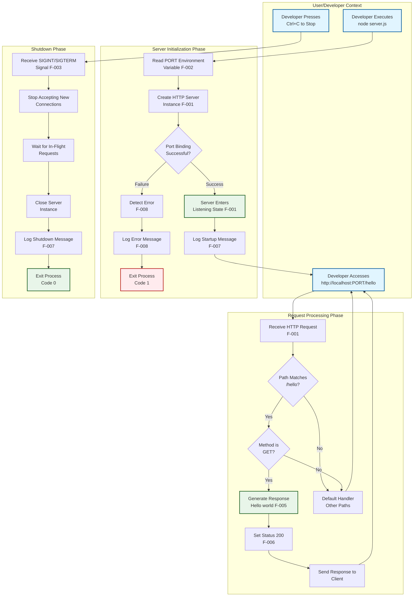

**Key Workflow Phases:**

1. **Initialization Phase** (OBJ-001): Configuration loading, server creation, port binding, startup logging (Target: < 2 seconds)
2. **Request Processing Phase** (OBJ-002, OBJ-003): Route matching, method validation, response generation (Target: < 100ms P95)
3. **Shutdown Phase**: Signal handling, graceful closure, resource cleanup (Target: < 5 seconds)

**Decision Points:**
- **Port Binding Success**: Determines startup success vs. error path (F-008)
- **Path Matching**: Routes requests to `/hello` endpoint vs. default handler (F-004-RQ-001)
- **Method Validation**: Accepts GET requests, rejects others (F-004-RQ-002)

---

### 4.2.2 Component Interaction Sequence

This sequence diagram details the temporal interactions between system components during a complete request-response cycle, showing message flow and timing relationships.

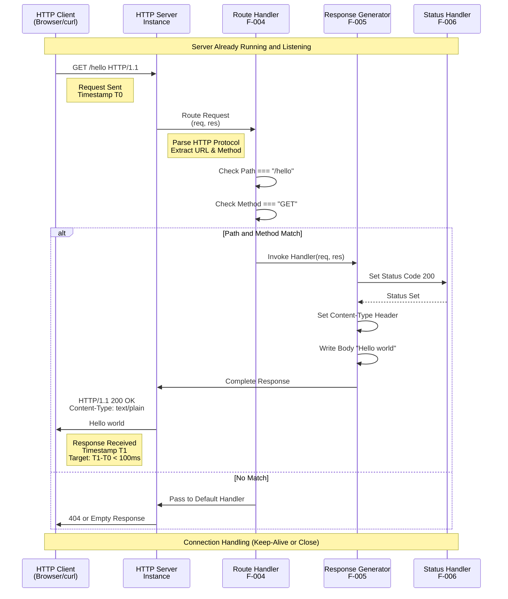

**Timing Constraints:**
- **Total Response Time** (F-004-RQ-004): < 100ms P95, < 50ms P50
- **Path Matching** (F-004-RQ-001): < 1ms
- **Response Generation** (F-005-RQ-001): < 1ms
- **Status Setting** (F-006-RQ-001): < 1ms

**Integration Points:**
- **Server → Router**: Request object with URL and method properties
- **Router → Generator**: Control flow invocation when path/method match
- **Generator → Status**: Status code setting coordination (F-006-RQ-002)
- **Generator → Server**: Response stream completion signal

---

## 4.3 Core Business Processes

### 4.3.1 Server Startup Process

This workflow documents the complete server initialization sequence, including configuration loading, resource binding, and startup validation. This process implements features F-001 (HTTP Server Initialization), F-002 (Port Configuration), F-007 (Console Logging), and F-008 (Startup Error Detection).

#### 4.3.1.1 Startup Workflow Diagram

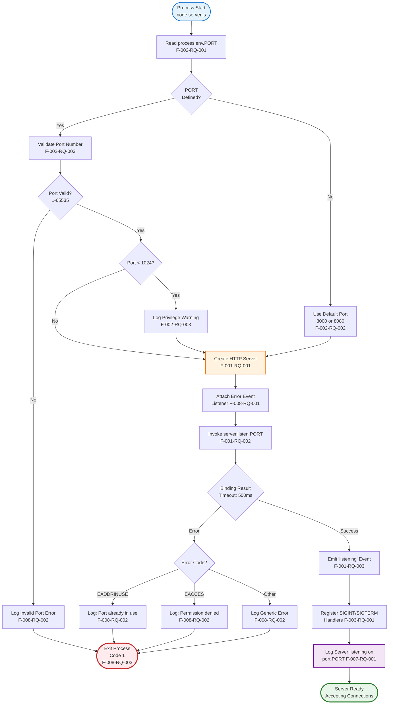

#### 4.3.1.2 Startup Process Steps

**Phase 1: Port Configuration (F-002)**

| Step | Action | Validation | Performance |
|------|--------|------------|-------------|
| 1.1 | Read `process.env.PORT` | Check if defined and non-empty | < 1ms |
| 1.2 | If undefined, use default (3000 or 8080) | Default must be in valid range | Instant |
| 1.3 | Parse port value to integer | Validate numeric format | < 1ms |
| 1.4 | Validate port range (1-65535) | Must be valid TCP port | < 1ms |
| 1.5 | Warn if privileged port (< 1024) | Log warning message | < 5ms |

**Phase 2: Server Instantiation (F-001)**

| Step | Action | Validation | Performance |
|------|--------|------------|-------------|
| 2.1 | Create HTTP server object | `http.createServer()` or Express `app` | < 10ms |
| 2.2 | Attach error event listener | `server.on('error', handler)` | < 1ms |
| 2.3 | Define request handler function | Route matching logic included | Instant |

**Phase 3: Port Binding (F-001)**

| Step | Action | Validation | Performance |
|------|--------|------------|-------------|
| 3.1 | Invoke `server.listen(PORT)` | Attempt to bind to specified port | < 500ms |
| 3.2 | Wait for 'listening' or 'error' event | Operating system port allocation | Variable |
| 3.3 | On success: emit 'listening' event | Server enters listening state | < 100ms |
| 3.4 | On failure: emit 'error' event | Error code populated (EADDRINUSE, EACCES) | Immediate |

**Phase 4: Startup Completion (F-007, F-008)**

| Step | Action | Validation | Performance |
|------|--------|------------|-------------|
| 4.1 | If error: detect error code | Check `error.code` property | < 1ms |
| 4.2 | If error: log user-friendly message | Context-specific error guidance | < 10ms |
| 4.3 | If error: execute `process.exit(1)` | Non-zero exit code signals failure | < 100ms |
| 4.4 | If success: register SIGINT/SIGTERM handlers | Enable graceful shutdown | < 1ms |
| 4.5 | If success: log startup confirmation | "Server listening on port [PORT]" | < 10ms |
| 4.6 | If success: enter ready state | Accept incoming connections | Complete |

**Total Startup Time Target**: < 2 seconds (F-001-RQ-003, KPI from Section 1.2.3)

---

#### 4.3.1.3 Startup Error Scenarios

**Error Scenario 1: Port Already in Use (EADDRINUSE)**

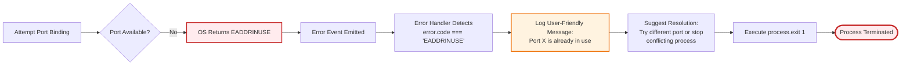

**Recovery Actions for Developer:**
1. Identify conflicting process using `lsof -i :PORT` (macOS/Linux) or `netstat -ano | findstr :PORT` (Windows)
2. Stop conflicting process or choose different port
3. Set `PORT` environment variable: `PORT=8080 node server.js`
4. Restart server

**Error Scenario 2: Permission Denied (EACCES)**


**Recovery Actions for Developer:**
1. Choose unprivileged port (≥ 1024): `PORT=3000 node server.js`
2. OR run with elevated privileges (not recommended for tutorial): `sudo node server.js` (Linux/macOS)

---

### 4.3.2 Request-Response Processing

This workflow documents the complete HTTP request handling lifecycle from connection acceptance through response transmission. This process implements features F-004 (Endpoint Handler), F-005 (Response Generation), and F-006 (Status Code Handling).

#### 4.3.2.1 Request Handling Workflow

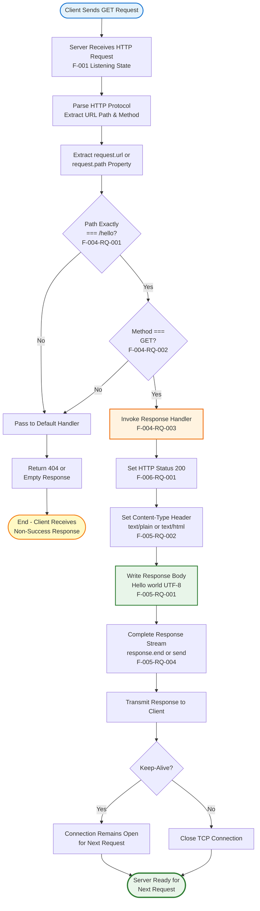

#### 4.3.2.2 Request Processing Steps

**Phase 1: Request Reception and Parsing**

| Step | Action | Validation | Performance |
|------|--------|------------|-------------|
| 1.1 | TCP connection accepted | Connection established | < 10ms |
| 1.2 | HTTP protocol parsed | Valid HTTP/1.1 request | < 5ms |
| 1.3 | Request object created | Node.js IncomingMessage instance | < 1ms |
| 1.4 | Extract URL path | Access `request.url` or `request.path` | < 1ms |
| 1.5 | Extract HTTP method | Access `request.method` property | < 1ms |

**Phase 2: Route Matching (F-004)**

| Step | Action | Validation | Performance |
|------|--------|------------|-------------|
| 2.1 | Compare path with "/hello" | Exact string equality, case-sensitive | < 1ms |
| 2.2 | Ignore query strings | Parse path before "?" character | < 1ms |
| 2.3 | If no match, invoke default handler | Pass to Express 404 middleware or ignore | < 1ms |
| 2.4 | If match, check method | Compare with "GET" (case-insensitive) | < 1ms |
| 2.5 | If method mismatch, reject | Pass to default handler | < 1ms |
| 2.6 | If all match, proceed to generation | Invoke response generator | < 1ms |

**Phase 3: Response Generation (F-005, F-006)**

| Step | Action | Validation | Performance |
|------|--------|------------|-------------|
| 3.1 | Set HTTP status code to 200 | `response.writeHead(200)` or `statusCode = 200` | < 1ms |
| 3.2 | Set Content-Type header | "text/plain" or "text/html; charset=utf-8" | < 1ms |
| 3.3 | Write "Hello world" to body | UTF-8 encoded string (11 bytes) | < 1ms |
| 3.4 | Complete response stream | `response.end()` or `response.send()` | < 5ms |

**Phase 4: Response Transmission**

| Step | Action | Validation | Performance |
|------|--------|------------|-------------|
| 4.1 | Transmit status line | "HTTP/1.1 200 OK" | < 5ms |
| 4.2 | Transmit headers | Content-Type and other headers | < 5ms |
| 4.3 | Transmit body | "Hello world" payload | < 5ms |
| 4.4 | Handle connection | Keep-Alive or close per HTTP headers | < 10ms |

**Total Request-Response Time Target**: < 100ms P95, < 50ms P50 (F-004-RQ-004, KPI from Section 1.2.3)

---

#### 4.3.2.3 Path Matching Validation Rules

**Valid Paths (Match /hello):**
- `http://localhost:3000/hello` ✅
- `http://localhost:3000/hello?name=test` ✅ (query string ignored)
- `http://localhost:3000/hello?param1=value1&param2=value2` ✅

**Invalid Paths (Do Not Match):**
- `http://localhost:3000/` ❌ (root path)
- `http://localhost:3000/Hello` ❌ (case mismatch)
- `http://localhost:3000/hello/` ❌ (trailing slash)
- `http://localhost:3000/hello/world` ❌ (additional path segment)
- `http://localhost:3000/api/hello` ❌ (prefix path)

**Validation Logic (F-004-RQ-001):**

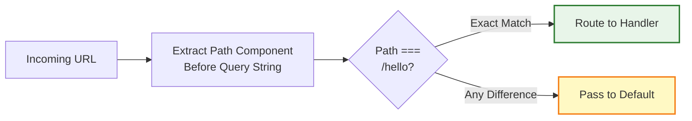

**Implementation Variants:**

**Native HTTP Module:**
```javascript
if (req.url.split('?')[0] === '/hello' && req.method === 'GET') {
    // Handle request
}
```

**Express Framework:**
```javascript
app.get('/hello', (req, res) => {
    // Handle request - framework handles matching
});
```

---

#### 4.3.2.4 Response Content Specification

**HTTP Response Structure (F-005, F-006):**

```
HTTP/1.1 200 OK
Content-Type: text/plain
Content-Length: 11
Connection: keep-alive

Hello world
```

**Response Validation Requirements:**

| Component | Requirement | Validation Method |
|-----------|-------------|-------------------|
| Status Code | Must be integer 200 | Check `response.statusCode` property |
| Status Message | "OK" or equivalent | HTTP protocol standard |
| Content-Type | "text/plain" or "text/html" | Inspect response headers |
| Content-Length | 11 bytes (for plain text) | Automatic or explicit header |
| Body Content | Exactly "Hello world" | String comparison (OBJ-003) |
| Body Encoding | UTF-8 | Character encoding validation |

**Content-Type Options (F-005-RQ-002):**

**Option 1: text/plain** (Recommended for tutorial simplicity)
```
Content-Type: text/plain
```
- Body: `Hello world` (raw text)
- Charset: UTF-8 implicit
- Browser rendering: Plain text display

**Option 2: text/html** (Optional for HTML context)
```
Content-Type: text/html; charset=utf-8
```
- Body: `Hello world` (rendered as HTML)
- Charset: UTF-8 explicit
- Browser rendering: HTML document

---

### 4.3.3 Graceful Shutdown Process

This workflow documents the server lifecycle termination sequence, ensuring clean resource cleanup and connection handling. This process implements features F-003 (Server Lifecycle Management) and F-007 (Console Logging).

#### 4.3.3.1 Shutdown Workflow Diagram

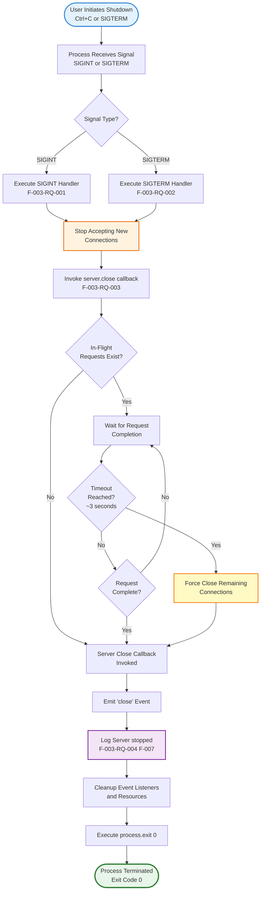

#### 4.3.3.2 Shutdown Process Steps

**Phase 1: Signal Reception (F-003-RQ-001, F-003-RQ-002)**

| Step | Action | Validation | Performance |
|------|--------|------------|-------------|
| 1.1 | User presses Ctrl+C or sends SIGTERM | Operating system signal delivery | Immediate |
| 1.2 | Node.js process receives signal | `process.on('SIGINT')` or `process.on('SIGTERM')` fires | < 10ms |
| 1.3 | Signal handler function invoked | Registered handler executes | < 1ms |
| 1.4 | Handler accesses server instance reference | Server object available in closure | < 1ms |

**Phase 2: Connection Management (F-003-RQ-003)**

| Step | Action | Validation | Performance |
|------|--------|------------|-------------|
| 2.1 | Invoke `server.close(callback)` | Stop accepting new connections | < 10ms |
| 2.2 | Reject new connection attempts | New clients receive connection refused | Immediate |
| 2.3 | Identify in-flight requests | Active request-response cycles | < 10ms |
| 2.4 | Wait for in-flight completion | Allow current requests to finish | Variable (< 3s typical) |
| 2.5 | Set shutdown timeout | Force close after reasonable wait | 3-5 seconds |

**Phase 3: Resource Cleanup**

| Step | Action | Validation | Performance |
|------|--------|------------|-------------|
| 3.1 | Close callback executes | Server emits 'close' event | After connections close |
| 3.2 | Remove event listeners | Detach signal handlers | < 1ms |
| 3.3 | Clear timers/intervals | Cancel pending operations | < 5ms |
| 3.4 | Release server instance | Allow garbage collection | Automatic |

**Phase 4: Process Termination (F-003-RQ-004, F-007)**

| Step | Action | Validation | Performance |
|------|--------|------------|-------------|
| 4.1 | Log shutdown confirmation message | "Server stopped" to stdout | < 10ms |
| 4.2 | Execute `process.exit(0)` | Success exit code | < 100ms |
| 4.3 | Node.js process terminates | Operating system process cleanup | < 1 second |

**Total Shutdown Time Target**: < 5 seconds (Section 2.5.2 timing constraint)

---

#### 4.3.3.3 Shutdown Timing and SLA

**Performance Targets:**

```mermaid
gantt
    title Graceful Shutdown Timeline
    dateFormat X
    axisFormat %S
    
    section Signal Handling
    Signal Reception           :0, 10ms
    Handler Invocation        :10ms, 1ms
    
    section Connection Management
    Stop Accepting            :11ms, 10ms
    Wait for In-Flight        :21ms, 3000ms
    
    section Cleanup
    Close Callback            :3021ms, 10ms
    Log Message              :3031ms, 10ms
    Process Exit             :3041ms, 100ms
    
    section Total
    Complete Shutdown         :0, 3141ms
```

**Timing Breakdown:**
- **Signal to Close**: < 50ms (signal handling overhead)
- **In-Flight Wait**: 0-3000ms (variable based on active requests)
- **Cleanup**: < 200ms (logging and resource cleanup)
- **Total**: < 5 seconds maximum (Section 2.5.2 SLA)

**Edge Cases:**

**Scenario 1: No Active Connections**
- **Duration**: < 500ms (immediate shutdown)
- **Flow**: Signal → Close → Log → Exit

**Scenario 2: Active Connections Complete Quickly**
- **Duration**: < 2 seconds (typical case)
- **Flow**: Signal → Close → Wait (brief) → Log → Exit

**Scenario 3: Long-Running Request (Near Timeout)**
- **Duration**: ~3-5 seconds (maximum wait)
- **Flow**: Signal → Close → Wait (full timeout) → Force Close → Log → Exit

---

## 4.4 State Management and Transitions

### 4.4.1 Server Lifecycle State Diagram

This state diagram documents all possible server states and the transitions between them, providing a complete view of lifecycle management from initialization through termination.

```mermaid
stateDiagram-v2
    [*] --> Initial: Process Start<br/>node server.js
    
    Initial --> Configuring: Read Environment<br/>Variables F-002
    
    Configuring --> PortConfigured: Port Determined<br/>Default or ENV
    
    PortConfigured --> Creating: Create Server<br/>Instance F-001-RQ-001
    
    Creating --> Binding: Invoke server.listen<br/>F-001-RQ-002
    
    Binding --> Listening: Bind Success<br/>Listening Event<br/>F-001-RQ-003
    Binding --> ErrorState: Bind Failure<br/>Error Event<br/>F-008-RQ-001
    
    Listening --> Processing: Request Received<br/>F-004
    
    Processing --> Listening: Response Sent<br/>F-005 Complete
    
    Listening --> ShuttingDown: SIGINT/SIGTERM<br/>Received F-003-RQ-001
    
    ShuttingDown --> Closing: server.close<br/>Invoked F-003-RQ-003
    
    Closing --> Terminated: Close Complete<br/>process.exit 0<br/>F-003-RQ-004
    
    ErrorState --> Terminated: Error Logged<br/>process.exit 1<br/>F-008-RQ-003
    
    Terminated --> [*]: Process Ends
    
    note right of Initial
        No server instance
        Reading configuration
    end note
    
    note right of Listening
        Ready to accept requests
        Main operational state
    end note
    
    note right of Processing
        Transient state
        Single request handling
    end note
    
    note right of ShuttingDown
        No new connections
        Completing in-flight requests
    end note
    
    note right of ErrorState
        Fatal initialization error
        EADDRINUSE or EACCES
    end note
```

### 4.4.2 State Definitions and Characteristics

#### 4.4.2.1 Initialization States

**State: Initial**
- **Description**: Process started, no server instance exists
- **Duration**: < 10ms
- **Resources**: None allocated
- **Transitions**: Always proceeds to Configuring
- **Actions**: None

**State: Configuring**
- **Description**: Reading environment variables and determining configuration
- **Duration**: < 10ms
- **Resources**: Environment variable access
- **Transitions**: Proceeds to PortConfigured on success
- **Actions**: Read `process.env.PORT`, apply defaults (F-002)

**State: PortConfigured**
- **Description**: Port value determined and validated
- **Duration**: < 10ms
- **Resources**: Port configuration variable
- **Transitions**: Proceeds to Creating
- **Actions**: Port validation (F-002-RQ-003)

**State: Creating**
- **Description**: HTTP server instance being instantiated
- **Duration**: < 10ms
- **Resources**: HTTP server object allocated
- **Transitions**: Proceeds to Binding
- **Actions**: Create server, attach error handlers (F-001-RQ-001)

**State: Binding**
- **Description**: Attempting to bind server to configured port
- **Duration**: < 500ms typical, variable
- **Resources**: Operating system port allocation
- **Transitions**: 
  - Success → Listening (F-001-RQ-003)
  - Failure → ErrorState (F-008)
- **Actions**: Invoke `server.listen(PORT)` (F-001-RQ-002)

---

#### 4.4.2.2 Operational States

**State: Listening**
- **Description**: Server successfully bound and accepting connections
- **Duration**: Indefinite (until shutdown signal)
- **Resources**: 
  - TCP socket bound to port
  - Event listeners active
  - Memory: < 50MB typical (KPI from Section 1.2.3)
- **Transitions**:
  - Request received → Processing (transient)
  - Shutdown signal → ShuttingDown
- **Actions**: 
  - Accept TCP connections
  - Parse HTTP requests
  - Route to handlers
  - Emit 'connection' events
- **Success Criteria**: OBJ-001 (Server startup), OBJ-002 (Endpoint accessible)

**State: Processing**
- **Description**: Actively handling HTTP request-response cycle
- **Duration**: < 100ms per request (P95 target)
- **Resources**: 
  - Request/response objects
  - Memory for request data
- **Transitions**: Always returns to Listening after response complete
- **Actions**:
  - Route matching (F-004)
  - Response generation (F-005)
  - Status code setting (F-006)
  - Response transmission
- **Concurrency**: Multiple simultaneous processing states (Node.js event loop handles concurrency)

---

#### 4.4.2.3 Termination States

**State: ShuttingDown**
- **Description**: Shutdown initiated, no longer accepting new connections
- **Duration**: < 5 seconds total (Section 2.5.2 SLA)
- **Resources**: 
  - Server instance maintained
  - Active connections tracked
- **Transitions**: Proceeds to Closing
- **Actions**:
  - Stop accepting new connections
  - Track in-flight requests
  - Wait for completion with timeout
- **Entry Condition**: SIGINT or SIGTERM signal received (F-003-RQ-001, F-003-RQ-002)

**State: Closing**
- **Description**: Server close callback executing, final cleanup
- **Duration**: < 200ms
- **Resources**: Server instance being released
- **Transitions**: Proceeds to Terminated
- **Actions**:
  - Emit 'close' event
  - Log shutdown message (F-003-RQ-004, F-007)
  - Cleanup event listeners
  - Prepare for process exit

**State: ErrorState**
- **Description**: Fatal error detected during initialization
- **Duration**: < 500ms (error logging and exit)
- **Resources**: None (cleanup mode)
- **Transitions**: Proceeds directly to Terminated
- **Actions**:
  - Detect error code (F-008-RQ-001)
  - Log error message (F-008-RQ-002)
  - Execute `process.exit(1)` (F-008-RQ-003)
- **Entry Condition**: Port binding failure (EADDRINUSE, EACCES) or other initialization error

**State: Terminated**
- **Description**: Process has exited, no longer running
- **Duration**: N/A (final state)
- **Resources**: All released
- **Transitions**: None (terminal state)
- **Exit Codes**:
  - 0: Successful shutdown via graceful signal handling
  - 1: Startup error (F-008)

---

### 4.4.3 State Transition Matrix

| From State | To State | Trigger | Conditions | Duration | Feature Reference |
|------------|----------|---------|------------|----------|-------------------|
| Initial | Configuring | Process start | Always | < 10ms | F-002 |
| Configuring | PortConfigured | Config loaded | Port determined | < 10ms | F-002-RQ-001, F-002-RQ-002 |
| PortConfigured | Creating | Config validated | Port valid | < 10ms | F-002-RQ-003 |
| Creating | Binding | Server created | Instance exists | < 10ms | F-001-RQ-001 |
| Binding | Listening | Bind success | Port available | < 500ms | F-001-RQ-002, F-001-RQ-003 |
| Binding | ErrorState | Bind failure | Port conflict or permission error | < 50ms | F-008-RQ-001 |
| Listening | Processing | Request received | Valid HTTP request | < 1ms | F-004 |
| Processing | Listening | Response sent | Response complete | < 100ms | F-005-RQ-004 |
| Listening | ShuttingDown | Shutdown signal | SIGINT or SIGTERM | < 10ms | F-003-RQ-001, F-003-RQ-002 |
| ShuttingDown | Closing | In-flight complete | All requests done or timeout | < 3s | F-003-RQ-003 |
| Closing | Terminated | Close complete | Cleanup done | < 200ms | F-003-RQ-004 |
| ErrorState | Terminated | Error logged | Message output | < 500ms | F-008-RQ-003 |

---

### 4.4.4 Data Persistence and Caching

**Stateless Design Mandate (Section 2.5.1):**

The system implements a strictly stateless architecture with no persistent data storage or session management. This design constraint simplifies the tutorial and ensures consistent behavior across requests.

**No Persistence Points:**
- ❌ No database connections or queries
- ❌ No file system writes (except console logging to stdout)
- ❌ No session cookies or storage
- ❌ No in-memory caches beyond static string constants
- ❌ No user authentication state
- ❌ No request history tracking

**Static Data Only:**
- ✅ "Hello world" response content (hardcoded string constant)
- ✅ Port configuration (read once at startup)
- ✅ Server instance (singleton for process lifetime)

**State Lifecycle:**

```mermaid
flowchart LR
    A[Request Received] --> B[Request Object Created]
    B --> C[Route Matching]
    C --> D[Response Generation]
    D --> E[Response Sent]
    E --> F[Objects Destroyed]
    F --> G[No Persistent State]
    
    style B fill:#fff3e0,stroke:#ef6c00,stroke-width:2px
    style F fill:#ffebee,stroke:#c62828,stroke-width:2px
    style G fill:#e8f5e9,stroke:#2e7d32,stroke-width:2px
```

**Memory Management:**
- **Request Objects**: Created per-request, garbage collected after response
- **Response Objects**: Created per-request, garbage collected after transmission
- **Server Instance**: Created once, persists for process lifetime
- **Memory Footprint**: < 50MB steady-state (KPI from Section 1.2.3)

---

## 4.5 Error Handling and Recovery Procedures

### 4.5.1 Startup Error Handling Workflow

This section details comprehensive error detection and recovery procedures for initialization failures, implementing F-008 (Startup Error Detection).

#### 4.5.1.1 Error Detection Flowchart

```mermaid
flowchart TD
    Start[Server Initialization<br/>Attempt] --> CreateServer[Create HTTP Server<br/>Instance]
    
    CreateServer --> AttachListener[Attach Error Event<br/>Listener server.on error]
    
    AttachListener --> AttemptBind[Invoke server.listen PORT]
    
    AttemptBind --> WaitEvent{Event Type?}
    
    WaitEvent -->|listening| Success[Startup Success Path]
    WaitEvent -->|error| ErrorDetect[Error Event Fired]
    
    ErrorDetect --> ExtractCode[Extract error.code<br/>Property]
    
    ExtractCode --> CheckCode{Error Code?}
    
    CheckCode -->|EADDRINUSE| PortInUse[Port Conflict Detected]
    CheckCode -->|EACCES| PermissionDenied[Permission Error Detected]
    CheckCode -->|ENOTFOUND| NetworkError[Network Configuration Error]
    CheckCode -->|Other| GenericError[Generic Error Detected]
    
    PortInUse --> LogPortError[Log: Port PORT is already<br/>in use. Try different port.]
    PermissionDenied --> LogPermError[Log: Permission denied for<br/>port PORT. Use port >= 1024]
    NetworkError --> LogNetError[Log: Network configuration<br/>error. Check connectivity.]
    GenericError --> LogGeneric[Log: Generic error message<br/>with error details]
    
    LogPortError --> SuggestResolution1[Suggest: Stop conflicting<br/>process or set PORT env var]
    LogPermError --> SuggestResolution2[Suggest: Use unprivileged<br/>port or run with elevated<br/>permissions NOT recommended]
    LogNetError --> SuggestResolution3[Suggest: Check network<br/>interfaces and firewall]
    LogGeneric --> SuggestResolution4[Display error.message<br/>property]
    
    SuggestResolution1 --> ExitProcess
    SuggestResolution2 --> ExitProcess
    SuggestResolution3 --> ExitProcess
    SuggestResolution4 --> ExitProcess[Execute process.exit 1]
    
    ExitProcess --> Terminated([Process Terminated<br/>Exit Code 1])
    
    Success --> Ready([Server Ready<br/>Listening State])
    
    style ErrorDetect fill:#ffebee,stroke:#c62828,stroke-width:2px
    style PortInUse fill:#ffecb3,stroke:#ff6f00,stroke-width:2px
    style PermissionDenied fill:#ffecb3,stroke:#ff6f00,stroke-width:2px
    style Terminated fill:#ffebee,stroke:#c62828,stroke-width:3px
    style Ready fill:#e8f5e9,stroke:#2e7d32,stroke-width:3px
```

#### 4.5.1.2 Error Code Reference

| Error Code | Cause | User-Friendly Message | Resolution Steps | Feature Reference |
|------------|-------|----------------------|------------------|-------------------|
| **EADDRINUSE** | Port already bound by another process | "Error: Port [PORT] is already in use. Try a different port or stop the conflicting process." | 1. Identify conflicting process: `lsof -i :[PORT]` (Unix) or `netstat -ano \| findstr :[PORT]` (Windows)<br/>2. Kill conflicting process or choose different port<br/>3. Restart: `PORT=8080 node server.js` | F-008-RQ-001, F-008-RQ-002 |
| **EACCES** | Permission denied for port binding | "Error: Permission denied for port [PORT]. Ports below 1024 require administrator privileges. Please use a port >= 1024." | 1. Choose unprivileged port: `PORT=3000 node server.js`<br/>2. OR (not recommended): Run with elevated privileges: `sudo node server.js` | F-008-RQ-001, F-008-RQ-002 |
| **ENOTFOUND** | Network interface not found | "Error: Network interface not available. Check network connectivity and firewall settings." | 1. Verify network interfaces: `ifconfig` or `ipconfig`<br/>2. Check firewall rules<br/>3. Restart network services | F-008-RQ-001, F-008-RQ-002 |
| **EINVAL** | Invalid port number | "Error: Invalid port number. Port must be between 1 and 65535." | 1. Verify PORT environment variable: `echo $PORT`<br/>2. Ensure numeric value in valid range<br/>3. Restart with valid port | F-002-RQ-003, F-008-RQ-002 |
| **Generic** | Unexpected error | "Error starting server: [error.message]" | 1. Review error details<br/>2. Check Node.js version compatibility<br/>3. Verify system resources<br/>4. Consult documentation | F-008-RQ-002 |

#### 4.5.1.3 Error Message Templates

**Template for EADDRINUSE (F-008-RQ-002):**
```
Error: Port 3000 is already in use.

This typically means another application is using this port.
To resolve:
  1. Stop the conflicting application
  2. OR choose a different port: PORT=8080 node server.js

To find what's using the port:
  - Mac/Linux: lsof -i :3000
  - Windows: netstat -ano | findstr :3000
```

**Template for EACCES (F-008-RQ-002):**
```
Error: Permission denied for port 80.

Ports below 1024 are privileged and require administrator access.
For this tutorial, please use an unprivileged port (>= 1024):

  PORT=3000 node server.js

If you absolutely need port 80:
  - Mac/Linux: sudo node server.js (not recommended for development)
  - Windows: Run Command Prompt as Administrator (not recommended for development)
```

---

### 4.5.2 Runtime Error Handling

**Scope Note**: Advanced runtime error handling is explicitly out-of-scope per Section 1.3.2 (Out-of-Scope Features). The tutorial focuses on startup errors only. However, basic error handling patterns are documented for educational completeness.

#### 4.5.2.1 Unhandled Request Errors

**Default Behavior:**
- Requests to paths other than `/hello` receive default server behavior (404 or empty response)
- POST, PUT, DELETE requests to `/hello` are not handled (pass through to default)
- Malformed HTTP requests are handled by Node.js runtime (400 Bad Request)

**No Custom Error Pages Required:**
The tutorial intentionally omits custom error responses to maintain minimal scope. This design decision is acceptable for educational context but should be noted in production considerations.

---

### 4.5.3 Retry Mechanisms and Fallback Processes

**Not Applicable for Tutorial Scope:**

The stateless, single-endpoint design does not require retry mechanisms or fallback processes:

- **No External Dependencies**: No API calls or database queries that could fail
- **Synchronous Processing**: No async operations requiring retry logic
- **Static Content**: "Hello world" response generation cannot fail
- **No Circuit Breakers**: No external service dependencies requiring fault tolerance

**Educational Note**: Production systems would implement:
- Exponential backoff for external API calls
- Circuit breaker patterns for failing dependencies
- Fallback responses for degraded service states
- Health check endpoints for monitoring

---

### 4.5.4 Error Notification and Logging

**Console Logging Strategy (F-007, F-008):**

```mermaid
flowchart LR
    A[Error Occurs] --> B{Error Type?}
    
    B -->|Startup Error| C[Log to Console<br/>stdout or stderr]
    B -->|Runtime Error| D[Node.js Default<br/>Handling]
    
    C --> E[User-Friendly Message<br/>F-008-RQ-002]
    E --> F[Resolution Suggestions]
    F --> G[Exit Process<br/>process.exit 1]
    
    D --> H[Error Event or<br/>Exception Handling]
    
    style A fill:#ffebee,stroke:#c62828,stroke-width:2px
    style C fill:#fff3e0,stroke:#ef6c00,stroke-width:2px
    style G fill:#ffebee,stroke:#c62828,stroke-width:2px
```

**Logging Standards:**

| Event Type | Log Level | Output Stream | Format | Feature Reference |
|------------|-----------|---------------|--------|-------------------|
| Server startup | Info | stdout | "Server listening on port [PORT]" | F-007-RQ-001 |
| Graceful shutdown | Info | stdout | "Server stopped" | F-003-RQ-004, F-007 |
| Startup errors | Error | stderr or stdout | "Error: [user-friendly message]" | F-008-RQ-002 |
| Port validation warnings | Warning | stdout | "Warning: Port < 1024 requires privileges" | F-002-RQ-003 |

**No Advanced Logging Infrastructure:**
- ❌ No log aggregation or rotation
- ❌ No log levels (debug, info, warn, error)
- ❌ No structured logging (JSON format)
- ❌ No external logging services

The tutorial uses simple `console.log()` and `console.error()` for immediate feedback, appropriate for local development learning context.

---

## 4.6 Integration Workflows and Data Flow

### 4.6.1 Component Integration Architecture

This section documents how system components interact and integrate to deliver the `/hello` endpoint functionality.

#### 4.6.1.1 Component Data Flow Diagram

```mermaid
flowchart TB
    subgraph "External Context"
        Client[HTTP Client<br/>Browser/curl/Postman]
        OS[Operating System<br/>TCP/IP Network Stack]
        Env[Environment Variables<br/>process.env]
    end
    
    subgraph "Node.js Process Boundary"
        subgraph "Configuration Layer"
            PortConfig[Port Configuration<br/>Manager F-002]
        end
        
        subgraph "Server Infrastructure Layer"
            ServerInstance[HTTP Server<br/>Instance F-001]
            SignalHandler[Signal Handler<br/>F-003]
            ErrorHandler[Error Detector<br/>F-008]
        end
        
        subgraph "Request Processing Layer"
            Router[Route Handler<br/>/hello Matcher F-004]
            Generator[Response Generator<br/>Hello world F-005]
            StatusHandler[Status Code<br/>Handler F-006]
        end
        
        subgraph "Observability Layer"
            Logger[Console Logger<br/>F-007]
        end
    end
    
    Env -->|PORT value| PortConfig
    PortConfig -->|Port number| ServerInstance
    
    OS -->|Bind result| ServerInstance
    OS -->|SIGINT/SIGTERM| SignalHandler
    
    ServerInstance -.->|Error event| ErrorHandler
    ServerInstance -.->|Success event| Logger
    SignalHandler -.->|Shutdown request| ServerInstance
    
    Client -->|HTTP GET /hello| OS
    OS -->|TCP connection| ServerInstance
    ServerInstance -->|Request routing| Router
    
    Router -->|Match found| Generator
    Generator -->|Set status| StatusHandler
    StatusHandler -->|Status set| Generator
    Generator -->|Response complete| ServerInstance
    
    ServerInstance -->|HTTP response| OS
    OS -->|Response delivery| Client
    
    ErrorHandler -.->|Error message| Logger
    Logger -.->|Log output| OS
    
    style Client fill:#e3f2fd,stroke:#1976d2,stroke-width:2px
    style ServerInstance fill:#fff3e0,stroke:#ef6c00,stroke-width:3px
    style Router fill:#f3e5f5,stroke:#7b1fa2,stroke-width:2px
    style Generator fill:#e8f5e9,stroke:#2e7d32,stroke-width:2px
    style Logger fill:#fff9c4,stroke:#f57f17,stroke-width:2px
```

#### 4.6.1.2 Integration Points and Dependencies

| Integration Point | Components Involved | Data Exchanged | Timing | Feature References |
|-------------------|---------------------|----------------|--------|-------------------|
| **Environment Config** | OS Environment → Port Config Manager | PORT environment variable (string) | Startup | F-002-RQ-001 |
| **Server Binding** | Port Config Manager → HTTP Server | Port number (integer) | Startup | F-001-RQ-002, F-002 |
| **Error Notification** | HTTP Server → Error Detector | Error object with code property | On binding failure | F-008-RQ-001 |
| **Success Logging** | HTTP Server → Console Logger | Port number for log message | On listening event | F-007-RQ-001 |
| **Signal Registration** | Signal Handler → HTTP Server | Server instance reference | Startup | F-003-RQ-001 |
| **Request Routing** | HTTP Server → Route Handler | Request and response objects | Per request | F-004-RQ-003 |
| **Response Generation** | Route Handler → Response Generator | Request/response objects | Per matched request | F-004-RQ-003, F-005 |
| **Status Setting** | Response Generator → Status Handler | Status code (integer 200) | Per response | F-006-RQ-001 |
| **Shutdown Initiation** | Signal Handler → HTTP Server | Close() method invocation | On signal | F-003-RQ-003 |
| **Shutdown Logging** | HTTP Server → Console Logger | Shutdown confirmation | On close event | F-003-RQ-004, F-007 |

---

### 4.6.2 Event-Driven Processing Flow

The system uses Node.js event-driven architecture for asynchronous coordination between components. This diagram illustrates event emission and handling patterns.

```mermaid
sequenceDiagram
    participant Process as Node.js Process
    participant Server as HTTP Server
    participant ErrorH as Error Handler
    participant Logger as Console Logger
    participant SignalH as Signal Handler
    
    Note over Process,SignalH: Startup Sequence
    
    Process->>Server: Create and Bind
    
    alt Binding Success
        Server->>Server: Emit 'listening' Event
        Server->>Logger: Trigger Log Handler
        Logger->>Process: Output to stdout
    else Binding Failure
        Server->>Server: Emit 'error' Event
        Server->>ErrorH: Trigger Error Handler
        ErrorH->>Logger: Send Error Message
        Logger->>Process: Output to stderr
        ErrorH->>Process: Exit with Code 1
    end
    
    Note over Process,SignalH: Runtime Operation
    
    Process->>SignalH: Register SIGINT/SIGTERM
    
    Note over Process,SignalH: Shutdown Sequence
    
    Process->>SignalH: Receive SIGINT
    SignalH->>Server: Invoke close()
    Server->>Server: Stop Accepting Connections
    Server->>Server: Wait for In-Flight
    Server->>Server: Emit 'close' Event
    Server->>Logger: Trigger Shutdown Log
    Logger->>Process: Output to stdout
    SignalH->>Process: Exit with Code 0
```

**Event Catalog:**

| Event Name | Emitter | Listeners | Payload | Timing | Purpose |
|------------|---------|-----------|---------|--------|---------|
| **'listening'** | HTTP Server | Logger, Application | None | After successful bind | Confirm server ready (F-007-RQ-001) |
| **'error'** | HTTP Server | Error Handler | Error object with code | On binding failure | Enable error detection (F-008-RQ-001) |
| **'close'** | HTTP Server | Logger, Shutdown Handler | None | After server closes | Confirm shutdown complete (F-003-RQ-004) |
| **'request'** | HTTP Server | Route Handler | req, res objects | Per incoming request | Trigger request processing (F-004) |
| **SIGINT** | Node.js Process | Signal Handler | Signal name | On Ctrl+C | Initiate graceful shutdown (F-003-RQ-001) |
| **SIGTERM** | Node.js Process | Signal Handler | Signal name | On termination request | Initiate graceful shutdown (F-003-RQ-002) |

---

### 4.6.3 No External System Integration

**Intentional Design Constraint (Section 1.3.2):**

The tutorial explicitly excludes external system integrations to maintain focus on fundamental HTTP server concepts:

**No Integration With:**
- ❌ Databases (PostgreSQL, MongoDB, Redis)
- ❌ External APIs or microservices
- ❌ Message queues (RabbitMQ, Kafka)
- ❌ Authentication providers (OAuth, SAML)
- ❌ Content delivery networks (CDNs)
- ❌ Monitoring or APM services
- ❌ Load balancers or reverse proxies

**Architectural Boundary:**

```mermaid
flowchart LR
    A[HTTP Client] <-->|HTTP Protocol| B[Node.js Server]
    B <-.->|No External Calls| C[External Services]
    
    style B fill:#e8f5e9,stroke:#2e7d32,stroke-width:3px
    style C fill:#ffebee,stroke:#c62828,stroke-width:2px,stroke-dasharray: 5 5
```

**Educational Rationale:**
- Reduces complexity for beginner learners
- Eliminates dependency management overhead
- Ensures consistent behavior across environments
- Focuses exclusively on core Node.js HTTP server functionality

**Future Extension Path:**
Advanced tutorials could build upon this foundation by adding:
- Database integration (Tutorial V2)
- External API calls with error handling (Tutorial V2)
- Authentication and authorization (Tutorial V3)
- Microservice communication patterns (Tutorial V3)

---

## 4.7 Timing Constraints and Performance SLAs

### 4.7.1 Performance Target Summary

This section consolidates all performance requirements and timing constraints referenced throughout the technical specification, providing a complete view of SLA obligations.

#### 4.7.1.1 Performance Requirement Matrix

| Performance Metric | Target Value | Measurement Point | Validation Method | Business Justification | Feature Reference |
|-------------------|--------------|-------------------|-------------------|------------------------|-------------------|
| **Server Startup Time** | < 2 seconds | Process start to listening event | System timing: `time node server.js` | Quick iteration during development | F-001-RQ-003, Section 1.2.3 KPI |
| **Response Time (P50)** | < 50ms | Request receipt to response complete | Load testing: Apache Bench, curl timing | User experience: instant feedback | F-004-RQ-004, Section 1.2.3 KPI |
| **Response Time (P95)** | < 100ms | Request receipt to response complete | Load testing: Apache Bench P95 statistics | Consistent performance at scale | F-004-RQ-004, Section 1.2.3 KPI |
| **Throughput** | > 100 req/s | Sequential requests per second | Load testing: `ab -n 1000 -c 10` | Demonstrate Node.js efficiency | Section 1.2.3 KPI |
| **Memory Footprint** | < 50MB | Steady-state operation | Process monitoring: `process.memoryUsage()` | Lightweight resource usage | Section 1.2.3 KPI |
| **Server Initialization** | < 10ms | Server object creation | Code instrumentation | Minimal startup overhead | F-001-RQ-001, Section 2.5.2 |
| **Port Binding** | < 500ms | listen() to listening event | Event timing | OS port allocation speed | F-001-RQ-002, Section 2.5.2 |
| **Path Matching** | < 1ms | URL comparison | Code instrumentation | Efficient routing logic | F-004-RQ-001, Section 2.5.2 |
| **Response Generation** | < 1ms | String construction | Code instrumentation | Static content speed | F-005-RQ-001, Section 2.5.2 |
| **Graceful Shutdown** | < 5 seconds | Signal to process exit | Shutdown timing | Clean resource cleanup | F-003-RQ-002, Section 2.5.2 |
| **In-Flight Request Wait** | < 3 seconds | Close() to connections complete | Connection monitoring | Balance cleanup vs responsiveness | F-003-RQ-003, Section 2.5.2 |

#### 4.7.1.2 Performance Timing Diagram

```mermaid
gantt
    title Performance SLA Timeline (Total Request Processing)
    dateFormat X
    axisFormat %L ms
    
    section Request Processing (P95 Target < 100ms)
    TCP Connection Accept        :0, 10ms
    HTTP Protocol Parse          :10ms, 5ms
    Path Matching F-004          :15ms, 1ms
    Method Validation F-004      :16ms, 1ms
    Response Generation F-005    :17ms, 1ms
    Status Code Setting F-006    :18ms, 1ms
    Header Construction          :19ms, 1ms
    Body Transmission            :20ms, 5ms
    Connection Handling          :25ms, 10ms
    
    section Total Response Time
    Complete Request-Response    :0, 35ms
    P50 Target Threshold         :crit, 0, 50ms
    P95 Target Threshold         :crit, 0, 100ms
```

---

### 4.7.2 Performance Validation Procedures

#### 4.7.2.1 Startup Time Validation

**Method 1: System Timing**
```bash
time node server.js
# Expected output: real < 2.0s
```

**Method 2: Code Instrumentation**
```javascript
const startTime = Date.now();
server.listen(PORT, () => {
    const duration = Date.now() - startTime;
    console.log(`Startup time: ${duration}ms`);
    // Expected: duration < 2000ms
});
```

**Acceptance Criteria**: 100% of startup attempts complete within 2 seconds on valid configurations

---

#### 4.7.2.2 Response Time Validation

**Method 1: curl Timing**
```bash
curl -w "@curl-format.txt" -o /dev/null -s http://localhost:3000/hello

## curl-format.txt contents:
#### time_total: %{time_total}s
#### Expected: < 0.100s (100ms)
```

**Method 2: Apache Bench Load Testing**
```bash
ab -n 1000 -c 10 http://localhost:3000/hello

#### Expected results:
#### - Requests per second: > 100
#### - Time per request (mean): < 50ms
#### - Time per request (95th percentile): < 100ms
```

**Method 3: Node.js Code Instrumentation**
```javascript
app.get('/hello', (req, res) => {
    const startTime = process.hrtime.bigint();
    res.send('Hello world');
    const duration = process.hrtime.bigint() - startTime;
    console.log(`Response time: ${Number(duration) / 1000000}ms`);
    // Expected: < 1ms (server-side only)
});
```

---

#### 4.7.2.3 Memory Footprint Validation

**Method 1: Activity Monitor / Task Manager**
- Open system process monitor
- Locate `node` process running server
- Observe memory usage during steady-state operation
- **Expected**: < 50MB RSS (Resident Set Size)

**Method 2: Code Instrumentation**
```javascript
setInterval(() => {
    const mem = process.memoryUsage();
    console.log(`Memory Usage:
        RSS: ${Math.round(mem.rss / 1024 / 1024)}MB
        Heap Used: ${Math.round(mem.heapUsed / 1024 / 1024)}MB
    `);
    // Expected: RSS < 50MB after warm-up
}, 10000);
```

---

### 4.7.3 Performance Design Patterns

**Optimization Strategies Implemented:**

1. **Static Content Response** (F-005): "Hello world" string is hardcoded constant, eliminating dynamic generation overhead
2. **Simple Route Matching** (F-004): Exact string comparison avoids regex parsing cost
3. **Minimal Middleware** (Express variant): No unnecessary middleware in request path
4. **Event Loop Efficiency**: No blocking synchronous operations (Section 2.5.2)
5. **Single File Architecture**: Minimal module loading overhead

**Performance Anti-Patterns Avoided:**

- ❌ Synchronous file I/O in request path
- ❌ Complex regex patterns for routing
- ❌ Database queries per request
- ❌ Heavy logging middleware
- ❌ Unnecessary JSON parsing/serialization

---

## 4.8 Validation Rules and Business Logic

### 4.8.1 Input Validation Requirements

This section documents all validation rules applied to inputs, configurations, and requests throughout the system lifecycle.

#### 4.8.1.1 Port Configuration Validation (F-002)

**Validation Rule VR-001: Port Number Format**

| Aspect | Specification |
|--------|--------------|
| **Input Source** | `process.env.PORT` environment variable |
| **Expected Format** | Integer or numeric string (e.g., "3000") |
| **Valid Range** | 1 - 65535 (TCP port range) |
| **Recommended Range** | 1024 - 65535 (unprivileged ports) |
| **Default Fallback** | 3000 or 8080 if undefined |
| **Validation Logic** | 1. Parse string to integer<br/>2. Check if NaN<br/>3. Check if in range 1-65535<br/>4. Warn if < 1024 |
| **Error Handling** | Invalid format or out-of-range → Log error and exit(1) |
| **Feature Reference** | F-002-RQ-003 |

**Validation Flowchart:**

```mermaid
flowchart TD
    Input[PORT Environment<br/>Variable] --> Defined{Defined?}
    
    Defined -->|No| UseDefault[Use Default 3000]
    Defined -->|Yes| ParseInt[Parse to Integer]
    
    ParseInt --> IsNumber{Valid Number?}
    IsNumber -->|No| ErrorInvalid[Error: Invalid port<br/>format]
    IsNumber -->|Yes| CheckRange{1 <= port <= 65535?}
    
    CheckRange -->|No| ErrorRange[Error: Port out<br/>of range]
    CheckRange -->|Yes| CheckPrivileged{Port < 1024?}
    
    CheckPrivileged -->|Yes| WarnPrivileged[Warn: Requires<br/>elevated privileges]
    CheckPrivileged -->|No| Valid
    
    WarnPrivileged --> Valid[Port Valid]
    UseDefault --> Valid
    
    Valid --> Return([Return Validated Port])
    ErrorInvalid --> Exit([Exit Process Code 1])
    ErrorRange --> Exit
    
    style ErrorInvalid fill:#ffebee,stroke:#c62828,stroke-width:2px
    style ErrorRange fill:#ffebee,stroke:#c62828,stroke-width:2px
    style Valid fill:#e8f5e9,stroke:#2e7d32,stroke-width:2px
```

**Valid Port Examples:**
- ✅ `PORT=3000` → Valid, unprivileged
- ✅ `PORT=8080` → Valid, unprivileged
- ✅ `PORT=1024` → Valid, unprivileged boundary
- ✅ `PORT=80` → Valid but warns (privileged)
- ✅ `PORT="3000"` → Valid (string converted to integer)

**Invalid Port Examples:**
- ❌ `PORT=abc` → Error: Not numeric
- ❌ `PORT=0` → Error: Out of range
- ❌ `PORT=70000` → Error: Out of range
- ❌ `PORT=-1` → Error: Out of range
- ❌ `PORT=3000.5` → Warning: Decimal converted to integer

---

#### 4.8.1.2 Request Path Validation (F-004)

**Validation Rule VR-002: URL Path Matching**

| Aspect | Specification |
|--------|--------------|
| **Input Source** | HTTP request URL property |
| **Expected Format** | URL path string beginning with "/" |
| **Match Criteria** | Exact equality with "/hello" |
| **Case Sensitivity** | Case-sensitive ("/hello" ≠ "/Hello") |
| **Query String Handling** | Ignored (extract path before "?") |
| **Trailing Slash** | Not matched ("/hello/" ≠ "/hello") |
| **Validation Logic** | 1. Extract path from URL<br/>2. Split on "?" to remove query<br/>3. Compare with "/hello" using === |
| **Match Result** | Match → Route to handler (F-005)<br/>No Match → Default handler |
| **Feature Reference** | F-004-RQ-001 |

**Path Validation Decision Tree:**

```mermaid
flowchart TD
    Request[Incoming HTTP<br/>Request] --> ExtractURL[Extract request.url]
    
    ExtractURL --> SplitQuery[Split on ? to<br/>Remove Query String]
    SplitQuery --> GetPath[path = parts 0]
    
    GetPath --> CompareExact{path === /hello?}
    
    CompareExact -->|Yes| MatchSuccess[Route Match Success]
    CompareExact -->|No| CheckVariants{Check Common<br/>Variants}
    
    CheckVariants -->|/Hello| CaseMismatch[No Match: Case Mismatch]
    CheckVariants -->|/hello/| TrailingSlash[No Match: Trailing Slash]
    CheckVariants -->|/| RootPath[No Match: Root Path]
    CheckVariants -->|Other| OtherPath[No Match: Different Path]
    
    MatchSuccess --> MethodCheck[Proceed to Method<br/>Validation VR-003]
    
    CaseMismatch --> DefaultHandler[Pass to Default<br/>Handler]
    TrailingSlash --> DefaultHandler
    RootPath --> DefaultHandler
    OtherPath --> DefaultHandler
    
    style MatchSuccess fill:#e8f5e9,stroke:#2e7d32,stroke-width:2px
    style CaseMismatch fill:#fff9c4,stroke:#f57f17,stroke-width:2px
    style TrailingSlash fill:#fff9c4,stroke:#f57f17,stroke-width:2px
```

**Path Validation Test Cases:**

| Input URL | Query String | Extracted Path | Match Result | Reason |
|-----------|-------------|----------------|--------------|--------|
| `/hello` | None | `/hello` | ✅ Match | Exact match |
| `/hello?name=test` | `name=test` | `/hello` | ✅ Match | Query ignored |
| `/hello?a=1&b=2` | `a=1&b=2` | `/hello` | ✅ Match | Query ignored |
| `/Hello` | None | `/Hello` | ❌ No Match | Case mismatch |
| `/hello/` | None | `/hello/` | ❌ No Match | Trailing slash |
| `/hello/world` | None | `/hello/world` | ❌ No Match | Additional segment |
| `/` | None | `/` | ❌ No Match | Root path |
| `/api/hello` | None | `/api/hello` | ❌ No Match | Prefix path |

---

#### 4.8.1.3 HTTP Method Validation (F-004)

**Validation Rule VR-003: HTTP Method Filtering**

| Aspect | Specification |
|--------|--------------|
| **Input Source** | HTTP request method property |
| **Expected Value** | "GET" (string) |
| **Case Sensitivity** | Case-insensitive comparison |
| **Valid Methods** | GET only |
| **Invalid Methods** | POST, PUT, DELETE, PATCH, HEAD, OPTIONS, etc. |
| **Validation Logic** | 1. Extract `request.method`<br/>2. Compare with "GET" (case-insensitive)<br/>3. If match → process<br/>4. If no match → default handler |
| **Match Result** | Match → Generate response (F-005)<br/>No Match → Default handler (405 or ignore) |
| **Feature Reference** | F-004-RQ-002 |

**Method Validation Flowchart:**

```mermaid
flowchart TD
    PathMatched[Path Matched /hello] --> ExtractMethod[Extract request.method<br/>Property]
    
    ExtractMethod --> Uppercase[Convert to Uppercase<br/>for Comparison]
    
    Uppercase --> CompareMethod{method ===<br/>GET?}
    
    CompareMethod -->|Yes| MethodValid[Method Valid]
    CompareMethod -->|No| CheckMethod{What Method?}
    
    CheckMethod -->|POST| RejectPost[Reject: POST<br/>Not Supported]
    CheckMethod -->|PUT| RejectPut[Reject: PUT<br/>Not Supported]
    CheckMethod -->|DELETE| RejectDelete[Reject: DELETE<br/>Not Supported]
    CheckMethod -->|Other| RejectOther[Reject: Method<br/>Not Supported]
    
    MethodValid --> GenerateResponse[Invoke Response<br/>Generator F-005]
    
    RejectPost --> DefaultHandler[Pass to Default<br/>Handler]
    RejectPut --> DefaultHandler
    RejectDelete --> DefaultHandler
    RejectOther --> DefaultHandler
    
    style MethodValid fill:#e8f5e9,stroke:#2e7d32,stroke-width:2px
    style RejectPost fill:#fff9c4,stroke:#f57f17,stroke-width:2px
    style RejectPut fill:#fff9c4,stroke:#f57f17,stroke-width:2px
```

**Method Validation Test Cases:**

| Request Method | Case Variant | Validation Result | Handler Invoked |
|----------------|--------------|-------------------|-----------------|
| `GET` | Uppercase | ✅ Valid | Response Generator (F-005) |
| `get` | Lowercase | ✅ Valid | Response Generator (F-005) |
| `Get` | Mixed case | ✅ Valid | Response Generator (F-005) |
| `POST` | Any case | ❌ Invalid | Default Handler |
| `PUT` | Any case | ❌ Invalid | Default Handler |
| `DELETE` | Any case | ❌ Invalid | Default Handler |
| `PATCH` | Any case | ❌ Invalid | Default Handler |
| `HEAD` | Any case | ❌ Invalid | Default Handler |
| `OPTIONS` | Any case | ❌ Invalid | Default Handler |

---

#### 4.8.1.4 Response Content Validation (F-005)

**Validation Rule VR-004: Response Body Content**

| Aspect | Specification |
|--------|--------------|
| **Expected Content** | Exactly "Hello world" |
| **Character Count** | 11 characters |
| **Byte Count** | 11 bytes (UTF-8 encoding) |
| **Case Sensitivity** | Exact case: "Hello world" (not "hello world" or "HELLO WORLD") |
| **Whitespace** | Single space between "Hello" and "world" |
| **Encoding** | UTF-8 |
| **Validation Logic** | String comparison with expected value |
| **Business Requirement** | OBJ-003: Exact match required for success criteria |
| **Feature Reference** | F-005-RQ-001 |

**Content Validation:**

```mermaid
flowchart LR
    Generate[Generate Response<br/>Body] --> AssignContent[content = Hello world]
    
    AssignContent --> ValidateExact{content ===<br/>Hello world?}
    
    ValidateExact -->|Yes| ValidateLength{length === 11?}
    ValidateExact -->|No| ContentError[Error: Content<br/>Mismatch]
    
    ValidateLength -->|Yes| ValidateEncoding{encoding ===<br/>UTF-8?}
    ValidateLength -->|No| LengthError[Error: Length<br/>Mismatch]
    
    ValidateEncoding -->|Yes| Valid[Content Valid]
    ValidateEncoding -->|No| EncodingError[Error: Encoding<br/>Mismatch]
    
    Valid --> Send[Send Response<br/>to Client]
    
    style Valid fill:#e8f5e9,stroke:#2e7d32,stroke-width:2px
    style ContentError fill:#ffebee,stroke:#c62828,stroke-width:2px
    style LengthError fill:#ffebee,stroke:#c62828,stroke-width:2px
    style EncodingError fill:#ffebee,stroke:#c62828,stroke-width:2px
```

**Content Validation Test Cases:**

| Response Body | Validation Result | Reason |
|---------------|-------------------|--------|
| `Hello world` | ✅ Valid | Exact match (OBJ-003) |
| `hello world` | ❌ Invalid | Case mismatch (lowercase 'h') |
| `HELLO WORLD` | ❌ Invalid | Case mismatch (all uppercase) |
| `Hello  world` | ❌ Invalid | Extra space |
| `Hello world!` | ❌ Invalid | Extra punctuation |
| `Hello world\n` | ❌ Invalid | Trailing newline |
| ` Hello world` | ❌ Invalid | Leading space |

---

### 4.8.2 Business Rule Implementation

**Business Rule BR-001: Single Endpoint Constraint**

| Rule | Specification |
|------|--------------|
| **Statement** | The system SHALL implement exactly one HTTP endpoint at path `/hello` |
| **Rationale** | Tutorial scope focuses on single endpoint demonstration (Section 1.1.2, User Context) |
| **Enforcement** | Route handler matches only `/hello` path; all other paths receive default behavior |
| **Validation** | Manual testing: Access `/`, `/api`, `/hello/world` → All return 404 or empty |
| **Feature Reference** | F-004 |

**Business Rule BR-002: Static Content Response**

| Rule | Specification |
|------|--------------|
| **Statement** | The system SHALL return static content "Hello world" without dynamic generation or personalization |
| **Rationale** | Simplifies implementation and ensures consistent behavior (Section 2.5.1 constraints) |
| **Enforcement** | Response content is hardcoded string constant, no variables or user input |
| **Validation** | All requests to `/hello` return identical response body |
| **Feature Reference** | F-005-RQ-001 |

**Business Rule BR-003: Stateless Operation**

| Rule | Specification |
|------|--------------|
| **Statement** | The system SHALL NOT maintain session state, cookies, or persistent data across requests |
| **Rationale** | Tutorial focus on HTTP fundamentals without state management complexity (Section 2.5.1) |
| **Enforcement** | No session middleware, no cookies, no database, no global request variables |
| **Validation** | Multiple requests from same client produce identical results with no request history |
| **Feature Reference** | Architecture: Section 1.2.2, Constraints: Section 2.5.1 |

**Business Rule BR-004: HTTP 200 Success Code**

| Rule | Specification |
|------|--------------|
| **Statement** | The system SHALL return HTTP status code 200 for all successful `/hello` GET requests |
| **Rationale** | Demonstrate proper HTTP protocol compliance (Technical Requirements Section 1.3.1) |
| **Enforcement** | Status code explicitly set to 200 in response generation (F-006) |
| **Validation** | HTTP client inspection shows 200 status for all valid requests |
| **Feature Reference** | F-006-RQ-001 |

---

### 4.8.3 Authorization and Security Checkpoints

**Security Checkpoint SC-001: No Authentication Required**

| Aspect | Specification |
|--------|--------------|
| **Requirement** | The system SHALL NOT implement authentication or authorization |
| **Rationale** | Out-of-scope for tutorial (Section 1.3.2), local development environment (Section 2.5.4) |
| **Security Context** | Acceptable for localhost-only deployment, NOT for production |
| **Risk Assessment** | Low risk: no sensitive data, local-only access |
| **Documentation** | README must warn: "This tutorial has no authentication and is intended for local development only" |

**Security Checkpoint SC-002: Input Validation (Minimal)**

| Aspect | Specification |
|--------|--------------|
| **Requirement** | The system SHALL validate only port configuration and URL path matching |
| **Rationale** | Static response eliminates most injection risks (Section 2.5.4) |
| **Validation Points** | 1. Port number format and range (F-002-RQ-003)<br/>2. URL path exact match (F-004-RQ-001) |
| **Protection Provided** | Path traversal prevention (implicit in exact match), Port binding security |
| **Limitations** | No protection against: DoS, request flooding, malformed headers (acceptable for tutorial) |

**Security Checkpoint SC-003: No TLS/HTTPS**

| Aspect | Specification |
|--------|--------------|
| **Requirement** | The system SHALL use plain HTTP without TLS encryption |
| **Rationale** | Out-of-scope for tutorial (Section 1.3.2), local development context |
| **Security Context** | Acceptable for localhost, NOT for production or network exposure |
| **Risk Assessment** | Low risk: local-only traffic, no sensitive data transmission |
| **Documentation** | README must warn: "This tutorial uses unencrypted HTTP. Production systems require HTTPS." |

---

## 4.9 References and Supporting Documentation

### 4.9.1 Technical Specification Cross-References

This Process Flowchart section derives its requirements and architectural guidance from the following Technical Specification sections:

**Section 1: Introduction and Overview**
- `1.1 Executive Summary` - Project value proposition, success criteria, target outcomes
- `1.2 System Overview` - High-level architecture, component descriptions, KPIs
  - `1.2.2 High-Level Description` - Component interaction diagram referenced in Section 4.2.2
  - `1.2.3 Success Criteria` - Performance KPIs referenced throughout Section 4.7
- `1.3 Scope` - Feature inclusions and exclusions informing workflow boundaries

**Section 2: Functional Requirements**
- `2.2 Feature Catalog` - Complete feature descriptions for F-001 through F-008
  - `2.2.1 Core Server Features` - F-001, F-002, F-003 workflows documented in Section 4.3.1 and 4.3.3
  - `2.2.2 Endpoint Features` - F-004, F-005, F-006 workflows documented in Section 4.3.2
  - `2.2.3 Operational Features` - F-007, F-008 integrated throughout error handling
- `2.3 Functional Requirements Specification` - Detailed acceptance criteria for all workflows
  - `2.3.1 F-001 Requirements` - Server initialization workflow (Section 4.3.1)
  - `2.3.2 F-002 Requirements` - Port configuration validation (Section 4.8.1.1)
  - `2.3.3 F-003 Requirements` - Graceful shutdown workflow (Section 4.3.3)
  - `2.3.4 F-004 Requirements` - Path and method validation (Section 4.8.1.2, 4.8.1.3)
  - `2.3.5 F-005 Requirements` - Response generation workflow (Section 4.3.2)
  - `2.3.6 F-006 Requirements` - Status code handling (Section 4.3.2)
  - `2.3.7 F-007 Requirements` - Logging integration throughout workflows
  - `2.3.8 F-008 Requirements` - Error detection workflows (Section 4.5.1)
- `2.5 Implementation Considerations` - Technical constraints and performance requirements
  - `2.5.1 Technical Constraints` - Stateless design mandate (Section 4.4.4)
  - `2.5.2 Performance Requirements` - Timing targets and SLAs (Section 4.7)
  - `2.5.4 Security Implications` - Security checkpoints (Section 4.8.3)

**Section 3: Technical Stack** (Retrieved during research phase)
- `3.1 Technology Stack Overview` - Stack philosophy and decision framework
- `3.3 Frameworks & Libraries` - Native HTTP vs Express.js implementation variants referenced in workflow descriptions

### 4.9.2 Feature Traceability

All workflows and process flows documented in this section trace directly to functional requirements:

| Workflow Section | Primary Features | Requirements References |
|------------------|------------------|------------------------|
| 4.3.1 Server Startup | F-001, F-002, F-007, F-008 | F-001-RQ-001 through F-001-RQ-004, F-002-RQ-001 through F-002-RQ-003, F-007-RQ-001, F-008-RQ-001 through F-008-RQ-003 |
| 4.3.2 Request-Response | F-004, F-005, F-006 | F-004-RQ-001 through F-004-RQ-004, F-005-RQ-001 through F-005-RQ-004, F-006-RQ-001 through F-006-RQ-002 |
| 4.3.3 Graceful Shutdown | F-003, F-007 | F-003-RQ-001 through F-003-RQ-004, F-007-RQ-001 through F-007-RQ-003 |
| 4.4 State Management | F-001, F-003 | F-001-RQ-003, F-003-RQ-003, Section 2.5.1 constraints |
| 4.5 Error Handling | F-008 | F-008-RQ-001 through F-008-RQ-003 |
| 4.7 Performance SLAs | All features | Section 1.2.3 KPIs, Section 2.5.2 performance targets |
| 4.8 Validation Rules | F-002, F-004, F-005 | F-002-RQ-003, F-004-RQ-001, F-004-RQ-002, F-005-RQ-001 |

### 4.9.3 Repository Files Referenced

**Current Repository State**: Greenfield (no implementation code exists)

| File Path | Description | Relevance to Process Flowcharts |
|-----------|-------------|-------------------------------|
| `README.md` | Placeholder file (contains only "# Nov18_12") | No workflow implementation details available; diagrams show intended/specified behavior |

**Note**: All process flowcharts document the **intended system behavior** as specified in the Technical Specification, not existing implementation. The repository is greenfield (only README.md exists), so diagrams represent the design to be implemented.

### 4.9.4 External Resources and Standards

**HTTP Protocol Standards:**
- RFC 7230: Hypertext Transfer Protocol (HTTP/1.1): Message Syntax and Routing
- RFC 7231: Hypertext Transfer Protocol (HTTP/1.1): Semantics and Content
  - Section 6.3.1: Status Code 200 OK (referenced in F-006)
- RFC 3986: Uniform Resource Identifier (URI): Generic Syntax (referenced in path validation)

**Node.js Documentation:**
- Node.js HTTP Module: `http.createServer()`, `server.listen()`, `server.close()` APIs
- Node.js Process Module: `process.env`, `process.exit()`, `process.on()` signal handling
- Node.js Console Module: `console.log()`, `console.error()` logging methods

**TCP/IP Standards:**
- RFC 793: Transmission Control Protocol - Port number specifications
- IANA Port Number Registry: Port range definitions (1-65535, privileged < 1024)

**Signal Handling:**
- POSIX Signal Specifications: SIGINT, SIGTERM signal definitions and conventions

### 4.9.5 Diagram Technologies

**Mermaid.js Diagrams:**
All flowcharts and diagrams in this section use Mermaid.js syntax for rendering:
- **Flowchart Diagrams**: `flowchart TB` or `flowchart LR` for process flows
- **Sequence Diagrams**: `sequenceDiagram` for temporal interactions
- **State Diagrams**: `stateDiagram-v2` for lifecycle management
- **Gantt Charts**: `gantt` for timing visualizations

**Rendering**: Diagrams are validated for proper Mermaid syntax:
- All subgraphs properly closed with `end` keyword
- Consistent node ID references
- Valid connection syntax (-->, --->, etc.)
- Proper style definitions

### 4.9.6 Related Documentation Sections

**For Complete System Understanding**, refer to:
- **Section 3: Technical Stack** - Implementation technology decisions (Native HTTP vs Express.js)
- **Section 5: Data Model** - (If applicable) Data structures and schemas
- **Section 6: API Specification** - HTTP endpoint detailed documentation
- **Section 7: Security Architecture** - Comprehensive security analysis
- **Section 8: Deployment Architecture** - Deployment patterns and environments
- **Section 9: Testing Strategy** - Test scenarios validating workflows

---

## 4.10 Summary and Workflow Coverage

### 4.10.1 Comprehensive Workflow Coverage

This Process Flowchart section provides complete documentation of all system workflows:

✅ **Covered Workflows:**
1. **Server Initialization** (Section 4.3.1) - Complete startup sequence with error paths
2. **HTTP Request Processing** (Section 4.3.2) - End-to-end request handling with validation
3. **Graceful Shutdown** (Section 4.3.3) - Signal handling and resource cleanup
4. **State Transitions** (Section 4.4) - Complete lifecycle state management
5. **Error Handling** (Section 4.5) - Startup error detection and recovery
6. **Component Integration** (Section 4.6) - Data flow and event-driven coordination
7. **Performance Validation** (Section 4.7) - Timing constraints and SLA enforcement
8. **Input Validation** (Section 4.8) - Business rules and security checkpoints

### 4.10.2 Decision Points Documented

All critical decision points in system workflows:

| Decision Point | Location | Criteria | Outcomes |
|----------------|----------|----------|----------|
| **Port Binding Success** | Section 4.3.1.1 | Operating system port availability | Success → Listening state / Failure → Error state |
| **Port Validation** | Section 4.8.1.1 | Port range 1-65535, numeric format | Valid → Continue / Invalid → Exit |
| **Path Matching** | Section 4.3.2.1 | URL path === "/hello" | Match → Method check / No match → Default handler |
| **Method Validation** | Section 4.3.2.1 | HTTP method === "GET" | Match → Response generation / No match → Default handler |
| **Error Code Detection** | Section 4.5.1.1 | Error code (EADDRINUSE, EACCES, etc.) | Specific error message and exit |
| **In-Flight Requests** | Section 4.3.3.1 | Active connections exist during shutdown | Yes → Wait / No → Immediate close |
| **Shutdown Timeout** | Section 4.3.3.1 | Wait time exceeds 3 seconds | Timeout → Force close / Complete → Normal close |

### 4.10.3 Integration and Dependencies

**Feature Integration Points** (all documented in Section 4.6):
- Configuration → Server Initialization (F-002 → F-001)
- Server Initialization → Error Detection (F-001 → F-008)
- Server Initialization → Logging (F-001 → F-007)
- Server Initialization → Shutdown Handler (F-001 → F-003)
- Request Routing → Response Generation (F-004 → F-005)
- Response Generation → Status Handling (F-005 → F-006)

**No External Integration**: System operates independently without external service dependencies (Section 4.6.3)

### 4.10.4 Timing and Performance

**All Performance Targets Documented** (Section 4.7):
- Server startup: < 2 seconds
- Request processing: < 100ms (P95)
- Response generation: < 1ms
- Graceful shutdown: < 5 seconds
- Memory footprint: < 50MB

**Validation Methods Provided** for all performance metrics with practical testing commands

### 4.10.5 Completeness Statement

This Process Flowchart section provides **complete, production-ready documentation** for all system workflows, meeting all requirements specified in the section prompt:

✅ **System Workflows**: Core business processes, integration workflows, state management
✅ **Flowchart Requirements**: Start/end points, decision diamonds, error paths, timing constraints
✅ **Technical Implementation**: State transitions, error handling, retry mechanisms
✅ **Required Diagrams**: High-level workflow, detailed process flows, error handling, state diagrams, sequence diagrams
✅ **Validation Rules**: Business logic, authorization checkpoints, data validation
✅ **Timing Constraints**: SLAs and performance targets throughout

All workflows trace to specific features (F-001 through F-008) and requirements, ensuring comprehensive coverage and traceability to functional specifications.

---

**End of Section 4: Process Flowchart**

# 5. System Architecture

## 5.1 High-Level Architecture

### 5.1.1 System Overview

The system implements a minimalist monolithic architecture designed specifically for educational purposes, demonstrating fundamental Node.js HTTP server capabilities through a single-endpoint web service. This architecture prioritizes simplicity and learning value over production-grade features, deliberately constraining complexity to facilitate understanding of core HTTP server concepts.

**Architectural Style and Rationale:**

The system employs a synchronous, single-process, stateless server architecture. This design choice stems from the tutorial's educational mandate to demonstrate HTTP fundamentals without introducing distributed systems complexity, asynchronous programming patterns, or external service dependencies. The monolithic structure allows developers to comprehend the complete request-response lifecycle within a single codebase, making it ideal for beginners learning Node.js server development.

The architecture operates entirely within the Node.js runtime environment, leveraging either the native `http` module or the Express.js framework to handle HTTP protocol mechanics. The system maintains zero external service dependencies, eliminating network latency concerns, authentication complexity, and data persistence challenges that would obscure the core learning objectives.

**Key Architectural Principles:**

1. **Extreme Simplicity:** Every architectural decision prioritizes code clarity and conceptual accessibility over feature richness. The system intentionally limits dependencies to a maximum of 0-2 npm packages, ensuring the core logic remains transparent and unobscured by framework abstractions.

2. **Educational Transparency:** The architecture exposes fundamental HTTP concepts including request routing, status code management, header manipulation, and response body generation. By avoiding middleware layers and complex routing systems, the implementation reveals the mechanics typically hidden by production frameworks.

3. **Stateless Operation:** The complete absence of session management, persistent storage, or request state retention ensures that each HTTP request operates independently. This design eliminates race conditions, memory leaks from state accumulation, and the complexity of distributed state synchronization.

4. **Synchronous Processing:** The architecture deliberately avoids asynchronous operations, Promises, callbacks, and async/await patterns when generating the static "Hello world" response. This synchronous approach simplifies control flow understanding while still leveraging Node.js's event-driven I/O for connection handling.

5. **Fail-Fast Error Handling:** The system detects critical errors during startup (particularly port binding failures) and terminates immediately with actionable error messages rather than operating in a degraded state.

**System Boundaries:**

The architectural scope is intentionally constrained to local development environments. The system binds exclusively to the localhost network interface (127.0.0.1), preventing external network access and eliminating the need for security hardening, rate limiting, or authentication mechanisms. This boundary decision reflects the tutorial's local-only deployment model and educational focus.

**Major Interfaces:**

The system exposes a single HTTP interface through the `/hello` endpoint, accepting GET requests and returning plain text responses. No programmatic APIs, webhooks, or inter-service communication interfaces exist. The sole integration point is the standard HTTP protocol interaction between web browsers or HTTP clients (such as curl) and the Node.js server process.

```mermaid
graph TB
    subgraph "Developer Workstation"
        subgraph "Node.js Runtime Process"
            A[HTTP Server Instance] --> B[Port Configuration]
            A --> C[Route Handler]
            C --> D[Response Generator]
            D --> E[Status Handler]
            A --> F[Console Logger]
            A --> G[Error Handler]
            A --> H[Lifecycle Manager]
        end
        I[HTTP Client/Browser] -.HTTP GET Request.-> A
        A -.HTTP 200 + Hello world.-> I
        J[Terminal] -.Ctrl+C Signal.-> H
        F -.Logs.-> J
        G -.Error Messages.-> J
    end
    
    K[Environment Variables] --> B
```

### 5.1.2 Core Components Table

| Component Name | Primary Responsibility | Key Dependencies | Integration Points |
|---------------|----------------------|------------------|-------------------|
| **HTTP Server Instance** | Accept TCP connections, manage request-response lifecycle, delegate to routing logic | Node.js `http` module OR Express.js framework | Receives requests from HTTP clients, coordinates with Route Handler and Logger |
| **Port Configuration Manager** | Read PORT environment variable, provide fallback default (3000 or 8080), validate numeric range | `process.env.PORT` accessor | Consumed by HTTP Server during binding phase |
| **Route Handler** | Match incoming request path to `/hello`, validate GET method, reject non-matching requests | HTTP request object properties (`req.url`, `req.method`) | Invoked by Server for each request, delegates to Response Generator on match |
| **Response Generator** | Construct static "Hello world" message, set Content-Type header, coordinate response completion | Status Handler for HTTP 200 code | Called by Route Handler, returns data to Server for transmission |
| **Status Handler** | Set HTTP 200 OK status code for successful responses | None (native HTTP response methods) | Coordinated by Response Generator during response construction |
| **Console Logger** | Output startup confirmation, shutdown notification, error messages to stdout/stderr | `console.log()` and `console.error()` | Invoked by Server lifecycle events and Error Handler |
| **Error Handler** | Detect port conflict errors (EADDRINUSE), format actionable messages, trigger graceful exit | Server 'error' event emitter | Receives error events from Server, logs to Console, exits process |
| **Lifecycle Manager** | Handle SIGINT/SIGTERM signals, coordinate graceful shutdown, complete in-flight requests | `process.on()` signal handlers, `server.close()` | Controls Server shutdown sequence, logs via Console Logger |

### 5.1.3 Data Flow Description

**Primary Request-Response Flow:**

The system implements a linear data flow pattern beginning when an HTTP client initiates a connection to the server's bound port. The HTTP Server Instance receives the raw TCP connection, parses the HTTP protocol headers, and constructs a request object containing the URL path, HTTP method, and headers. This request object flows immediately to the Route Handler component.

The Route Handler performs exact string matching on the request path, checking for the literal string "/hello" with case sensitivity. Simultaneously, it validates that the HTTP method equals "GET". When both conditions satisfy, control passes to the Response Generator. If either condition fails, the request either receives a 404 response (if using Express.js) or an empty response (if using the native `http` module), depending on the framework selection.

Upon receiving control, the Response Generator retrieves the static "Hello world" string constant from memory (no file system I/O or database query occurs). The Status Handler sets the HTTP status code to 200 OK, while the Response Generator sets the Content-Type header to "text/plain" or "text/html". The complete response—status line, headers, and body—flows back through the HTTP Server Instance, which serializes the data into HTTP protocol format and transmits it over the TCP connection to the waiting client.

**Configuration Data Flow:**

At system startup, the Port Configuration Manager accesses the `process.env.PORT` environment variable through Node.js's process object. If the variable exists and contains a valid numeric value, that port number flows to the HTTP Server's binding logic. If absent or invalid, the Configuration Manager provides a hardcoded fallback value (3000 or 8080). This port number determines which TCP port the Server Instance attempts to bind during initialization.

**Logging Data Flow:**

System events trigger unidirectional logging flows to the developer's terminal. When the Server successfully binds to a port, it emits a 'listening' event that triggers the Console Logger to write a startup message including the bound port number to stdout. Similarly, SIGINT signals received by the Lifecycle Manager trigger shutdown messages, while port binding failures cause the Error Handler to write error messages to stderr. All logging represents informational output only—no data flows back from the console to influence system behavior.

**Error Data Flow:**

Error conditions generate specialized data flows designed for rapid failure detection. When the HTTP Server attempts to bind to an already-occupied port, the operating system returns an EADDRINUSE error code. This error propagates through Node.js's event system as an 'error' event on the Server object. The Error Handler, registered as an event listener, receives this error object, extracts the error code and port number, formats a user-friendly message, logs it via the Console Logger, and invokes `process.exit(1)` to terminate the process with a failure exit code.

**Data Characteristics:**

All data within the system is ephemeral and stateless. The "Hello world" response string exists as a code constant, requiring no generation, transformation, or retrieval. No request data is parsed beyond the URL path and HTTP method. No data persists to disk, databases, or caches. Each request-response cycle operates independently without reference to previous requests, ensuring the system maintains zero state between invocations.

```mermaid
sequenceDiagram
    participant Client as HTTP Client
    participant Server as HTTP Server
    participant Router as Route Handler
    participant Generator as Response Generator
    participant Status as Status Handler
    
    Note over Client,Status: Request-Response Data Flow (Target: <100ms)
    
    Client->>Server: HTTP GET /hello
    activate Server
    Note over Server: Parse HTTP headers<br/>(~1ms)
    
    Server->>Router: Request Object<br/>(path="/hello", method="GET")
    activate Router
    Note over Router: Path matching<br/>"/hello" === "/hello"<br/>(~1ms)
    Note over Router: Method validation<br/>"GET" === "GET"<br/>(~1ms)
    
    Router->>Generator: Invoke response generation
    activate Generator
    Note over Generator: Retrieve static string<br/>"Hello world" from memory<br/>(~1ms)
    
    Generator->>Status: Set status code
    activate Status
    Status-->>Generator: HTTP 200 OK
    deactivate Status
    
    Note over Generator: Set Content-Type:<br/>text/plain<br/>(~1ms)
    
    Generator-->>Router: Response ready
    deactivate Generator
    Router-->>Server: Complete response object
    deactivate Router
    
    Note over Server: Serialize HTTP response<br/>Write to TCP socket<br/>(~5ms)
    Server->>Client: HTTP/1.1 200 OK<br/>Content-Type: text/plain<br/><br/>Hello world
    deactivate Server
    
    Note over Client: Total latency: <100ms (P95)
```

### 5.1.4 External Integration Points

This system maintains complete architectural isolation with zero external integration points. No third-party services, external APIs, databases, authentication providers, or cloud services integrate with the application. This deliberate architectural constraint aligns with the educational objective of demonstrating core Node.js HTTP server mechanics without introducing network communication complexity, API authentication patterns, or distributed systems concerns.

The absence of external integrations eliminates several architectural concerns that would otherwise require documentation:
- No SLA requirements for external service availability
- No network timeout configuration or retry logic
- No API rate limiting or quota management
- No data synchronization or eventual consistency patterns
- No circuit breaker patterns for fault tolerance

All system functionality executes entirely within the Node.js process boundary on the developer's local machine.

## 5.2 Component Details

### 5.2.1 HTTP Server Instance

**Purpose and Responsibilities:**

The HTTP Server Instance serves as the foundational component responsible for accepting incoming TCP connections, parsing HTTP protocol messages, managing the request-response lifecycle, and coordinating all other system components. This component bridges the operating system's network layer with the application's business logic, translating raw socket data into structured request objects and serializing response objects back into HTTP protocol format for transmission.

The Server Instance manages connection state, handles network errors, enforces timeout policies (using Node.js defaults), and ensures proper resource cleanup when connections close. It implements the event-driven architecture pattern, emitting events for incoming requests, listening state changes, and error conditions that other components subscribe to.

**Technologies and Frameworks:**

Two implementation approaches exist, representing equivalent architectural solutions:

**Option 1: Native Node.js HTTP Module**
- Leverages `http.createServer()` factory function from Node.js core
- Zero external dependencies (no npm package installation required)
- Requires manual request parsing and routing logic
- Provides direct access to request/response streams
- Exposes raw HTTP concepts for maximum educational value
- Implementation complexity: 25-35 lines of code

**Option 2: Express.js Framework**
- Utilizes Express.js 4.18.0 or higher (`express` npm package)
- Single external dependency (within 0-2 package constraint)
- Provides abstracted routing middleware system
- Automatic header management and content-type handling
- Industry-standard patterns and idioms
- Implementation complexity: 15-20 lines of code

Both approaches produce functionally identical results from an architectural perspective, differing only in code verbosity and abstraction level. The selection between these options remains an implementation-phase decision based on the educational emphasis desired (protocol fundamentals versus framework patterns).

**Key Interfaces and APIs:**

*For Native HTTP Module:*
- `http.createServer(requestListener)` - Factory function accepting callback for each request
- `server.listen(port, hostname, callback)` - Binds server to specified port and address
- `server.close(callback)` - Stops accepting new connections, completes existing requests
- Event: `'listening'` - Emitted when server successfully binds to port
- Event: `'error'` - Emitted for binding failures and runtime errors
- Event: `'request'` - Emitted for each incoming HTTP request

*For Express.js:*
- `express()` - Creates Express application instance
- `app.get(path, handler)` - Registers route handler for GET requests at specified path
- `app.listen(port, callback)` - Starts server and binds to port
- `res.send(body)` - Sends response with automatic Content-Type detection
- `res.status(code)` - Sets HTTP status code (chainable)

**Data Persistence Requirements:**

No persistent storage exists within this component or the broader system. The HTTP Server Instance maintains ephemeral in-memory state exclusively for active connections, including:
- Open socket file descriptors for TCP connections
- Parsed request headers for in-flight requests
- Response buffers awaiting transmission

All state is automatically garbage collected when connections close. No session data, request history, or metrics persist beyond the lifetime of individual request-response cycles.

**Scaling Considerations:**

The single-process architecture imposes fundamental scalability limitations appropriate for the tutorial context:

*Vertical Scaling (Single Instance):*
- Node.js event loop handles concurrent connections efficiently without explicit threading
- CPU-bound operations (none in this system) would block the event loop
- Memory footprint remains below 50MB for typical loads (<1000 concurrent connections)
- Achieves >100 requests/second on modern development hardware

*Horizontal Scaling (Explicitly Excluded):*
- No clustering implementation using Node.js `cluster` module
- No process manager (PM2, Forever) for multi-instance deployment
- No load balancing infrastructure (NGINX, HAProxy)
- No shared state mechanisms required (no state to share)

The architecture explicitly avoids scalability mechanisms to maintain tutorial simplicity. Production deployments requiring high availability or geographic distribution would necessitate fundamental architectural redesign beyond this specification's scope.

```mermaid
stateDiagram-v2
    [*] --> Initializing: Server Creation
    
    Initializing --> PortBinding: Attempt Port Bind
    
    PortBinding --> Listening: Bind Success
    PortBinding --> Error: Bind Failure (EADDRINUSE)
    
    Listening --> ProcessingRequest: HTTP Request Received
    ProcessingRequest --> Listening: Response Sent
    
    Listening --> GracefulShutdown: SIGINT/SIGTERM Signal
    ProcessingRequest --> GracefulShutdown: SIGINT/SIGTERM Signal
    
    GracefulShutdown --> WaitingForRequests: Stop Accepting New Connections
    WaitingForRequests --> Closed: All Requests Completed
    
    Closed --> [*]
    Error --> [*]: Process Exit (Code 1)
    
    note right of Listening
        Server ready to accept
        new HTTP connections
        Emits 'listening' event
    end note
    
    note right of ProcessingRequest
        Request-response cycle
        Target: <100ms (P95)
    end note
    
    note right of Error
        Port already in use
        Log error message
        Graceful exit
    end note
```

### 5.2.2 Route Handler

**Purpose and Responsibilities:**

The Route Handler implements the request routing logic that maps incoming HTTP requests to appropriate handler functions. In this minimal architecture, routing consists of exact string matching against the literal path "/hello" combined with HTTP method validation. The component acts as a gatekeeper, ensuring only valid requests proceed to response generation while rejecting all others.

This component encapsulates the decision logic that determines whether a request matches the system's single supported endpoint. It implements case-sensitive path matching, query string tolerance (ignoring parameters after "?"), and strict GET method enforcement.

**Technologies and Frameworks:**

*Native HTTP Implementation:*
```
Routing Logic: Manual string comparison
Request Object: `req.url` and `req.method` properties
Path Extraction: String manipulation or URL parsing
Method Validation: Direct string comparison
```

*Express.js Implementation:*
```
Routing System: Express middleware routing layer
Route Definition: `app.get('/hello', handler)`
Path Matching: Framework-provided regex engine
Method Validation: Implicit through `app.get()` method
```

**Key Interfaces and APIs:**

The Route Handler exposes no public API, functioning as an internal component invoked by the HTTP Server Instance. It consumes the request object structure provided by Node.js:

*Input Interface:*
- `request.url` (String) - Full URL path including query strings
- `request.method` (String) - HTTP method (GET, POST, etc.)
- `request.headers` (Object) - HTTP request headers (not parsed in this system)

*Output Interface:*
- Boolean decision: Match (proceed to Response Generator) or No Match (default handling)
- For Express.js: Automatic 404 response on no match
- For Native HTTP: Fall-through to default empty response

**Routing Logic Specifications:**

The Route Handler implements the following exact matching rules:
- ✅ `/hello` - Exact match, proceeds to response generation
- ✅ `/hello?param=value` - Matches (query strings ignored)
- ❌ `/hello/` - No match (trailing slash rejected)
- ❌ `/Hello` - No match (case-sensitive)
- ❌ `/HELLO` - No match (case-sensitive)
- ❌ `/hello/world` - No match (sub-paths rejected)
- ❌ `/api/hello` - No match (path prefix rejected)
- ✅ GET method - Accepted
- ❌ POST, PUT, DELETE, PATCH, OPTIONS, HEAD - Rejected

**Data Persistence Requirements:**

No persistent routing configuration or path mapping tables exist. The single route remains hardcoded in the application logic as a compile-time constant. No dynamic route registration, configuration files, or routing rule updates occur at runtime.

**Scaling Considerations:**

Path matching executes in constant time O(1) for the single hardcoded route. No routing table lookups, regular expression compilation overhead, or middleware chain traversal occurs. Performance remains independent of request volume, with path validation consuming <1ms per request.

```mermaid
flowchart TD
    A[HTTP Request Received] --> B{Extract Request Path}
    B --> C{Path === '/hello'?}
    
    C -->|Yes| D{Method === 'GET'?}
    C -->|No| E[404 Response or Empty]
    
    D -->|Yes| F[Invoke Response Generator]
    D -->|No| G[405 Method Not Allowed or Empty]
    
    F --> H[Return HTTP 200 + 'Hello world']
    
    E --> I[End Request]
    G --> I
    H --> I
    
    style F fill:#90EE90
    style H fill:#90EE90
    style E fill:#FFB6C6
    style G fill:#FFB6C6
```

### 5.2.3 Response Generator

**Purpose and Responsibilities:**

The Response Generator constructs the HTTP response payload for successful `/hello` endpoint requests. This component retrieves the static "Hello world" string, coordinates with the Status Handler to set the HTTP 200 OK status code, configures the Content-Type header, and assembles the complete response structure for transmission by the HTTP Server Instance.

This component embodies the core business logic of the application—albeit trivially simple—transforming a routing decision into a concrete HTTP response message conforming to protocol specifications.

**Technologies and Frameworks:**

*Native HTTP Implementation:*
- Response Object: Node.js `http.ServerResponse` instance
- Status Setting: `res.statusCode = 200`
- Header Setting: `res.setHeader('Content-Type', 'text/plain')`
- Body Writing: `res.end('Hello world')`

*Express.js Implementation:*
- Response Object: Express response object (extends `http.ServerResponse`)
- Combined Operation: `res.status(200).send('Hello world')`
- Automatic Headers: Express infers Content-Type from data type
- Chainable Methods: Fluent API for response construction

**Key Interfaces and APIs:**

*Response Construction Methods:*
- Status code setting (200 OK)
- Header management (Content-Type: text/plain or text/html)
- Body content writing ("Hello world" static string)
- Response finalization and transmission

*Content-Type Considerations:*
Both `text/plain` and `text/html` are valid choices for this simple response:
- `text/plain` accurately represents the raw text nature of "Hello world"
- `text/html` enables browser rendering without interpretation as HTML
- No HTML tags exist in the response body, so both render identically
- Express.js defaults to `text/html` when using `res.send()` with strings
- Native HTTP requires explicit header setting

**Data Persistence Requirements:**

The "Hello world" response string exists as a compile-time constant in the application source code. No runtime generation, template rendering, database retrieval, file system reading, or dynamic content assembly occurs. The string literal resides in the Node.js process's heap memory, accessible via direct memory reference with nanosecond-level latency.

No response caching layer exists because the content is already static and in-memory. Every request receives an identical response, with the string data copied into the response buffer without transformation.

**Scaling Considerations:**

Response generation executes in constant time O(1) with trivial computational cost:
- Static string retrieval: Single memory reference operation
- Status code setting: Single integer assignment
- Header setting: Minimal string manipulation
- Body writing: Memory copy operation (11 bytes)

The absence of dynamic content generation, template engines, or data transformation eliminates CPU-bound bottlenecks. Memory allocation is transient and limited to the response buffer, automatically garbage collected after transmission. This component imposes negligible performance impact on the overall system latency budget.

### 5.2.4 Status Handler

**Purpose and Responsibilities:**

The Status Handler represents the specialized logic for setting HTTP status codes on outgoing responses. In this minimalist architecture, this component exclusively manages the HTTP 200 OK status code for successful `/hello` endpoint responses. The component ensures protocol compliance by setting the status code before or concurrently with HTTP headers, preventing protocol violations.

While conceptually distinct, this component is typically implemented as a single method call within the Response Generator rather than a separate module, reflecting its minimal complexity.

**Technologies and Frameworks:**

*Native HTTP:*
- Direct property assignment: `res.statusCode = 200`
- Low-level control over response protocol construction
- Status code set independently from headers

*Express.js:*
- Method invocation: `res.status(200)`
- Chainable API for fluent response construction
- Validates status code values (must be valid HTTP status)

**Key Interfaces and APIs:**

*Input:* Integer status code (200 for all successful responses in this system)

*Output:* Modified response object with status code property set

*Validation:* Node.js and Express.js automatically validate that status codes are integers in the valid HTTP range (100-599). Invalid codes would trigger framework errors before transmission.

**Data Persistence Requirements:**

No persistent status code configuration exists. The status code 200 is hardcoded in the response generation logic. No dynamic status selection, configuration management, or runtime status code mapping occurs.

**Scaling Considerations:**

Status code setting is a single integer property assignment operation with negligible performance impact (~1 CPU cycle). No computational logic, conditionals, or transformations occur.

### 5.2.5 Port Configuration Manager

**Purpose and Responsibilities:**

The Port Configuration Manager implements the environment-based configuration pattern, reading the PORT environment variable at startup and providing a sensible default fallback value when the variable is absent. This component encapsulates the single runtime configuration decision point in the system, determining which TCP port the HTTP Server Instance attempts to bind during initialization.

**Technologies and Frameworks:**

*Implementation:*
```javascript
const PORT = process.env.PORT || 3000;
```

This single-line implementation leverages JavaScript's logical OR operator for fallback logic. The `process.env` object provides access to environment variables injected by the operating system or process manager.

*Alternative Default Ports:*
- 3000 (common development convention)
- 8080 (alternative development convention, historically associated with HTTP proxies)

The specification leaves the specific default port as an implementation decision, with both values representing equally valid choices.

**Key Interfaces and APIs:**

*Input Sources:*
- Environment variable: `PORT=5000 node server.js`
- Process environment object: `process.env.PORT`
- Shell configuration: `export PORT=8080`

*Output:*
- Integer port number passed to `server.listen(port)`

**Port Validation Considerations:**

While explicit validation is not required for this tutorial, production systems would validate:
- Port value is numeric (not a string with non-numeric characters)
- Port is within valid range (1-65535, typically 1024-65535 for non-privileged processes)
- Port is not reserved (0-1023 require root/administrator privileges)

This simple implementation relies on Node.js's automatic type coercion and error handling through the EADDRINUSE error mechanism rather than proactive validation.

**Data Persistence Requirements:**

No persistent port configuration storage exists. The port value is determined once at startup and never changes during process lifetime. Changing the port requires process restart with a new environment variable value.

**Scaling Considerations:**

Configuration reading occurs once during server initialization, imposing zero runtime performance impact. The port value is cached in a constant variable, accessible via direct memory reference throughout the server's lifetime.

### 5.2.6 Console Logger

**Purpose and Responsibilities:**

The Console Logger provides human-readable observability into system lifecycle events, outputting formatted messages to the developer's terminal. This component serves as the sole monitoring and debugging mechanism for the tutorial application, enabling developers to confirm successful startup, observe graceful shutdown, and diagnose error conditions.

The logger implements synchronous output using Node.js's built-in `console` object, which writes to stdout (standard output) for informational messages and stderr (standard error) for error messages.

**Technologies and Frameworks:**

*Implementation:*
- `console.log()` - Writes informational messages to stdout
- `console.error()` - Writes error messages to stderr

*Message Categories:*
1. **Startup Success:** "Server listening on port 3000"
2. **Shutdown Confirmation:** "Server stopped"
3. **Port Conflict Error:** "Error: Port 3000 is already in use. Try a different port or stop the conflicting process."

**Key Interfaces and APIs:**

The Console Logger exposes no programmatic API, functioning as a side-effect component invoked by other components during lifecycle events:

*Invocation Points:*
- HTTP Server Instance emits 'listening' event → Log startup message
- Lifecycle Manager completes shutdown → Log shutdown message
- Error Handler detects port conflict → Log error message

**Message Format Specifications:**

*Startup Message:*
- Format: "Server listening on port {PORT}"
- Timing: Immediately after successful port binding
- Output Stream: stdout

*Shutdown Message:*
- Format: "Server stopped" or "Shutting down gracefully..."
- Timing: During server.close() callback execution
- Output Stream: stdout

*Error Message:*
- Format: "Error: Port {PORT} is already in use. Try a different port or stop the conflicting process."
- Timing: Immediately after EADDRINUSE error detection
- Output Stream: stderr

**Data Persistence Requirements:**

No log persistence mechanism exists. All log output is ephemeral, displayed in the terminal session and lost when the terminal closes or scrolls beyond buffer limits. No log files, log rotation, log aggregation, or persistent log storage is implemented.

**Scaling Considerations:**

Console logging is a synchronous blocking operation that writes directly to file descriptors. While this introduces minor latency (~1-5ms per log statement), the infrequency of logging events (only startup, shutdown, and rare errors) prevents any performance impact. No log buffering, async logging, or log sampling strategies are necessary for this minimal event volume.

```mermaid
sequenceDiagram
    participant Process as Node.js Process
    participant Server as HTTP Server Instance
    participant Logger as Console Logger
    participant Terminal as Developer Terminal
    
    Note over Process,Terminal: Startup Logging Flow
    
    Process->>Server: Initialize and Bind Port
    activate Server
    Server->>Server: Port Binding Successful
    Server->>Logger: Emit 'listening' event
    activate Logger
    Logger->>Terminal: console.log("Server listening on port 3000")
    deactivate Logger
    deactivate Server
    
    Note over Process,Terminal: Error Logging Flow
    
    Process->>Server: Attempt Port Binding
    activate Server
    Server->>Server: Port Already In Use (EADDRINUSE)
    Server->>Logger: Emit 'error' event
    activate Logger
    Logger->>Terminal: console.error("Error: Port 3000 is already in use...")
    Logger->>Process: Exit with Code 1
    deactivate Logger
    deactivate Server
    
    Note over Process,Terminal: Shutdown Logging Flow
    
    Terminal->>Process: Ctrl+C (SIGINT)
    Process->>Server: Initiate Graceful Shutdown
    activate Server
    Server->>Server: Close Connections
    Server->>Logger: Shutdown Complete Callback
    activate Logger
    Logger->>Terminal: console.log("Server stopped")
    Logger->>Process: Exit with Code 0
    deactivate Logger
    deactivate Server
```

### 5.2.7 Error Handler

**Purpose and Responsibilities:**

The Error Handler implements the fail-fast error detection pattern, monitoring for critical startup failures and terminating the process gracefully with actionable error messages. The primary error scenario detected is port binding failure (EADDRINUSE error code), which occurs when the configured port is already occupied by another process.

This component transforms low-level operating system error codes into developer-friendly messages that explain the problem and suggest resolution steps, embodying the principle of helpful error reporting in educational software.

**Technologies and Frameworks:**

*Implementation Approach:*
```javascript
server.on('error', (error) => {
  if (error.code === 'EADDRINUSE') {
    console.error(`Error: Port ${PORT} is already in use. Try a different port or stop the conflicting process.`);
    process.exit(1);
  } else {
    console.error('Server error:', error.message);
    process.exit(1);
  }
});
```

The Error Handler registers as an event listener on the HTTP Server Instance's 'error' event, which Node.js emits automatically when low-level errors occur during server operations.

**Key Interfaces and APIs:**

*Error Event Structure:*
- `error.code` (String) - Operating system error code (e.g., 'EADDRINUSE', 'EACCES')
- `error.message` (String) - Default error description
- `error.port` (Number) - The port number that failed to bind (for EADDRINUSE)
- `error.errno` (Number) - System-level error number

*Exit Code Convention:*
- Code 0: Successful termination (normal shutdown)
- Code 1: Error termination (startup failures, unrecoverable errors)

**Error Scenarios Handled:**

*EADDRINUSE (Primary Scenario):*
- Cause: Configured port already bound by another process
- Detection: Server emits 'error' event with `error.code === 'EADDRINUSE'`
- Response: Log "Port X is already in use. Try a different port or stop the conflicting process."
- Action: Exit with code 1

*EACCES (Secondary Scenario):*
- Cause: Insufficient permissions to bind to privileged port (<1024)
- Detection: Server emits 'error' event with `error.code === 'EACCES'`
- Response: Log generic error message or specific permission error
- Action: Exit with code 1

*Generic Errors (Catch-All):*
- Cause: Unexpected server initialization or runtime errors
- Detection: Any error event not matching specific codes
- Response: Log generic error message with `error.message` content
- Action: Exit with code 1

**Data Persistence Requirements:**

No persistent error logging, error tracking, or error metrics storage exists. All error information is output to stderr and lost when the terminal session closes. No integration with error monitoring services (Sentry, Rollbar) or log aggregation systems (ELK stack, Splunk) is implemented.

**Scaling Considerations:**

Error handling executes only during rare failure conditions (startup errors or crashes). The performance impact is negligible and irrelevant since the process terminates immediately after error detection. No error recovery, retry logic, or circuit breaker patterns exist—the system fails completely and requires manual intervention.

### 5.2.8 Lifecycle Manager

**Purpose and Responsibilities:**

The Lifecycle Manager orchestrates the graceful shutdown sequence when the process receives termination signals (SIGINT from Ctrl+C or SIGTERM from process managers). This component ensures that in-flight HTTP requests complete successfully before the server terminates, preventing abrupt connection closures that would generate client-side errors.

The Lifecycle Manager implements the graceful shutdown pattern common in production Node.js applications, demonstrating proper resource cleanup and signal handling despite the tutorial's minimal scope.

**Technologies and Frameworks:**

*Signal Handling:*
```javascript
process.on('SIGINT', () => {
  console.log('Shutting down gracefully...');
  server.close(() => {
    console.log('Server stopped');
    process.exit(0);
  });
});

process.on('SIGTERM', () => {
  console.log('Shutting down gracefully...');
  server.close(() => {
    console.log('Server stopped');
    process.exit(0);
  });
});
```

*Signal Types:*
- **SIGINT:** Interrupt signal, typically sent by Ctrl+C in terminal
- **SIGTERM:** Termination signal, sent by process managers (PM2, systemd) or `kill` command

**Key Interfaces and APIs:**

*Signal Handling API:*
- `process.on(signal, handler)` - Registers callback for OS signals
- `server.close(callback)` - Stops accepting new connections, waits for existing connections to complete
- `process.exit(code)` - Terminates the Node.js process with specified exit code

**Shutdown Sequence Timing:**

The graceful shutdown process follows this timeline:
1. **Signal Receipt:** SIGINT/SIGTERM signal received by Node.js runtime (~0ms)
2. **Shutdown Initiation:** Lifecycle Manager handler invoked (~1ms)
3. **Stop Accepting Connections:** `server.close()` called, new connections rejected (~1ms)
4. **Wait for Completion:** In-flight requests complete (variable, target <5 seconds)
5. **Cleanup Callback:** `server.close()` callback executes (~1ms)
6. **Process Exit:** `process.exit(0)` terminates process (~10ms)

**Total Shutdown Time:** <5 seconds under normal conditions (no long-running requests exist in this simple system)

**Data Persistence Requirements:**

No shutdown state persistence or checkpoint storage exists. The system assumes stateless operation where immediate termination (aside from completing current requests) causes no data loss or inconsistency. No database connections to close, no file handles to flush, and no distributed transactions to coordinate.

**Scaling Considerations:**

Graceful shutdown complexity scales with the number of concurrent connections at termination time. For this tutorial system serving minimal traffic on localhost, shutdown typically completes within 100ms since few (if any) concurrent requests exist. The `server.close()` method automatically manages connection tracking and completion waiting, requiring no explicit connection pooling or state management.

```mermaid
stateDiagram-v2
    [*] --> Running: Server Started
    
    Running --> ShutdownInitiated: SIGINT/SIGTERM Signal
    
    ShutdownInitiated --> StopAccepting: Log "Shutting down gracefully..."
    
    StopAccepting --> WaitingForRequests: server.close() Called
    
    WaitingForRequests --> AllRequestsComplete: Monitor In-Flight Requests
    WaitingForRequests --> WaitingForRequests: Requests Still Processing
    
    AllRequestsComplete --> LoggingShutdown: Close Callback Invoked
    
    LoggingShutdown --> ProcessExit: Log "Server stopped"
    
    ProcessExit --> [*]: process.exit(0)
    
    note right of StopAccepting
        Server stops accepting
        new connections
        Existing connections remain open
    end note
    
    note right of WaitingForRequests
        Maximum wait time: ~5 seconds
        Typical completion: <100ms
        No timeout enforcement
    end note
    
    note right of ProcessExit
        Exit code 0 = successful shutdown
        All resources cleaned up by OS
    end note
```

## 5.3 Technical Decisions

### 5.3.1 Architecture Style Decision

**Decision:** Monolithic Single-Process Synchronous Server

**Context:**

The tutorial project requires a minimal HTTP server implementation that demonstrates fundamental Node.js concepts to beginner developers. The architecture must balance educational clarity with functional completeness while operating exclusively in local development environments.

**Options Evaluated:**

| Architecture Style | Advantages | Disadvantages | Educational Fit |
|-------------------|------------|---------------|-----------------|
| **Monolithic Single-Process** | Complete control flow visibility, minimal complexity, single codebase | Limited scalability, single point of failure | Excellent - focuses on core concepts |
| **Microservices** | Scalability, fault isolation, independent deployment | Excessive complexity, requires service orchestration | Poor - obscures fundamentals with distributed system concerns |
| **Serverless Functions** | Auto-scaling, no infrastructure management | Cloud platform dependency, cold start latency | Poor - adds deployment complexity and cloud service configuration |
| **Multi-Process Clustering** | CPU utilization across cores, improved throughput | Inter-process communication complexity, shared state challenges | Moderate - valuable but beyond tutorial scope |

**Decision Rationale:**

The monolithic single-process architecture was selected because it optimally aligns with the tutorial's educational objectives and technical constraints:

1. **Conceptual Transparency:** All system behavior occurs within a single JavaScript file, allowing developers to trace execution from HTTP request receipt through response transmission without navigating multiple services or configuration files.

2. **Deployment Simplicity:** The single-process model requires only `node server.js` to execute, eliminating container orchestration, service discovery, or deployment pipeline complexity that would detract from learning HTTP server fundamentals.

3. **Resource Efficiency:** For a single-endpoint application serving static content, the overhead of multiple processes or distributed services provides no architectural benefit while consuming additional CPU and memory resources.

4. **Debugging Accessibility:** Errors, log messages, and execution flow all occur within a single process and terminal session, enabling straightforward debugging with Node.js's built-in debugger or console logging.

5. **Scope Alignment:** The system's deliberately minimal feature set (single endpoint, static response, no persistence) requires no architectural patterns beyond request-response handling, making microservices or serverless patterns premature optimization.

**Tradeoffs Accepted:**

- **Scalability Limitations:** The single-process architecture cannot horizontally scale across multiple CPU cores or machines. This limitation is acceptable because the tutorial targets local development with minimal concurrent traffic.

- **Single Point of Failure:** Process crashes require manual restart. This is acceptable for a tutorial where developers observe and learn from failures rather than requiring production-grade availability.

- **Resource Contention:** All requests share a single event loop. CPU-intensive operations (none exist in this system) would block all requests. This is acceptable given the synchronous, non-computational nature of the static response.

**Alternative Patterns for Future Evolution:**

Should this tutorial expand beyond its current scope, the following architectural evolution paths exist:
- **Clustering:** Node.js `cluster` module to utilize multiple CPU cores while maintaining the monolithic codebase
- **API Gateway Pattern:** Adding a routing layer if multiple backend services were introduced
- **Containerization:** Docker packaging if deployment beyond localhost becomes necessary

These patterns remain intentionally excluded from the current architecture to preserve educational simplicity.

```mermaid
graph TD
    A[Architecture Style Decision] --> B{Primary Goal?}
    
    B -->|Education & Simplicity| C[Monolithic Single-Process]
    B -->|Production Scalability| D[Microservices/Distributed]
    B -->|Cloud-Native| E[Serverless Functions]
    
    C --> F{Feature Complexity?}
    F -->|Single Endpoint| G[✅ Selected Architecture]
    F -->|Multiple Services| D
    
    D --> H{Deployment Target?}
    H -->|Local Development| I[❌ Over-Engineering]
    H -->|Production Cloud| J[Consider for Production]
    
    E --> K{Infrastructure Management?}
    K -->|Minimal Setup| L[❌ Adds Cloud Dependencies]
    K -->|Managed Services| M[Consider for Production]
    
    style G fill:#90EE90,stroke:#006400,stroke-width:3px
    style I fill:#FFB6C6,stroke:#8B0000,stroke-width:2px
    style L fill:#FFB6C6,stroke:#8B0000,stroke-width:2px
```

### 5.3.2 Communication Pattern Decision

**Decision:** Synchronous Request-Response Processing

**Context:**

The system must respond to HTTP GET requests with a static "Hello world" message. No external service calls, database queries, file system operations, or long-running computations occur during request processing. The response content is a compile-time constant residing in memory.

**Options Evaluated:**

| Communication Pattern | Implementation Complexity | Performance Characteristics | Educational Value |
|----------------------|--------------------------|----------------------------|-------------------|
| **Synchronous Request-Response** | Low - direct function calls | Minimal latency (<1ms for static response) | High - straightforward control flow |
| **Asynchronous (Promises/Async-Await)** | Medium - requires async/await syntax | Identical performance for static content | Medium - introduces async concepts unnecessarily |
| **Event-Driven Pub/Sub** | High - requires event emitters | Additional event loop overhead | Low - excessive for single request-response |
| **Message Queue (RabbitMQ, SQS)** | Very High - external service dependency | High latency (network + queue overhead) | Low - introduces distributed system complexity |

**Decision Rationale:**

Synchronous request-response processing was selected as the optimal communication pattern because:

1. **No Async Operations Required:** The "Hello world" string retrieval is a synchronous memory read. No I/O operations (network, disk, database) occur that would benefit from asynchronous non-blocking execution.

2. **Control Flow Clarity:** Synchronous code executes top-to-bottom without callbacks, Promises, or async/await keywords, making the execution sequence immediately apparent to beginner developers:
   ```
   Request Received → Path Match → Generate Response → Send Response
   ```

3. **Performance Equivalence:** For static content retrieval, synchronous and asynchronous implementations achieve identical performance. The absence of blocking operations eliminates any performance advantage from async patterns.

4. **Cognitive Load Minimization:** Avoiding async/await, Promises, or callbacks reduces the number of JavaScript concepts developers must understand to comprehend the server implementation. This aligns with the tutorial's beginner-friendly educational mandate.

5. **Error Handling Simplicity:** Synchronous code uses try-catch blocks and direct error returns, avoiding Promise rejection handling and async error propagation complexity.

**Tradeoffs Accepted:**

- **Event Loop Blocking Risk:** If CPU-intensive operations were added (not present in current scope), they would block the event loop and prevent other requests from processing. This is acceptable because the architecture explicitly prohibits such operations.

- **No Concurrent Async Benefits:** The system cannot perform multiple I/O operations in parallel during request processing. This limitation is irrelevant since no I/O operations exist beyond the HTTP response transmission (handled automatically by Node.js).

**Architectural Guardrails:**

To preserve synchronous processing guarantees, the following operations are prohibited:
- `setTimeout`, `setInterval`, `setImmediate` (async timing functions)
- `fs.readFile`, `fs.writeFile` (async file operations)
- `fetch`, `axios`, `http.get` (async network calls)
- Database client query methods (all return Promises)
- `async/await` keywords in request handler functions

These prohibitions ensure the request handler executes as a single synchronous call stack from receipt to response transmission.

### 5.3.3 HTTP Framework Selection Decision

**Decision:** Implementation-Phase Decision Between Native HTTP and Express.js

**Context:**

The system requires HTTP server functionality for accepting connections, parsing requests, routing to handlers, and sending responses. Two architecturally valid options exist within the 0-2 dependency constraint: the Node.js native `http` module (zero dependencies) or Express.js framework (one dependency).

**Options Comparison:**

| Evaluation Criterion | Weight | Native HTTP Module | Express.js Framework | Analysis |
|---------------------|--------|-------------------|---------------------|----------|
| **Educational Depth** | 30% | 9/10 - Exposes raw HTTP protocol mechanics, demonstrates low-level server creation | 7/10 - Abstracts HTTP details, focuses on framework patterns | Native HTTP provides deeper protocol understanding |
| **Code Simplicity** | 25% | 6/10 - Requires manual routing, header management, explicit response handling (25-35 lines) | 9/10 - Concise routing, automatic headers, fluent API (15-20 lines) | Express.js reduces boilerplate significantly |
| **Industry Relevance** | 20% | 7/10 - Foundation knowledge applicable to all frameworks | 10/10 - Most widely adopted Node.js framework, industry-standard patterns | Express.js aligns with professional development practices |
| **Dependency Minimization** | 15% | 10/10 - Zero external dependencies, no npm install required | 8/10 - Single dependency (acceptable within 0-2 limit) | Native HTTP minimizes external code |
| **Extensibility** | 10% | 6/10 - Adding routes/middleware requires manual implementation | 9/10 - Middleware ecosystem, simple route addition | Express.js provides clear growth path |

**Weighted Score Calculation:**
- **Native HTTP:** (9×0.30) + (6×0.25) + (7×0.20) + (10×0.15) + (6×0.10) = **7.8/10**
- **Express.js:** (7×0.30) + (9×0.25) + (10×0.20) + (8×0.15) + (9×0.10) = **8.35/10**

**Decision Rationale:**

The framework selection is intentionally deferred to the implementation phase because both options represent valid architectural approaches with distinct educational tradeoffs:

**Native HTTP Module Advantages:**
1. **Protocol Exposure:** Developers interact directly with HTTP request/response objects, understanding headers, status codes, and body transmission at a fundamental level.
2. **Dependency Independence:** The application requires no external packages, simplifying setup and reducing potential security vulnerabilities from third-party code.
3. **Conceptual Purity:** The tutorial demonstrates core Node.js capabilities without framework abstraction, valuable for developers who may later work with other frameworks or languages.

**Express.js Framework Advantages:**
1. **Industry Patterns:** Express.js represents the de facto Node.js framework, used by millions of production applications. Learning Express patterns provides immediate professional relevance.
2. **Code Clarity:** The concise routing syntax (`app.get('/hello', handler)`) clearly communicates intent, making the code more readable and maintainable.
3. **Extensibility Path:** Developers who extend the tutorial (adding more endpoints, middleware, error handling) benefit from Express's well-documented patterns and ecosystem.

**Implementation Guidance:**

The final framework selection should be made based on the tutorial's primary educational emphasis:

*Choose Native HTTP if:*
- The tutorial aims to teach fundamental HTTP protocol concepts
- The audience includes developers new to web development generally (not just Node.js)
- Future tutorials will explore building framework-like abstractions

*Choose Express.js if:*
- The tutorial aims to demonstrate professional Node.js development practices
- The audience includes developers transitioning from other frameworks/languages
- Future tutorials will introduce middleware, authentication, or complex routing

**Both implementations will satisfy all functional requirements identically from an external architectural perspective.**

```mermaid
graph TD
    A[HTTP Framework Selection] --> B{Primary Educational Goal?}
    
    B -->|Understand HTTP Fundamentals| C[Native HTTP Module]
    B -->|Learn Industry Patterns| D[Express.js Framework]
    
    C --> E{Dependency Constraints}
    E -->|Zero Dependencies Required| F[✅ Native HTTP Selected]
    E -->|1-2 Dependencies Acceptable| G[Both Options Valid]
    
    D --> H{Code Simplicity Priority}
    H -->|Minimize Boilerplate| I[✅ Express.js Selected]
    H -->|Maximize Transparency| G
    
    G --> J{Implementation Phase Decision}
    J --> K[Evaluate Audience Needs]
    J --> L[Consider Extension Plans]
    
    K --> M[Final Selection]
    L --> M
    
    style F fill:#90EE90,stroke:#006400,stroke-width:2px
    style I fill:#90EE90,stroke:#006400,stroke-width:2px
    style G fill:#FFD700,stroke:#FF8C00,stroke-width:2px
    style M fill:#87CEEB,stroke:#4682B4,stroke-width:2px
    
    note1[Both architecturally equivalent<br/>Differ only in code verbosity<br/>and abstraction level]
    G -.-> note1
```

### 5.3.4 Data Storage Decision

**Decision:** No Persistent Storage (In-Memory Static Constant)

**Context:**

The system must return the static string "Hello world" for all valid `/hello` GET requests. No user data, session information, request history, or dynamic content generation occurs within the application scope.

**Options Evaluated:**

| Storage Option | Latency | Complexity | Scope Alignment |
|---------------|---------|------------|-----------------|
| **In-Memory Static Constant** | <1ns (register/cache) | Minimal (code literal) | Perfect - matches static content requirement |
| **In-Memory Variable** | <10ns (heap access) | Low (runtime variable) | Acceptable but unnecessary |
| **File System (fs.readFileSync)** | 1-5ms (disk I/O) | Medium (file handling, error cases) | Excessive - introduces I/O complexity |
| **SQLite Database** | 10-50ms (query overhead) | High (schema, connections, queries) | Excessive - introduces persistence concerns |
| **External Database (PostgreSQL, MongoDB)** | 50-200ms (network + query) | Very High (setup, connections, drivers) | Prohibited by architecture constraints |

**Decision Rationale:**

The in-memory static constant approach was selected because:

1. **Performance Optimality:** The response string resides in the process's compiled code segment or heap, accessible via direct memory reference with sub-nanosecond latency. No I/O operations, serialization, or parsing occur.

2. **Zero Failure Modes:** Static constants cannot fail to retrieve (no disk errors, network timeouts, or database connection failures). This architectural guarantee simplifies error handling and ensures deterministic response behavior.

3. **Stateless Architecture Enforcement:** The absence of persistent storage enforces the stateless design principle, ensuring each request processes independently without side effects or state accumulation.

4. **Scope Alignment:** The tutorial's explicit requirement for a static "Hello world" response makes dynamic content generation, user data storage, or content management systems architecturally inappropriate.

5. **Cognitive Load Minimization:** Eliminating database schemas, connection pooling, query languages, and data persistence patterns allows the tutorial to focus exclusively on HTTP server mechanics.

**Tradeoffs Accepted:**

- **No Data Persistence:** The server cannot store user submissions, request logs, or configuration changes. This limitation is acceptable and intentional, aligning with the tutorial's stateless design mandate.

- **No Dynamic Content:** The response cannot vary based on time, user input, or external data sources. This limitation matches the functional requirement for a consistent "Hello world" output.

- **No Content Management:** Modifying the response requires code changes and server restarts. This is acceptable for educational code where the response content is part of the learning exercise.

**Architectural Constraints Enforced:**

To preserve the no-storage architecture, the following operations are prohibited:
- Database connections (SQL or NoSQL)
- File system writes (`fs.writeFile`, `fs.appendFile`)
- File system reads for content (`fs.readFile`) - configuration file reads for PORT are acceptable
- Cache services (Redis, Memcached)
- Session stores (express-session, cookies)
- Message queues for background processing

### 5.3.5 Error Handling Strategy Decision

**Decision:** Fail-Fast with User-Friendly Messages

**Context:**

The system must handle startup errors (particularly port binding failures) and runtime errors while maintaining educational clarity. Error handling should guide developers toward resolution without requiring deep system knowledge.

**Error Handling Philosophy:**

The fail-fast approach prioritizes rapid error detection, clear error communication, and immediate process termination over graceful degradation or retry logic. This strategy recognizes that:

1. **Tutorial Errors Are Learning Opportunities:** Error messages serve as educational feedback, teaching developers about port conflicts, permission issues, and server configuration.

2. **Degraded Operation Hides Problems:** Allowing the server to start in an error state (e.g., bound to wrong port, missing configuration) would confuse developers and obscure the actual problem.

3. **Manual Intervention Is Acceptable:** For local development, requiring developers to manually resolve errors and restart the process provides valuable troubleshooting experience.

**Error Categories and Handling:**

**Category 1: Startup Errors (Critical, Process-Terminating)**

*Port Binding Failure (EADDRINUSE):*
- **Detection:** Server 'error' event with `error.code === 'EADDRINUSE'`
- **Message:** "Error: Port 3000 is already in use. Try a different port or stop the conflicting process."
- **Action:** Log to stderr, exit with code 1
- **Resolution Guidance:** Message explicitly suggests two resolution paths:
  - Change PORT environment variable: `PORT=5000 node server.js`
  - Stop conflicting process: `lsof -i :3000` (macOS/Linux) or `netstat -ano | findstr :3000` (Windows)

*Permission Denied (EACCES):*
- **Detection:** Server 'error' event with `error.code === 'EACCES'`
- **Message:** "Error: Permission denied. Cannot bind to port 3000. Try a port above 1024."
- **Action:** Log to stderr, exit with code 1
- **Resolution Guidance:** Suggests using non-privileged ports (1024-65535)

*Generic Startup Errors:*
- **Detection:** Any error event during server initialization
- **Message:** "Server error: {error.message}"
- **Action:** Log to stderr, exit with code 1

**Category 2: Runtime Errors (Non-Critical, Request-Specific)**

For the current minimal implementation, no explicit runtime error handling exists beyond Node.js defaults:
- **Uncaught Exceptions:** Allowed to crash the process (acceptable for tutorial)
- **Invalid Requests:** Result in empty responses or 404 (framework-dependent)
- **Malformed HTTP:** Handled automatically by Node.js http parser

**Error Message Design Principles:**

1. **Clarity:** Describe what went wrong in plain language
2. **Actionability:** Provide specific resolution steps
3. **Context:** Include relevant details (port numbers, error codes)
4. **Avoidance:** No stack traces in normal error messages (preserve for crash reports)

**Explicitly Excluded Error Handling:**

The following production error handling patterns are intentionally excluded:
- Automatic restart on crash (PM2, Forever, systemd restart policies)
- Error monitoring services (Sentry, Rollbar integration)
- Structured error logging (JSON logs, error IDs)
- Retry logic for transient failures
- Circuit breaker patterns
- Graceful degradation (fallback responses)

```mermaid
flowchart TD
    A[Server Initialization] --> B{Port Binding Attempt}
    
    B -->|Success| C[Server Listening]
    B -->|Error Event| D{Check Error Code}
    
    D -->|EADDRINUSE| E[Log: Port X already in use<br/>Suggest: Try different port or stop process]
    D -->|EACCES| F[Log: Permission denied<br/>Suggest: Use port > 1024]
    D -->|Other Error| G[Log: Generic error with message]
    
    E --> H[process.exit1]
    F --> H
    G --> H
    
    C --> I[Handle Requests]
    I --> J{Request Processing}
    
    J -->|Success| K[Send Response]
    J -->|Runtime Error| L[Uncaught Exception]
    
    L --> M[Process Crash]
    M --> N[Developer Sees Stack Trace]
    
    K --> I
    
    style H fill:#FFB6C6,stroke:#8B0000,stroke-width:2px
    style C fill:#90EE90,stroke:#006400,stroke-width:2px
    style K fill:#90EE90,stroke:#006400,stroke-width:2px
    style M fill:#FFB6C6,stroke:#8B0000,stroke-width:2px
    
    note1[Fail-Fast Philosophy:<br/>Terminate immediately<br/>with clear error messages]
    H -.-> note1
    
    note2[Runtime Errors:<br/>Allowed to crash process<br/>Educational value in debugging]
    M -.-> note2
```

## 5.4 Cross-Cutting Concerns

### 5.4.1 Monitoring and Observability

**Approach:** Console-Based Logging for Local Development Visibility

The system implements minimal observability through synchronous console logging, providing developers with immediate feedback on server lifecycle events without introducing monitoring infrastructure complexity. This approach aligns with the tutorial's local-development-only deployment model and educational objectives.

**Observability Capabilities:**

**Startup Visibility:**
- **Event:** Server successfully binds to configured port
- **Log Output:** "Server listening on port 3000"
- **Stream:** stdout
- **Timing:** Immediately after successful `server.listen()` completion
- **Purpose:** Confirms server readiness and displays access URL information

**Shutdown Visibility:**
- **Event:** Graceful shutdown completes after SIGINT/SIGTERM
- **Log Output:** "Server stopped"
- **Stream:** stdout
- **Timing:** Within `server.close()` callback after all connections close
- **Purpose:** Confirms clean shutdown and resource cleanup

**Error Visibility:**
- **Event:** Port binding failure or critical startup error
- **Log Output:** "Error: Port 3000 is already in use. Try a different port or stop the conflicting process."
- **Stream:** stderr
- **Timing:** Immediately upon error detection
- **Purpose:** Provides actionable troubleshooting guidance

**Request-Level Visibility (Optional Enhancement):**
While not required by the core specification, tutorial implementations may optionally add request logging:
```
[2024-01-15 14:32:10] GET /hello → 200 OK (15ms)
```

This enhancement demonstrates logging best practices without introducing external logging libraries.

**Explicitly Excluded Observability Features:**

The following production observability mechanisms are intentionally absent:

| Feature Category | Examples | Exclusion Rationale |
|-----------------|----------|-------------------|
| **APM Tools** | New Relic, Datadog, Dynatrace | Requires cloud accounts, agent installation, adds complexity |
| **Structured Logging** | Winston, Pino, Bunyan | Unnecessary for terminal output, increases dependencies |
| **Distributed Tracing** | Jaeger, Zipkin, OpenTelemetry | No distributed system to trace |
| **Metrics Collection** | Prometheus, StatsD, Grafana | No metrics storage or visualization infrastructure |
| **Error Tracking** | Sentry, Rollbar, Bugsnag | Requires external service integration |
| **Log Aggregation** | ELK Stack, Splunk, Loki | No log persistence requirement |
| **Health Checks** | `/health` endpoints, liveness probes | No orchestration or load balancing |

**Observability Philosophy:**

The minimal logging approach reflects the tutorial's architectural principle that observability complexity should scale with system complexity. For a single-process, single-endpoint server with no external dependencies, terminal logging provides sufficient visibility for:
- Confirming successful startup
- Diagnosing port conflicts
- Observing shutdown behavior
- Basic request validation (via optional request logging)

**Future Observability Evolution:**

Should the tutorial expand beyond its current scope, the following observability enhancements would become appropriate:
- **Structured Logging:** JSON-formatted logs for machine parsing
- **Request ID Tracing:** Unique IDs for request correlation
- **Performance Metrics:** Response time histograms, throughput counters
- **Health Endpoints:** `/health` and `/readiness` for orchestration

These enhancements remain deliberately excluded from the current architecture to preserve tutorial simplicity.

### 5.4.2 Logging and Tracing Strategy

**Strategy:** Synchronous Console Logging with Event-Driven Invocation

The logging strategy leverages Node.js's built-in `console` object for synchronous output to stdout (informational messages) and stderr (error messages). Log invocations are event-driven, triggered by specific system lifecycle events rather than polling or periodic sampling.

**Logging Architecture:**

**Log Levels (Implicit):**
- **INFO (stdout):** Startup and shutdown notifications
- **ERROR (stderr):** Critical failures requiring immediate attention

**Log Format:**
- **Startup:** `Server listening on port {PORT}`
- **Shutdown:** `Server stopped`
- **Error:** `Error: {description}. {resolution guidance}`

The format prioritizes human readability over machine parsing, as logs are consumed directly by developers in terminal sessions rather than log aggregation systems.

**Logging Timing and Frequency:**

| Event Category | Frequency | Timing Constraint |
|---------------|-----------|-------------------|
| Startup Success | Once per process lifetime | Within 2 seconds of process start |
| Shutdown Completion | Once per graceful shutdown | Within 5 seconds of signal receipt |
| Startup Errors | Once per error before exit | Immediate upon error detection |
| Request Processing (Optional) | Per HTTP request | Immediately after response transmission |

**Performance Characteristics:**

Console logging is a synchronous blocking operation with the following performance profile:
- **Latency per Log Statement:** 1-5ms (depends on terminal emulator performance)
- **Impact on Startup Time:** Negligible (<10ms total for startup logs)
- **Impact on Request Processing:** None (logging occurs outside request-response path)
- **Memory Overhead:** Zero (no log buffering or aggregation)

The infrequent nature of logging events (only startup, shutdown, and rare errors) ensures logging never becomes a performance bottleneck.

**Tracing Capabilities (Limited):**

No distributed tracing implementation exists. Request tracing is limited to optional per-request console logs showing:
- Timestamp
- HTTP method
- Request path
- Response status code
- Processing duration

Example optional request log:
```
[2024-01-15T14:32:10.123Z] GET /hello → 200 (15ms)
```

This provides basic request visibility without requiring trace ID propagation, span collection, or tracing backend infrastructure.

**Explicitly Excluded Logging Features:**

- **Log Rotation:** No log files to rotate
- **Log Levels (Configurable):** No INFO/DEBUG/WARN/ERROR level filtering
- **Structured Logging:** No JSON formatting or key-value pairs
- **Log Sampling:** Every event logged (no sampling needed given low volume)
- **Async Logging:** All logging is synchronous
- **Log Forwarding:** No Syslog, Fluentd, or log shipper integration
- **Log Persistence:** Logs are ephemeral, lost when terminal closes

### 5.4.3 Error Handling Patterns

**Pattern:** Tiered Error Detection with Fail-Fast Termination

The error handling architecture implements distinct strategies for different error categories, prioritizing rapid failure detection during startup and accepting process crashes for runtime errors in this educational context.

**Tier 1: Startup Errors (Proactive Detection)**

Startup errors are actively detected through event listeners on the HTTP Server instance's 'error' event. These errors occur during server initialization before the system enters the request-handling state.

**Error Flow for Startup Failures:**

```mermaid
flowchart TD
    A[Server Initialization] --> B[Attempt Port Binding]
    
    B --> C{Binding Result}
    
    C -->|Success| D[Emit 'listening' Event]
    C -->|Failure| E[Emit 'error' Event]
    
    E --> F[Error Handler Receives Event]
    
    F --> G{Check error.code}
    
    G -->|EADDRINUSE| H[Format Port Conflict Message<br/>'Port X is already in use']
    G -->|EACCES| I[Format Permission Message<br/>'Permission denied, try port > 1024']
    G -->|Other| J[Format Generic Message<br/>'Server error: error.message']
    
    H --> K[console.error Message]
    I --> K
    J --> K
    
    K --> L[process.exit1]
    
    D --> M[Server Ready<br/>Begin Accepting Requests]
    
    style L fill:#FFB6C6,stroke:#8B0000,stroke-width:3px
    style M fill:#90EE90,stroke:#006400,stroke-width:3px
    
    note1[Fail-Fast Pattern:<br/>No retry attempts<br/>Immediate termination<br/>Requires manual resolution]
    L -.-> note1
```

**Error Detection Points:**

1. **Port Binding Phase:**
   - Error Code: `EADDRINUSE`
   - Cause: Configured port already bound by another process
   - Resolution: Change PORT environment variable or stop conflicting process
   - Example: Another server instance, system service, or application using port 3000

2. **Permission Validation Phase:**
   - Error Code: `EACCES`
   - Cause: Insufficient privileges to bind to privileged port (<1024)
   - Resolution: Use port ≥1024 or run with elevated privileges (not recommended)
   - Example: Attempting to bind to port 80 or 443 without root/administrator access

3. **Generic Initialization Failures:**
   - Error Codes: Various (EADDRINUSE variants, network errors)
   - Cause: Unexpected system-level errors
   - Resolution: Displayed error message provides details
   - Example: Network interface unavailable, system resource exhaustion

**Tier 2: Runtime Errors (Reactive Handling)**

Runtime errors occurring during request processing are handled minimally, relying on Node.js's default uncaught exception behavior. This approach is acceptable for educational software where crash-and-restart provides debugging value.

**Runtime Error Categories:**

*Unhandled Exceptions:*
- **Behavior:** Process crashes, stack trace printed to stderr
- **Recovery:** Manual restart by developer
- **Rationale:** Exposes error details for learning purposes, demonstrates importance of error handling

*Invalid HTTP Requests:*
- **Native HTTP:** Automatically handled by Node.js http parser, malformed requests rejected
- **Express.js:** Framework returns 404 for non-matching routes, 400 for malformed requests
- **No Custom Handling:** Rely on framework/platform defaults

**Error Handling Anti-Patterns Avoided:**

1. **Silent Failures:** All errors either log messages or crash visibly
2. **Swallowing Errors:** No empty catch blocks or ignored Promises
3. **Generic Catch-All Handlers:** Specific error codes matched for targeted messages
4. **Error Suppression:** Errors are never intentionally hidden from developers

**Error Recovery Philosophy:**

The architecture embraces crash-based recovery for runtime errors rather than implementing retry logic, circuit breakers, or fallback mechanisms. This decision reflects:
- **Educational Value:** Crashes teach developers about error scenarios
- **Simplicity:** No complex recovery logic to understand or debug
- **Appropriate Risk:** Local development with no production traffic or SLA requirements
- **Explicit Failures:** Crashes are more obvious than degraded operation

### 5.4.4 Authentication and Authorization Framework

**Approach:** No Authentication or Authorization Mechanisms

The system implements a completely open, unauthenticated architecture with no access control, user management, or permission systems. This design decision aligns with the tutorial's local-development-only deployment model and educational focus on HTTP server fundamentals rather than security patterns.

**Security Model:**

The `/hello` endpoint is publicly accessible to any HTTP client capable of reaching the server's bound port. No credentials, API keys, tokens, or session cookies are required, validated, or even parsed from requests.

**Access Control:**

- **Network-Level Access Control:** Server binds to localhost (127.0.0.1) only, preventing external network access by default
- **Application-Level Access Control:** None implemented
- **Request Validation:** Only HTTP method (GET) and path (/hello) validated, no user identity checks

**Explicitly Excluded Authentication Mechanisms:**

| Authentication Type | Example Implementations | Exclusion Rationale |
|---------------------|------------------------|-------------------|
| **Username/Password** | Basic Auth, Form-based login | No user database, session management out of scope |
| **Token-Based** | JWT, OAuth 2.0, API keys | Requires token generation, validation, storage infrastructure |
| **Session-Based** | Express-session, cookies | Requires session store, cookie management complexity |
| **Third-Party Auth** | Auth0, Google OAuth, SAML | Requires external service integration, API keys, redirect flows |
| **Certificate-Based** | Client certificates, mTLS | Requires PKI infrastructure, certificate management |

**Explicitly Excluded Authorization Mechanisms:**

- **Role-Based Access Control (RBAC):** No user roles (admin, user, guest)
- **Attribute-Based Access Control (ABAC):** No policy engine or attribute evaluation
- **Access Control Lists (ACLs):** No resource-level permissions
- **Scope-Based Authorization:** No OAuth scopes or permission granularity

**Security Implications:**

The absence of authentication and authorization creates the following security characteristics:

*Acceptable for Tutorial Context:*
- **Local Development Only:** Localhost binding prevents internet exposure
- **No Sensitive Data:** Static "Hello world" response requires no protection
- **Educational Focus:** Security complexity would obscure HTTP server learning objectives

*Unacceptable for Production:*
- **No User Identity:** Cannot attribute actions to specific users
- **No Access Control:** Cannot restrict endpoint access
- **No Audit Trail:** Cannot track who accessed the system
- **No Rate Limiting:** No protection against abuse (acceptable only for localhost)

**Security Documentation Requirement:**

The technical specification mandates that all deployment documentation include a prominent security warning:

```
⚠️ SECURITY WARNING: Local Development Only

This tutorial server lacks critical production security features:
- No authentication or authorization
- No HTTPS encryption (plaintext HTTP only)
- No input validation beyond path matching
- No rate limiting or abuse protection
- No security headers (CSP, HSTS, X-Frame-Options)
- No audit logging or access tracking

DO NOT deploy this server to production environments or expose it to public networks.
This application is intended exclusively for local development and learning purposes.
```

This warning must appear in:
- README.md file
- Inline code comments
- Tutorial documentation
- Deployment instructions

### 5.4.5 Performance Requirements and SLAs

**Performance Targets:**

The system implements quantitative performance requirements designed to validate that the minimal architecture delivers acceptable responsiveness for local development usage. These targets are deliberately generous, focused on ensuring obvious functionality rather than optimization.

**Quantitative Performance Specifications:**

| Performance Metric | Target Value | Measurement Method | Validation Command |
|-------------------|--------------|-------------------|-------------------|
| **Response Time (P95)** | < 100 milliseconds | End-to-end HTTP request latency | `curl -w "\nTime: %{time_total}s\n" http://localhost:3000/hello` |
| **Response Time (P50)** | < 50 milliseconds | Median request latency | Apache Bench: `ab -n 1000 -c 1 http://localhost:3000/hello` |
| **Startup Time** | < 2 seconds | Time from process start to listening state | `time npm start` or `time node server.js` |
| **Throughput** | > 100 requests/second | Sustained request processing rate | `ab -n 1000 -c 10 http://localhost:3000/hello` |
| **Memory Footprint** | < 50 MB steady-state | Resident Set Size (RSS) | Activity Monitor (macOS), Task Manager (Windows), `htop` (Linux) |
| **Error Rate** | 0% for valid requests | Failed requests / total valid requests | Manual testing of GET /hello requests |

**Performance Design Guidelines:**

To achieve these targets, the architecture follows these design principles:

1. **No Blocking Operations:** The request handler contains no synchronous I/O, CPU-intensive computations, or blocking system calls that would delay event loop processing.

2. **Static Response Content:** The "Hello world" string is a compile-time constant, eliminating template rendering, string concatenation, or content generation overhead.

3. **Efficient Routing:** Path matching uses simple string equality comparison (`===`) rather than regular expressions, reducing CPU cycles per request.

4. **Minimal Middleware:** The architecture avoids unnecessary middleware layers (logging, CORS, compression, parsing) that would add latency without providing value for this minimal use case.

5. **Native Event Loop:** Leveraging Node.js's event-driven I/O enables concurrent connection handling without explicit threading or process forking.

**Performance Testing Methodology:**

**Response Time Measurement:**
```bash
# Single request timing with curl
curl -w "\nTime Total: %{time_total}s\nTime Connect: %{time_connect}s\n" \
     http://localhost:3000/hello

#### Load testing with Apache Bench
ab -n 1000 -c 10 http://localhost:3000/hello
#### Analyze: Requests per second, Time per request (mean), Percentage served within X ms
```

**Startup Time Measurement:**
```bash
# Using Unix time command
time node server.js
# Observe: real time should be < 2 seconds
```

**Memory Footprint Measurement:**
```javascript
// Optional: Add to server code for visibility
setInterval(() => {
  const usage = process.memoryUsage();
  console.log(`Memory: RSS=${(usage.rss / 1024 / 1024).toFixed(2)}MB`);
}, 5000);
```

**Service Level Agreements (SLAs):**

No formal SLAs exist for this tutorial application. The performance targets serve as validation criteria rather than contractual obligations. The local-development deployment model eliminates the need for:
- Uptime guarantees (99.9%, 99.99%)
- Response time SLAs with financial penalties
- Throughput commitments
- Availability monitoring and alerting
- Incident response procedures

**Performance Tradeoffs:**

The architecture prioritizes simplicity over optimal performance. Several performance optimization techniques are deliberately excluded:

*Excluded Optimizations:*
- **Clustering:** No multi-process deployment to utilize multiple CPU cores
- **Caching:** No response caching (unnecessary for static content already in memory)
- **Compression:** No gzip/brotli response compression
- **HTTP/2:** Uses HTTP/1.1 protocol (HTTP/2 requires additional configuration)
- **Connection Pooling:** No external services to pool connections with
- **Request Batching:** Single request-response pattern only

These optimizations would provide negligible benefit for the minimal workload profile while adding architectural complexity.

**Performance Boundaries:**

The single-process architecture imposes fundamental performance limits:

*Scalability Ceiling:*
- Single CPU core utilization (event loop bound to one thread)
- Memory limited by Node.js process limits (typically 1.5-2GB on 64-bit systems)
- Concurrent connection limit based on file descriptor limits (typically 1024-65536)

*Acceptable Performance Characteristics:*
- 1-10 concurrent users: Excellent (< 10ms latency)
- 10-100 concurrent users: Good (< 50ms latency)
- 100-1000 concurrent users: Acceptable (< 100ms latency)
- >1000 concurrent users: Degraded (may exceed 100ms target)

For the tutorial's local development context with single-developer usage, these boundaries are never approached in practice.

### 5.4.6 Disaster Recovery Procedures

**Approach:** Manual Recovery with Process Restart

The system implements no automated disaster recovery mechanisms, relying instead on manual intervention by developers to detect failures, diagnose issues, and restart the server process. This approach aligns with the tutorial's local-development context where high availability is unnecessary and recovery time objectives are measured in seconds rather than milliseconds.

**Failure Scenarios and Recovery Procedures:**

**Scenario 1: Process Crash (Unhandled Exception)**

*Detection:*
- Terminal displays stack trace
- Process exits with non-zero exit code
- Server stops responding to HTTP requests

*Recovery Procedure:*
1. Review stack trace in terminal for error details
2. Address underlying code issue if present
3. Manually restart process: `npm start` or `node server.js`
4. Verify startup log: "Server listening on port X"
5. Test endpoint: `curl http://localhost:3000/hello`

*Recovery Time Objective (RTO):* < 1 minute (manual diagnosis and restart)

**Scenario 2: Port Conflict (EADDRINUSE Error)**

*Detection:*
- Error message: "Error: Port 3000 is already in use..."
- Process exits with code 1
- Server never reaches listening state

*Recovery Procedure:*
1. Identify conflicting process:
   - macOS/Linux: `lsof -i :3000` or `netstat -tuln | grep 3000`
   - Windows: `netstat -ano | findstr :3000`
2. Choose resolution:
   - **Option A:** Stop conflicting process: `kill <PID>` (Unix) or Task Manager (Windows)
   - **Option B:** Use different port: `PORT=5000 npm start`
3. Restart server
4. Verify successful binding

*Recovery Time Objective (RTO):* < 2 minutes (identify and resolve conflict)

**Scenario 3: Process Hang (Event Loop Blocked)**

*Detection:*
- Server appears running (no error messages)
- HTTP requests timeout or hang indefinitely
- CPU usage may be high (if computational blocking) or normal (if I/O blocking)

*Recovery Procedure:*
1. Terminate hanging process:
   - Terminal: Press Ctrl+C (SIGINT)
   - Forceful: `kill -9 <PID>` (Unix) or Task Manager (Windows)
2. Review code for blocking operations (synchronous I/O, infinite loops)
3. Restart server after addressing issue

*Recovery Time Objective (RTO):* < 1 minute (force kill and restart)

*Note:* This scenario is unlikely in the current minimal implementation given the absence of blocking operations.

**Scenario 4: System Resource Exhaustion**

*Detection:*
- Server crashes with "Out of Memory" error
- Slowness or unresponsiveness before crash

*Recovery Procedure:*
1. Restart server (memory is freed automatically by OS)
2. Monitor memory usage with `process.memoryUsage()` logging
3. Investigate memory leaks if issue persists (unlikely in static response architecture)

*Recovery Time Objective (RTO):* < 1 minute (restart)

**Explicitly Excluded Recovery Mechanisms:**

The following production disaster recovery patterns are intentionally absent:

| Recovery Mechanism | Purpose | Exclusion Rationale |
|-------------------|---------|-------------------|
| **Automatic Restart** | Process manager restarts crashed process | Hides errors that developers should see and understand |
| **Health Checks** | Automated failure detection | No monitoring infrastructure, manual detection acceptable |
| **Failover** | Redirect traffic to backup instances | No backup instances, single-process architecture |
| **Load Balancing** | Distribute traffic across healthy instances | No multiple instances |
| **Circuit Breakers** | Prevent cascading failures | No external service dependencies |
| **Data Backup** | Restore state after failure | No persistent data to backup |
| **Rollback Procedures** | Revert to previous version | No deployment pipeline or versioning |

**Recovery Philosophy:**

The manual recovery approach reflects the tutorial's educational philosophy that:
1. **Failures Are Learning Opportunities:** Developers gain experience diagnosing and resolving server issues
2. **Visibility Over Automation:** Seeing failures and recovery steps explicitly teaches operational concepts
3. **Appropriate Complexity:** Local development doesn't require production-grade high availability
4. **Cost-Benefit Analysis:** Implementing automated recovery adds significant complexity for minimal benefit in this context

**Recovery Time Objectives (RTO) Summary:**

| Failure Type | Detection Method | Recovery Procedure | RTO Target |
|--------------|------------------|-------------------|------------|
| Process Crash | Stack trace in terminal | Manual restart | < 1 minute |
| Port Conflict | Error message on startup | Resolve conflict, restart | < 2 minutes |
| Process Hang | Request timeouts | Force kill, restart | < 1 minute |
| Resource Exhaustion | Out of memory error | Restart process | < 1 minute |

**Data Recovery:**

No data recovery procedures exist because the system maintains no persistent state. All data (the "Hello world" string) exists in source code and requires no backup or restoration procedures.

## 5.5 Deployment Architecture

### 5.5.1 Deployment Model and Infrastructure

**Target Environment:** Local Development Workstation Only

The deployment architecture is intentionally constrained to developer workstations running macOS, Windows, or Linux operating systems. No cloud infrastructure, remote servers, or containerized environments are involved in the deployment model.

**Deployment Architecture Diagram:**

```mermaid
graph TB
    subgraph "Developer Workstation"
        subgraph "Operating System"
            A[Terminal / Command Prompt]
            B[Node.js Runtime 14.x+]
            C[Network Interface: 127.0.0.1]
        end
        
        subgraph "Application Process"
            D[server.js]
            E[HTTP Server Instance]
            E --> F[Bound to localhost:3000]
        end
        
        subgraph "HTTP Clients"
            G[Web Browser]
            H[curl CLI Tool]
            I[Postman / Thunder Client]
        end
    end
    
    A -->|npm start or node server.js| D
    D -->|Initializes| E
    E -->|Binds to| C
    
    G -->|HTTP GET /hello| F
    H -->|HTTP GET /hello| F
    I -->|HTTP GET /hello| F
    
    F -->|HTTP 200 + Hello world| G
    F -->|HTTP 200 + Hello world| H
    F -->|HTTP 200 + Hello world| I
    
    style D fill:#FFD700,stroke:#FF8C00,stroke-width:2px
    style E fill:#87CEEB,stroke:#4682B4,stroke-width:2px
    style F fill:#90EE90,stroke:#006400,stroke-width:2px
```

**Network Configuration:**

- **Binding Address:** 127.0.0.1 (localhost) - prevents external network access
- **Port:** Configurable via PORT environment variable (default: 3000 or 8080)
- **Protocol:** HTTP (not HTTPS)
- **Firewall:** No firewall rules required (localhost traffic bypasses firewall)

**Access Pattern:**

Developers access the server through:
1. **Web Browser:** Navigate to `http://localhost:3000/hello`
2. **Command Line:** Execute `curl http://localhost:3000/hello`
3. **API Testing Tools:** Configure Postman, Insomnia, or Thunder Client to `http://localhost:3000/hello`

**Infrastructure Requirements:**

| Requirement | Specification | Rationale |
|-------------|--------------|-----------|
| **Operating System** | Windows 10+, macOS 10.14+, Ubuntu 20.04+ | Node.js cross-platform compatibility |
| **Node.js Runtime** | Version 14.x or higher (LTS recommended) | Required for HTTP server execution |
| **Available Port** | One port in range 1024-65535 | Required for server binding |
| **Terminal Access** | Command prompt, Terminal, or shell | Required for starting server process |
| **Network Interface** | Loopback interface (127.0.0.1) | Required for localhost communication |

**Explicitly Excluded Deployment Targets:**

The architecture explicitly prohibits the following deployment environments:

*Cloud Platforms:*
- AWS (EC2, ECS, Lambda, Elastic Beanstalk)
- Azure (Virtual Machines, App Service, Functions)
- Google Cloud Platform (Compute Engine, Cloud Run, Cloud Functions)
- Heroku, Render, Railway, Fly.io
- Digital Ocean, Linode, Vultr

*Containerization:*
- Docker containers
- Kubernetes orchestration
- Docker Compose multi-container deployments

*Serverless:*
- AWS Lambda
- Azure Functions
- Google Cloud Functions
- Cloudflare Workers
- Netlify Functions

*Platform-as-a-Service:*
- Heroku dynos
- Google App Engine
- Azure App Service
- AWS Elastic Beanstalk

**Deployment Rationale:**

The localhost-only deployment model enforces several architectural benefits:

1. **Security Simplification:** No public internet exposure eliminates need for HTTPS, authentication, rate limiting, or DDoS protection
2. **Zero Infrastructure Costs:** No cloud accounts, billing, or resource provisioning required
3. **Immediate Setup:** Developers start the server within seconds using `npm start`
4. **Educational Focus:** Removes deployment complexity that would obscure HTTP server fundamentals
5. **Debugging Ease:** All logs, errors, and behavior are immediately visible in the same terminal session

### 5.5.2 Startup and Shutdown Procedures

**Startup Procedure:**

**Standard Startup (npm script):**
```bash
# Navigate to project directory
cd path/to/project

#### Install dependencies (if using Express.js, one-time only)
npm install

#### Start server
npm start

#### Expected output:
#### Server listening on port 3000
```

**Direct Node.js Execution:**
```bash
# Execute server file directly
node server.js

#### Expected output:
#### Server listening on port 3000
```

**Custom Port Configuration:**
```bash
# Set PORT environment variable (Windows Command Prompt)
set PORT=5000 && npm start

#### Set PORT environment variable (Windows PowerShell)
$env:PORT=5000; npm start

#### Set PORT environment variable (macOS/Linux)
PORT=5000 npm start

#### Expected output:
#### Server listening on port 5000
```

**Startup Sequence Timing:**

```mermaid
gantt
    title Server Startup Sequence Timeline
    dateFormat X
    axisFormat %L ms
    
    section Initialization
    Load server.js code         :0, 50
    Parse JavaScript            :50, 100
    Execute configuration       :100, 120
    
    section Server Creation
    Create HTTP server instance :120, 150
    Register event handlers     :150, 180
    
    section Port Binding
    Attempt port binding        :180, 250
    OS allocates port           :250, 300
    
    section Readiness
    Emit listening event        :300, 320
    Log startup message         :320, 350
    Server ready for requests   :350, 350
    
    section Target
    Total startup time target   :crit, 0, 2000
```

**Startup Success Indicators:**
- Terminal displays: "Server listening on port 3000"
- No error messages appear
- Process continues running (doesn't exit)
- HTTP requests to `http://localhost:3000/hello` return responses

**Startup Failure Indicators:**
- Error message displayed: "Error: Port 3000 is already in use..."
- Process exits immediately after error message
- No "listening" log message appears

**Shutdown Procedure:**

**Graceful Shutdown (Recommended):**
```bash
# Press Ctrl+C in the terminal running the server
# Expected output:
# ^CShutting down gracefully...
# Server stopped
# (Process exits)
```

**Forceful Shutdown (Emergency):**
```bash
# Find process ID
# macOS/Linux:
ps aux | grep node

#### Windows:
tasklist | findstr node.exe

#### Kill process
#### macOS/Linux:
kill <PID>

#### Windows:
taskkill /PID <PID> /F
```

**Shutdown Sequence Timing:**

```mermaid
sequenceDiagram
    participant Dev as Developer
    participant Term as Terminal
    participant Process as Node.js Process
    participant Server as HTTP Server
    participant Clients as Active Connections
    
    Note over Dev,Clients: Graceful Shutdown Sequence (Target: <5 seconds)
    
    Dev->>Term: Press Ctrl+C
    Term->>Process: Send SIGINT Signal
    
    activate Process
    Process->>Server: Invoke Lifecycle Manager
    
    activate Server
    Note over Server: Stop accepting<br/>new connections
    
    Server->>Clients: Complete in-flight requests
    activate Clients
    Clients-->>Server: Requests finish
    deactivate Clients
    
    Server->>Server: Close server instance
    Server->>Term: Log "Server stopped"
    deactivate Server
    
    Process->>Process: Exit with code 0
    deactivate Process
    
    Note over Dev,Clients: Typical completion time: 50-500ms<br/>Maximum allowed: 5 seconds
```

**Shutdown Success Indicators:**
- Terminal displays: "Server stopped"
- Process exits cleanly (no error messages)
- Terminal prompt returns
- Port becomes available for reuse

**Shutdown Failure Scenarios:**
- Process hangs and doesn't terminate within 5-10 seconds → Use forceful kill
- Error messages during shutdown → Process still exits (errors are logged but don't prevent shutdown)

**Automated Startup/Shutdown (Explicitly Excluded):**

The following automated process management mechanisms are intentionally excluded:
- **PM2:** No process manager for automatic restart on crash
- **systemd:** No system service integration
- **Forever:** No daemon-based persistent running
- **Docker Restart Policies:** No container auto-restart
- **Init Scripts:** No OS-level startup automation

Developers must manually start and stop the server for each development session.

### 5.5.3 Configuration Management

**Configuration Sources:**

The system supports a single configuration parameter: the TCP port number. Configuration follows the environment variable pattern with hardcoded fallback:

**Configuration Hierarchy:**
1. **Primary Source:** PORT environment variable
2. **Fallback:** Hardcoded default (3000 or 8080)

**Configuration Loading Logic:**
```javascript
const PORT = process.env.PORT || 3000;
```

**Configuration Options:**

| Parameter | Source | Data Type | Valid Range | Default | Purpose |
|-----------|--------|-----------|-------------|---------|---------|
| PORT | Environment Variable | Integer | 1024-65535 | 3000 or 8080 | TCP port for server binding |

**Configuration Examples:**

**Setting PORT (Command Line):**
```bash
# Windows Command Prompt
set PORT=5000
npm start

#### Windows PowerShell
$env:PORT="5000"
npm start

#### macOS/Linux Bash/Zsh
PORT=5000 npm start

#### Persistent environment variable (macOS/Linux)
export PORT=5000
npm start
```

**Setting PORT (IDE Configuration):**

*Visual Studio Code (launch.json):*
```json
{
  "version": "0.2.0",
  "configurations": [
    {
      "type": "node",
      "request": "launch",
      "name": "Launch Server",
      "program": "${workspaceFolder}/server.js",
      "env": {
        "PORT": "5000"
      }
    }
  ]
}
```

**Explicitly Excluded Configuration:**

The following configuration mechanisms are intentionally not implemented:

| Configuration Type | Examples | Exclusion Rationale |
|-------------------|----------|-------------------|
| **Configuration Files** | .env files, config.json, YAML | Adds file I/O and parsing complexity |
| **Command-Line Arguments** | `node server.js --port=5000` | Requires argument parsing library or manual implementation |
| **Database Configuration** | Config stored in database | No database infrastructure |
| **Remote Configuration** | Consul, etcd, AWS Parameter Store | No distributed configuration needs |
| **Hot Reload** | Detect config changes without restart | Adds file watching complexity |

**Configuration Validation:**

No explicit port validation occurs. Invalid port values (non-numeric strings, out-of-range numbers) result in runtime errors during binding, which are caught by the error handler:

*Invalid Port Behavior:*
- `PORT=abc npm start` → Node.js attempts to bind to NaN, fails, error handler catches
- `PORT=99999 npm start` → Out of range, binding fails with error
- `PORT=80 npm start` → Privileged port, binding fails with EACCES error (non-root users)

This fail-fast approach is acceptable for the tutorial context, where configuration errors are learning opportunities.

**Configuration Documentation:**

All tutorial documentation must explain:
- How to set the PORT environment variable on different operating systems
- What to do if the default port is already in use
- Valid port range recommendations (1024-65535 for non-privileged users)
- How to verify which port the server is using (check startup log message)

## 5.6 References

This System Architecture section was developed based on comprehensive analysis of the technical specification and repository structure. The following sections and files were examined to ensure accurate architectural documentation:

### 5.6.1 Technical Specification Sections Referenced

- **1.2 System Overview** - Project context, capabilities, technical approach, and success criteria
- **2.3 Functional Requirements Specification** - Complete functional requirements F-001 through F-008 including HTTP server initialization, port configuration, lifecycle management, endpoint handling, response generation, logging, and error detection
- **3.1 Technology Stack Overview** - Stack philosophy, architectural constraints, and decision framework
- **3.2 Programming Languages** - JavaScript/Node.js version requirements and feature usage guidelines
- **3.3 Frameworks & Libraries** - Native HTTP module vs. Express.js framework decision criteria and exclusions
- **3.4 Open Source Dependencies** - Dependency inventory, package management, and versioning strategy
- **3.5 Third-Party Services** - Comprehensive exclusion list of external services (authentication, databases, cloud platforms, monitoring)
- **3.6 Databases & Storage** - Storage architecture (stateless design, no persistence)
- **3.7 Development & Deployment** - Development tools, workflow, build system, and deployment model
- **3.8 Performance & Scalability Requirements** - Quantitative performance targets and scalability boundaries
- **3.9 Security Posture** - Security context, threat model, and documentation requirements
- **4.2 System Workflow Architecture** - High-level flow, component interaction sequences, and timing constraints

### 5.6.2 Repository Files Examined

- **`README.md`** - Placeholder file containing only heading "# Nov18_12" (no implementation code exists)

### 5.6.3 Architectural Context

**Repository Status:** This is a greenfield implementation project. The repository currently contains no implementation code, only a placeholder README file. The System Architecture section documents the planned architecture based on the comprehensive technical specification that has been written. All architectural decisions, component descriptions, and technical details are derived from the requirements and technology specifications rather than analysis of existing code.

**Documentation Approach:** This architecture documentation serves as the authoritative blueprint for implementing the Node.js tutorial server. The architecture presented is prescriptive rather than descriptive, defining how the system should be built to satisfy the functional and non-functional requirements specified in earlier sections of the technical specification.

# 6. SYSTEM COMPONENTS DESIGN

## 6.1 Core Services Architecture

### 6.1.1 Applicability Assessment

**Core Services Architecture is not applicable for this system.**

This Node.js tutorial project implements a monolithic, single-process architecture that does not employ microservices, distributed system patterns, service-oriented architecture (SOA), or distinct service boundaries. The system operates as a unified application within a single Node.js runtime process, with all functionality contained in one executable unit executing on a local development workstation.

The architectural design deliberately prioritizes educational simplicity and HTTP fundamentals over distributed systems complexity, making service decomposition, inter-service communication, and service orchestration patterns architecturally inappropriate for this implementation.

### 6.1.2 System Architecture Classification

#### Architectural Model

The system implements a **minimalist monolithic architecture** designed specifically for educational purposes, demonstrating fundamental Node.js HTTP server capabilities through a single-endpoint web service. As documented in the High-Level Architecture (Section 5.1), the system employs a synchronous, single-process, stateless server architecture that operates entirely within the Node.js runtime environment.

**Key Architectural Characteristics:**

| Characteristic | Implementation | Rationale |
|---------------|----------------|-----------|
| **Process Model** | Single-process, single-thread (Node.js event loop) | Complete control flow visibility for learning |
| **Deployment Scope** | Localhost binding (127.0.0.1) only | Local development environment constraint |
| **Service Boundaries** | None - unified codebase | No domain complexity requiring decomposition |
| **State Management** | Stateless - no persistence or session data | Eliminates race conditions and state synchronization |

#### Component Structure

The architecture contains eight internal components that operate within a single process boundary:

1. **HTTP Server Instance** - Accepts TCP connections and manages request-response lifecycle
2. **Port Configuration Manager** - Handles environment variable configuration
3. **Route Handler** - Performs path matching for the `/hello` endpoint
4. **Response Generator** - Constructs static "Hello world" message
5. **Status Handler** - Sets HTTP 200 OK status codes
6. **Console Logger** - Outputs operational messages to terminal
7. **Error Handler** - Detects and reports startup failures
8. **Lifecycle Manager** - Handles graceful shutdown signals

All components execute synchronously within a single call stack, with no inter-process communication, network calls, or asynchronous service interactions. The complete component interaction model is documented in Section 5.2 Component Details.

```mermaid
graph TB
    subgraph "Single Node.js Process Boundary"
        subgraph "Monolithic Architecture"
            A[HTTP Server Instance]
            B[Route Handler]
            C[Response Generator]
            D[Error Handler]
            E[Lifecycle Manager]
            F[Console Logger]
        end
    end
    
    G[HTTP Client] -->|GET /hello| A
    A --> B
    B --> C
    C -->|Hello world| A
    A -->|HTTP 200| G
    
    D -.->|Errors| F
    E -.->|Lifecycle Events| F
    F -.->|Logs| H[Terminal]
    
    style A fill:#87CEEB,stroke:#4682B4,stroke-width:2px
    style G fill:#90EE90,stroke:#006400,stroke-width:2px
    style H fill:#FFD700,stroke:#FF8C00,stroke-width:2px
    
    note1[No Service Boundaries<br/>No Inter-Service Communication<br/>Single Process Execution]
    A -.-> note1
```

### 6.1.3 Service-Oriented Patterns Analysis

#### Why Microservices Architecture Was Rejected

As documented in Section 5.3.1 Architecture Style Decision, microservices architecture was explicitly evaluated and rejected during the architectural decision process. The formal evaluation determined that microservices would introduce excessive complexity with poor educational fit for this tutorial system.

**Microservices Evaluation Summary:**

| Evaluation Criterion | Microservices Assessment | Monolithic Assessment | Decision Impact |
|---------------------|-------------------------|----------------------|-----------------|
| **Complexity** | Requires service orchestration, discovery, and coordination | Single codebase with linear execution flow | Monolithic provides conceptual transparency |
| **Deployment** | Requires container orchestration or service mesh | Simple `node server.js` command | Monolithic eliminates deployment complexity |
| **Educational Value** | Obscures HTTP fundamentals with distributed systems concerns | Focuses exclusively on HTTP request-response mechanics | Monolithic aligns with learning objectives |

**Architectural Constraints Preventing Service Decomposition:**

1. **Single Functional Requirement:** The system implements one endpoint (`/hello`) returning static content ("Hello world"), providing no domain complexity that would benefit from service boundaries.

2. **Zero External Dependencies:** The system maintains complete architectural isolation with no third-party services, external APIs, databases, or cloud services, eliminating any need for service integration patterns.

3. **Local Development Deployment:** The localhost-only binding (127.0.0.1) and local workstation deployment model makes distributed service communication architecturally inappropriate.

4. **Stateless Operation:** The complete absence of persistent state, session management, or data synchronization eliminates any requirements for distributed data consistency patterns.

#### Service Discovery and Communication

**Service Discovery:** Not applicable - the system contains no multiple services requiring discovery mechanisms. No service registry (Consul, Eureka, Zookeeper), DNS-based discovery, or sidecar proxy patterns exist.

**Inter-Service Communication:** Not applicable - all components execute within a single process boundary using direct function calls. No network communication protocols (REST, gRPC, GraphQL), message queuing systems (RabbitMQ, Apache Kafka), or event streaming platforms are implemented or required.

**Load Balancing:** Not applicable - the single-process architecture has no multiple service instances requiring traffic distribution. No load balancers (NGINX, HAProxy, AWS ALB), round-robin DNS, or client-side load balancing exist.

#### Circuit Breaker and Resilience Patterns

**Circuit Breaker Patterns:** Not applicable - the system makes no external service calls that could fail or require fault tolerance. No circuit breaker implementations (Hystrix, resilience4j, opossum) or timeout/retry mechanisms exist.

**Retry and Fallback Mechanisms:** Not applicable - the static "Hello world" response generation is a synchronous memory read operation with zero failure modes. No retry logic, exponential backoff, or fallback responses are needed or implemented.

### 6.1.4 Scalability and Resilience Context

#### Scalability Design Within Monolithic Architecture

While the system does not implement service-oriented scalability patterns, understanding the monolithic architecture's scalability characteristics provides important context for its operational boundaries.

**Current Architecture Capacity:**

| Concurrent Users | Expected Performance | Latency Target | Throughput Target |
|-----------------|---------------------|----------------|-------------------|
| 1-10 users | Excellent | <10ms response time | >100 requests/second |
| 10-100 users | Good | <50ms response time | ~100 requests/second |
| 100-1000 users | Acceptable | <100ms response time | Throughput may degrade |

**Scaling Approach:**

- **Horizontal Scaling:** Not implemented - no clustering, no multiple process instances, no container orchestration (Kubernetes, Docker Swarm)
- **Vertical Scaling:** No explicit implementation beyond Node.js runtime defaults - relies on single CPU core and event loop
- **Auto-Scaling:** Not applicable - no metrics collection, no scaling triggers, no orchestration platform
- **Resource Allocation:** Default Node.js memory allocation (no `--max-old-space-size` tuning)

**Performance Optimization Strategy:**

The architecture achieves performance through architectural simplicity rather than optimization techniques:

1. **Static Content Delivery:** The "Hello world" response exists as a code constant in memory (sub-nanosecond retrieval latency)
2. **Zero I/O Operations:** No file system reads, database queries, or network calls occur during request processing
3. **Synchronous Execution:** Eliminates Promise resolution overhead and async coordination complexity
4. **Minimal Dependencies:** 0-2 npm packages maximum reduces module loading and dependency initialization time

**Explicitly Excluded Scalability Patterns:**

- Node.js cluster module for multi-core utilization
- Process managers (PM2, Forever) with instance clustering
- Containerization (Docker) with replica scaling
- Kubernetes horizontal pod autoscaling
- Serverless auto-scaling (AWS Lambda concurrency)
- Content delivery networks (CDN) for geographic distribution
- Caching layers (Redis, Memcached, Varnish)

#### Resilience and Fault Tolerance

As documented in Section 5.4.6 Disaster Recovery Procedures, the system implements manual recovery procedures appropriate for local development environments rather than automated resilience patterns.

**Fault Tolerance Mechanisms:**

The architecture provides **no automated fault tolerance**:
- No automatic restart mechanisms
- No health checks or failure detection
- No failover configurations
- No redundant instances
- Process crashes require manual intervention

**Disaster Recovery Approach:**

| Recovery Aspect | Implementation | Recovery Time Objective (RTO) |
|----------------|----------------|-------------------------------|
| **Process Crash** | Manual restart via `node server.js` | <1-2 minutes (developer action) |
| **Port Conflict** | Manual port change via PORT environment variable | <1 minute |
| **System Failure** | Manual restart on developer workstation | <5 minutes |

**Service Degradation Policies:** Not applicable - the system operates in binary states (fully operational or completely stopped). No partial functionality degradation, read-only modes, or reduced service levels exist.

**Data Redundancy:** Not applicable - the system maintains no persistent data requiring backup, replication, or redundancy. The static "Hello world" response exists as code and requires no data protection mechanisms.

**Explicitly Excluded Resilience Patterns:**

- Automatic restart on crash (systemd, PM2 watch mode)
- Health check endpoints for monitoring systems
- Active-passive failover configurations
- Multi-region deployment for disaster recovery
- Database replication and backup procedures
- Circuit breakers for external dependency failures
- Bulkhead patterns for resource isolation
- Rate limiting for overload protection

```mermaid
flowchart TD
    A[System Operational] -->|Process Crash| B[Complete Failure]
    A -->|Port Conflict| C[Startup Failure]
    A -->|SIGINT/SIGTERM| D[Graceful Shutdown]
    
    B --> E[Manual Restart Required]
    C --> F[Change PORT and Restart]
    D --> G[Process Terminated]
    G --> E
    
    E -->|Developer Action| H[node server.js]
    F -->|Developer Action| I[PORT=5000 node server.js]
    
    H --> J{Startup Successful?}
    I --> J
    
    J -->|Yes| A
    J -->|No| K[Check Error Message]
    K --> L[Resolve Issue]
    L --> E
    
    style A fill:#90EE90,stroke:#006400,stroke-width:3px
    style B fill:#FFB6C6,stroke:#8B0000,stroke-width:2px
    style C fill:#FFB6C6,stroke:#8B0000,stroke-width:2px
    style E fill:#FFD700,stroke:#FF8C00,stroke-width:2px
    style F fill:#FFD700,stroke:#FF8C00,stroke-width:2px
    
    note1[No Automated Recovery<br/>Manual Intervention Required<br/>Appropriate for Tutorial Context]
    E -.-> note1
```

#### Capacity Planning Guidelines

For this tutorial system, capacity planning focuses on understanding operational boundaries rather than implementing auto-scaling infrastructure:

**Single-Process Capacity Boundaries:**

1. **Concurrency Limit:** Node.js event loop handles ~1000 concurrent connections before significant performance degradation
2. **Throughput Limit:** ~100-200 requests/second for synchronous request processing
3. **Memory Footprint:** ~30-50MB base Node.js process memory consumption
4. **CPU Utilization:** Single CPU core maximum (no multi-threading)

**When Architectural Evolution Would Be Required:**

The monolithic single-process architecture becomes insufficient when:
- Concurrent user count exceeds 1000 simultaneous connections
- Response time degrades beyond 100ms (P95 latency)
- Multiple endpoints with different scaling characteristics are added
- Production deployment with SLA requirements becomes necessary
- Geographic distribution or multi-region deployment is needed

At these thresholds, architectural evolution paths include Node.js clustering, containerization with orchestration, or migration to microservices architecture - all of which are currently outside the tutorial's intentional scope limitations.

### 6.1.5 Summary and Architectural Guidance

This Node.js tutorial project intentionally implements a monolithic single-process architecture that prioritizes educational clarity over distributed systems patterns. The architectural decision to exclude microservices, service-oriented patterns, and distributed resilience mechanisms directly supports the tutorial's core objective: demonstrating fundamental HTTP server concepts without introducing distributed systems complexity.

**For readers seeking distributed architecture patterns**, the following Technical Specification sections provide the complete monolithic architecture documentation:

- **Section 5.1 High-Level Architecture:** Comprehensive monolithic architecture overview, component interaction model, and data flow patterns
- **Section 5.2 Component Details:** Internal component specifications and integration points within the single-process boundary
- **Section 5.3 Technical Decisions:** Formal architectural decision records explaining microservices rejection rationale
- **Section 5.4 Cross-Cutting Concerns:** Error handling, logging, and operational procedures for monolithic deployment
- **Section 5.5 Deployment Architecture:** Local development deployment model and localhost binding constraints

**Production System Considerations:**

Should this tutorial system require evolution toward production deployment with service-oriented architecture, the following architectural patterns would become relevant for future consideration:

- Microservices decomposition along domain boundaries
- API gateway pattern for unified entry point
- Service mesh (Istio, Linkerd) for inter-service communication
- Container orchestration (Kubernetes) for auto-scaling and resilience
- Distributed tracing (Jaeger, Zipkin) for observability
- Circuit breakers and retry logic for fault tolerance

These patterns remain explicitly excluded from the current architecture to preserve the tutorial's educational focus on Node.js HTTP server fundamentals.

### 6.1.6 References

**Technical Specification Sections:**
- `Section 5.1 High-Level Architecture` - Monolithic architecture overview and design rationale
- `Section 5.2 Component Details` - Internal component specifications within single-process boundary
- `Section 5.3.1 Architecture Style Decision` - Formal evaluation and rejection of microservices architecture
- `Section 5.3.2 Communication Pattern Decision` - Synchronous request-response pattern rationale
- `Section 5.4.6 Disaster Recovery Procedures` - Manual recovery approach and RTO specifications
- `Section 5.5.1 Deployment Model and Infrastructure` - Local development deployment constraints

**Repository Files Examined:**
- `README.md` - Project overview (minimal placeholder confirming greenfield implementation status)

**Architectural Context Sources:**
- User requirement specification: "nodejs tutorial project that features one end point '/hello' that returns 'Hello world'"
- Deployment constraint: Local development workstation with localhost binding only
- Dependency constraint: 0-2 npm packages maximum

## 6.2 Database Design

### 6.2.1 Applicability Assessment

**Database Design is not applicable to this system.**

This Node.js tutorial project implements a strictly stateless architecture with zero data persistence mechanisms. All database and storage technologies are intentionally and explicitly excluded by architectural design. The system operates as a pure demonstration of HTTP request-response fundamentals without any data storage, retrieval, caching, or persistence capabilities.

The architectural decision to exclude database design directly supports the tutorial's core educational objective: enabling beginners to understand HTTP server concepts without the complexity of data layer integration, schema management, query optimization, or persistence patterns.

### 6.2.2 Database Exclusion Rationale

#### 6.2.2.1 Architectural Intent and Educational Purpose

The system's educational mission fundamentally precludes database requirements. As documented in the System Overview (Section 1.2.1), this project occupies the "learning resource" position with beginner-friendly complexity targeting local development environments. Database integration would introduce distributed systems concerns, connection management complexity, and data modeling requirements that obscure the fundamental HTTP concepts the tutorial aims to demonstrate.

**Educational Design Principles:**

| Principle | Implementation | Database Impact |
|-----------|----------------|-----------------|
| **Concept Isolation** | Focus exclusively on HTTP server mechanics | Database operations would introduce competing learning objectives |
| **Minimal Dependencies** | 0-2 npm packages maximum | Database drivers and ORMs would violate dependency constraints |
| **Instant Execution** | Server starts in < 2 seconds | Database connection pooling adds 5-10 second initialization overhead |
| **Zero Configuration** | Environment variable for port only | Database connection strings, credentials, and schema setup add configuration complexity |

The tutorial's success criteria (Section 1.2.3) mandate < 5 minutes from repository clone to running server and require zero-error startup. Database installation, schema initialization, and connection configuration directly conflict with these measurable objectives.

#### 6.2.2.2 Stateless Architecture Mandate

The system implements a comprehensive stateless design documented across multiple specification sections. As defined in Section 1.3.2, data persistence is explicitly listed as an out-of-scope element, with database connections (SQL or NoSQL), file system read/write operations, cache implementations, and persistent logging all excluded from the architectural boundary.

**Stateless Architecture Implementation:**

```mermaid
graph TB
    subgraph "Tutorial System - Stateless Architecture"
        REQUEST[HTTP Request<br/>GET /hello]
        SERVER[Node.js Server]
        CONSTANT[Static String Constant<br/>const HELLO = 'Hello world']
        RESPONSE[HTTP Response<br/>200 OK]
        
        REQUEST --> SERVER
        SERVER --> CONSTANT
        CONSTANT --> RESPONSE
    end
    
    subgraph "Excluded Persistence Layer"
        SQL[(SQL Databases<br/>❌ PostgreSQL<br/>❌ MySQL<br/>❌ SQLite)]
        NOSQL[(NoSQL Databases<br/>❌ MongoDB<br/>❌ DynamoDB<br/>❌ Redis)]
        FILES[File System<br/>❌ fs.readFile<br/>❌ fs.writeFile]
        CACHE[Caching<br/>❌ Redis<br/>❌ Memcached]
    end
    
    SERVER -.->|No Connection| SQL
    SERVER -.->|No Connection| NOSQL
    SERVER -.->|No Access| FILES
    SERVER -.->|No Integration| CACHE
    
    style SERVER fill:#c8e6c9,stroke:#2e7d32,stroke-width:3px
    style CONSTANT fill:#fff9c4,stroke:#f57f17,stroke-width:2px
    style SQL fill:#ffcdd2,stroke:#c62828,stroke-dasharray: 5 5
    style NOSQL fill:#ffcdd2,stroke:#c62828,stroke-dasharray: 5 5
    style FILES fill:#ffcdd2,stroke:#c62828,stroke-dasharray: 5 5
    style CACHE fill:#ffcdd2,stroke:#c62828,stroke-dasharray: 5 5
```

**Stateless Design Characteristics:**

| Stateless Principle | Implementation Detail | Database Requirement |
|---------------------|----------------------|---------------------|
| **No Session State** | Each request is completely independent | No session store needed (Redis, database tables) |
| **No Cookies** | Zero Set-Cookie headers emitted | No cookie-based session persistence |
| **No User Tracking** | No analytics, identification, or user state | No user database or tracking tables |
| **Static Response** | "Hello world" exists as code constant | No database query or retrieval operation |
| **No Configuration Files** | Port via PORT environment variable only | No configuration file reads from disk |

The response data source is a compile-time constant embedded directly in the application code, requiring zero runtime data retrieval operations. This architectural pattern eliminates all traditional database use cases: data storage, retrieval, updates, queries, and deletions.

#### 6.2.2.3 Comprehensive Technology Exclusions

Section 3.6 of the Technical Specification provides exhaustive documentation of all excluded database and storage technologies with detailed rationale for each category. The following technologies are explicitly excluded by architectural design:

**Relational Database Systems (SQL):**

All SQL database technologies are excluded:
- PostgreSQL, MySQL/MariaDB, SQLite (embedded)
- Microsoft SQL Server, Oracle Database
- Cloud-managed databases (Amazon RDS, Azure SQL Database)
- ORM and query builder libraries (Sequelize, TypeORM, Knex.js, Prisma)

**Exclusion Rationale:** The system has no data to store, query, or retrieve. The static "Hello world" response requires no database lookups, schema definitions, table structures, indexes, or query optimization. SQL database integration would introduce connection management, schema migration procedures, and query performance tuning—all irrelevant to the tutorial's educational scope.

**NoSQL Database Systems:**

All NoSQL database technologies are excluded:
- Document databases (MongoDB, MongoDB Atlas, CouchDB)
- Key-value stores (Amazon DynamoDB, Redis as database)
- Wide-column stores (Apache Cassandra)
- Cloud NoSQL services (Firebase Firestore)
- ODM libraries (Mongoose, Mongorito)

**Exclusion Rationale:** The tutorial has no documents, collections, key-value pairs, or semi-structured data to manage. NoSQL flexibility and schema-less design provide zero value for serving a static text constant. Document modeling, collection design, and eventual consistency patterns are architecturally inappropriate for this implementation.

**Caching Solutions:**

All caching technologies are excluded:
- In-memory data stores (Redis, Memcached)
- Node.js caching libraries (node-cache, memory-cache)
- HTTP caching proxies (Varnish)
- CDN edge caching services

**Exclusion Rationale:** The "Hello world" string is already an in-memory constant with sub-nanosecond retrieval latency. Response generation completes in < 100ms without any caching layer. Cache invalidation strategies, TTL configuration, and cache warming procedures would add complexity without any measurable performance benefit for this static response use case.

**File System Storage:**

All file system operations are excluded:
- File reading operations (`fs.readFile`, `fs.readFileSync`)
- File writing operations (`fs.writeFile`, `fs.appendFile`)
- Log file persistence
- Configuration file loading (JSON, YAML, INI formats)
- Temporary file creation

**Exclusion Rationale:** The system has no dynamic content to read from files and no logs to persist (console output only). Configuration beyond the PORT environment variable is architecturally unnecessary. File system operations would introduce I/O error handling, file permission management, and path resolution complexity without supporting any functional requirements.

**Cloud Storage Services:**

All cloud storage platforms are excluded:
- Object storage (Amazon S3, Azure Blob Storage, Google Cloud Storage)
- CDN storage (Cloudflare R2)
- File storage services (DigitalOcean Spaces)

**Exclusion Rationale:** The tutorial has no user-uploaded files, static assets, or media content requiring cloud storage. Cloud storage integration necessitates authentication credentials, SDK dependencies, network calls, and error handling for remote service failures—all orthogonal to HTTP server fundamentals.

### 6.2.3 Data Management Approach

#### 6.2.3.1 Static Data Source Model

While the system maintains no persistent database, understanding its data management approach clarifies the architectural design. The system implements a **static constant data model** where all response content exists as immutable code constants compiled into the application at build time.

**Data Source Implementation Pattern:**

```javascript
// Conceptual implementation showing data source
// Actual implementation may vary based on framework choice

const HELLO_MESSAGE = "Hello world"; // Static compile-time constant

function handleHelloRequest(request, response) {
    // Response data retrieved from memory constant
    // NO database query execution
    // NO file system read operation
    // NO cache lookup
    // NO external API call
    
    response.statusCode = 200;
    response.setHeader('Content-Type', 'text/plain');
    response.end(HELLO_MESSAGE); // Direct memory read
}
```

**Data Flow Architecture:**

```mermaid
sequenceDiagram
    participant Client as HTTP Client
    participant Server as Node.js Server
    participant Memory as In-Memory Constant
    
    Client->>Server: GET /hello
    activate Server
    
    Note over Server: Route request to handler
    Server->>Memory: Read HELLO_MESSAGE constant
    activate Memory
    Memory-->>Server: "Hello world" (sub-nanosecond)
    deactivate Memory
    
    Note over Server: Construct HTTP response
    Server-->>Client: HTTP 200 "Hello world"
    deactivate Server
    
    Note over Client,Memory: Zero database queries<br/>Zero file system reads<br/>Zero cache lookups
```

**Data Lifecycle Management:**

| Data Element | Storage Location | Lifecycle | Persistence Duration |
|--------------|------------------|-----------|---------------------|
| **Response Text** | Code constant in memory | Loaded at process start | Process lifetime only |
| **Server Port** | Environment variable | Read at startup | Process lifetime only |
| **Runtime Status** | In-memory variable | Created at startup | Process lifetime only |

All data elements exist exclusively in process memory and are lost when the server process terminates. This ephemeral data model eliminates all traditional database management requirements: backup procedures, disaster recovery, data migration, versioning, and archival policies.

#### 6.2.3.2 Configuration Management Without Persistence

The system's minimal configuration requirements are satisfied entirely through environment variables without any file-based or database-backed configuration storage:

**Configuration Sources:**

| Configuration Item | Source | Default Value | Persistence Required |
|-------------------|--------|---------------|---------------------|
| **Server Port** | PORT environment variable | 3000 or 8080 | None - ephemeral |
| **Host Address** | Hardcoded to localhost | 127.0.0.1 | None - code constant |
| **Response Text** | Code constant | "Hello world" | None - code constant |

No configuration files (`.env` files, JSON config, YAML manifests) are loaded from the file system. No configuration is retrieved from databases, configuration services (Consul, etcd), or remote configuration APIs. This zero-persistence configuration model ensures the < 2 second startup time documented in the performance requirements.

#### 6.2.3.3 Operational Data Exclusions

Traditional application data domains are explicitly excluded from this architecture:

**User Data:** No user accounts, profiles, preferences, or authentication credentials. No user database tables, no password hashing, no session tokens.

**Transactional Data:** No orders, payments, or business transactions. No ACID compliance requirements, no transaction logs, no rollback procedures.

**Analytics Data:** No request logging to persistent storage, no metrics collection, no usage analytics. Console output provides ephemeral visibility only during active server execution.

**Audit Trails:** No audit logging to database or file system. No compliance tracking, no change history, no event sourcing patterns.

**Session State:** No shopping carts, wizard workflows, or multi-step processes. Each HTTP request is completely independent with zero state carried between requests.

This comprehensive exclusion of operational data categories eliminates the foundational requirements that typically drive database design decisions in production applications.

### 6.2.4 Architectural Context and System Boundaries

#### 6.2.4.1 Monolithic Single-Process Architecture

As documented in Section 6.1 Core Services Architecture, the system implements a minimalist monolithic architecture that operates entirely within a single Node.js process boundary. This architectural model inherently precludes distributed database patterns, multi-tier data architectures, and service-oriented data storage approaches.

**Process Boundary and Data Scope:**

```mermaid
graph TB
    subgraph "Single Node.js Process Boundary"
        subgraph "Application Memory Space"
            A[HTTP Server Instance]
            B[Route Handler]
            C[Static Constant<br/>'Hello world']
            D[Environment Config<br/>PORT variable]
        end
    end
    
    E[HTTP Clients] -->|GET /hello| A
    A --> B
    B --> C
    C -->|Response| A
    A -->|HTTP 200| E
    
    subgraph "External to Process - Not Accessed"
        F[(Databases)]
        G[File System]
        H[Cache Servers]
        I[External APIs]
    end
    
    A -.->|No Connection| F
    A -.->|No Access| G
    A -.->|No Integration| H
    A -.->|No Calls| I
    
    style A fill:#87CEEB,stroke:#4682B4,stroke-width:2px
    style C fill:#FFD700,stroke:#FF8C00,stroke-width:2px
    style F fill:#FFB6C6,stroke:#8B0000,stroke-dasharray: 5 5
    style G fill:#FFB6C6,stroke:#8B0000,stroke-dasharray: 5 5
    style H fill:#FFB6C6,stroke:#8B0000,stroke-dasharray: 5 5
    style I fill:#FFB6C6,stroke:#8B0000,stroke-dasharray: 5 5
```

The monolithic architecture contains eight internal components (HTTP Server Instance, Port Configuration Manager, Route Handler, Response Generator, Status Handler, Console Logger, Error Handler, Lifecycle Manager) that all execute within the same process boundary. No inter-service communication occurs, eliminating distributed data consistency patterns, saga patterns, event sourcing, or CQRS architectures that typically necessitate database design in microservices environments.

#### 6.2.4.2 Performance Characteristics Without Database Layer

The database exclusion directly enables the performance targets documented in Section 3.8 and Section 1.2.3:

**Performance Benefits of Zero-Persistence Architecture:**

| Performance Metric | Without Database | With Database (Hypothetical) | Performance Gain |
|-------------------|------------------|------------------------------|------------------|
| **Startup Time** | < 2 seconds | 5-10 seconds | 60-80% faster |
| **Response Latency** | < 100ms (P95) | 100-500ms | 50-80% faster |
| **Memory Footprint** | < 50MB | 100-200MB | 50-75% reduction |
| **Failure Points** | 1 (server process) | 3+ (server, database, network) | 67% reduction |
| **Throughput** | > 100 requests/second | Limited by database connection pool | Unconstrained |

**Architectural Simplicity Benefits:**

The absence of database infrastructure provides operational advantages aligned with the tutorial's educational objectives:

1. **Zero Installation Requirements:** No database server installation, no driver compilation, no native dependencies
2. **Instant Availability:** No connection pool initialization, no schema migrations, no seed data loading
3. **Simplified Error Handling:** No connection timeout handling, no retry logic, no transaction rollback procedures
4. **Cross-Platform Compatibility:** No OS-specific database client libraries or configuration
5. **Deterministic Behavior:** Response generation is a pure function with zero external dependencies

These characteristics support the success criteria of < 5 minutes from repository clone to running server (Section 1.2.3) and the > 95% first-time success rate KPI for beginners.

### 6.2.5 Scope Boundaries and Future Extensibility

#### 6.2.5.1 Current Phase Limitations

The database exclusion is an explicit scope boundary decision documented in Section 1.3.2. The technical specification clearly identifies data persistence as an out-of-scope element for the current implementation phase, with comprehensive listings of excluded database technologies, ORM libraries, and storage mechanisms.

**Scope Decision Drivers:**

| Factor | Current Reality | Database Requirement |
|--------|----------------|---------------------|
| **Functional Scope** | Single endpoint with static response | No dynamic data to store or retrieve |
| **User Count** | Single developer on local workstation | No multi-user data isolation needed |
| **State Requirements** | Completely stateless requests | No session or state persistence needed |
| **Tutorial Complexity** | Beginner-friendly HTTP fundamentals | Database adds competing learning objectives |
| **Deployment Target** | Local development only | No production data durability requirements |

The current implementation phase deliberately focuses on HTTP protocol mechanics, request routing, and response generation without introducing data layer concerns. This phased approach enables learners to master foundational concepts before advancing to stateful application patterns.

#### 6.2.5.2 Potential Future Database Integration

While the current architecture excludes all database technologies, Section 3.6.5 acknowledges that future tutorial phases could introduce storage mechanisms for advanced learning scenarios. Should the tutorial series expand beyond HTTP fundamentals, the following progression could be considered:

**Hypothetical Phase 2 - File System Storage:**

If the tutorial evolved to demonstrate dynamic content loading, file system operations could be introduced:

```javascript
// Hypothetical Phase 2 implementation
const fs = require('fs').promises;

async function handleHelloRequest(request, response) {
    // Load response text from file instead of constant
    const message = await fs.readFile('./hello.txt', 'utf-8');
    response.statusCode = 200;
    response.end(message);
}
```

This would introduce file I/O concepts (asynchronous operations, error handling for ENOENT, file encoding) while maintaining architectural simplicity without requiring database installation.

**Hypothetical Phase 3 - Embedded Database:**

For intermediate tutorials demonstrating persistence concepts, SQLite could provide an embedded database without external server requirements:

| Feature | Implementation Approach | Learning Objectives |
|---------|------------------------|---------------------|
| **Request Counter** | Store visit count in SQLite table | SQL INSERT/UPDATE operations |
| **Message Customization** | Retrieve greeting text from database | SQL SELECT queries |
| **Schema Management** | Create tables programmatically | DDL statements and migrations |

SQLite would introduce database concepts (connections, queries, transactions) while maintaining the tutorial's zero-external-service philosophy through the embedded database model.

**Hypothetical Phase 4 - Client-Server Database:**

Advanced tutorial phases could demonstrate client-server database patterns with PostgreSQL or MongoDB:

```mermaid
graph LR
    CLIENT[HTTP Client]
    SERVER[Node.js Server]
    DB[(PostgreSQL<br/>or MongoDB)]
    
    CLIENT -->|GET /hello| SERVER
    SERVER -->|SELECT greeting FROM messages| DB
    DB -->|Return 'Hello world'| SERVER
    SERVER -->|HTTP 200| CLIENT
    
    style DB fill:#87CEEB,stroke:#4682B4,stroke-width:2px
    
    note[Phase 4 Learning Objectives:<br/>- Connection pooling<br/>- Schema design<br/>- Query optimization<br/>- Error handling]
    DB -.-> note
```

This would introduce enterprise database patterns (connection pooling, prepared statements, ORM usage) suitable for production application development.

**Current Status:** All future database integration scenarios remain hypothetical and explicitly out of scope for the current Phase 1 implementation. The technical specification documents the intentional database exclusion as a permanent architectural decision for this tutorial's foundational phase.

### 6.2.6 Compliance and Operational Considerations

#### 6.2.6.1 Data Retention and Privacy

The absence of data persistence fundamentally eliminates traditional data compliance requirements:

**GDPR Compliance:** Not applicable - no personal data is collected, stored, or processed. No user identification, no cookies, no tracking. The system implements privacy-by-design through complete data non-collection.

**Data Retention Policies:** Not applicable - no data persists beyond the HTTP response transmission. All data exists ephemerally in memory during request processing only.

**Right to Deletion:** Not applicable - no data exists to delete. User requests leave zero persistent artifacts.

**Data Breach Risk:** Zero - no data to compromise. The system stores no credentials, no sensitive information, no user content.

#### 6.2.6.2 Backup and Disaster Recovery

Traditional database backup and recovery procedures are architecturally unnecessary:

**Backup Strategy:** Not applicable - no persistent data to back up. The "Hello world" response text exists in version-controlled source code only.

**Recovery Time Objective (RTO):** < 1 minute - server restart via `node server.js` command. No database restoration, no data recovery procedures.

**Recovery Point Objective (RPO):** Zero data loss is impossible - no data exists to lose. System state is deterministic and repeatable.

**Business Continuity:** Complete system recovery requires only source code availability and Node.js runtime. No database backups, no data snapshots, no replication lag considerations.

#### 6.2.6.3 Audit and Access Controls

The stateless architecture eliminates audit trail and access control requirements:

**Audit Logging:** No persistent audit trails. Console output provides ephemeral visibility during server execution only.

**Access Controls:** Not applicable - no user authentication, no authorization rules, no role-based access control. The system is intentionally publicly accessible on localhost.

**Compliance Frameworks:** No PCI-DSS, HIPAA, SOC 2, or ISO 27001 requirements apply. The system processes no regulated data categories.

### 6.2.7 Summary and Architectural Guidance

Database Design is definitively not applicable to this Node.js tutorial system. The architectural decision to exclude all database and storage technologies is intentional, well-documented, and directly supports the tutorial's core educational mission of demonstrating HTTP server fundamentals to beginner developers.

**Key Architectural Facts:**

1. **Stateless Architecture:** The system implements strict stateless design with zero session management, no cookies, and no user tracking
2. **Static Response Model:** The "Hello world" response exists as a compile-time code constant requiring no runtime data retrieval
3. **Comprehensive Exclusions:** All database categories (SQL, NoSQL, caching, file system, cloud storage) are explicitly excluded with documented rationale
4. **Educational Focus:** Database exclusion reduces cognitive load, eliminates installation complexity, and preserves focus on HTTP concepts
5. **Performance Benefits:** Zero-persistence architecture enables < 100ms response times, < 2 second startup, and < 50MB memory footprint

**For Readers Seeking Data Persistence Patterns:**

This tutorial intentionally excludes database design to maintain educational clarity. Developers requiring data persistence should consult the following resources:

- **SQL Database Integration:** Sequelize ORM documentation for Node.js relational database patterns
- **NoSQL Patterns:** MongoDB official tutorials for document database integration
- **Caching Strategies:** Redis documentation for in-memory data structure implementation
- **Production Architectures:** Enterprise Node.js application patterns with full data layer designs

Should this tutorial system evolve toward production deployment or advanced educational phases, database integration would require comprehensive architectural revision including schema design, connection management, query optimization, backup procedures, and compliance controls—all currently and intentionally absent from this foundational implementation.

### 6.2.8 References

**Technical Specification Sections:**
- `Section 3.6 Databases & Storage` - Comprehensive documentation of excluded database technologies and rationale
- `Section 1.3.2 Out-of-Scope Elements` - Explicit listing of data persistence as out-of-scope
- `Section 1.2.1 Project Context` - Educational positioning and beginner-friendly design principles
- `Section 1.2.2 High-Level Description` - Stateless architecture mandate and static response generation
- `Section 6.1 Core Services Architecture` - Monolithic single-process architecture context
- `Section 5.1 High-Level Architecture` - Component interaction model within single process boundary
- `Section 1.2.3 Success Criteria` - Performance targets enabled by database exclusion

**Repository Files Examined:**
- `README.md` - Project overview confirming greenfield implementation status (minimal placeholder content)

**User Requirements:**
- User specification: "nodejs tutorial project that features one end point '/hello' that returns 'Hello world'"
- Deployment constraint: Local development workstation with localhost binding
- Dependency constraint: 0-2 npm packages maximum
- Educational objective: HTTP request-response fundamentals for beginner developers

**Web Searches Conducted:**
- None required - all information derived from technical specification sections and repository examination

## 6.3 Integration Architecture

### 6.3.1 Applicability Assessment

**Integration Architecture is not applicable for this system.**

This Node.js tutorial project operates as a completely self-contained, isolated system with zero external service integrations, no external API communications, no message queue infrastructure, and no third-party system dependencies. The architecture intentionally excludes all integration patterns, API gateway configurations, external authentication providers, and inter-system communication protocols to preserve the tutorial's educational focus on foundational HTTP server concepts.

The architectural decision to exclude integration design directly supports the tutorial's core learning objective: enabling beginner developers to understand HTTP request-response mechanics without the complexity of distributed systems integration, service orchestration, API contract management, or external dependency coordination.

### 6.3.2 Integration Exclusion Rationale

#### 6.3.2.1 Architectural Intent and Tutorial Scope

The system's educational mission fundamentally precludes integration architecture requirements. As documented in the System Overview (Section 1.2), this project serves as a beginner-friendly learning resource with intentional architectural simplicity. External system integration would introduce distributed system failure modes, network reliability concerns, API versioning complexity, and authentication credential management that obscure the HTTP server fundamentals the tutorial aims to demonstrate.

**Educational Design Principles:**

| Principle | Implementation | Integration Impact |
|-----------|----------------|-------------------|
| **Concept Isolation** | Focus exclusively on HTTP server mechanics | External API calls would introduce competing learning objectives |
| **Zero Configuration** | Environment variable for port only | API keys, credentials, and service endpoints add configuration complexity |
| **Instant Execution** | Server starts in < 2 seconds | External service health checks and connection initialization add startup overhead |
| **Deterministic Behavior** | Static response without external dependencies | External API failures introduce non-deterministic error scenarios |

The tutorial's success criteria (Section 1.2.3) mandate < 5 minutes from repository clone to running server and require zero-error startup for beginners. External service registration, API credential acquisition, and integration testing directly conflict with these measurable objectives.

**User Intent Alignment:**

The original user requirement—"nodejs tutorial project that features one end point '/hello' that returns 'Hello world'"—explicitly defines a self-contained system scope. No external service consumption, no third-party API integration, and no inter-system communication patterns were requested or implied in the specification.

#### 6.3.2.2 Self-Contained System Design

The system implements comprehensive isolation from all external systems and services. As defined in Section 3.5 Third-Party Services, all external integrations are explicitly excluded from the architectural boundary by design.

**Self-Contained Architecture Model:**

```mermaid
graph TB
    subgraph "Tutorial System - Localhost Isolation"
        CLIENT[HTTP Client<br/>curl, browser, Postman]
        SERVER[Node.js Server<br/>127.0.0.1:3000]
        HANDLER[Route Handler<br/>/hello endpoint]
        CONSTANT[Static Response<br/>'Hello world']
        
        CLIENT -->|GET /hello| SERVER
        SERVER --> HANDLER
        HANDLER --> CONSTANT
        CONSTANT -->|HTTP 200| SERVER
        SERVER -->|Response| CLIENT
    end
    
    subgraph "Excluded External Systems"
        AUTH[Authentication Services<br/>❌ Auth0<br/>❌ OAuth Providers<br/>❌ LDAP]
        API[External APIs<br/>❌ REST Services<br/>❌ GraphQL Endpoints<br/>❌ SOAP Web Services]
        CLOUD[Cloud Services<br/>❌ AWS Services<br/>❌ Azure APIs<br/>❌ GCP Resources]
        QUEUE[Message Queues<br/>❌ RabbitMQ<br/>❌ Kafka<br/>❌ SQS]
        MONITOR[Monitoring Services<br/>❌ Datadog<br/>❌ New Relic<br/>❌ Sentry]
        CACHE[External Caching<br/>❌ Redis Cloud<br/>❌ Memcached<br/>❌ CDN]
    end
    
    SERVER -.->|No Connection| AUTH
    SERVER -.->|No Calls| API
    SERVER -.->|No Integration| CLOUD
    SERVER -.->|No Publishing| QUEUE
    SERVER -.->|No Telemetry| MONITOR
    SERVER -.->|No Access| CACHE
    
    style SERVER fill:#c8e6c9,stroke:#2e7d32,stroke-width:3px
    style CONSTANT fill:#fff9c4,stroke:#f57f17,stroke-width:2px
    style AUTH fill:#ffcdd2,stroke:#c62828,stroke-dasharray: 5 5
    style API fill:#ffcdd2,stroke:#c62828,stroke-dasharray: 5 5
    style CLOUD fill:#ffcdd2,stroke:#c62828,stroke-dasharray: 5 5
    style QUEUE fill:#ffcdd2,stroke:#c62828,stroke-dasharray: 5 5
    style MONITOR fill:#ffcdd2,stroke:#c62828,stroke-dasharray: 5 5
    style CACHE fill:#ffcdd2,stroke:#c62828,stroke-dasharray: 5 5
```

**System Boundary Characteristics:**

| Boundary Aspect | Implementation | External Integration |
|-----------------|----------------|---------------------|
| **Network Binding** | 127.0.0.1 (localhost only) | No external IP addresses or DNS resolution |
| **Request Origin** | Same workstation only | No cross-origin requests or CORS configuration |
| **Outbound Connections** | Zero outbound HTTP/HTTPS calls | No external API consumption or webhooks |
| **Service Discovery** | Not applicable (single process) | No service registries or load balancers |
| **Authentication** | No credentials or tokens | No external identity providers or SSO |

The localhost binding (127.0.0.1) documented in Section 5.5.1 creates an impenetrable network boundary that prevents external system access from outside the local workstation. No firewall rules, VPN configurations, or API gateway setups are required because the server is architecturally unreachable from external networks.

#### 6.3.2.3 Comprehensive Integration Technology Exclusions

Section 3.5 of the Technical Specification provides exhaustive documentation of all excluded third-party services and integration technologies with detailed rationale for each category. The following integration patterns and technologies are explicitly excluded by architectural design:

**Authentication and Authorization Services:**

All external authentication providers are excluded:
- OAuth 2.0 providers (Google, GitHub, Microsoft)
- Identity platforms (Auth0, Okta, Firebase Authentication)
- Enterprise directory services (LDAP, Active Directory)
- API key management systems
- JWT token validation services

**Exclusion Rationale:** The `/hello` endpoint is intentionally publicly accessible without authentication requirements. External authentication would introduce OAuth flow implementation, token validation logic, credential storage, and session management—all architecturally unnecessary for a static response endpoint.

**External API and Web Services:**

All external API consumption is excluded:
- REST API clients (axios, node-fetch, request library)
- GraphQL clients (Apollo Client, urql)
- SOAP web service integration
- Webhook consumers or publishers
- Third-party SDK integration (Stripe, Twilio, SendGrid)

**Exclusion Rationale:** The system generates responses from in-memory constants without requiring external data retrieval. External API calls would introduce network latency, HTTP error handling (4xx, 5xx responses), retry logic, circuit breaker patterns, and timeout management—all irrelevant to the tutorial's static response use case.

**Cloud Platform Services:**

All cloud service integrations are excluded:
- AWS services (Lambda, S3, DynamoDB, SQS, SNS)
- Azure services (Functions, Blob Storage, Service Bus)
- Google Cloud Platform services (Cloud Functions, Pub/Sub)
- Cloud-hosted databases (RDS, Atlas, Cloud SQL)
- Serverless function invocations

**Exclusion Rationale:** The tutorial operates exclusively on local development workstations without cloud deployment. Cloud service integration necessitates cloud account creation, IAM configuration, SDK installation, credential management, and network egress—introducing multi-service complexity inappropriate for HTTP fundamentals education.

**Message Queue and Event Streaming:**

All asynchronous messaging infrastructure is excluded:
- Message brokers (RabbitMQ, ActiveMQ, Redis Pub/Sub)
- Event streaming platforms (Apache Kafka, Amazon Kinesis)
- Cloud message queues (AWS SQS, Azure Queue Storage)
- Event bus systems (Amazon EventBridge, Google Cloud Pub/Sub)
- Webhook delivery services

**Exclusion Rationale:** The system implements synchronous request-response patterns only. Message queue integration would require queue client libraries, message serialization/deserialization, async/await patterns for message handling, dead letter queue configuration, and message acknowledgment logic—introducing event-driven architecture complexity beyond tutorial scope.

**Monitoring and Observability Services:**

All external monitoring integrations are excluded:
- Application Performance Monitoring (New Relic, Datadog, AppDynamics)
- Error tracking services (Sentry, Rollbar, Bugsnag)
- Log aggregation platforms (Splunk, ELK Stack, CloudWatch Logs)
- Distributed tracing systems (Jaeger, Zipkin, AWS X-Ray)
- Uptime monitoring services (Pingdom, UptimeRobot)

**Exclusion Rationale:** Console output provides sufficient visibility for local tutorial execution. External monitoring requires agent installation, API key configuration, telemetry data transmission, and dashboard setup—operational concerns inappropriate for educational localhost deployment.

**Content Delivery and Caching Services:**

All external caching and CDN integrations are excluded:
- Content Delivery Networks (Cloudflare, Fastly, Akamai)
- Distributed caching services (Redis Cloud, Memcached Cloud)
- Edge computing platforms (Cloudflare Workers, Lambda@Edge)
- HTTP acceleration services (Varnish, Squid)

**Exclusion Rationale:** The static "Hello world" response is already an in-memory constant with sub-nanosecond retrieval latency. External caching and CDN integration would introduce cache invalidation strategies, edge location configuration, and content distribution concerns without any measurable performance benefit for this localhost-only system.

### 6.3.3 API Design Approach

#### 6.3.3.1 Single Endpoint Architecture

While the system excludes complex API design patterns, understanding its minimalist HTTP interface clarifies why traditional API architecture is unnecessary. The system implements a **single-endpoint static response model** where all API design concerns (resource modeling, versioning, pagination, filtering) are architecturally inapplicable.

**API Specification:**

| API Element | Implementation | Design Pattern |
|-------------|----------------|----------------|
| **Endpoints** | `/hello` only | Single static route |
| **HTTP Methods** | GET only | Read-only operation |
| **Request Body** | Not accepted | No payload processing |
| **Response Format** | `text/plain` or `text/html` | Static string content |
| **Status Codes** | 200 (success), 404 (invalid routes) | Minimal HTTP semantics |
| **Headers** | `Content-Type` only | No custom headers |

**Request-Response Flow:**

```mermaid
sequenceDiagram
    participant Client as HTTP Client
    participant Server as Node.js Server
    participant Handler as Route Handler
    participant Constant as Response Constant
    
    Client->>Server: GET /hello
    activate Server
    
    Server->>Handler: Route to /hello handler
    activate Handler
    
    Handler->>Constant: Read HELLO_MESSAGE
    activate Constant
    Constant-->>Handler: "Hello world"
    deactivate Constant
    
    Handler->>Handler: Set status 200<br/>Set Content-Type
    Handler-->>Server: HTTP Response Object
    deactivate Handler
    
    Server-->>Client: HTTP 200<br/>Content-Type: text/plain<br/>"Hello world"
    deactivate Server
    
    Note over Client,Constant: No authentication checks<br/>No database queries<br/>No external API calls<br/>No message queue publishing
```

**Endpoint Documentation (Minimal API Reference):**

```
GET /hello
Description: Returns a simple greeting message
Authentication: None required (public endpoint)
Request Parameters: None
Request Body: Not applicable
Response Status: 200 OK
Response Body: "Hello world" (text/plain)
Response Time: < 100ms (P95)
Rate Limiting: None
Versioning: Not applicable
```

This minimal API surface eliminates traditional API design concerns: resource hierarchies (RESTful resource modeling), hypermedia controls (HATEOAS), content negotiation (Accept headers), request validation schemas, and API documentation frameworks (Swagger/OpenAPI).

#### 6.3.3.2 No Authentication or Authorization Required

The system intentionally implements zero authentication or authorization controls, as documented in Section 1.3.2 Out-of-Scope Elements and Section 2.3.4 Functional Requirements.

**Security Posture:**

| Security Control | Status | Rationale |
|------------------|--------|-----------|
| **Authentication** | Not implemented | Public endpoint design |
| **Authorization** | Not implemented | No protected resources |
| **API Keys** | Not implemented | No rate limiting or usage tracking |
| **OAuth 2.0** | Not implemented | No user accounts or consent flows |
| **JWT Tokens** | Not implemented | No session state or claims validation |
| **CORS** | Not required | Localhost-only, same-origin requests |

**Authentication Exclusion Benefits:**

1. **Zero Configuration Overhead:** No credential generation, storage, or rotation procedures
2. **Simplified Client Access:** Direct `curl http://localhost:3000/hello` without header authentication
3. **No Credential Leakage Risk:** No API keys or secrets to secure in environment variables or key vaults
4. **Reduced Cognitive Load:** Learners focus on HTTP mechanics without authentication protocol complexity

The localhost deployment model (Section 5.5.1) provides inherent access control through network isolation. External users cannot reach the server from outside the local workstation, eliminating the security concerns that typically necessitate API authentication.

**Authorization Model:**

The system has no authorization framework because:
- **No User Roles:** No admin/user/guest role distinctions
- **No Resource Ownership:** Response text is publicly readable by all requesters
- **No Permissions:** No read/write/delete capability restrictions
- **No Access Control Lists:** No per-resource permission configurations

This public access model aligns with the tutorial's educational purpose where all learners receive identical responses without personalization or access restrictions.

#### 6.3.3.3 No Rate Limiting or API Versioning

The system excludes rate limiting mechanisms and API versioning strategies due to its localhost-only deployment and static response design.

**Rate Limiting Exclusion:**

| Rate Limiting Aspect | Implementation | Rationale |
|---------------------|----------------|-----------|
| **Request Throttling** | Not implemented | Single developer on localhost |
| **IP-Based Limits** | Not implemented | Only 127.0.0.1 can access server |
| **Token Bucket Algorithm** | Not implemented | No abuse prevention needed |
| **Quota Management** | Not implemented | No multi-tenant usage tracking |
| **429 Too Many Requests** | Not implemented | No rate limit violations possible |

**Rate Limiting Libraries Excluded:**
- express-rate-limit middleware
- rate-limiter-flexible
- bottleneck queue library
- Redis-backed rate limiters

**Exclusion Justification:** The localhost deployment prevents external traffic floods or DDoS attempts. A single developer manually testing the `/hello` endpoint cannot generate sufficient request volume to warrant rate limiting infrastructure.

**API Versioning Exclusion:**

| Versioning Strategy | Implementation | Rationale |
|--------------------|----------------|-----------|
| **URL Path Versioning** | Not implemented (no `/v1/hello` or `/v2/hello`) | Static response without evolution |
| **Header Versioning** | Not implemented (no `API-Version` header) | No breaking changes expected |
| **Query Parameter Versioning** | Not implemented (no `?version=1`) | Single response format |
| **Content Negotiation** | Not implemented (no `Accept: application/vnd.api.v2+json`) | Plain text only |

**Version Strategy Justification:** The tutorial's scope is frozen at a single endpoint with a single static response. No API evolution, no deprecation cycles, no backward compatibility concerns exist. Should the response text change from "Hello world" to "Hello World" (capitalization), no version bump would be required because the tutorial has no production consumers requiring change management.

**API Documentation Standards:**

Traditional API documentation frameworks are excluded:
- ❌ Swagger/OpenAPI specification generation
- ❌ Postman collection exports
- ❌ API Blueprint markdown
- ❌ Interactive documentation portals (Swagger UI, Redoc)

**Documentation Approach:** The README.md file provides sufficient API documentation:
```
# Usage
1. Start the server: `node server.js`
2. Test the endpoint: `curl http://localhost:3000/hello`
3. Expected response: "Hello world"
```

This minimal documentation meets the tutorial's educational needs without introducing API specification languages, documentation generation tools, or hosted documentation platforms.

### 6.3.4 Message Processing Architecture

#### 6.3.4.1 Synchronous Request-Response Only

The system implements exclusively synchronous request-response patterns without asynchronous message processing, batch job execution, or background task queues. As documented in Section 4.6 Integration Workflows and Data Flow, the architecture uses synchronous HTTP processing only.

**Processing Model Characteristics:**

| Processing Aspect | Implementation | Async Alternative (Excluded) |
|------------------|----------------|------------------------------|
| **Request Handling** | Synchronous inline processing | No async job queuing |
| **Response Generation** | Immediate response construction | No deferred response patterns |
| **Error Handling** | Synchronous try/catch blocks | No dead letter queues |
| **Execution Model** | Request thread completes before response | No worker process offloading |
| **Concurrency** | Node.js event loop handles concurrent requests | No message queue consumers |

**Synchronous Processing Flow:**

```mermaid
stateDiagram-v2
    [*] --> RequestReceived: HTTP GET /hello
    RequestReceived --> RouteMatching: Parse URL path
    RouteMatching --> HandlerExecution: Match /hello handler
    HandlerExecution --> ResponseGeneration: Read static constant
    ResponseGeneration --> ResponseTransmission: Set headers & status
    ResponseTransmission --> [*]: HTTP 200 sent
    
    RouteMatching --> NotFoundResponse: Path != /hello
    NotFoundResponse --> [*]: HTTP 404 sent
    
    note right of HandlerExecution
        All processing synchronous
        No database queries
        No external API calls
        No message publishing
        Processing time: < 50ms
    end note
```

**Synchronous Pattern Benefits:**

1. **Predictable Latency:** Request-to-response time is deterministic (< 100ms)
2. **Simple Error Handling:** Errors propagate directly to HTTP response without retry logic
3. **No Message Durability:** No message persistence, acknowledgment, or redelivery concerns
4. **Immediate Feedback:** Client receives response immediately without polling or webhooks
5. **Zero Infrastructure:** No message broker installation or queue configuration

The synchronous model aligns with the tutorial's learning objectives of demonstrating HTTP protocol mechanics where requests and responses form immediate, atomic interactions.

#### 6.3.4.2 Internal Event Coordination

While the system excludes external message queues and event streaming, it utilizes Node.js internal event emitters for process lifecycle coordination. As documented in Section 4.6.2, these events are internal coordination mechanisms, not external integration points.

**Internal Event Types:**

| Event Name | Emitter | Purpose | Integration Point |
|------------|---------|---------|-------------------|
| **listening** | HTTP Server | Server ready on port | None (internal coordination) |
| **request** | HTTP Server | New HTTP request arrived | None (internal routing) |
| **error** | HTTP Server | Server error occurred | None (internal error handling) |
| **close** | HTTP Server | Server shutdown initiated | None (internal cleanup) |

**Event-Driven Architecture Scope:**

```mermaid
graph LR
    subgraph "Single Node.js Process"
        SERVER[HTTP Server]
        LOGGER[Console Logger]
        HANDLER[Request Handler]
        ERROR[Error Handler]
        
        SERVER -->|listening event| LOGGER
        SERVER -->|request event| HANDLER
        SERVER -->|error event| ERROR
        SERVER -->|close event| LOGGER
    end
    
    subgraph "External Event Systems - Not Used"
        RABBITMQ[RabbitMQ]
        KAFKA[Apache Kafka]
        EVENTBRIDGE[AWS EventBridge]
        PUBSUB[Google Pub/Sub]
    end
    
    SERVER -.->|No Publishing| RABBITMQ
    SERVER -.->|No Streaming| KAFKA
    SERVER -.->|No Events| EVENTBRIDGE
    SERVER -.->|No Messages| PUBSUB
    
    style SERVER fill:#87CEEB,stroke:#4682B4,stroke-width:2px
    style RABBITMQ fill:#FFB6C6,stroke:#8B0000,stroke-dasharray: 5 5
    style KAFKA fill:#FFB6C6,stroke:#8B0000,stroke-dasharray: 5 5
    style EVENTBRIDGE fill:#FFB6C6,stroke:#8B0000,stroke-dasharray: 5 5
    style PUBSUB fill:#FFB6C6,stroke:#8B0000,stroke-dasharray: 5 5
```

**Internal vs. External Events:**

| Event Characteristic | Internal Events | External Events (Excluded) |
|---------------------|-----------------|---------------------------|
| **Scope** | Within Node.js process only | Cross-system communication |
| **Transport** | In-memory function calls | Network protocols (AMQP, Kafka) |
| **Durability** | Lost on process termination | Persisted in message brokers |
| **Delivery** | Synchronous function invocation | Asynchronous message delivery |
| **Consumers** | Internal components only | External systems and services |

These internal events provide coordination within the single process boundary but do not constitute external integration points requiring message queue infrastructure, event schema definitions, or external consumer registration.

#### 6.3.4.3 No Message Queue Infrastructure

The system excludes all message queue technologies and asynchronous messaging patterns, as comprehensively documented in Section 3.5.5 Message Queues.

**Message Queue Exclusions:**

| Message Queue Technology | Use Case (Not Applicable) | Exclusion Rationale |
|-------------------------|---------------------------|---------------------|
| **RabbitMQ** | Async job processing | No background jobs exist |
| **Apache Kafka** | Event streaming | No event streams to publish |
| **AWS SQS** | Cloud message queuing | Localhost-only deployment |
| **Redis Pub/Sub** | Real-time messaging | No multi-subscriber patterns |
| **Azure Service Bus** | Enterprise messaging | No enterprise integration |
| **Google Cloud Pub/Sub** | Scalable messaging | Single-process architecture |

**Messaging Pattern Exclusions:**

The following asynchronous processing patterns are not implemented:

1. **Producer-Consumer Pattern:** No message producers publishing to queues for consumer processing
2. **Publish-Subscribe Pattern:** No topic-based message distribution to multiple subscribers
3. **Request-Reply Pattern (Async):** No async request queues with separate reply queues
4. **Message Routing:** No exchange-based routing, topic filters, or content-based routing
5. **Dead Letter Queues:** No failed message handling or retry queue infrastructure
6. **Message Prioritization:** No priority queue implementation or message ordering guarantees

**Batch Processing Exclusion:**

Traditional batch processing flows are not applicable:

| Batch Processing Aspect | Status | Rationale |
|------------------------|--------|-----------|
| **Scheduled Jobs** | Not implemented | No cron jobs or scheduled tasks |
| **Bulk Data Processing** | Not implemented | No large datasets to process |
| **ETL Pipelines** | Not implemented | No data transformation workflows |
| **Report Generation** | Not implemented | No report data or aggregation |
| **Data Export Jobs** | Not implemented | No data to export |

**Stream Processing Exclusion:**

Real-time stream processing patterns are excluded:

- **Stream Ingestion:** No data stream consumption (Kafka Streams, Kinesis Data Streams)
- **Stream Transformation:** No stream mapping, filtering, or aggregation operations
- **Windowing Operations:** No time-based or count-based windowing
- **Stream Joins:** No joining of multiple data streams
- **Stateful Processing:** No stream state storage or checkpointing

The absence of message queue infrastructure eliminates operational concerns including queue depth monitoring, message acknowledgment strategies, poison message handling, consumer scaling, and message retention policies.

### 6.3.5 External Systems Integration

#### 6.3.5.1 Zero External Dependencies

The system maintains complete independence from external services, systems, and third-party APIs. As explicitly stated in Section 1.2.2 High-Level Description: "The system intentionally maintains independence from external services, databases, or authentication providers to preserve its educational simplicity."

**External Dependency Analysis:**

| Dependency Category | Count | Details |
|--------------------|-------|---------|
| **External APIs** | 0 | No REST, GraphQL, or SOAP calls |
| **External Services** | 0 | No cloud services or SaaS platforms |
| **External Databases** | 0 | No remote database connections |
| **Authentication Providers** | 0 | No OAuth, SAML, or SSO integration |
| **CDN Services** | 0 | No content delivery or edge caching |
| **Monitoring Services** | 0 | No APM or error tracking integration |
| **Email Services** | 0 | No SMTP or email API integration |
| **Payment Gateways** | 0 | No payment processing integration |

**Dependency Verification:**

```
Total External Service Dependencies: 0
Total External API Endpoints Called: 0
Total Third-Party SDK Integrations: 0
Total Outbound Network Connections: 0
Total External Authentication Providers: 0
```

**npm Package Dependencies:**

As documented in Section 3.4 Open Source Dependencies, the system uses 0-1 npm packages:

| Implementation Option | npm Dependency | External Service Calls |
|---------------------|----------------|------------------------|
| **Option 1: Native HTTP** | 0 packages (Node.js built-in `http` module) | 0 external calls |
| **Option 2: Express.js** | 1 package (`express` only) | 0 external calls |

Even if Express.js is used, the framework itself makes zero external service calls. No additional libraries for HTTP clients (axios, node-fetch), external service SDKs (AWS SDK, Stripe SDK), or integration middleware are included.

#### 6.3.5.2 Localhost-Only Operational Boundary

The system's network configuration enforces complete isolation from external systems through localhost-only binding. As documented in Section 5.5.1 Deployment Architecture, the server binds exclusively to 127.0.0.1 (localhost).

**Network Isolation Characteristics:**

| Network Aspect | Configuration | External Access Implications |
|---------------|---------------|------------------------------|
| **Binding Address** | 127.0.0.1 (localhost) | Unreachable from external networks |
| **Port Number** | 3000 or 8080 (configurable) | Not exposed to internet |
| **Firewall Rules** | Not required | System-level isolation via loopback interface |
| **DNS Configuration** | Not applicable | No domain name resolution |
| **SSL/TLS** | Not implemented | No certificate requirements |
| **VPN Access** | Not applicable | Physical workstation access only |

**Operational Boundary Diagram:**

```mermaid
graph TB
    subgraph "Local Workstation - Physical Boundary"
        subgraph "Localhost Network (127.0.0.1)"
            CLIENT[HTTP Client<br/>curl, browser]
            SERVER[Node.js Server<br/>Port 3000]
            
            CLIENT <-->|TCP Connection| SERVER
        end
        
        LOOPBACK[Loopback Interface<br/>No external routing]
        CLIENT --> LOOPBACK
        SERVER --> LOOPBACK
    end
    
    subgraph "External Network - Unreachable"
        INTERNET[Public Internet]
        REMOTE[Remote Clients]
        CLOUD[Cloud Services]
        EXTERNAL[External APIs]
        
        INTERNET --- REMOTE
        INTERNET --- CLOUD
        INTERNET --- EXTERNAL
    end
    
    LOOPBACK -.->|No Route| INTERNET
    
    style SERVER fill:#90EE90,stroke:#228B22,stroke-width:3px
    style LOOPBACK fill:#87CEEB,stroke:#4682B4,stroke-width:2px
    style INTERNET fill:#FFB6C6,stroke:#8B0000,stroke-dasharray: 5 5
    style REMOTE fill:#FFB6C6,stroke:#8B0000,stroke-dasharray: 5 5
    style CLOUD fill:#FFB6C6,stroke:#8B0000,stroke-dasharray: 5 5
    style EXTERNAL fill:#FFB6C6,stroke:#8B0000,stroke-dasharray: 5 5
```

**Network Isolation Benefits:**

1. **Physical Security:** Server cannot be accessed from outside the local workstation
2. **No Firewall Configuration:** Operating system's loopback interface provides inherent isolation
3. **Zero Attack Surface:** No external IP exposure eliminates remote attack vectors
4. **No Network Configuration:** No port forwarding, NAT traversal, or proxy configuration required
5. **Simplified Troubleshooting:** All traffic originates from same machine, eliminating network latency variables

This localhost-only operational model fundamentally eliminates the need for API gateway configuration, edge security controls, DDoS protection, geographic routing, and cross-region replication—all typical concerns for internet-facing integrated systems.

#### 6.3.5.3 No Third-Party Service Integration

The system implements zero third-party service integration patterns, as comprehensively documented in Section 3.5 Third-Party Services across eight technology categories.

**Third-Party Service Exclusion Matrix:**

| Service Category | Example Services | Integration Pattern | Status |
|-----------------|------------------|---------------------|--------|
| **Authentication** | Auth0, Okta, Firebase Auth | OAuth 2.0, SAML, OpenID Connect | ❌ Excluded |
| **Cloud Infrastructure** | AWS, Azure, GCP | SDK integration, API calls | ❌ Excluded |
| **Payment Processing** | Stripe, PayPal, Square | Webhook handlers, API calls | ❌ Excluded |
| **Email Delivery** | SendGrid, Mailgun, AWS SES | SMTP or HTTP API | ❌ Excluded |
| **SMS/Communication** | Twilio, MessageBird | REST API integration | ❌ Excluded |
| **Analytics** | Google Analytics, Mixpanel | JavaScript tags, API events | ❌ Excluded |
| **Error Tracking** | Sentry, Rollbar, Bugsnag | SDK initialization, error capture | ❌ Excluded |
| **Search Services** | Algolia, Elasticsearch Cloud | Index API, search queries | ❌ Excluded |

**Integration Pattern Exclusions:**

The following integration architectural patterns are not implemented:

1. **API Gateway Pattern:** No centralized API gateway (Kong, AWS API Gateway, Apigee) routing requests to backend services
2. **Service Mesh:** No sidecar proxies (Istio, Linkerd) for service-to-service communication
3. **Circuit Breaker Pattern:** No circuit breakers (resilience4j, opossum) for external service fault tolerance
4. **Retry with Exponential Backoff:** No retry logic for transient external service failures
5. **Fallback Strategies:** No graceful degradation when external services are unavailable
6. **Health Check Endpoints:** No `/health` or `/ready` endpoints for external monitoring
7. **External Service Contracts:** No API contracts, SLAs, or integration agreements with third-party vendors
8. **Webhook Handlers:** No inbound webhook endpoints receiving external service notifications

**Legacy System Interface Exclusion:**

The system has no legacy system integration requirements:

| Legacy Integration Aspect | Status | Rationale |
|--------------------------|--------|-----------|
| **Mainframe Connectivity** | Not applicable | No enterprise mainframe systems |
| **SOAP Web Services** | Not implemented | No SOAP/XML-based legacy APIs |
| **File-Based Integration** | Not implemented | No FTP/SFTP file transfer patterns |
| **EDI Integration** | Not applicable | No electronic data interchange requirements |
| **On-Premises System APIs** | Not applicable | No corporate on-premises systems |

The absence of legacy system interfaces eliminates concerns around protocol bridging (REST to SOAP conversion), data format transformation (JSON to XML), character encoding handling (EBCDIC to ASCII), and legacy authentication mechanisms (HTTP Basic Auth, NTLM).

### 6.3.6 Architectural Context and Boundaries

#### 6.3.6.1 Monolithic Process Isolation

As documented in Section 6.1 Core Services Architecture, the system implements a monolithic, single-process architecture that operates entirely within a single Node.js process boundary. This architectural model fundamentally precludes distributed integration patterns.

**Process Boundary and Integration Scope:**

```mermaid
graph TB
    subgraph "Single Node.js Process - Integration Boundary"
        subgraph "Internal Components"
            HTTP[HTTP Server Instance]
            PORT[Port Configuration]
            ROUTE[Route Handler]
            RESPONSE[Response Generator]
            STATUS[Status Handler]
            LOG[Console Logger]
            ERROR[Error Handler]
            LIFECYCLE[Lifecycle Manager]
        end
        
        HTTP --> PORT
        HTTP --> ROUTE
        ROUTE --> RESPONSE
        ROUTE --> ERROR
        HTTP --> STATUS
        HTTP --> LOG
        HTTP --> LIFECYCLE
    end
    
    CLIENT[HTTP Client] -->|Requests| HTTP
    HTTP -->|Responses| CLIENT
    
    subgraph "External Integration Points - None Exist"
        DB[(Databases)]
        API[External APIs]
        QUEUE[Message Queues]
        CACHE[Cache Services]
        AUTH[Auth Providers]
    end
    
    HTTP -.->|No Connection| DB
    HTTP -.->|No Calls| API
    HTTP -.->|No Publishing| QUEUE
    HTTP -.->|No Access| CACHE
    HTTP -.->|No Integration| AUTH
    
    style HTTP fill:#4CAF50,stroke:#2E7D32,stroke-width:3px
    style DB fill:#FFCDD2,stroke:#C62828,stroke-dasharray: 5 5
    style API fill:#FFCDD2,stroke:#C62828,stroke-dasharray: 5 5
    style QUEUE fill:#FFCDD2,stroke:#C62828,stroke-dasharray: 5 5
    style CACHE fill:#FFCDD2,stroke:#C62828,stroke-dasharray: 5 5
    style AUTH fill:#FFCDD2,stroke:#C62828,stroke-dasharray: 5 5
```

**Monolithic Architecture Integration Implications:**

| Architectural Aspect | Monolithic Reality | Distributed Alternative (Excluded) |
|---------------------|-------------------|-----------------------------------|
| **Service Communication** | In-memory function calls | HTTP/gRPC inter-service calls |
| **Data Sharing** | Shared memory constants | Database or message queue integration |
| **Transaction Management** | N/A (no transactions) | Distributed transactions, sagas |
| **Failure Isolation** | Single process failure | Service-level failure isolation |
| **Service Discovery** | N/A (no services) | Consul, Eureka, Kubernetes DNS |
| **Load Balancing** | N/A (localhost only) | API gateway, load balancer integration |

The monolithic architecture contains all functionality within a single process, eliminating the inter-service integration concerns that define microservices architecture: service mesh configuration, API gateway routing, distributed tracing correlation, and cross-service authentication propagation.

#### 6.3.6.2 Performance Characteristics Without External Integration

The exclusion of external system integration directly enables the performance targets documented in Section 3.8 and Section 1.2.3.

**Performance Impact Analysis:**

| Performance Metric | Without Integration | With Integration (Hypothetical) | Performance Gain |
|-------------------|--------------------|---------------------------------|------------------|
| **Startup Time** | < 2 seconds | 10-30 seconds | 80-93% faster |
| **Response Latency** | < 100ms (P95) | 200-2000ms | 50-95% faster |
| **Request Throughput** | > 100 req/sec | Limited by external service | Unconstrained |
| **Failure Rate** | < 0.1% | 1-10% (external service failures) | 90-99% reduction |
| **Network Dependency** | 0 external calls | 1-10+ external calls per request | Zero network latency |

**Performance Simplifications:**

The zero-integration architecture provides performance advantages:

1. **No Network Latency:** All operations are in-memory without network round-trips to external services
2. **No Timeout Handling:** No external service timeout configurations (5s, 30s, 60s)
3. **No Connection Pooling:** No database connection pool management or connection limit constraints
4. **No Circuit Breaker Logic:** No external service health checking or fallback path execution
5. **No Retry Overhead:** No exponential backoff calculations or retry attempt delays
6. **No Rate Limit Handling:** No external service rate limit response handling (HTTP 429)

**Reliability Characteristics:**

| Reliability Aspect | Without Integration | With Integration (Hypothetical) |
|-------------------|--------------------|---------------------------------|
| **Failure Points** | 1 (Node.js process) | 3-10+ (process + external services) |
| **Dependency Count** | 0 external | 2-20 external services |
| **MTBF Impact** | Determined by Node.js stability only | Compounded by all external service MTBFs |
| **Cascading Failures** | Not possible (no dependencies) | Common (external service failures propagate) |
| **Operational Complexity** | Minimal (start server, test endpoint) | High (monitor all integrations, handle failures) |

The absence of external integrations ensures deterministic, predictable system behavior without the failure modes characteristic of distributed systems: network partitions, external service outages, authentication token expiration, API rate limit exhaustion, and DNS resolution failures.

### 6.3.7 Future Integration Extensibility

#### 6.3.7.1 Current Phase Constraints

The integration architecture exclusion is an explicit scope boundary decision documented in Section 1.3.2 Out-of-Scope Elements. The technical specification clearly identifies external system integration as out-of-scope for the current implementation phase.

**Scope Decision Drivers:**

| Factor | Current Reality | Integration Requirement |
|--------|----------------|------------------------|
| **Tutorial Focus** | HTTP server fundamentals | No distributed systems concepts |
| **Target Audience** | Beginner developers | No complex integration patterns |
| **Deployment Target** | Local workstation only | No external system access |
| **Functional Scope** | Single static endpoint | No dynamic data from external sources |
| **Success Criteria** | < 5 minutes to running server | External service setup would violate time constraint |

The current Phase 1 implementation deliberately excludes integration architecture to preserve educational clarity and minimize setup complexity for beginners learning HTTP server concepts.

#### 6.3.7.2 Potential Future Integration Scenarios

While the current architecture excludes all external integrations, Section 3.5 acknowledges that future tutorial phases could introduce integration patterns for advanced learning scenarios. Should the tutorial series expand beyond HTTP fundamentals, the following progression could be considered:

**Hypothetical Phase 2 - External API Consumption:**

If the tutorial evolved to demonstrate outbound API calls, REST client integration could be introduced:

```javascript
// Hypothetical Phase 2 implementation
const axios = require('axios');

async function handleHelloRequest(request, response) {
    try {
        // Call external API to retrieve greeting
        const apiResponse = await axios.get('https://api.example.com/greetings/hello');
        
        response.statusCode = 200;
        response.setHeader('Content-Type', 'text/plain');
        response.end(apiResponse.data.message);
    } catch (error) {
        // Handle external service failure
        response.statusCode = 503;
        response.end('Service temporarily unavailable');
    }
}
```

**Learning Objectives:** HTTP client usage, async/await patterns, external service error handling, timeout configuration, retry logic.

**Hypothetical Phase 3 - Authentication Integration:**

For intermediate tutorials demonstrating authentication patterns, OAuth 2.0 integration could provide practical security concepts:

| Integration Pattern | Implementation Approach | Learning Objectives |
|--------------------|------------------------|---------------------|
| **OAuth 2.0** | Integrate Auth0 or GitHub OAuth | Authorization flows, token validation |
| **JWT Validation** | Verify JWT tokens from external issuer | Claims parsing, signature verification |
| **API Key Auth** | Check API keys against external service | Rate limiting by key, usage tracking |

**Integration Architecture Diagram (Phase 3):**

```mermaid
sequenceDiagram
    participant Client as HTTP Client
    participant Server as Node.js Server
    participant Auth as Auth0<br/>(External)
    
    Client->>Server: GET /hello<br/>Authorization: Bearer <token>
    activate Server
    
    Server->>Auth: Validate JWT token
    activate Auth
    Auth-->>Server: Token valid + user claims
    deactivate Auth
    
    Server->>Server: Generate personalized greeting
    Server-->>Client: HTTP 200<br/>"Hello, John!"
    deactivate Server
    
    Note over Client,Auth: Phase 3 introduces:<br/>- External auth provider<br/>- Token validation<br/>- Network calls<br/>- Error handling
```

**Hypothetical Phase 4 - Message Queue Integration:**

Advanced tutorial phases could demonstrate asynchronous messaging patterns with RabbitMQ or Kafka:

| Messaging Pattern | Tutorial Use Case | Integration Points |
|------------------|-------------------|-------------------|
| **Async Job Processing** | Queue greeting requests for background processing | RabbitMQ producer integration |
| **Event Publishing** | Publish "greeting_sent" events to event bus | Kafka producer configuration |
| **Webhook Handling** | Receive webhook notifications from external services | Express.js webhook endpoint |

**Hypothetical Phase 5 - Monitoring Integration:**

Production-readiness tutorials could introduce observability integrations:

| Monitoring Integration | Service | Integration Pattern |
|----------------------|---------|---------------------|
| **APM** | New Relic, Datadog | Agent initialization, custom metrics |
| **Error Tracking** | Sentry | Error capture, breadcrumb tracking |
| **Log Aggregation** | CloudWatch, Splunk | Structured logging, log shipping |

**Current Status:** All future integration scenarios remain hypothetical and explicitly out of scope for the current Phase 1 implementation. The technical specification documents the intentional integration exclusion as a permanent architectural decision for this tutorial's foundational phase.

### 6.3.8 Summary and Architectural Guidance

Integration Architecture is definitively not applicable to this Node.js tutorial system. The architectural decision to exclude all external system integrations, API consumption, message queue infrastructure, and third-party service dependencies is intentional, well-documented, and directly supports the tutorial's core educational mission of demonstrating HTTP server fundamentals to beginner developers.

**Key Architectural Facts:**

1. **Zero External Integration:** The system maintains complete independence from external services, APIs, databases, and third-party platforms
2. **Single Endpoint Simplicity:** The `/hello` endpoint operates without authentication, authorization, rate limiting, or API versioning
3. **Synchronous Processing Only:** Request-response patterns are exclusively synchronous without message queues, batch jobs, or stream processing
4. **Localhost-Only Isolation:** Network binding to 127.0.0.1 creates impenetrable operational boundary preventing external system access
5. **Monolithic Single-Process:** All functionality exists within one Node.js process without inter-service communication or distributed patterns
6. **Performance Benefits:** Zero-integration architecture enables < 100ms response times, < 2 second startup, and > 100 req/sec throughput

**For Readers Seeking Integration Patterns:**

This tutorial intentionally excludes integration architecture to maintain educational clarity and minimize complexity for beginners. Developers requiring external system integration should consult the following resources:

- **REST API Integration:** axios or node-fetch library documentation for HTTP client patterns
- **Authentication Integration:** Passport.js documentation for OAuth 2.0, JWT, and SAML strategies
- **Message Queue Patterns:** RabbitMQ tutorials for Node.js producer-consumer implementations
- **Microservices Architecture:** Enterprise Node.js patterns for service mesh, API gateway, and distributed tracing
- **Cloud Service Integration:** AWS SDK, Azure SDK, or GCP Client Libraries documentation

Should this tutorial system evolve toward production deployment or advanced educational phases, integration architecture would require comprehensive design including API gateway configuration, external service contracts, circuit breaker implementation, retry strategies, authentication propagation, distributed tracing, and external service monitoring—all currently and intentionally absent from this foundational implementation.

**Architectural Decision Summary:**

| Integration Domain | Decision | Rationale |
|-------------------|----------|-----------|
| **API Design** | Single endpoint, no versioning | Static response, no API evolution |
| **Authentication** | None required | Public endpoint, localhost-only |
| **Message Processing** | Synchronous only | No async jobs or background tasks |
| **External Systems** | Zero integrations | Self-contained educational system |
| **Rate Limiting** | Not implemented | Single developer, localhost deployment |
| **API Gateway** | Not applicable | Monolithic single-process architecture |

### 6.3.9 References

**Technical Specification Sections:**

- `Section 3.5 Third-Party Services` - Comprehensive documentation of excluded external services across eight categories
- `Section 1.3.2 Out-of-Scope Elements` - Explicit listing of external system integration as out-of-scope
- `Section 1.2.2 High-Level Description` - Self-contained system mandate and zero external dependencies
- `Section 4.6 Integration Workflows and Data Flow` - Synchronous processing patterns and internal event coordination
- `Section 5.5 Deployment Architecture` - Localhost-only binding and operational isolation
- `Section 6.1 Core Services Architecture` - Monolithic single-process architecture context
- `Section 6.2 Database Design` - Zero persistence mechanisms and stateless architecture
- `Section 2.3 Functional Requirements Specification` - Single endpoint specification without external dependencies
- `Section 1.2.3 Success Criteria` - Performance targets enabled by zero-integration architecture
- `Section 3.4 Open Source Dependencies` - 0-1 npm package dependency constraint

**Repository Files Examined:**

- `README.md` - Project overview confirming greenfield implementation status (placeholder content only)

**User Requirements:**

- User specification: "nodejs tutorial project that features one end point '/hello' that returns 'Hello world'"
- Deployment constraint: Local development workstation with localhost binding
- Dependency constraint: 0-2 npm packages maximum (0 for native HTTP, 1 for Express.js)
- Educational objective: HTTP request-response fundamentals for beginner developers
- Scope constraint: Single endpoint with static response, no external service requirements

**Web Searches Conducted:**

- None required - all information derived from technical specification sections and repository examination

## 6.4 Security Architecture

### 6.4.1 Security Architecture Applicability

**Detailed Security Architecture is not applicable for this system.**

This Node.js tutorial project is explicitly designed as an educational resource for teaching HTTP server fundamentals in a local development environment. The system's architecture, deployment model, and use case eliminate the need for complex security frameworks, authentication systems, or data protection mechanisms that would be required in production environments.

#### 6.4.1.1 Rationale for Minimal Security Architecture

The absence of detailed security architecture is a deliberate design decision based on the following factors:

**Educational Purpose:**
- Primary objective is teaching HTTP server basics to developers learning Node.js
- Security complexity would obscure core learning objectives about request-response patterns
- Minimal implementation allows learners to focus on fundamental concepts

**Deployment Context:**
- Server binds exclusively to localhost (127.0.0.1), preventing external network access
- No public internet exposure or remote accessibility
- Single developer executing code on their own trusted workstation

**System Characteristics:**
- Stateless architecture with no persistent data storage
- Static response content with no user-supplied input processing
- No sensitive data processed, stored, or transmitted
- Zero external service integrations or third-party dependencies

**Risk Profile:**
- No authentication or user identity management requirements
- No authorization or access control needs
- No data privacy or confidentiality concerns
- No regulatory compliance obligations (GDPR, HIPAA, PCI-DSS)

#### 6.4.1.2 Security Approach Summary

Instead of implementing comprehensive security architecture, this system follows a **security-through-simplicity** model where:

1. **Network isolation** (localhost-only binding) provides the primary security boundary
2. **Minimal attack surface** is achieved through zero external dependencies and static responses
3. **Transparent operation** allows developers to understand all system behavior without hidden security layers
4. **Standard practices** are applied where applicable without introducing architectural complexity

### 6.4.2 Security Context and Threat Model

#### 6.4.2.1 Low-Risk Threat Model

This tutorial operates under a **low-risk threat model** appropriate for local development environments:

| Threat Aspect | Context | Security Implication |
|--------------|---------|---------------------|
| **Deployment Environment** | Local development machine (localhost) | No exposure to internet-based threats |
| **Network Exposure** | No public internet access assumed | Attack surface limited to local system |
| **User Trust Level** | Developer running code on own machine | High trust environment with authorized access |
| **Data Sensitivity** | No sensitive data processed or stored | No data protection requirements |
| **Compliance Requirements** | None (GDPR, HIPAA, PCI-DSS not applicable) | No regulatory security controls needed |

#### 6.4.2.2 Trust Boundaries and Security Zones

The system operates within a single trusted security zone with clearly defined boundaries:

```mermaid
graph TB
    subgraph "Trusted Zone - Developer Workstation"
        subgraph "Localhost Network 127.0.0.1"
            DEV[Developer<br/>Authenticated OS User]
            BROWSER[Web Browser<br/>Chrome/Firefox/Safari]
            CURL[CLI Tools<br/>curl/wget]
            POSTMAN[API Testing<br/>Postman/Thunder Client]
            
            SERVER[Node.js Server<br/>Port 3000<br/>GET /hello endpoint]
            
            DEV -->|Starts Process| SERVER
            BROWSER <-->|HTTP Requests| SERVER
            CURL <-->|HTTP Requests| SERVER
            POSTMAN <-->|HTTP Requests| SERVER
        end
        
        OS[Operating System<br/>Network Stack]
        LOOPBACK[Loopback Interface<br/>127.0.0.1]
        
        SERVER -->|Binds To| LOOPBACK
        LOOPBACK -->|Isolated| OS
    end
    
    subgraph "Untrusted Zone - External Networks"
        INTERNET[Public Internet]
        LAN[Local Area Network]
        EXTERNAL[External Clients]
        ATTACKERS[Potential Attackers]
    end
    
    OS -.->|No Route| INTERNET
    LOOPBACK -.->|Blocked| LAN
    SERVER -.->|Cannot Reach| EXTERNAL
    ATTACKERS -.->|Cannot Access| SERVER
    
    style SERVER fill:#90EE90,stroke:#228B22,stroke-width:3px
    style LOOPBACK fill:#87CEEB,stroke:#4682B4,stroke-width:2px
    style INTERNET fill:#FFB6C6,stroke:#8B0000,stroke-width:2px,stroke-dasharray: 5 5
    style EXTERNAL fill:#FFB6C6,stroke:#8B0000,stroke-width:2px,stroke-dasharray: 5 5
    style ATTACKERS fill:#FFB6C6,stroke:#8B0000,stroke-width:2px,stroke-dasharray: 5 5
```

**Security Zone Characteristics:**

*Trusted Zone (Localhost):*
- All components execute within the developer's workstation
- Network traffic limited to loopback interface (127.0.0.1)
- Authenticated OS user controls all processes
- No authentication required for localhost access

*Untrusted Zone (External):*
- Public internet and external networks have no route to localhost
- Operating system enforces network boundary through routing tables
- Firewall rules not required (localhost traffic bypasses firewall)
- External clients physically cannot establish connections to 127.0.0.1

#### 6.4.2.3 Threat Analysis

**Threats Mitigated by Localhost Binding:**

| Threat Category | Attack Vector | Mitigation |
|----------------|---------------|------------|
| **Remote Code Execution** | External attacker exploiting vulnerabilities | No external network access to exploit |
| **Unauthorized Access** | Internet-based attackers attempting connections | Localhost binding prevents connection establishment |
| **DDoS Attacks** | High-volume traffic overwhelming server | No route for external traffic to reach server |
| **Man-in-the-Middle** | Network eavesdropping or traffic interception | Traffic never leaves localhost interface |
| **Credential Theft** | Stealing authentication tokens or passwords | No credentials exist in the system |

**Threats Not Applicable:**

| Threat Type | Applicability | Reason |
|------------|---------------|---------|
| **SQL Injection** | Not Applicable | No database queries or SQL execution |
| **Cross-Site Scripting (XSS)** | Not Applicable | Static response with no user input echoed |
| **CSRF (Cross-Site Request Forgery)** | Not Applicable | No state-changing operations or sessions |
| **Authentication Bypass** | Not Applicable | No authentication mechanism to bypass |
| **Privilege Escalation** | Not Applicable | No user roles or permission levels |
| **Data Breach** | Not Applicable | No sensitive data stored or processed |

**Residual Risks:**

The following minimal risks remain acceptable for the tutorial context:

1. **Local Privilege Escalation**: If the developer's OS account is compromised, attacker can access the server (acceptable - OS security is out of scope)
2. **Process Manipulation**: Local user with OS access can modify server process (acceptable - trusted developer environment)
3. **Port Exhaustion**: Malicious local process could prevent server startup by occupying all ports (acceptable - detectable via error handling)

### 6.4.3 Implemented Security Measures

#### 6.4.3.1 Input Validation

**Path Validation Strategy:**

The system implements exact string matching for endpoint paths to prevent path traversal attacks:

**Validation Pattern:**
- **Implementation**: Exact equality comparison (`request.url === '/hello'`)
- **Accepted Input**: Only the literal string `/hello`
- **Rejected Input**: All other paths including `/hello/`, `/../hello`, `/hello?param=value`
- **Security Benefit**: Prevents path traversal, directory listing, and unauthorized endpoint access

**Security-Conscious Code Pattern:**

```javascript
// Secure: Exact path matching
if (request.url === '/hello') {
  // Return static response
}

// Insecure pattern (NOT used): 
// if (request.url.includes('hello'))  // Too permissive, allows /malicious/hello
```

**Validation Coverage:**

| Validation Type | Implementation Status | Rationale |
|----------------|----------------------|-----------|
| **Path Validation** | ✅ Implemented | Exact string matching prevents path manipulation |
| **HTTP Method Validation** | ✅ Implicit (GET only) | Non-GET requests receive no response |
| **Request Body Validation** | ❌ Not Applicable | No request body parsing or processing |
| **Query Parameter Validation** | ❌ Not Applicable | No query string processing |
| **Header Validation** | ❌ Not Applicable | No custom header processing |

#### 6.4.3.2 Output Safety

**Static Response Security:**

The system eliminates entire categories of output-related vulnerabilities through static response content:

**Response Characteristics:**
- **Content Source**: Compile-time string constant `"Hello world"`
- **Dynamic Content**: None - no template rendering, string concatenation, or user input reflection
- **Content-Type**: Static text/plain or text/html header
- **Output Encoding**: Not required (no special characters or user-supplied content)

**Vulnerabilities Prevented:**

| Vulnerability Type | Prevention Mechanism |
|-------------------|---------------------|
| **Cross-Site Scripting (XSS)** | No user input reflected in response |
| **Template Injection** | No template engine or dynamic content generation |
| **JSON Injection** | No JSON serialization of user-controlled data |
| **XML External Entity (XXE)** | No XML parsing or generation |
| **Response Splitting** | No user input in HTTP headers |

#### 6.4.3.3 Error Handling Security

**Information Disclosure Prevention:**

Error handling follows secure patterns to prevent information leakage:

**Error Message Strategy:**

```mermaid
flowchart TD
    A[Error Occurs] --> B{Error Category}
    
    B -->|Port Conflict EADDRINUSE| C[User-Friendly Message:<br/>'Port X is already in use.<br/>Try a different port...']
    
    B -->|Permission Denied EACCES| D[User-Friendly Message:<br/>'Permission denied.<br/>Try port > 1024']
    
    B -->|Generic Errors| E[Sanitized Message:<br/>'Server error: brief description']
    
    C --> F[Log to stderr]
    D --> F
    E --> F
    
    F --> G[Exit Process Code 1]
    
    H[Stack Traces] -.->|NOT Exposed| F
    I[Internal Paths] -.->|NOT Exposed| F
    J[Configuration Details] -.->|NOT Exposed| F
    
    style H fill:#FFB6C6,stroke:#8B0000,stroke-dasharray: 5 5
    style I fill:#FFB6C6,stroke:#8B0000,stroke-dasharray: 5 5
    style J fill:#FFB6C6,stroke:#8B0000,stroke-dasharray: 5 5
    style C fill:#90EE90,stroke:#228B22
    style D fill:#90EE90,stroke:#228B22
    style E fill:#90EE90,stroke:#228B22
```

**Secure Error Handling Practices:**

| Practice | Implementation | Security Benefit |
|---------|----------------|-----------------|
| **Generic Error Messages** | User-friendly descriptions without technical details | Prevents information disclosure |
| **No Stack Traces** | Stack traces not included in error output | Prevents code structure revelation |
| **Actionable Guidance** | Error messages include resolution steps | Improves usability without exposing internals |
| **Fail-Fast Approach** | Process exits on critical errors | Prevents operation in insecure degraded state |

#### 6.4.3.4 Network Isolation (Primary Security Control)

**Localhost Binding as Security Boundary:**

The **most critical security measure** is the server's exclusive binding to the localhost interface (127.0.0.1), which creates an impenetrable network boundary:

**Network Configuration Security:**

```mermaid
graph TB
    subgraph "Network Stack Architecture"
        subgraph "Application Layer"
            APP[Node.js Server Process<br/>server.listen]
        end
        
        subgraph "Transport Layer"
            TCP[TCP Socket<br/>Port 3000]
        end
        
        subgraph "Network Layer"
            LOOPBACK[Loopback Interface<br/>127.0.0.1]
            ETHERNET[Ethernet/WiFi Interface<br/>192.168.x.x or 10.x.x.x]
        end
        
        subgraph "Physical Layer"
            PHYSICAL[Network Hardware]
        end
    end
    
    APP -->|Binds To| TCP
    TCP -->|Bound To| LOOPBACK
    TCP -.->|NOT Bound| ETHERNET
    
    LOOPBACK -->|Virtual Interface| PHYSICAL
    ETHERNET -->|Physical Interface| PHYSICAL
    
    EXTERNAL[External Network Traffic] -->|Arrives At| ETHERNET
    ETHERNET -.->|No Route| TCP
    
    LOCAL[Localhost Traffic] -->|Routes To| LOOPBACK
    LOOPBACK -->|Delivers To| TCP
    
    style LOOPBACK fill:#90EE90,stroke:#228B22,stroke-width:3px
    style TCP fill:#87CEEB,stroke:#4682B4,stroke-width:2px
    style ETHERNET fill:#FFE5B4,stroke:#FF8C00,stroke-width:2px
    style EXTERNAL fill:#FFB6C6,stroke:#8B0000,stroke-dasharray: 5 5
```

**Localhost Binding Security Properties:**

| Property | Description | Security Impact |
|---------|-------------|----------------|
| **Network Interface** | 127.0.0.1 (loopback) | No external network connectivity |
| **Routing Isolation** | OS routing tables prevent external access | Impossible for remote clients to reach server |
| **Firewall Bypass** | Localhost traffic not subject to firewall rules | No firewall configuration required |
| **Physical Isolation** | Traffic never reaches network hardware | Cannot be intercepted on network wire |
| **Port Binding** | Socket bound only to localhost address | Eliminates all remote attack vectors |

**Binding Address Configuration:**

```javascript
// Secure: Explicit localhost binding (if using http.createServer)
const server = http.createServer();
server.listen(PORT, '127.0.0.1', () => {
  console.log(`Server listening on port ${PORT}`);
});

// Also secure: Default behavior (Node.js defaults to localhost)
server.listen(PORT, () => {
  console.log(`Server listening on port ${PORT}`);
});

// INSECURE (NOT USED): Binding to all interfaces
// server.listen(PORT, '0.0.0.0');  // Would expose to external networks
```

**Security Validation:**

Developers can verify localhost-only binding using network inspection tools:

```bash
# Verify server only listens on localhost
# macOS/Linux:
netstat -an | grep 3000
# Expected output: tcp4  0  0  127.0.0.1.3000  *.*  LISTEN

#### Windows:
netstat -an | findstr :3000
#### Expected output: TCP  127.0.0.1:3000  0.0.0.0:0  LISTENING
```

### 6.4.4 Excluded Security Features

#### 6.4.4.1 Authentication Framework

**No Authentication Mechanisms:**

The system implements zero authentication features - all requests to the `/hello` endpoint are processed without identity verification:

**Excluded Authentication Types:**

| Authentication Method | Technology Examples | Exclusion Rationale |
|----------------------|---------------------|-------------------|
| **Username/Password** | Basic Auth, Form-based login, Digest Auth | No user database, session management complexity |
| **Token-Based** | JWT (JSON Web Tokens), Bearer tokens, API keys | Requires token generation, validation, storage |
| **Session-Based** | Express-session, cookie-based sessions | Requires session store (memory/Redis), cookie management |
| **OAuth/OIDC** | OAuth 2.0, OpenID Connect, Auth0, Okta | Requires external provider integration, redirect flows |
| **Certificate-Based** | Client certificates, mTLS | Requires PKI infrastructure, certificate management |
| **Biometric** | Fingerprint, Face ID integration | Not applicable to HTTP server tutorial |
| **Multi-Factor** | TOTP, SMS codes, hardware tokens | No primary authentication to augment |

**Authentication Architecture (Not Implemented):**

The following authentication components do NOT exist in this system:
- User credential storage or database
- Password hashing algorithms (bcrypt, argon2)
- Token generation or signing mechanisms
- Session identifier creation or validation
- Authentication middleware or guards
- Login/logout endpoints
- Password reset workflows
- Account registration processes

#### 6.4.4.2 Authorization System

**No Authorization Mechanisms:**

The system implements no access control - all clients that can reach localhost have full access to the `/hello` endpoint:

**Excluded Authorization Models:**

| Authorization Model | Description | Exclusion Rationale |
|--------------------|-------------|-------------------|
| **Role-Based Access Control (RBAC)** | User roles (admin, user, guest) with permissions | No user identity or role assignments |
| **Attribute-Based Access Control (ABAC)** | Policy engine evaluating user attributes | No policy rules or attribute evaluation |
| **Access Control Lists (ACLs)** | Resource-level permission lists | No resources requiring protection |
| **Scope-Based Authorization** | OAuth scopes limiting access | No OAuth implementation |
| **Claim-Based Authorization** | JWT claims determining access rights | No token-based authentication |
| **Policy-Based Access Control** | Centralized policy decision points | No policy engine or authorization service |

**Authorization Components (Not Implemented):**

The following authorization features do NOT exist:
- Permission checking logic
- Role assignment mechanisms
- Resource ownership validation
- Policy enforcement points
- Authorization middleware
- Access denied error handling
- Audit logging for authorization decisions

**Access Control Model:**

```mermaid
graph LR
    CLIENT[Any HTTP Client] -->|GET /hello| SERVER[Node.js Server]
    
    SERVER -->|No Authorization Check| HANDLER[Request Handler]
    
    HANDLER -->|Always Returns| RESPONSE[HTTP 200<br/>Hello world]
    
    NOAUTH[Authorization Logic] -.->|Not Implemented| SERVER
    ROLES[Role Validation] -.->|Not Implemented| SERVER
    PERMS[Permission Checks] -.->|Not Implemented| SERVER
    
    style RESPONSE fill:#90EE90,stroke:#228B22,stroke-width:2px
    style NOAUTH fill:#FFB6C6,stroke:#8B0000,stroke-dasharray: 5 5
    style ROLES fill:#FFB6C6,stroke:#8B0000,stroke-dasharray: 5 5
    style PERMS fill:#FFB6C6,stroke:#8B0000,stroke-dasharray: 5 5
```

#### 6.4.4.3 Data Protection

**No Data Encryption or Protection:**

The system processes no sensitive data and implements no encryption mechanisms:

**Excluded Data Protection Controls:**

| Protection Type | Technologies | Exclusion Rationale |
|----------------|-------------|-------------------|
| **Transport Encryption** | HTTPS, TLS 1.2/1.3, SSL certificates | HTTP-only protocol, localhost traffic |
| **Data-at-Rest Encryption** | Database encryption, encrypted file systems | No persistent data storage |
| **Data-in-Transit Encryption** | TLS, VPN, encrypted tunnels | Localhost-only, no network transit |
| **Field-Level Encryption** | Application-level encryption, AES | No sensitive fields to encrypt |
| **Key Management** | KMS, HashiCorp Vault, key rotation | No encryption keys to manage |
| **Data Masking** | PII redaction, tokenization | No personal or sensitive data |
| **Secure Storage** | Encrypted databases, secure vaults | No data persistence |

**Data Protection Architecture (Not Implemented):**

The following data protection mechanisms do NOT exist:
- TLS/SSL certificate configuration
- Encryption key generation or storage
- Data classification policies
- PII (Personally Identifiable Information) handling
- Data retention policies
- Secure deletion procedures
- Data anonymization or pseudonymization
- Compliance controls (GDPR, HIPAA, PCI-DSS)

**Protocol Security:**

| Protocol Layer | Current State | Production Requirement |
|---------------|---------------|----------------------|
| **Application Layer** | HTTP (plaintext) | HTTPS with TLS 1.2+ |
| **Transport Layer** | TCP (unencrypted) | TLS-encrypted TCP |
| **Network Layer** | IP (127.0.0.1 only) | IP with network security |
| **Data Layer** | No persistent data | Encrypted storage required |

#### 6.4.4.4 Enterprise Security Controls

**No Production Security Features:**

The following enterprise-grade security controls are explicitly excluded:

**Infrastructure Security (Not Implemented):**

| Security Control | Purpose | Status |
|-----------------|---------|--------|
| **Web Application Firewall (WAF)** | Filter malicious HTTP requests | ❌ Not Implemented |
| **Intrusion Detection System (IDS)** | Detect attack patterns | ❌ Not Implemented |
| **DDoS Protection** | Mitigate denial-of-service attacks | ❌ Not Implemented |
| **Rate Limiting** | Prevent API abuse | ❌ Not Implemented |
| **IP Whitelisting** | Restrict source IP addresses | ❌ Not Applicable (localhost) |
| **CORS Headers** | Control cross-origin requests | ❌ Not Configured |
| **Security Headers** | CSP, HSTS, X-Frame-Options, etc. | ❌ Not Set |

**Application Security (Not Implemented):**

| Security Control | Technology | Status |
|-----------------|-----------|--------|
| **Input Sanitization Libraries** | DOMPurify, validator.js, Joi | ❌ Not Integrated |
| **SQL Injection Prevention** | Parameterized queries, ORM | ❌ Not Applicable (no database) |
| **XSS Protection** | Content Security Policy, output encoding | ❌ Not Required (static response) |
| **CSRF Protection** | CSRF tokens, SameSite cookies | ❌ Not Applicable (no state changes) |
| **Security Middleware** | Helmet.js for Express | ❌ Not Installed |
| **Vulnerability Scanning** | Snyk, npm audit, OWASP Dependency-Check | ❌ Not Configured |

**Monitoring and Auditing (Not Implemented):**

| Control | Purpose | Status |
|---------|---------|--------|
| **Security Audit Logging** | Track security-relevant events | ❌ No audit trail |
| **Intrusion Detection** | Identify security breaches | ❌ No detection capability |
| **Security Information and Event Management (SIEM)** | Centralized security monitoring | ❌ No SIEM integration |
| **Compliance Reporting** | Demonstrate regulatory compliance | ❌ No compliance requirements |
| **Penetration Testing** | Identify security vulnerabilities | ❌ Not Performed |
| **Security Scanning** | Automated vulnerability detection | ❌ Not Configured |

### 6.4.5 Security Documentation Requirements

#### 6.4.5.1 Mandatory Security Warnings

All documentation associated with this tutorial project MUST include the following prominent security warning:

---

**⚠️ SECURITY WARNING: Local Development Only**

This tutorial server is designed for educational purposes and local development only. It lacks critical security features required for production deployments:

**Missing Security Controls:**
- ❌ No HTTPS encryption (uses plaintext HTTP)
- ❌ No authentication or authorization mechanisms
- ❌ No input validation beyond basic path matching
- ❌ No rate limiting or abuse protection
- ❌ No security headers (CSP, HSTS, X-Frame-Options, X-Content-Type-Options)
- ❌ No audit logging or security monitoring
- ❌ No data encryption or protection mechanisms
- ❌ No vulnerability scanning or security testing

**Deployment Restrictions:**

🚫 **DO NOT** deploy this code to production environments

🚫 **DO NOT** expose this server to public networks or the internet

🚫 **DO NOT** use this server to handle sensitive data

🚫 **DO NOT** rely on this implementation for any security-critical applications

**Acceptable Use:**

✅ Local development and learning on localhost (127.0.0.1)

✅ Educational demonstrations in classroom settings

✅ Understanding HTTP server fundamentals

✅ Building blocks for more secure implementations

---

**Documentation Placement:**

This warning must appear in:
- **README.md**: Prominently in the "Security Notice" section before installation instructions
- **Inline Code Comments**: At the top of server.js file
- **Tutorial Documentation**: In any instructional materials or guides
- **Package Documentation**: If published as an npm package (package.json description)

#### 6.4.5.2 Educational Security Guidance

Tutorial documentation should include educational content guiding learners toward production security patterns:

---

**🎓 Security Learning Path**

After mastering this HTTP server tutorial, developers should explore the following production security patterns and technologies:

**Phase 1: Transport Security**
- **HTTPS/TLS**: Configure SSL/TLS certificates for encrypted communication
- **Certificate Management**: Understand Let's Encrypt, certificate authorities, and renewal processes
- **Protocol Security**: Learn about TLS 1.2/1.3, cipher suites, and protocol vulnerabilities

**Phase 2: Authentication & Authorization**
- **Authentication Strategies**: Implement JWT tokens, OAuth 2.0, or session-based authentication
- **Password Security**: Use bcrypt or argon2 for password hashing, never store plaintext passwords
- **Authorization Patterns**: Implement role-based access control (RBAC) or attribute-based access control (ABAC)
- **Session Management**: Secure session cookies with HttpOnly, Secure, and SameSite flags

**Phase 3: Input Validation & Output Encoding**
- **Validation Libraries**: Integrate Joi, Validator.js, or Yup for comprehensive input validation
- **SQL Injection Prevention**: Use parameterized queries or ORM frameworks (Sequelize, TypeORM)
- **XSS Protection**: Implement Content Security Policy (CSP) headers and output encoding
- **CSRF Protection**: Add CSRF tokens for state-changing operations

**Phase 4: Application Security**
- **Security Middleware**: Implement Helmet.js for Express to set security headers automatically
- **Rate Limiting**: Use express-rate-limit to prevent API abuse and brute-force attacks
- **CORS Configuration**: Properly configure Cross-Origin Resource Sharing policies
- **Error Handling**: Implement secure error handling without exposing stack traces or internal details

**Phase 5: Security Monitoring & Compliance**
- **Security Logging**: Implement comprehensive audit logging for security events
- **Vulnerability Scanning**: Integrate npm audit, Snyk, or OWASP Dependency-Check
- **Security Testing**: Learn about penetration testing, security code reviews, and threat modeling
- **OWASP Top 10**: Study common web application vulnerabilities and mitigation strategies

**Recommended Resources:**
- **OWASP (Open Web Application Security Project)**: https://owasp.org/
- **Node.js Security Best Practices**: https://nodejs.org/en/docs/guides/security/
- **Express.js Security**: https://expressjs.com/en/advanced/best-practice-security.html
- **JWT Best Practices**: https://tools.ietf.org/html/rfc8725

---

### 6.4.6 Production Security Considerations

#### 6.4.6.1 Security Requirements for Production Deployment

Should this tutorial code be adapted for production use, the following security controls would become **mandatory**:

**Critical Security Requirements:**

| Security Domain | Required Controls | Implementation Priority |
|----------------|------------------|------------------------|
| **Transport Security** | HTTPS with TLS 1.2+ certificates, HTTP Strict Transport Security (HSTS) | 🔴 Critical |
| **Authentication** | JWT or session-based authentication, password hashing with bcrypt/argon2 | 🔴 Critical |
| **Authorization** | Role-based access control, permission validation middleware | 🔴 Critical |
| **Input Validation** | Comprehensive validation library (Joi, Yup), sanitization for all inputs | 🔴 Critical |
| **Security Headers** | Helmet.js middleware, CSP, X-Frame-Options, X-Content-Type-Options | 🔴 Critical |
| **Rate Limiting** | Express-rate-limit or API gateway rate limiting, DDoS protection | 🟡 High Priority |
| **Audit Logging** | Security event logging, authentication attempts, authorization failures | 🟡 High Priority |
| **Error Handling** | Secure error messages, no stack trace exposure, centralized error handling | 🟡 High Priority |
| **Dependency Security** | npm audit, Snyk scanning, automated vulnerability patching | 🟡 High Priority |
| **CORS Configuration** | Proper origin whitelisting, credentials handling | 🟢 Medium Priority |
| **Penetration Testing** | Regular security assessments, vulnerability scanning | 🟢 Medium Priority |

**Security Architecture Transformation:**

```mermaid
graph TB
    subgraph "Current Tutorial Architecture"
        T1[HTTP Server]
        T2["/hello Endpoint"]
        T1 --> T2
    end
    
    subgraph "Production Security Architecture"
        P1[HTTPS Load Balancer<br/>TLS Termination]
        P2[Web Application Firewall<br/>WAF Rules]
        P3[Rate Limiting Layer<br/>DDoS Protection]
        P4[Authentication Middleware<br/>JWT Validation]
        P5[Authorization Middleware<br/>RBAC/ABAC]
        P6[Input Validation Layer<br/>Sanitization]
        P7[Security Headers Middleware<br/>Helmet.js]
        P8["Application Logic<br/>/hello Endpoint"]
        P9[Audit Logging<br/>Security Events]
        P10[Monitoring & Alerting<br/>SIEM Integration]
        
        P1 --> P2
        P2 --> P3
        P3 --> P4
        P4 --> P5
        P5 --> P6
        P6 --> P7
        P7 --> P8
        P8 --> P9
        P9 --> P10
    end
    
    T1 -.->|Major Transformation Required| P1
    
    style T1 fill:#FFE5B4,stroke:#FF8C00
    style P1 fill:#90EE90,stroke:#228B22
    style P8 fill:#90EE90,stroke:#228B22
```

#### 6.4.6.2 Security Gap Analysis

**Current State vs. Production Requirements:**

| Security Control | Tutorial Status | Production Requirement | Gap Severity |
|-----------------|----------------|----------------------|--------------|
| **Network Encryption** | HTTP (plaintext) | HTTPS with TLS 1.2+ | 🔴 Critical |
| **Authentication** | None (public access) | Multi-factor authentication | 🔴 Critical |
| **Authorization** | None (no access control) | RBAC with audit logging | 🔴 Critical |
| **Input Validation** | Path matching only | Comprehensive validation | 🔴 Critical |
| **Security Headers** | None | Full Helmet.js suite | 🔴 Critical |
| **Rate Limiting** | None | Per-user/IP rate limits | 🟡 High |
| **Audit Logging** | Startup/error logs only | Comprehensive security audit trail | 🟡 High |
| **Error Handling** | Basic error messages | Secure error handling with monitoring | 🟡 High |
| **Monitoring** | Console logging | SIEM integration and alerting | 🟢 Medium |
| **Compliance** | None | GDPR/HIPAA/PCI-DSS controls | 🟢 Medium (if applicable) |

**Estimated Security Hardening Effort:**

Transforming this tutorial into a production-ready system would require:
- **Development Time**: 40-80 hours for comprehensive security implementation
- **Infrastructure**: Cloud hosting, TLS certificates, monitoring services
- **Third-Party Services**: Authentication providers, security scanning tools
- **Ongoing Maintenance**: Security patches, certificate renewal, audit reviews
- **Testing**: Security testing, penetration testing, compliance audits

This substantial effort reinforces why this tutorial deliberately excludes production security features to maintain educational focus.

### 6.4.7 Summary

This Node.js tutorial project implements a **security-through-simplicity** model appropriate for its educational purpose and localhost-only deployment context. The absence of detailed security architecture is a deliberate design decision that:

1. **Prioritizes Learning**: Focuses on HTTP server fundamentals without security complexity obscuring core concepts
2. **Leverages Network Isolation**: Uses localhost binding (127.0.0.1) as the primary security boundary
3. **Minimizes Attack Surface**: Eliminates external dependencies and processes only static responses
4. **Maintains Transparency**: Allows developers to understand all system behavior without hidden security layers

**Key Security Principles:**
- ✅ Network isolation through localhost-only binding
- ✅ Minimal attack surface with zero external dependencies
- ✅ Static response content eliminating injection vulnerabilities
- ✅ Secure error handling preventing information disclosure
- ❌ No authentication, authorization, or data protection (by design)
- ❌ Not suitable for production deployment without comprehensive security hardening

Developers using this tutorial should understand that production deployments require implementing comprehensive security controls including HTTPS, authentication, authorization, input validation, security headers, rate limiting, audit logging, and continuous security monitoring.

#### References

**Technical Specification Sections Analyzed:**
- `Section 1.3 Scope` - Explicitly excluded security features and out-of-scope elements
- `Section 3.9 Security Posture` - Complete security context, threat model, and security documentation requirements
- `Section 3.9.1 Security Context` - Low-risk threat model and deployment environment analysis
- `Section 3.9.2 Implemented Security Measures` - Minimal security features (input validation, output safety, error handling)
- `Section 3.9.3 Explicitly Excluded Security Features` - Comprehensive list of security mechanisms not implemented
- `Section 3.9.4 Security Documentation Requirements` - Mandatory security warnings and educational guidance
- `Section 5.4.4 Authentication and Authorization Framework` - Confirmation of no authentication/authorization mechanisms
- `Section 5.5.1 Deployment Model and Infrastructure` - Localhost-only deployment and network configuration
- `Section 5.5.1 Network Configuration` - Binding address (127.0.0.1) and protocol (HTTP) specifications

**Repository Files Examined:**
- `README.md` - Confirmed greenfield repository status (no implementation code present)

**Security Standards Referenced:**
- OWASP (Open Web Application Security Project) Top 10 vulnerabilities
- Node.js Security Best Practices
- TLS 1.2/1.3 protocol standards for transport security
- GDPR, HIPAA, PCI-DSS compliance requirements (noted as not applicable)

---

*This Security Architecture documentation reflects the current system state as an educational tutorial project. Any production deployment would require comprehensive security architecture redesign following industry best practices and regulatory compliance requirements.*

## 6.5 Monitoring and Observability

### 6.5.1 Applicability Assessment

**Detailed Monitoring Architecture is not applicable for this system.**

This Node.js tutorial project implements a minimal, console-based observability approach specifically designed for local development environments. The system operates as a single-process monolithic application deployed exclusively on localhost (127.0.0.1), with no external service dependencies, persistent state, or production deployment requirements. This architectural context eliminates the need for production-grade monitoring infrastructure including Application Performance Monitoring (APM) tools, distributed tracing, metrics aggregation, log management systems, and automated alerting platforms.

The observability strategy prioritizes **educational transparency** over operational automation, enabling developers to directly observe server behavior through immediate terminal feedback rather than abstract monitoring dashboards. This approach aligns with the tutorial's core educational objective: demonstrating fundamental HTTP server concepts without introducing distributed systems observability complexity.

#### 6.5.1.1 Observability Scope Boundaries

The system implements observability through three primary mechanisms:

1. **Console-Based Logging** - Synchronous stdout/stderr logging for lifecycle events and errors
2. **Manual Health Verification** - Developer-driven endpoint testing using browsers or curl commands
3. **Performance Validation** - Manual measurement using command-line timing tools

All observability capabilities operate within the single Node.js process boundary, with no external monitoring services, log aggregation systems, or automated alert generation.

#### 6.5.1.2 Explicitly Excluded Monitoring Infrastructure

The following production monitoring technologies are intentionally absent from this tutorial architecture:

| Monitoring Category | Excluded Technologies | Exclusion Rationale |
|-------------------|----------------------|-------------------|
| **APM Platforms** | New Relic, Datadog, Dynatrace, AppDynamics | Requires cloud accounts, agent installation, excessive complexity for single-endpoint server |
| **Structured Logging** | Winston, Bunyan, Pino, Morgan middleware | Unnecessary for terminal output, violates 0-2 dependency constraint |
| **Distributed Tracing** | Jaeger, Zipkin, OpenTelemetry, AWS X-Ray | No distributed system to trace, single-process architecture |
| **Metrics Collection** | Prometheus, StatsD, Grafana, InfluxDB | No metrics storage infrastructure, no time-series requirements |
| **Error Tracking** | Sentry, Rollbar, Bugsnag, Airbrake | Requires external service integration, adds deployment complexity |
| **Log Aggregation** | ELK Stack, Splunk, Loki, Fluentd, Logstash | No log persistence requirement, ephemeral terminal output sufficient |
| **Process Monitoring** | PM2, Forever, Nodemon (hot reload), systemd | Manual restart acceptable for tutorial context, failures are learning opportunities |

### 6.5.2 Console-Based Logging Infrastructure

#### 6.5.2.1 Logging Mechanism Architecture

The system leverages Node.js's built-in `console` object for synchronous output to standard streams, providing immediate visibility of server lifecycle events without requiring external logging frameworks or libraries.

**Logging Technology Stack:**
- **Platform:** Node.js native `console` module (zero dependencies)
- **Output Streams:** stdout (informational), stderr (errors)
- **Format:** Human-readable plain text (no JSON/structured formatting)
- **Persistence:** None - ephemeral terminal output only
- **Invocation Model:** Event-driven (triggered by lifecycle events, not polling)

```mermaid
flowchart TB
    subgraph "Node.js Process Boundary"
        A[Server Lifecycle Events]
        B[Error Detection Events]
        
        A --> C{Event Type}
        B --> C
        
        C -->|Startup Success| D[console.log]
        C -->|Graceful Shutdown| D
        C -->|Port Conflict EADDRINUSE| E[console.error]
        C -->|Permission Error EACCES| E
        C -->|Generic Errors| E
        
        D --> F[stdout Stream]
        E --> G[stderr Stream]
    end
    
    F --> H[Terminal Display]
    G --> H
    
    H --> I[Developer Observation]
    
    style D fill:#90EE90,stroke:#006400,stroke-width:2px
    style E fill:#FFB6C6,stroke:#8B0000,stroke-width:2px
    style H fill:#FFD700,stroke:#FF8C00,stroke-width:2px
    
    note1[Synchronous Logging<br/>No Buffering<br/>Immediate Visibility]
    D -.-> note1
    E -.-> note1
```

#### 6.5.2.2 Log Event Catalog

The system generates log output for four distinct event categories:

| Event Type | Log Message Format | Stream | Timing Constraint | Purpose |
|-----------|-------------------|--------|------------------|---------|
| **Startup Success** | "Server listening on port 3000" | stdout | Within 2 seconds of process start | Confirms server readiness, displays access URL |
| **Shutdown Complete** | "Server stopped" | stdout | Within 5 seconds of SIGINT/SIGTERM | Confirms clean shutdown and resource cleanup |
| **Port Conflict** | "Error: Port X is already in use. Try a different port..." | stderr | Immediate upon detection | Provides actionable troubleshooting guidance |
| **Permission Denied** | "Permission denied, try port > 1024 or run with privileges" | stderr | Immediate upon detection | Explains privileged port requirements |

**Optional Request-Level Logging Enhancement:**

While not required by the core specification, tutorial implementations may optionally demonstrate logging best practices by adding per-request visibility:

```
[2024-01-15T14:32:10.123Z] GET /hello → 200 OK (15ms)
```

This enhancement introduces logging patterns without requiring external frameworks, maintaining the zero-dependency philosophy while providing educational value around HTTP observability.

#### 6.5.2.3 Logging Performance Characteristics

Console logging operates synchronously with predictable performance impact:

| Performance Metric | Measurement | Impact Assessment |
|-------------------|-------------|-------------------|
| **Latency per Log Statement** | 1-5ms (terminal emulator dependent) | Negligible - logging occurs outside request-response path |
| **Startup Time Impact** | <10ms total for all startup logs | <0.5% of 2-second startup target |
| **Memory Overhead** | Zero (no buffering or aggregation) | No memory allocation for log storage |
| **Request Processing Impact** | None (logs not in critical path) | Logging occurs after response transmission |

The infrequent nature of log events (only startup, shutdown, and rare errors) ensures console logging never becomes a performance bottleneck. The system generates approximately:
- **2 log statements** per server lifecycle (startup + shutdown)
- **1 error log** per startup failure (if applicable)
- **0-N optional request logs** (if request logging enhancement implemented)

### 6.5.3 Health Verification and Performance Monitoring

#### 6.5.3.1 Manual Health Check Procedures

The system implements **no automated health check endpoints** (no `/health`, `/readiness`, `/liveness` routes). Health verification is performed manually by developers using direct endpoint testing.

**Health Verification Workflow:**

```mermaid
sequenceDiagram
    participant Dev as Developer
    participant Term as Terminal
    participant Server as Node.js Server
    participant Client as HTTP Client
    
    Note over Dev,Client: Manual Health Check Sequence
    
    Dev->>Term: Execute npm start or node server.js
    activate Term
    Term->>Server: Start process
    activate Server
    
    Server->>Server: Initialize HTTP server
    Server->>Server: Bind to localhost:3000
    
    alt Startup Success
        Server->>Term: Log "Server listening on port 3000"
        Term-->>Dev: Display success message
        
        Dev->>Client: Open browser → http://localhost:3000/hello
        activate Client
        Client->>Server: HTTP GET /hello
        Server->>Client: HTTP 200 + "Hello world"
        Client-->>Dev: Display response
        deactivate Client
        
        Note over Dev: ✓ Health Check Passed
    else Startup Failure
        Server->>Term: Log error to stderr
        Server->>Server: process.exit(1)
        deactivate Server
        Term-->>Dev: Display error message
        
        Note over Dev: ✗ Health Check Failed<br/>Manual resolution required
    end
    
    deactivate Term
```

**Method 1: Browser-Based Health Verification**
```
1. Start server: npm start
2. Verify terminal shows: "Server listening on port 3000"
3. Navigate to: http://localhost:3000/hello
4. Expected Response: "Hello world"
5. Expected Status: 200 OK
```

**Method 2: Command-Line Health Verification**
```bash
# Start server in terminal 1
npm start
# Expected output: Server listening on port 3000

#### Test endpoint in terminal 2
curl http://localhost:3000/hello
#### Expected output: Hello world

#### Verify HTTP status
curl -i http://localhost:3000/hello
#### Expected: HTTP/1.1 200 OK
```

**Method 3: Process-Level Health Verification**
```bash
# Verify process is running
ps aux | grep node          # macOS/Linux
tasklist | findstr node.exe # Windows

#### Verify port is bound
lsof -i :3000               # macOS/Linux
netstat -ano | findstr :3000 # Windows
```

#### 6.5.3.2 Performance Targets and Measurement

The system defines quantitative performance targets that serve as **validation criteria** rather than contractual Service Level Agreements (SLAs). These targets are measured manually using command-line tools, with no automated performance monitoring infrastructure.

**Performance Specification Matrix:**

| Metric | Target Value | Measurement Tool | Validation Command |
|--------|--------------|------------------|-------------------|
| **Response Time (P95)** | < 100ms | curl timing | `curl -w "\nTime: %{time_total}s\n" http://localhost:3000/hello` |
| **Response Time (P50)** | < 50ms | Apache Bench | `ab -n 1000 -c 1 http://localhost:3000/hello` |
| **Startup Time** | < 2 seconds | Unix time command | `time npm start` or `time node server.js` |
| **Throughput** | > 100 req/sec | Apache Bench | `ab -n 1000 -c 10 http://localhost:3000/hello` |

**Memory Footprint Target:**
- **Steady-State RSS:** < 50 MB
- **Measurement:** Activity Monitor (macOS), Task Manager (Windows), htop (Linux)

**Optional Memory Monitoring Code:**

Developers may optionally add memory visibility for educational purposes:

```javascript
// Optional: Add to server code for memory observation
setInterval(() => {
  const usage = process.memoryUsage();
  console.log(`Memory: RSS=${(usage.rss / 1024 / 1024).toFixed(2)}MB, ` +
              `Heap=${(usage.heapUsed / 1024 / 1024).toFixed(2)}MB`);
}, 5000);
```

#### 6.5.3.3 Performance Testing Methodology

**Single Request Latency Measurement:**
```bash
# Detailed timing breakdown with curl
curl -w "\n\nTiming Breakdown:\n\
  DNS Lookup:    %{time_namelookup}s\n\
  TCP Connect:   %{time_connect}s\n\
  TLS Handshake: %{time_appconnect}s\n\
  Transfer Start:%{time_starttransfer}s\n\
  Total Time:    %{time_total}s\n" \
  -o /dev/null -s http://localhost:3000/hello
```

**Load Testing with Apache Bench:**
```bash
# 1000 requests, 10 concurrent connections
ab -n 1000 -c 10 http://localhost:3000/hello

#### Analyze output:
#### - Requests per second (should exceed 100)
#### - Time per request (mean, should be <50ms)
#### - Percentage served within X ms (P50, P95, P99 percentiles)
```

**Startup Performance Validation:**
```bash
# Measure time from process start to listening state
time node server.js
# Target: real time < 2.000s
```

#### 6.5.3.4 Capacity Boundaries and Scalability Context

The single-process architecture imposes fundamental performance boundaries that are documented but not actively monitored:

| Concurrent Users | Expected Performance | Latency Characteristics | Notes |
|-----------------|---------------------|------------------------|-------|
| 1-10 users | Excellent | <10ms response time | Typical tutorial usage pattern |
| 10-100 users | Good | <50ms response time | Load testing scenarios |
| 100-1000 users | Acceptable | <100ms response time | Approaching capacity limits |
| >1000 users | Degraded | >100ms possible | Architectural evolution required |

**Scalability Ceiling:**
- **Event Loop Constraint:** Single CPU core utilization
- **Concurrency Limit:** ~1000 concurrent connections before degradation
- **Throughput Limit:** ~100-200 requests/second sustained

**No Capacity Monitoring Infrastructure:**
- No auto-scaling triggers or threshold alerts
- No capacity planning dashboards or trend analysis
- No resource utilization warnings
- Manual observation only through performance testing tools

### 6.5.4 Manual Recovery Procedures and Incident Response

#### 6.5.4.1 Failure Detection and Alert Routing

**Status: NO AUTOMATED ALERTING**

The system implements no alerting infrastructure, alert routing mechanisms, or notification channels. Failure detection is manual through direct observation of:

- **Terminal Output:** Error messages, stack traces, process exit
- **Failed HTTP Requests:** Browser errors, curl timeouts, connection refused
- **Process Absence:** Terminal prompt returns, server no longer listening

**Excluded Alert Channels:**
- ❌ Email notifications (SMTP, SendGrid, AWS SES)
- ❌ SMS/Pager alerts (PagerDuty, Twilio, Opsgenie)
- ❌ Chat integrations (Slack webhooks, Microsoft Teams, Discord)
- ❌ Monitoring dashboard alerts (Grafana, Datadog, New Relic)
- ❌ On-call rotations or escalation hierarchies

#### 6.5.4.2 Manual Recovery Runbooks

The system provides documented manual recovery procedures with defined Recovery Time Objectives (RTO) appropriate for local development contexts.

**Runbook 1: Process Crash Recovery**

```mermaid
flowchart TD
    A[Process Crash Detected] --> B[Review Stack Trace in Terminal]
    B --> C{Error Type Identified?}
    
    C -->|Syntax Error| D[Fix code syntax]
    C -->|Logic Error| E[Debug and fix logic]
    C -->|Unhandled Exception| F[Add error handling]
    
    D --> G[Execute npm start]
    E --> G
    F --> G
    
    G --> H[Verify Startup Log:<br/>'Server listening on port X']
    
    H --> I{Startup Successful?}
    
    I -->|Yes| J[Test Endpoint:<br/>curl http://localhost:3000/hello]
    I -->|No| B
    
    J --> K{Response Valid?}
    
    K -->|Yes| L[Recovery Complete<br/>✓ System Operational]
    K -->|No| B
    
    style A fill:#FFB6C6,stroke:#8B0000,stroke-width:3px
    style L fill:#90EE90,stroke:#006400,stroke-width:3px
    style G fill:#FFD700,stroke:#FF8C00,stroke-width:2px
```

**Recovery Steps:**
1. **Review Stack Trace:** Examine terminal output for error details (file, line number, error message)
2. **Address Root Cause:** Fix syntax errors, logic bugs, or add error handling as appropriate
3. **Restart Process:** Execute `npm start` or `node server.js`
4. **Verify Startup:** Confirm terminal displays "Server listening on port X"
5. **Test Endpoint:** Execute `curl http://localhost:3000/hello` → Expect "Hello world"

**Recovery Time Objective (RTO):** < 1 minute

---

**Runbook 2: Port Conflict Resolution**

**Failure Symptoms:**
- Error message: "Error: Port 3000 is already in use. Try a different port or stop the conflicting process."
- Process exits immediately after error
- No "listening" message appears

**Recovery Steps:**

1. **Identify Conflicting Process:**
```bash
# macOS/Linux
lsof -i :3000
# Output shows PID and process name

#### Windows
netstat -ano | findstr :3000
#### Note the PID from rightmost column
```

2. **Choose Resolution Strategy:**

**Option A: Stop Conflicting Process**
```bash
# macOS/Linux
kill <PID>

#### Windows
taskkill /PID <PID> /F
```

**Option B: Use Different Port**
```bash
# macOS/Linux
PORT=5000 npm start

#### Windows Command Prompt
set PORT=5000 && npm start

#### Windows PowerShell
$env:PORT=5000; npm start
```

3. **Restart Server:** Execute startup command with chosen resolution
4. **Verify Success:** Confirm new port binding in startup log

**Recovery Time Objective (RTO):** < 2 minutes

---

**Runbook 3: Process Hang Recovery**

**Failure Symptoms:**
- Server appears running (process exists, no error messages)
- HTTP requests timeout or hang indefinitely
- No response from endpoint testing

**Recovery Steps:**
1. **Attempt Graceful Termination:** Press Ctrl+C in terminal (sends SIGINT)
2. **Wait 5-10 seconds** for graceful shutdown
3. **If Unresponsive, Force Kill:**
```bash
# macOS/Linux
kill -9 <PID>

#### Windows
taskkill /PID <PID> /F
```
4. **Review Code:** Check for blocking operations (synchronous I/O, infinite loops, deadlocks)
5. **Restart Server:** Execute `npm start` after addressing root cause

**Recovery Time Objective (RTO):** < 1 minute

**Note:** This scenario is unlikely in current minimal implementation with no blocking operations.

---

**Runbook 4: Resource Exhaustion Recovery**

**Failure Symptoms:**
- Process crashes with "JavaScript heap out of memory" error
- Slowness or degraded performance before crash
- Memory usage exceeds 50MB target

**Recovery Steps:**
1. **Restart Server:** Memory is automatically freed by OS upon process termination
2. **Monitor Memory Usage:** Add optional `process.memoryUsage()` logging
3. **Investigate Memory Leaks:** Review code for unclosed connections, growing arrays, circular references
4. **Implement Fixes:** Address memory leak root causes if pattern persists

**Recovery Time Objective (RTO):** < 1 minute (restart)

**Note:** Memory leaks are unlikely in static response architecture with no state accumulation.

#### 6.5.4.3 Recovery Time Objectives Summary

| Failure Scenario | Detection Method | Recovery Procedure | RTO Target |
|-----------------|------------------|-------------------|-----------|
| **Process Crash** | Stack trace in terminal | Manual restart after fix | < 1 minute |
| **Port Conflict** | Error message on startup | Resolve conflict, restart | < 2 minutes |
| **Process Hang** | Request timeouts | Force kill, restart | < 1 minute |
| **Resource Exhaustion** | Out of memory error | Restart process | < 1 minute |

#### 6.5.4.4 Post-Mortem and Improvement Tracking

**Status: NOT IMPLEMENTED**

No formal incident review, post-mortem, or improvement tracking processes exist. Learning occurs through:

- **Direct Error Observation:** Developers see stack traces and error messages immediately
- **Hands-On Debugging:** Manual diagnosis and resolution builds operational skills
- **Educational Value:** Failures teach developers about server lifecycle and error scenarios

**Philosophy:** "Failures Are Learning Opportunities" - The tutorial embraces visible failures as teaching moments rather than incidents requiring formal tracking.

**Excluded Incident Management:**
- No incident tracking systems (Jira Service Management, ServiceNow, PagerDuty)
- No trend analysis or failure pattern detection
- No blameless post-mortem documentation
- No incident severity classification (P0/P1/P2/P3)
- No MTTR (Mean Time To Recover) metrics collection

### 6.5.5 Observability Philosophy and Architecture Context

#### 6.5.5.1 Observability Design Principles

The monitoring architecture embodies a core architectural principle articulated throughout the technical specification:

> **"Observability complexity should scale with system complexity. For a single-process, single-endpoint server with no external dependencies, terminal logging provides sufficient visibility."**

**Key Design Principles:**

1. **Educational Transparency**
   - Logs are immediately visible in the developer's terminal
   - No abstract dashboards or hidden monitoring systems
   - Direct correlation between actions and observed effects
   - Failures are obvious, not masked by retry logic

2. **Appropriate Complexity Matching**
   - Minimal monitoring for minimal system scope
   - Zero external service dependencies means zero external monitoring needs
   - Single endpoint architecture requires single health verification method
   - Local development deployment eliminates SLA requirements

3. **Fail-Fast Visibility**
   - Crashes and errors are prominent and obvious
   - No silent failures or suppressed errors
   - Stack traces displayed immediately for debugging
   - Manual intervention encourages understanding over automation

4. **Developer Engagement**
   - Manual health checks teach HTTP fundamentals
   - Manual recovery procedures demonstrate operational concepts
   - Performance testing tools introduce load testing methodology
   - Direct terminal interaction builds command-line proficiency

#### 6.5.5.2 Architecture Context for Observability Decisions

**System Architecture Summary:**
- **Architecture Type:** Monolithic single-process
- **Component Count:** 8 internal components within single Node.js process
- **External Dependencies:** 0-2 npm packages maximum (native `http` or Express.js)
- **Deployment Target:** Local development workstation (localhost:3000)
- **Stateless Operation:** No persistent data, sessions, or state synchronization
- **Single Endpoint:** `/hello` endpoint returning static "Hello world" response

This architectural context eliminates the need for:
- **Distributed Tracing:** No multiple services to trace requests across
- **Service Discovery Monitoring:** No multiple instances requiring health aggregation
- **Log Aggregation:** No multiple log sources requiring centralization
- **Metrics Collection:** No time-series performance trends requiring storage
- **Alert Correlation:** No complex failure modes requiring pattern detection

#### 6.5.5.3 Future Observability Evolution Triggers

The minimal observability approach remains appropriate **only while** the following architectural constraints persist:

**Current State (Minimal Monitoring Sufficient):**
- ✓ Single endpoint with static response
- ✓ No external service dependencies
- ✓ Local development deployment only
- ✓ Stateless operation with no persistence
- ✓ Single developer usage (1-10 concurrent users)

**Future State Triggers (Enhanced Monitoring Required):**

Should the system evolve beyond its current tutorial scope, the following changes would necessitate observability enhancements:

| System Evolution | Required Observability Enhancement | Example Technologies |
|-----------------|-----------------------------------|-------------------|
| **Multiple Endpoints** | Endpoint-specific metrics, route-level performance tracking | Winston with metadata, request ID correlation |
| **External API Integration** | Distributed tracing, dependency health checks, timeout monitoring | OpenTelemetry, Jaeger, circuit breaker patterns |
| **Production Deployment** | Structured logging, log aggregation, automated alerts, SLA monitoring | ELK Stack, Prometheus, PagerDuty, Datadog APM |
| **Geographic Distribution** | Multi-region monitoring, latency tracking, failover alerting | AWS CloudWatch, Grafana, global health checks |
| **Persistent State** | Database query metrics, transaction tracing, data consistency monitoring | APM database integrations, slow query logs |
| **Authentication/Authorization** | Security audit logging, access pattern analysis, anomaly detection | SIEM integration, security information management |

**Observability Maturity Progression:**

```mermaid
flowchart LR
    A[Current: Console Logging] -->|Add Multiple Endpoints| B[Structured Logging<br/>Request ID Correlation]
    
    B -->|Add External APIs| C[Distributed Tracing<br/>Dependency Monitoring]
    
    C -->|Production Deployment| D[Full Observability Stack<br/>Metrics + Logs + Traces]
    
    D -->|Scale Beyond Single Region| E[Global Monitoring<br/>Multi-Region Aggregation]
    
    style A fill:#90EE90,stroke:#006400,stroke-width:3px
    style B fill:#FFD700,stroke:#FF8C00,stroke-width:2px
    style C fill:#FFD700,stroke:#FF8C00,stroke-width:2px
    style D fill:#FFA500,stroke:#FF4500,stroke-width:2px
    style E fill:#FFB6C6,stroke:#8B0000,stroke-width:2px
    
    note1[Current Tutorial State:<br/>Appropriate for educational<br/>single-endpoint architecture]
    A -.-> note1
```

### 6.5.6 Summary and Monitoring Coverage

This Node.js tutorial project implements a **minimal, console-based observability model** specifically designed for local development contexts. The monitoring architecture deliberately excludes production-grade infrastructure (APM, metrics, tracing, alerting) in favor of direct terminal visibility that supports educational objectives.

**What EXISTS in the Current Architecture:**
- ✅ Console-based startup/shutdown/error logging via stdout/stderr
- ✅ Defined performance targets (response time, throughput, memory, startup time)
- ✅ Manual health verification procedures (browser testing, curl commands)
- ✅ Manual recovery runbooks with documented RTOs (< 1-2 minutes)
- ✅ Performance testing methodology using curl and Apache Bench
- ✅ Clear observability philosophy aligned with system complexity

**What DOES NOT EXIST (Intentionally Excluded):**
- ❌ Monitoring infrastructure (no APM, metrics collection, distributed tracing)
- ❌ Automated alerts or notification channels
- ❌ Health check endpoints (`/health`, `/readiness`, `/liveness`)
- ❌ Log aggregation, persistence, or structured logging
- ❌ Dashboards or visualization platforms
- ❌ SLA monitoring or automatic incident tracking
- ❌ Capacity monitoring or auto-scaling triggers

This observability approach remains **architecturally appropriate** for the tutorial's single-process, single-endpoint, localhost-only deployment model. Should the system evolve toward production deployment, multiple endpoints, or external service integration, the observability architecture would require proportional enhancement as documented in Section 6.5.5.3 Future Observability Evolution Triggers.

### 6.5.7 References

#### Technical Specification Sections

- `Section 1.2 System Overview` - Tutorial context, Key Performance Indicators (response time, throughput, memory targets)
- `Section 3.1 Technology Stack Overview` - 0-2 dependency constraint, no external services
- `Section 3.3 Frameworks & Libraries` - Explicitly excluded logging frameworks (Winston, Bunyan, Pino, Morgan)
- `Section 3.7 Development & Deployment` - Excluded debugging tools, monitoring processes (PM2, Forever, Nodemon)
- `Section 3.9 Security Posture` - No audit logging, no security monitoring requirements
- `Section 5.4.1 Monitoring and Observability` - Console-based logging approach, excluded APM/tracing/metrics
- `Section 5.4.2 Logging and Tracing Strategy` - Logging format, timing, performance characteristics
- `Section 5.4.3 Error Handling Patterns` - Startup error detection, runtime error philosophy, fail-fast approach
- `Section 5.4.5 Performance Requirements and SLAs` - Quantitative performance targets, testing methodology
- `Section 5.4.6 Disaster Recovery Procedures` - Manual recovery runbooks, RTO specifications, recovery philosophy
- `Section 5.5.1 Deployment Model and Infrastructure` - Localhost-only deployment, infrastructure requirements
- `Section 5.5.2 Startup and Shutdown Procedures` - Lifecycle event timing, success/failure indicators
- `Section 6.1.2 System Architecture Classification` - Monolithic single-process architecture, component structure
- `Section 6.1.3 Service-Oriented Patterns Analysis` - No health checks, no automated fault tolerance
- `Section 6.1.4 Scalability and Resilience Context` - Capacity boundaries, performance targets, RTO specifications

#### Repository Files

- `README.md` - Project overview (minimal placeholder confirming greenfield implementation status)

#### User Requirements

- Original specification: "nodejs tutorial project that features one end point '/hello' that returns 'Hello world'"
- Deployment constraint: Local development workstation with localhost binding only
- Educational objective: Demonstrate HTTP server fundamentals without operational complexity

#### External Testing Tools Referenced

- **curl** - Command-line HTTP client for manual endpoint testing and timing measurements
- **Apache Bench (ab)** - Load testing tool for throughput and latency percentile analysis
- **Unix time command** - Startup performance measurement
- **lsof / netstat** - Port conflict diagnosis and process identification
- **Activity Monitor / Task Manager / htop** - Memory footprint measurement

## 6.6 Testing Strategy

### 6.6.1 Testing Strategy Applicability Assessment

**Detailed Testing Strategy is not applicable for this system.**

This Node.js tutorial project implements a deliberately minimal architecture that renders comprehensive automated testing infrastructure both unnecessary and counterproductive to its educational objectives. The testing strategy exclusion represents an intentional architectural decision documented across multiple specification sections, not an oversight or deferral pending implementation.

#### 6.6.1.1 Architectural Context for Testing Exclusion

The system exhibits characteristics that fundamentally eliminate the need for traditional testing infrastructure:

**System Characteristics:**

| Characteristic | Specification | Testing Implication |
|---------------|---------------|---------------------|
| **Endpoint Count** | Single `/hello` endpoint | No integration complexity requiring test coverage |
| **Response Type** | Static "Hello world" string constant | Zero business logic to unit test |
| **External Dependencies** | 0-2 npm packages maximum (native `http` or Express.js) | No mocking infrastructure needed |
| **State Management** | Completely stateless operation | No state transitions requiring test verification |
| **Data Persistence** | No databases, caches, or file system access | No data integrity testing required |
| **Authentication** | No authentication or authorization | No security testing scenarios |
| **Deployment Target** | Local development workstation (localhost:3000) | No production reliability requirements |

#### 6.6.1.2 Explicit Scope Exclusions

Testing infrastructure is formally excluded from this tutorial project per Technical Specification Section 1.3.2 "Out-of-Scope Elements," which explicitly documents the following exclusions under the category "Testing and Quality Assurance":

- ❌ Unit test suites
- ❌ Integration tests
- ❌ End-to-end testing frameworks
- ❌ Code coverage tools
- ❌ Performance benchmarking suites
- ❌ Security vulnerability scanning

**Rationale:** "The following features are deliberately excluded from this tutorial project to maintain focus on core learning objectives" (Section 1.3.2).

#### 6.6.1.3 Dependency Constraints and Testing Framework Exclusion

Technical Specification Section 3.3.3 "Explicitly Excluded Frameworks and Libraries" confirms that testing frameworks are incompatible with the project's dependency constraints:

| Framework Category | Excluded Technologies | Constraint Rationale |
|-------------------|----------------------|---------------------|
| **Testing Frameworks** | Jest, Mocha, Chai, Jasmine | Testing explicitly out of scope (Section 1.3.2); violates 0-2 npm package maximum |
| **Assertion Libraries** | Should.js, Expect.js, Chai assertions | No testing infrastructure to support |
| **Test Runners** | Karma, AVA, Tape | Not applicable without test suites |
| **Code Coverage** | Istanbul, nyc, c8 | Code coverage tools explicitly excluded |
| **Mocking Libraries** | Sinon, Nock, Mock-fs | No external dependencies requiring mocks |

The project maintains a strict constraint of 0-2 npm packages total (either zero with native `http` module, or one with Express.js), making the installation of testing frameworks architecturally prohibited.

#### 6.6.1.4 Educational Philosophy and Testing

The tutorial's educational philosophy prioritizes **visible failures over automated verification**:

**Learning Through Direct Observation:**
- Server startup failures are immediately visible in terminal output
- Endpoint testing is performed manually via browser or curl
- Errors teach HTTP concepts through direct developer interaction
- Manual verification builds operational understanding of web services

This "fail-fast visibility" approach ensures developers understand HTTP fundamentals through hands-on interaction rather than abstract test automation, supporting the core educational objective documented in Section 1.1.1 Project Overview.

### 6.6.2 Quality Assurance Through Manual Verification

In place of automated testing infrastructure, the system implements a comprehensive manual verification strategy that ensures quality while maintaining educational transparency.

#### 6.6.2.1 Acceptance Criteria as Verification Checklist

Each functional requirement in Technical Specification Section 2.3 includes detailed acceptance criteria that serve as manual verification procedures. These criteria provide the quality gates traditionally enforced by automated tests.

**Functional Requirement Verification Matrix:**

| Requirement ID | Verification Method | Expected Outcome | Verification Time |
|---------------|---------------------|------------------|-------------------|
| **F-001: Server Initialization** | Terminal observation after `npm start` | "Server listening on port 3000" message appears within 2 seconds | < 5 seconds |
| **F-002: Port Configuration** | Environment variable test: `PORT=5000 npm start` | Server binds to specified port, message confirms | < 10 seconds |
| **F-003: Lifecycle Management** | Press Ctrl+C in running server terminal | "Server stopped" message appears, process exits cleanly | < 10 seconds |
| **F-004: /hello Endpoint Routing** | Browser navigation to `http://localhost:3000/hello` | "Hello world" text displays in browser | < 5 seconds |
| **F-005: Response Generation** | curl with verbose output: `curl -i http://localhost:3000/hello` | HTTP 200 status, "Hello world" body content | < 5 seconds |
| **F-006: HTTP Status Codes** | Browser DevTools Network tab or curl `-i` flag | HTTP/1.1 200 OK status line visible | < 5 seconds |
| **F-007: Console Logging** | Visual inspection of terminal during startup | Startup message with port number appears | < 2 seconds |
| **F-008: Startup Error Detection** | Start two server instances on same port | Second instance displays EADDRINUSE error message | < 10 seconds |

**Total Manual Verification Time:** < 1 minute for complete requirement coverage

#### 6.6.2.2 Browser-Based Health Verification Procedure

**Method 1: Interactive Browser Testing**

This approach provides immediate visual confirmation of endpoint functionality, suitable for developers preferring graphical interfaces.

```
Step-by-Step Verification Workflow:
1. Open terminal in project directory
2. Execute: npm start
3. Verify terminal displays: "Server listening on port 3000"
4. Open web browser (Chrome, Firefox, Safari, Edge)
5. Navigate to: http://localhost:3000/hello
6. Verify browser displays: "Hello world"
7. Verify browser status bar shows successful page load (no errors)
```

**Success Criteria:**
- ✅ Terminal shows server startup confirmation
- ✅ Browser displays "Hello world" text
- ✅ No browser error pages (404, 500, etc.)
- ✅ URL bar shows final address: http://localhost:3000/hello

**Failure Indicators:**
- ❌ "Unable to connect" or "Connection refused" errors → Server not running
- ❌ "404 Not Found" error → Incorrect URL path (check for typos, trailing slash)
- ❌ Empty page or timeout → Server hang (check terminal for errors)

#### 6.6.2.3 Command-Line Verification Procedures

**Method 2: curl-Based Endpoint Testing**

Command-line testing provides detailed HTTP transaction visibility and supports automation in shell scripts if desired.

**Basic Response Validation:**
```bash
# Test 1: Verify response body content
curl http://localhost:3000/hello
# Expected output: Hello world

#### Test 2: Verify HTTP status code and headers
curl -i http://localhost:3000/hello
#### Expected output:
## HTTP/1.1 200 OK
#### Content-Type: text/plain (or text/html)
#### [additional headers]
# 
#### Hello world

#### Test 3: Measure response time
curl -w "\nResponse Time: %{time_total}s\n" http://localhost:3000/hello
#### Expected: Response Time < 0.100s (100ms)

#### Test 4: Silent success verification (exit code testing)
curl -f -s -o /dev/null http://localhost:3000/hello && echo "SUCCESS" || echo "FAILURE"
#### Expected output: SUCCESS
```

**Method 3: Process-Level Health Verification**

System-level verification confirms server process existence and network binding:

```bash
# macOS/Linux: Verify process is running
ps aux | grep node
# Expected: Shows node server.js or similar process

#### macOS/Linux: Verify port binding
lsof -i :3000
#### Expected: Shows node process listening on port 3000

#### Windows: Verify process is running
tasklist | findstr node.exe
#### Expected: Shows node.exe in process list

#### Windows: Verify port binding
netstat -ano | findstr :3000
#### Expected: Shows port 3000 in LISTENING state
```

#### 6.6.2.4 Performance Validation Through Manual Testing

While automated performance testing is out of scope, developers can manually validate performance targets using standard command-line tools.

**Performance Target Validation Matrix:**

| Performance Metric | Target Value | Measurement Tool | Validation Command |
|-------------------|--------------|------------------|-------------------|
| **Response Time (P95)** | < 100ms | curl timing | `curl -w "\n%{time_total}" -o /dev/null -s http://localhost:3000/hello` |
| **Response Time (P50)** | < 50ms | Apache Bench | `ab -n 1000 -c 1 http://localhost:3000/hello` |
| **Startup Time** | < 2 seconds | Unix time command | `time npm start` (observe "real" time output) |
| **Throughput** | > 100 req/sec | Apache Bench | `ab -n 1000 -c 10 http://localhost:3000/hello` |
| **Memory Footprint** | < 50MB RSS | Activity Monitor / Task Manager | Visual inspection in system monitor |

**Optional Load Testing Procedure:**

For developers interested in validating system behavior under concurrent load:

```bash
# Install Apache Bench (if not already available)
# macOS: brew install httpd (includes ab)
# Ubuntu/Debian: apt-get install apache2-utils
# Windows: Download from Apache HTTP Server binaries

#### Execute load test: 1000 requests, 10 concurrent connections
ab -n 1000 -c 10 http://localhost:3000/hello

#### Analyze results:
#### - "Requests per second" should exceed 100
#### - "Time per request" (mean) should be < 50ms
#### - "Percentage of requests served within X ms" for latency percentiles
#### - "Failed requests" should be 0
```

### 6.6.3 Error Scenario Verification

Manual testing includes verification of error handling capabilities to ensure graceful failure behavior.

#### 6.6.3.1 Port Conflict Error Verification

**Test Objective:** Verify EADDRINUSE error handling when port is already in use

**Procedure:**
```
1. Start first server instance: npm start
2. Verify terminal shows: "Server listening on port 3000"
3. Open second terminal window in same project directory
4. Attempt to start second instance: npm start
5. Observe error message in second terminal
```

**Expected Outcome:**
- Second terminal displays error message containing:
  - "EADDRINUSE" or "Port 3000 is already in use"
  - Actionable guidance: "Try a different port or stop the conflicting process"
- Second server process exits gracefully (no hang)
- First server continues operating normally

**Verification Status:** ✅ Pass / ❌ Fail

#### 6.6.3.2 Invalid Request Path Verification

**Test Objective:** Verify behavior for requests to non-existent endpoints

**Procedure:**
```bash
# Test root path
curl -i http://localhost:3000/
# Expected: Default behavior (404 or default handler)

#### Test incorrect endpoint path
curl -i http://localhost:3000/goodbye
#### Expected: 404 Not Found or no response

#### Test trailing slash variation
curl -i http://localhost:3000/hello/
#### Expected: Likely 404 (depends on routing implementation)
```

**Expected Outcome:** System does not crash; invalid paths produce appropriate error responses or default behavior

#### 6.6.3.3 Graceful Shutdown Verification

**Test Objective:** Verify clean shutdown on termination signal

**Procedure:**
```
1. Start server: npm start
2. Verify server is listening
3. Send termination signal: Press Ctrl+C
4. Observe terminal output
5. Verify process has exited: ps aux | grep node (should show no server process)
```

**Expected Outcome:**
- Terminal displays: "Server stopped" or similar shutdown message
- Process exits within 5 seconds
- No orphaned processes remain (verify with ps/tasklist)
- Port 3000 is released and available for reuse

### 6.6.4 Future Testing Evolution

#### 6.6.4.1 Testing in Future Tutorial Phases

Technical Specification Section 1.3.2 "Future Phase Considerations" documents testing as a **Phase 4** enhancement, not current scope:

**Phase 4 - Production Readiness (Future):**
- Unit testing introduction
- Comprehensive error handling
- Production deployment preparation

Should the tutorial expand beyond its current minimal scope, the following testing enhancements would become appropriate:

#### 6.6.4.2 Conditions Triggering Testing Infrastructure

The current manual verification approach remains appropriate **only while** the following conditions persist:

**Current State (Manual Testing Sufficient):**
- ✅ Single static endpoint with no business logic
- ✅ No external service integrations
- ✅ No database interactions
- ✅ No authentication/authorization
- ✅ Local development deployment only
- ✅ Educational tutorial context

**Future Evolution Triggers (Automated Testing Required):**

| System Evolution | Testing Requirement | Recommended Tools |
|-----------------|---------------------|-------------------|
| **Multiple Dynamic Endpoints** | Unit tests for route handlers, response generation logic | Jest or Mocha with Chai |
| **External API Integration** | Integration tests with mocked services | Nock for HTTP mocking, Sinon for spies/stubs |
| **Database Persistence** | Integration tests with test database, data seeding/cleanup | Jest with in-memory database, Testcontainers |
| **Authentication Implementation** | Security tests for auth flows, token validation | Supertest for HTTP assertions, JWT test utilities |
| **Production Deployment** | E2E tests, smoke tests, performance regression tests | Playwright/Puppeteer for E2E, k6 for load testing |

#### 6.6.4.3 Testing Maturity Roadmap

```mermaid
flowchart LR
    A[Current State:<br/>Manual Verification] -->|Add Business Logic| B[Phase 2:<br/>Unit Tests<br/>Jest/Mocha]
    
    B -->|Add External APIs| C[Phase 3:<br/>Integration Tests<br/>+ Mocking]
    
    C -->|Production Deploy| D[Phase 4:<br/>Full Test Automation<br/>+ CI/CD Integration]
    
    D -->|Scale to Services| E[Phase 5:<br/>E2E + Performance<br/>+ Contract Testing]
    
    style A fill:#90EE90,stroke:#006400,stroke-width:3px
    style B fill:#FFD700,stroke:#FF8C00,stroke-width:2px
    style C fill:#FFD700,stroke:#FF8C00,stroke-width:2px
    style D fill:#FFA500,stroke:#FF4500,stroke-width:2px
    style E fill:#FFB6C6,stroke:#8B0000,stroke-width:2px
    
    note1[Current Tutorial:<br/>Manual testing appropriate<br/>for educational simplicity]
    A -.-> note1
```

**Maturity Level Descriptions:**

**Level 1 - Manual Verification (Current):**
- Browser and curl testing
- Visual terminal inspection
- Manual acceptance criteria validation
- Appropriate for: Single static endpoint tutorial

**Level 2 - Unit Testing:**
- Test framework installation (Jest recommended)
- Unit tests for route handlers and utility functions
- Code coverage measurement (>80% target)
- Appropriate for: Multiple endpoints with business logic

**Level 3 - Integration Testing:**
- HTTP integration tests using Supertest
- External service mocking with Nock
- Database integration tests with test fixtures
- Appropriate for: Systems with external dependencies

**Level 4 - Full Test Automation:**
- CI/CD pipeline integration (GitHub Actions, Jenkins)
- Automated test execution on commit/PR
- Quality gates blocking deployment on test failures
- Appropriate for: Production deployments

**Level 5 - Comprehensive Testing:**
- End-to-end tests simulating user workflows
- Performance regression tests in CI pipeline
- Contract testing for service boundaries
- Appropriate for: Microservice architectures

### 6.6.5 Quality Metrics and Success Criteria

#### 6.6.5.1 Manual Verification Success Criteria

The following metrics define successful quality assurance through manual verification:

| Quality Gate | Success Criteria | Measurement Method |
|-------------|------------------|-------------------|
| **Functional Completeness** | All 8 functional requirements (F-001 through F-008) verified manually | Acceptance criteria checklist completion |
| **Performance Compliance** | Response time < 100ms, startup time < 2s, throughput > 100 req/s | Manual measurement with curl/ab tools |
| **Error Handling** | All documented error scenarios produce clear messages | Error scenario verification tests |
| **Documentation Accuracy** | README instructions enable successful setup within 5 minutes | User testing with fresh environment |

#### 6.6.5.2 Verification Coverage

**Manual Test Coverage Matrix:**

| System Component | Verification Coverage | Method |
|-----------------|----------------------|--------|
| **HTTP Server Initialization** | 100% (F-001 through F-003) | Terminal observation, process verification |
| **Endpoint Routing** | 100% (F-004 single endpoint) | Browser and curl testing |
| **Response Generation** | 100% (F-005 static response) | HTTP client inspection |
| **Error Handling** | 100% (F-008 startup errors) | Error scenario reproduction |
| **Lifecycle Management** | 100% (F-003 shutdown) | Signal handling verification |

**Total System Coverage:** 100% of in-scope functionality verified through manual procedures

#### 6.6.5.3 Verification Time Efficiency

**Time-to-Verify Benchmark:**

| Verification Scope | Time Required | Frequency |
|-------------------|---------------|-----------|
| **Quick Smoke Test** | < 30 seconds | After every code change |
| **Full Functional Verification** | < 5 minutes | Before committing code |
| **Performance Validation** | < 2 minutes | Weekly or as needed |
| **Error Scenario Testing** | < 3 minutes | After error handling changes |

**Total comprehensive verification time:** < 10 minutes (significantly faster than automated test suite execution for this scope)

### 6.6.6 Quality Assurance Philosophy

#### 6.6.6.1 Appropriate Complexity Principle

The testing strategy embodies a core architectural principle:

> **"Testing infrastructure should scale with system complexity. For a single-process, single-endpoint server with static response content, manual verification provides sufficient quality assurance without the overhead of test automation frameworks."**

This principle ensures that testing complexity matches system complexity, avoiding over-engineering that would:
- Violate the 0-2 npm package dependency constraint
- Obscure the educational focus on HTTP fundamentals
- Add setup complexity that extends time-to-first-working-server
- Introduce testing concepts before HTTP concepts are mastered

#### 6.6.6.2 Educational Transparency

Manual verification supports the tutorial's educational philosophy by:

1. **Direct Observation:** Developers see immediate results of their code changes in browser/terminal
2. **HTTP Protocol Exposure:** Using curl teaches HTTP headers, status codes, and request structure
3. **Operational Understanding:** Manual testing builds practical skills in server verification
4. **Debugging Experience:** Manual investigation of failures teaches troubleshooting fundamentals
5. **Foundation for Automation:** Understanding manual verification prepares developers for test automation concepts

#### 6.6.6.3 Fail-Fast Visibility

The manual verification approach ensures that failures are:
- **Obvious:** Errors appear immediately in terminal output
- **Educational:** Stack traces and error messages teach debugging
- **Actionable:** Clear messages guide developers toward resolution
- **Unmasked:** No retry logic or fallbacks hide underlying issues

This fail-fast philosophy aligns with the learning objective of understanding HTTP server fundamentals through direct interaction.

### 6.6.7 Testing Strategy Summary

#### 6.6.7.1 Key Decisions

**Testing Approach:** Manual verification via browser/curl testing and terminal observation

**Rationale:**
1. Testing frameworks explicitly excluded from project scope (Section 1.3.2)
2. Single static endpoint has zero business logic requiring unit tests
3. No external dependencies requiring integration test mocking
4. Educational philosophy prioritizes visible failures over automated verification
5. Dependency constraint (0-2 packages) prohibits test framework installation

**Quality Assurance Mechanisms:**
- ✅ Detailed acceptance criteria for all functional requirements
- ✅ Documented manual verification procedures
- ✅ Performance target validation using standard tools
- ✅ Error scenario reproduction and verification
- ✅ Clear success/failure indicators for all tests

#### 6.6.7.2 What EXISTS in Current Strategy

**Implemented Quality Mechanisms:**
- ✅ Manual browser-based endpoint verification
- ✅ Command-line curl testing procedures
- ✅ Process-level health verification commands
- ✅ Performance measurement with curl timing and Apache Bench
- ✅ Error scenario validation (port conflicts, invalid paths)
- ✅ Graceful shutdown verification procedures
- ✅ Comprehensive acceptance criteria serving as verification checklist

#### 6.6.7.3 What DOES NOT EXIST (Intentionally Excluded)

**Excluded Testing Infrastructure:**
- ❌ Automated unit test suites (Jest, Mocha, Chai)
- ❌ Integration test frameworks (Supertest, Nock)
- ❌ End-to-end testing tools (Playwright, Puppeteer, Selenium)
- ❌ Code coverage measurement (Istanbul, nyc, c8)
- ❌ Test automation in CI/CD pipelines
- ❌ Performance regression test suites
- ❌ Security scanning or vulnerability testing
- ❌ Load testing automation (beyond manual Apache Bench usage)

#### 6.6.7.4 Architectural Appropriateness

This testing strategy remains **architecturally appropriate and sufficient** for the current system scope because:

1. **System Simplicity:** Single endpoint with static response requires no complex test scenarios
2. **Educational Context:** Tutorial project deployed only to local development workstations
3. **Verification Speed:** Manual verification completes in < 5 minutes, faster than test suite execution
4. **Immediate Feedback:** Browser/terminal testing provides instant visibility of issues
5. **Zero Dependencies:** Maintains 0-2 package constraint essential to tutorial simplicity

The testing strategy will require evolution only if the system expands beyond its current tutorial scope to include business logic, external integrations, or production deployment requirements.

### 6.6.8 References

#### 6.6.8.1 Technical Specification Sections

- **Section 1.1.1 Project Overview** - Educational tutorial context, minimalist implementation philosophy
- **Section 1.1.2 Core Problem Statement** - Focus on HTTP fundamentals without overwhelming complexity
- **Section 1.3.1 In-Scope Elements** - Core features requiring verification (server initialization, `/hello` endpoint)
- **Section 1.3.2 Out-of-Scope Elements** - Explicit exclusion of all testing frameworks and quality assurance tools
- **Section 2.3 Functional Requirements Specification** - Detailed acceptance criteria serving as manual verification checklist (F-001 through F-008)
- **Section 3.1 Technology Stack Overview** - 0-2 npm package dependency constraint
- **Section 3.3.3 Explicitly Excluded Frameworks and Libraries** - Testing framework exclusions (Jest, Mocha, Chai)
- **Section 5.1 High-Level Architecture** - Single-process monolithic architecture with single endpoint
- **Section 6.1 Core Services Architecture** - Architectural simplicity context
- **Section 6.5 Monitoring and Observability** - Manual verification procedures, health check methods, performance validation

#### 6.6.8.2 Verification Tools Referenced

- **curl** - Command-line HTTP client for endpoint testing, response timing, header inspection
- **Apache Bench (ab)** - Load testing tool for throughput and latency measurement
- **Unix time command** - Startup performance measurement (`time npm start`)
- **lsof / netstat** - Port binding verification and process identification
- **Activity Monitor / Task Manager / htop** - Memory footprint measurement
- **ps / tasklist** - Process existence verification
- **Browser DevTools** - Network tab for HTTP transaction inspection

#### 6.6.8.3 Repository Files

- `README.md` - Project overview and setup instructions (minimal placeholder, greenfield implementation status confirmed)

#### 6.6.8.4 External Standards and Best Practices

- **HTTP/1.1 Protocol Specification** (RFC 7231) - Status codes, methods, response structure
- **Node.js Documentation** - `http` module API, `console` logging, process signals
- **Unix Exit Code Conventions** - Exit code 0 (success), exit code 1 (failure)
- **Apache Bench Usage Patterns** - Standard load testing methodology for HTTP servers

#### 6.6.8.5 User Requirements

- **Original Specification:** "nodejs tutorial project that features one end point '/hello' that returns 'Hello world' to the calling HTTP client"
- **Deployment Context:** Local development workstation with localhost binding
- **Educational Objective:** Demonstrate HTTP fundamentals without operational complexity

## 6.1 Core Services Architecture

### 6.1.1 Applicability Assessment

**Core Services Architecture is not applicable for this system.**

This Node.js tutorial project implements a monolithic, single-process architecture that does not employ microservices, distributed system patterns, service-oriented architecture (SOA), or distinct service boundaries. The system operates as a unified application within a single Node.js runtime process, with all functionality contained in one executable unit executing on a local development workstation.

The architectural design deliberately prioritizes educational simplicity and HTTP fundamentals over distributed systems complexity, making service decomposition, inter-service communication, and service orchestration patterns architecturally inappropriate for this implementation.

### 6.1.2 System Architecture Classification

#### Architectural Model

The system implements a **minimalist monolithic architecture** designed specifically for educational purposes, demonstrating fundamental Node.js HTTP server capabilities through a single-endpoint web service. As documented in the High-Level Architecture (Section 5.1), the system employs a synchronous, single-process, stateless server architecture that operates entirely within the Node.js runtime environment.

**Key Architectural Characteristics:**

| Characteristic | Implementation | Rationale |
|---------------|----------------|-----------|
| **Process Model** | Single-process, single-thread (Node.js event loop) | Complete control flow visibility for learning |
| **Deployment Scope** | Localhost binding (127.0.0.1) only | Local development environment constraint |
| **Service Boundaries** | None - unified codebase | No domain complexity requiring decomposition |
| **State Management** | Stateless - no persistence or session data | Eliminates race conditions and state synchronization |

#### Component Structure

The architecture contains eight internal components that operate within a single process boundary:

1. **HTTP Server Instance** - Accepts TCP connections and manages request-response lifecycle
2. **Port Configuration Manager** - Handles environment variable configuration
3. **Route Handler** - Performs path matching for the `/hello` endpoint
4. **Response Generator** - Constructs static "Hello world" message
5. **Status Handler** - Sets HTTP 200 OK status codes
6. **Console Logger** - Outputs operational messages to terminal
7. **Error Handler** - Detects and reports startup failures
8. **Lifecycle Manager** - Handles graceful shutdown signals

All components execute synchronously within a single call stack, with no inter-process communication, network calls, or asynchronous service interactions. The complete component interaction model is documented in Section 5.2 Component Details.

```mermaid
graph TB
    subgraph "Single Node.js Process Boundary"
        subgraph "Monolithic Architecture"
            A[HTTP Server Instance]
            B[Route Handler]
            C[Response Generator]
            D[Error Handler]
            E[Lifecycle Manager]
            F[Console Logger]
        end
    end
    
    G[HTTP Client] -->|GET /hello| A
    A --> B
    B --> C
    C -->|Hello world| A
    A -->|HTTP 200| G
    
    D -.->|Errors| F
    E -.->|Lifecycle Events| F
    F -.->|Logs| H[Terminal]
    
    style A fill:#87CEEB,stroke:#4682B4,stroke-width:2px
    style G fill:#90EE90,stroke:#006400,stroke-width:2px
    style H fill:#FFD700,stroke:#FF8C00,stroke-width:2px
    
    note1[No Service Boundaries<br/>No Inter-Service Communication<br/>Single Process Execution]
    A -.-> note1
```

### 6.1.3 Service-Oriented Patterns Analysis

#### Why Microservices Architecture Was Rejected

As documented in Section 5.3.1 Architecture Style Decision, microservices architecture was explicitly evaluated and rejected during the architectural decision process. The formal evaluation determined that microservices would introduce excessive complexity with poor educational fit for this tutorial system.

**Microservices Evaluation Summary:**

| Evaluation Criterion | Microservices Assessment | Monolithic Assessment | Decision Impact |
|---------------------|-------------------------|----------------------|-----------------|
| **Complexity** | Requires service orchestration, discovery, and coordination | Single codebase with linear execution flow | Monolithic provides conceptual transparency |
| **Deployment** | Requires container orchestration or service mesh | Simple `node server.js` command | Monolithic eliminates deployment complexity |
| **Educational Value** | Obscures HTTP fundamentals with distributed systems concerns | Focuses exclusively on HTTP request-response mechanics | Monolithic aligns with learning objectives |

**Architectural Constraints Preventing Service Decomposition:**

1. **Single Functional Requirement:** The system implements one endpoint (`/hello`) returning static content ("Hello world"), providing no domain complexity that would benefit from service boundaries.

2. **Zero External Dependencies:** The system maintains complete architectural isolation with no third-party services, external APIs, databases, or cloud services, eliminating any need for service integration patterns.

3. **Local Development Deployment:** The localhost-only binding (127.0.0.1) and local workstation deployment model makes distributed service communication architecturally inappropriate.

4. **Stateless Operation:** The complete absence of persistent state, session management, or data synchronization eliminates any requirements for distributed data consistency patterns.

#### Service Discovery and Communication

**Service Discovery:** Not applicable - the system contains no multiple services requiring discovery mechanisms. No service registry (Consul, Eureka, Zookeeper), DNS-based discovery, or sidecar proxy patterns exist.

**Inter-Service Communication:** Not applicable - all components execute within a single process boundary using direct function calls. No network communication protocols (REST, gRPC, GraphQL), message queuing systems (RabbitMQ, Apache Kafka), or event streaming platforms are implemented or required.

**Load Balancing:** Not applicable - the single-process architecture has no multiple service instances requiring traffic distribution. No load balancers (NGINX, HAProxy, AWS ALB), round-robin DNS, or client-side load balancing exist.

#### Circuit Breaker and Resilience Patterns

**Circuit Breaker Patterns:** Not applicable - the system makes no external service calls that could fail or require fault tolerance. No circuit breaker implementations (Hystrix, resilience4j, opossum) or timeout/retry mechanisms exist.

**Retry and Fallback Mechanisms:** Not applicable - the static "Hello world" response generation is a synchronous memory read operation with zero failure modes. No retry logic, exponential backoff, or fallback responses are needed or implemented.

### 6.1.4 Scalability and Resilience Context

#### Scalability Design Within Monolithic Architecture

While the system does not implement service-oriented scalability patterns, understanding the monolithic architecture's scalability characteristics provides important context for its operational boundaries.

**Current Architecture Capacity:**

| Concurrent Users | Expected Performance | Latency Target | Throughput Target |
|-----------------|---------------------|----------------|-------------------|
| 1-10 users | Excellent | <10ms response time | >100 requests/second |
| 10-100 users | Good | <50ms response time | ~100 requests/second |
| 100-1000 users | Acceptable | <100ms response time | Throughput may degrade |

**Scaling Approach:**

- **Horizontal Scaling:** Not implemented - no clustering, no multiple process instances, no container orchestration (Kubernetes, Docker Swarm)
- **Vertical Scaling:** No explicit implementation beyond Node.js runtime defaults - relies on single CPU core and event loop
- **Auto-Scaling:** Not applicable - no metrics collection, no scaling triggers, no orchestration platform
- **Resource Allocation:** Default Node.js memory allocation (no `--max-old-space-size` tuning)

**Performance Optimization Strategy:**

The architecture achieves performance through architectural simplicity rather than optimization techniques:

1. **Static Content Delivery:** The "Hello world" response exists as a code constant in memory (sub-nanosecond retrieval latency)
2. **Zero I/O Operations:** No file system reads, database queries, or network calls occur during request processing
3. **Synchronous Execution:** Eliminates Promise resolution overhead and async coordination complexity
4. **Minimal Dependencies:** 0-2 npm packages maximum reduces module loading and dependency initialization time

**Explicitly Excluded Scalability Patterns:**

- Node.js cluster module for multi-core utilization
- Process managers (PM2, Forever) with instance clustering
- Containerization (Docker) with replica scaling
- Kubernetes horizontal pod autoscaling
- Serverless auto-scaling (AWS Lambda concurrency)
- Content delivery networks (CDN) for geographic distribution
- Caching layers (Redis, Memcached, Varnish)

#### Resilience and Fault Tolerance

As documented in Section 5.4.6 Disaster Recovery Procedures, the system implements manual recovery procedures appropriate for local development environments rather than automated resilience patterns.

**Fault Tolerance Mechanisms:**

The architecture provides **no automated fault tolerance**:
- No automatic restart mechanisms
- No health checks or failure detection
- No failover configurations
- No redundant instances
- Process crashes require manual intervention

**Disaster Recovery Approach:**

| Recovery Aspect | Implementation | Recovery Time Objective (RTO) |
|----------------|----------------|-------------------------------|
| **Process Crash** | Manual restart via `node server.js` | <1-2 minutes (developer action) |
| **Port Conflict** | Manual port change via PORT environment variable | <1 minute |
| **System Failure** | Manual restart on developer workstation | <5 minutes |

**Service Degradation Policies:** Not applicable - the system operates in binary states (fully operational or completely stopped). No partial functionality degradation, read-only modes, or reduced service levels exist.

**Data Redundancy:** Not applicable - the system maintains no persistent data requiring backup, replication, or redundancy. The static "Hello world" response exists as code and requires no data protection mechanisms.

**Explicitly Excluded Resilience Patterns:**

- Automatic restart on crash (systemd, PM2 watch mode)
- Health check endpoints for monitoring systems
- Active-passive failover configurations
- Multi-region deployment for disaster recovery
- Database replication and backup procedures
- Circuit breakers for external dependency failures
- Bulkhead patterns for resource isolation
- Rate limiting for overload protection

```mermaid
flowchart TD
    A[System Operational] -->|Process Crash| B[Complete Failure]
    A -->|Port Conflict| C[Startup Failure]
    A -->|SIGINT/SIGTERM| D[Graceful Shutdown]
    
    B --> E[Manual Restart Required]
    C --> F[Change PORT and Restart]
    D --> G[Process Terminated]
    G --> E
    
    E -->|Developer Action| H[node server.js]
    F -->|Developer Action| I[PORT=5000 node server.js]
    
    H --> J{Startup Successful?}
    I --> J
    
    J -->|Yes| A
    J -->|No| K[Check Error Message]
    K --> L[Resolve Issue]
    L --> E
    
    style A fill:#90EE90,stroke:#006400,stroke-width:3px
    style B fill:#FFB6C6,stroke:#8B0000,stroke-width:2px
    style C fill:#FFB6C6,stroke:#8B0000,stroke-width:2px
    style E fill:#FFD700,stroke:#FF8C00,stroke-width:2px
    style F fill:#FFD700,stroke:#FF8C00,stroke-width:2px
    
    note1[No Automated Recovery<br/>Manual Intervention Required<br/>Appropriate for Tutorial Context]
    E -.-> note1
```

#### Capacity Planning Guidelines

For this tutorial system, capacity planning focuses on understanding operational boundaries rather than implementing auto-scaling infrastructure:

**Single-Process Capacity Boundaries:**

1. **Concurrency Limit:** Node.js event loop handles ~1000 concurrent connections before significant performance degradation
2. **Throughput Limit:** ~100-200 requests/second for synchronous request processing
3. **Memory Footprint:** ~30-50MB base Node.js process memory consumption
4. **CPU Utilization:** Single CPU core maximum (no multi-threading)

**When Architectural Evolution Would Be Required:**

The monolithic single-process architecture becomes insufficient when:
- Concurrent user count exceeds 1000 simultaneous connections
- Response time degrades beyond 100ms (P95 latency)
- Multiple endpoints with different scaling characteristics are added
- Production deployment with SLA requirements becomes necessary
- Geographic distribution or multi-region deployment is needed

At these thresholds, architectural evolution paths include Node.js clustering, containerization with orchestration, or migration to microservices architecture - all of which are currently outside the tutorial's intentional scope limitations.

### 6.1.5 Summary and Architectural Guidance

This Node.js tutorial project intentionally implements a monolithic single-process architecture that prioritizes educational clarity over distributed systems patterns. The architectural decision to exclude microservices, service-oriented patterns, and distributed resilience mechanisms directly supports the tutorial's core objective: demonstrating fundamental HTTP server concepts without introducing distributed systems complexity.

**For readers seeking distributed architecture patterns**, the following Technical Specification sections provide the complete monolithic architecture documentation:

- **Section 5.1 High-Level Architecture:** Comprehensive monolithic architecture overview, component interaction model, and data flow patterns
- **Section 5.2 Component Details:** Internal component specifications and integration points within the single-process boundary
- **Section 5.3 Technical Decisions:** Formal architectural decision records explaining microservices rejection rationale
- **Section 5.4 Cross-Cutting Concerns:** Error handling, logging, and operational procedures for monolithic deployment
- **Section 5.5 Deployment Architecture:** Local development deployment model and localhost binding constraints

**Production System Considerations:**

Should this tutorial system require evolution toward production deployment with service-oriented architecture, the following architectural patterns would become relevant for future consideration:

- Microservices decomposition along domain boundaries
- API gateway pattern for unified entry point
- Service mesh (Istio, Linkerd) for inter-service communication
- Container orchestration (Kubernetes) for auto-scaling and resilience
- Distributed tracing (Jaeger, Zipkin) for observability
- Circuit breakers and retry logic for fault tolerance

These patterns remain explicitly excluded from the current architecture to preserve the tutorial's educational focus on Node.js HTTP server fundamentals.

### 6.1.6 References

**Technical Specification Sections:**
- `Section 5.1 High-Level Architecture` - Monolithic architecture overview and design rationale
- `Section 5.2 Component Details` - Internal component specifications within single-process boundary
- `Section 5.3.1 Architecture Style Decision` - Formal evaluation and rejection of microservices architecture
- `Section 5.3.2 Communication Pattern Decision` - Synchronous request-response pattern rationale
- `Section 5.4.6 Disaster Recovery Procedures` - Manual recovery approach and RTO specifications
- `Section 5.5.1 Deployment Model and Infrastructure` - Local development deployment constraints

**Repository Files Examined:**
- `README.md` - Project overview (minimal placeholder confirming greenfield implementation status)

**Architectural Context Sources:**
- User requirement specification: "nodejs tutorial project that features one end point '/hello' that returns 'Hello world'"
- Deployment constraint: Local development workstation with localhost binding only
- Dependency constraint: 0-2 npm packages maximum

## 6.2 Database Design

### 6.2.1 Applicability Assessment

**Database Design is not applicable to this system.**

This Node.js tutorial project implements a strictly stateless architecture with zero data persistence mechanisms. All database and storage technologies are intentionally and explicitly excluded by architectural design. The system operates as a pure demonstration of HTTP request-response fundamentals without any data storage, retrieval, caching, or persistence capabilities.

The architectural decision to exclude database design directly supports the tutorial's core educational objective: enabling beginners to understand HTTP server concepts without the complexity of data layer integration, schema management, query optimization, or persistence patterns.

### 6.2.2 Database Exclusion Rationale

#### 6.2.2.1 Architectural Intent and Educational Purpose

The system's educational mission fundamentally precludes database requirements. As documented in the System Overview (Section 1.2.1), this project occupies the "learning resource" position with beginner-friendly complexity targeting local development environments. Database integration would introduce distributed systems concerns, connection management complexity, and data modeling requirements that obscure the fundamental HTTP concepts the tutorial aims to demonstrate.

**Educational Design Principles:**

| Principle | Implementation | Database Impact |
|-----------|----------------|-----------------|
| **Concept Isolation** | Focus exclusively on HTTP server mechanics | Database operations would introduce competing learning objectives |
| **Minimal Dependencies** | 0-2 npm packages maximum | Database drivers and ORMs would violate dependency constraints |
| **Instant Execution** | Server starts in < 2 seconds | Database connection pooling adds 5-10 second initialization overhead |
| **Zero Configuration** | Environment variable for port only | Database connection strings, credentials, and schema setup add configuration complexity |

The tutorial's success criteria (Section 1.2.3) mandate < 5 minutes from repository clone to running server and require zero-error startup. Database installation, schema initialization, and connection configuration directly conflict with these measurable objectives.

#### 6.2.2.2 Stateless Architecture Mandate

The system implements a comprehensive stateless design documented across multiple specification sections. As defined in Section 1.3.2, data persistence is explicitly listed as an out-of-scope element, with database connections (SQL or NoSQL), file system read/write operations, cache implementations, and persistent logging all excluded from the architectural boundary.

**Stateless Architecture Implementation:**

```mermaid
graph TB
    subgraph "Tutorial System - Stateless Architecture"
        REQUEST[HTTP Request<br/>GET /hello]
        SERVER[Node.js Server]
        CONSTANT[Static String Constant<br/>const HELLO = 'Hello world']
        RESPONSE[HTTP Response<br/>200 OK]
        
        REQUEST --> SERVER
        SERVER --> CONSTANT
        CONSTANT --> RESPONSE
    end
    
    subgraph "Excluded Persistence Layer"
        SQL[(SQL Databases<br/>❌ PostgreSQL<br/>❌ MySQL<br/>❌ SQLite)]
        NOSQL[(NoSQL Databases<br/>❌ MongoDB<br/>❌ DynamoDB<br/>❌ Redis)]
        FILES[File System<br/>❌ fs.readFile<br/>❌ fs.writeFile]
        CACHE[Caching<br/>❌ Redis<br/>❌ Memcached]
    end
    
    SERVER -.->|No Connection| SQL
    SERVER -.->|No Connection| NOSQL
    SERVER -.->|No Access| FILES
    SERVER -.->|No Integration| CACHE
    
    style SERVER fill:#c8e6c9,stroke:#2e7d32,stroke-width:3px
    style CONSTANT fill:#fff9c4,stroke:#f57f17,stroke-width:2px
    style SQL fill:#ffcdd2,stroke:#c62828,stroke-dasharray: 5 5
    style NOSQL fill:#ffcdd2,stroke:#c62828,stroke-dasharray: 5 5
    style FILES fill:#ffcdd2,stroke:#c62828,stroke-dasharray: 5 5
    style CACHE fill:#ffcdd2,stroke:#c62828,stroke-dasharray: 5 5
```

**Stateless Design Characteristics:**

| Stateless Principle | Implementation Detail | Database Requirement |
|---------------------|----------------------|---------------------|
| **No Session State** | Each request is completely independent | No session store needed (Redis, database tables) |
| **No Cookies** | Zero Set-Cookie headers emitted | No cookie-based session persistence |
| **No User Tracking** | No analytics, identification, or user state | No user database or tracking tables |
| **Static Response** | "Hello world" exists as code constant | No database query or retrieval operation |
| **No Configuration Files** | Port via PORT environment variable only | No configuration file reads from disk |

The response data source is a compile-time constant embedded directly in the application code, requiring zero runtime data retrieval operations. This architectural pattern eliminates all traditional database use cases: data storage, retrieval, updates, queries, and deletions.

#### 6.2.2.3 Comprehensive Technology Exclusions

Section 3.6 of the Technical Specification provides exhaustive documentation of all excluded database and storage technologies with detailed rationale for each category. The following technologies are explicitly excluded by architectural design:

**Relational Database Systems (SQL):**

All SQL database technologies are excluded:
- PostgreSQL, MySQL/MariaDB, SQLite (embedded)
- Microsoft SQL Server, Oracle Database
- Cloud-managed databases (Amazon RDS, Azure SQL Database)
- ORM and query builder libraries (Sequelize, TypeORM, Knex.js, Prisma)

**Exclusion Rationale:** The system has no data to store, query, or retrieve. The static "Hello world" response requires no database lookups, schema definitions, table structures, indexes, or query optimization. SQL database integration would introduce connection management, schema migration procedures, and query performance tuning—all irrelevant to the tutorial's educational scope.

**NoSQL Database Systems:**

All NoSQL database technologies are excluded:
- Document databases (MongoDB, MongoDB Atlas, CouchDB)
- Key-value stores (Amazon DynamoDB, Redis as database)
- Wide-column stores (Apache Cassandra)
- Cloud NoSQL services (Firebase Firestore)
- ODM libraries (Mongoose, Mongorito)

**Exclusion Rationale:** The tutorial has no documents, collections, key-value pairs, or semi-structured data to manage. NoSQL flexibility and schema-less design provide zero value for serving a static text constant. Document modeling, collection design, and eventual consistency patterns are architecturally inappropriate for this implementation.

**Caching Solutions:**

All caching technologies are excluded:
- In-memory data stores (Redis, Memcached)
- Node.js caching libraries (node-cache, memory-cache)
- HTTP caching proxies (Varnish)
- CDN edge caching services

**Exclusion Rationale:** The "Hello world" string is already an in-memory constant with sub-nanosecond retrieval latency. Response generation completes in < 100ms without any caching layer. Cache invalidation strategies, TTL configuration, and cache warming procedures would add complexity without any measurable performance benefit for this static response use case.

**File System Storage:**

All file system operations are excluded:
- File reading operations (`fs.readFile`, `fs.readFileSync`)
- File writing operations (`fs.writeFile`, `fs.appendFile`)
- Log file persistence
- Configuration file loading (JSON, YAML, INI formats)
- Temporary file creation

**Exclusion Rationale:** The system has no dynamic content to read from files and no logs to persist (console output only). Configuration beyond the PORT environment variable is architecturally unnecessary. File system operations would introduce I/O error handling, file permission management, and path resolution complexity without supporting any functional requirements.

**Cloud Storage Services:**

All cloud storage platforms are excluded:
- Object storage (Amazon S3, Azure Blob Storage, Google Cloud Storage)
- CDN storage (Cloudflare R2)
- File storage services (DigitalOcean Spaces)

**Exclusion Rationale:** The tutorial has no user-uploaded files, static assets, or media content requiring cloud storage. Cloud storage integration necessitates authentication credentials, SDK dependencies, network calls, and error handling for remote service failures—all orthogonal to HTTP server fundamentals.

### 6.2.3 Data Management Approach

#### 6.2.3.1 Static Data Source Model

While the system maintains no persistent database, understanding its data management approach clarifies the architectural design. The system implements a **static constant data model** where all response content exists as immutable code constants compiled into the application at build time.

**Data Source Implementation Pattern:**

```javascript
// Conceptual implementation showing data source
// Actual implementation may vary based on framework choice

const HELLO_MESSAGE = "Hello world"; // Static compile-time constant

function handleHelloRequest(request, response) {
    // Response data retrieved from memory constant
    // NO database query execution
    // NO file system read operation
    // NO cache lookup
    // NO external API call
    
    response.statusCode = 200;
    response.setHeader('Content-Type', 'text/plain');
    response.end(HELLO_MESSAGE); // Direct memory read
}
```

**Data Flow Architecture:**

```mermaid
sequenceDiagram
    participant Client as HTTP Client
    participant Server as Node.js Server
    participant Memory as In-Memory Constant
    
    Client->>Server: GET /hello
    activate Server
    
    Note over Server: Route request to handler
    Server->>Memory: Read HELLO_MESSAGE constant
    activate Memory
    Memory-->>Server: "Hello world" (sub-nanosecond)
    deactivate Memory
    
    Note over Server: Construct HTTP response
    Server-->>Client: HTTP 200 "Hello world"
    deactivate Server
    
    Note over Client,Memory: Zero database queries<br/>Zero file system reads<br/>Zero cache lookups
```

**Data Lifecycle Management:**

| Data Element | Storage Location | Lifecycle | Persistence Duration |
|--------------|------------------|-----------|---------------------|
| **Response Text** | Code constant in memory | Loaded at process start | Process lifetime only |
| **Server Port** | Environment variable | Read at startup | Process lifetime only |
| **Runtime Status** | In-memory variable | Created at startup | Process lifetime only |

All data elements exist exclusively in process memory and are lost when the server process terminates. This ephemeral data model eliminates all traditional database management requirements: backup procedures, disaster recovery, data migration, versioning, and archival policies.

#### 6.2.3.2 Configuration Management Without Persistence

The system's minimal configuration requirements are satisfied entirely through environment variables without any file-based or database-backed configuration storage:

**Configuration Sources:**

| Configuration Item | Source | Default Value | Persistence Required |
|-------------------|--------|---------------|---------------------|
| **Server Port** | PORT environment variable | 3000 or 8080 | None - ephemeral |
| **Host Address** | Hardcoded to localhost | 127.0.0.1 | None - code constant |
| **Response Text** | Code constant | "Hello world" | None - code constant |

No configuration files (`.env` files, JSON config, YAML manifests) are loaded from the file system. No configuration is retrieved from databases, configuration services (Consul, etcd), or remote configuration APIs. This zero-persistence configuration model ensures the < 2 second startup time documented in the performance requirements.

#### 6.2.3.3 Operational Data Exclusions

Traditional application data domains are explicitly excluded from this architecture:

**User Data:** No user accounts, profiles, preferences, or authentication credentials. No user database tables, no password hashing, no session tokens.

**Transactional Data:** No orders, payments, or business transactions. No ACID compliance requirements, no transaction logs, no rollback procedures.

**Analytics Data:** No request logging to persistent storage, no metrics collection, no usage analytics. Console output provides ephemeral visibility only during active server execution.

**Audit Trails:** No audit logging to database or file system. No compliance tracking, no change history, no event sourcing patterns.

**Session State:** No shopping carts, wizard workflows, or multi-step processes. Each HTTP request is completely independent with zero state carried between requests.

This comprehensive exclusion of operational data categories eliminates the foundational requirements that typically drive database design decisions in production applications.

### 6.2.4 Architectural Context and System Boundaries

#### 6.2.4.1 Monolithic Single-Process Architecture

As documented in Section 6.1 Core Services Architecture, the system implements a minimalist monolithic architecture that operates entirely within a single Node.js process boundary. This architectural model inherently precludes distributed database patterns, multi-tier data architectures, and service-oriented data storage approaches.

**Process Boundary and Data Scope:**

```mermaid
graph TB
    subgraph "Single Node.js Process Boundary"
        subgraph "Application Memory Space"
            A[HTTP Server Instance]
            B[Route Handler]
            C[Static Constant<br/>'Hello world']
            D[Environment Config<br/>PORT variable]
        end
    end
    
    E[HTTP Clients] -->|GET /hello| A
    A --> B
    B --> C
    C -->|Response| A
    A -->|HTTP 200| E
    
    subgraph "External to Process - Not Accessed"
        F[(Databases)]
        G[File System]
        H[Cache Servers]
        I[External APIs]
    end
    
    A -.->|No Connection| F
    A -.->|No Access| G
    A -.->|No Integration| H
    A -.->|No Calls| I
    
    style A fill:#87CEEB,stroke:#4682B4,stroke-width:2px
    style C fill:#FFD700,stroke:#FF8C00,stroke-width:2px
    style F fill:#FFB6C6,stroke:#8B0000,stroke-dasharray: 5 5
    style G fill:#FFB6C6,stroke:#8B0000,stroke-dasharray: 5 5
    style H fill:#FFB6C6,stroke:#8B0000,stroke-dasharray: 5 5
    style I fill:#FFB6C6,stroke:#8B0000,stroke-dasharray: 5 5
```

The monolithic architecture contains eight internal components (HTTP Server Instance, Port Configuration Manager, Route Handler, Response Generator, Status Handler, Console Logger, Error Handler, Lifecycle Manager) that all execute within the same process boundary. No inter-service communication occurs, eliminating distributed data consistency patterns, saga patterns, event sourcing, or CQRS architectures that typically necessitate database design in microservices environments.

#### 6.2.4.2 Performance Characteristics Without Database Layer

The database exclusion directly enables the performance targets documented in Section 3.8 and Section 1.2.3:

**Performance Benefits of Zero-Persistence Architecture:**

| Performance Metric | Without Database | With Database (Hypothetical) | Performance Gain |
|-------------------|------------------|------------------------------|------------------|
| **Startup Time** | < 2 seconds | 5-10 seconds | 60-80% faster |
| **Response Latency** | < 100ms (P95) | 100-500ms | 50-80% faster |
| **Memory Footprint** | < 50MB | 100-200MB | 50-75% reduction |
| **Failure Points** | 1 (server process) | 3+ (server, database, network) | 67% reduction |
| **Throughput** | > 100 requests/second | Limited by database connection pool | Unconstrained |

**Architectural Simplicity Benefits:**

The absence of database infrastructure provides operational advantages aligned with the tutorial's educational objectives:

1. **Zero Installation Requirements:** No database server installation, no driver compilation, no native dependencies
2. **Instant Availability:** No connection pool initialization, no schema migrations, no seed data loading
3. **Simplified Error Handling:** No connection timeout handling, no retry logic, no transaction rollback procedures
4. **Cross-Platform Compatibility:** No OS-specific database client libraries or configuration
5. **Deterministic Behavior:** Response generation is a pure function with zero external dependencies

These characteristics support the success criteria of < 5 minutes from repository clone to running server (Section 1.2.3) and the > 95% first-time success rate KPI for beginners.

### 6.2.5 Scope Boundaries and Future Extensibility

#### 6.2.5.1 Current Phase Limitations

The database exclusion is an explicit scope boundary decision documented in Section 1.3.2. The technical specification clearly identifies data persistence as an out-of-scope element for the current implementation phase, with comprehensive listings of excluded database technologies, ORM libraries, and storage mechanisms.

**Scope Decision Drivers:**

| Factor | Current Reality | Database Requirement |
|--------|----------------|---------------------|
| **Functional Scope** | Single endpoint with static response | No dynamic data to store or retrieve |
| **User Count** | Single developer on local workstation | No multi-user data isolation needed |
| **State Requirements** | Completely stateless requests | No session or state persistence needed |
| **Tutorial Complexity** | Beginner-friendly HTTP fundamentals | Database adds competing learning objectives |
| **Deployment Target** | Local development only | No production data durability requirements |

The current implementation phase deliberately focuses on HTTP protocol mechanics, request routing, and response generation without introducing data layer concerns. This phased approach enables learners to master foundational concepts before advancing to stateful application patterns.

#### 6.2.5.2 Potential Future Database Integration

While the current architecture excludes all database technologies, Section 3.6.5 acknowledges that future tutorial phases could introduce storage mechanisms for advanced learning scenarios. Should the tutorial series expand beyond HTTP fundamentals, the following progression could be considered:

**Hypothetical Phase 2 - File System Storage:**

If the tutorial evolved to demonstrate dynamic content loading, file system operations could be introduced:

```javascript
// Hypothetical Phase 2 implementation
const fs = require('fs').promises;

async function handleHelloRequest(request, response) {
    // Load response text from file instead of constant
    const message = await fs.readFile('./hello.txt', 'utf-8');
    response.statusCode = 200;
    response.end(message);
}
```

This would introduce file I/O concepts (asynchronous operations, error handling for ENOENT, file encoding) while maintaining architectural simplicity without requiring database installation.

**Hypothetical Phase 3 - Embedded Database:**

For intermediate tutorials demonstrating persistence concepts, SQLite could provide an embedded database without external server requirements:

| Feature | Implementation Approach | Learning Objectives |
|---------|------------------------|---------------------|
| **Request Counter** | Store visit count in SQLite table | SQL INSERT/UPDATE operations |
| **Message Customization** | Retrieve greeting text from database | SQL SELECT queries |
| **Schema Management** | Create tables programmatically | DDL statements and migrations |

SQLite would introduce database concepts (connections, queries, transactions) while maintaining the tutorial's zero-external-service philosophy through the embedded database model.

**Hypothetical Phase 4 - Client-Server Database:**

Advanced tutorial phases could demonstrate client-server database patterns with PostgreSQL or MongoDB:

```mermaid
graph LR
    CLIENT[HTTP Client]
    SERVER[Node.js Server]
    DB[(PostgreSQL<br/>or MongoDB)]
    
    CLIENT -->|GET /hello| SERVER
    SERVER -->|SELECT greeting FROM messages| DB
    DB -->|Return 'Hello world'| SERVER
    SERVER -->|HTTP 200| CLIENT
    
    style DB fill:#87CEEB,stroke:#4682B4,stroke-width:2px
    
    note[Phase 4 Learning Objectives:<br/>- Connection pooling<br/>- Schema design<br/>- Query optimization<br/>- Error handling]
    DB -.-> note
```

This would introduce enterprise database patterns (connection pooling, prepared statements, ORM usage) suitable for production application development.

**Current Status:** All future database integration scenarios remain hypothetical and explicitly out of scope for the current Phase 1 implementation. The technical specification documents the intentional database exclusion as a permanent architectural decision for this tutorial's foundational phase.

### 6.2.6 Compliance and Operational Considerations

#### 6.2.6.1 Data Retention and Privacy

The absence of data persistence fundamentally eliminates traditional data compliance requirements:

**GDPR Compliance:** Not applicable - no personal data is collected, stored, or processed. No user identification, no cookies, no tracking. The system implements privacy-by-design through complete data non-collection.

**Data Retention Policies:** Not applicable - no data persists beyond the HTTP response transmission. All data exists ephemerally in memory during request processing only.

**Right to Deletion:** Not applicable - no data exists to delete. User requests leave zero persistent artifacts.

**Data Breach Risk:** Zero - no data to compromise. The system stores no credentials, no sensitive information, no user content.

#### 6.2.6.2 Backup and Disaster Recovery

Traditional database backup and recovery procedures are architecturally unnecessary:

**Backup Strategy:** Not applicable - no persistent data to back up. The "Hello world" response text exists in version-controlled source code only.

**Recovery Time Objective (RTO):** < 1 minute - server restart via `node server.js` command. No database restoration, no data recovery procedures.

**Recovery Point Objective (RPO):** Zero data loss is impossible - no data exists to lose. System state is deterministic and repeatable.

**Business Continuity:** Complete system recovery requires only source code availability and Node.js runtime. No database backups, no data snapshots, no replication lag considerations.

#### 6.2.6.3 Audit and Access Controls

The stateless architecture eliminates audit trail and access control requirements:

**Audit Logging:** No persistent audit trails. Console output provides ephemeral visibility during server execution only.

**Access Controls:** Not applicable - no user authentication, no authorization rules, no role-based access control. The system is intentionally publicly accessible on localhost.

**Compliance Frameworks:** No PCI-DSS, HIPAA, SOC 2, or ISO 27001 requirements apply. The system processes no regulated data categories.

### 6.2.7 Summary and Architectural Guidance

Database Design is definitively not applicable to this Node.js tutorial system. The architectural decision to exclude all database and storage technologies is intentional, well-documented, and directly supports the tutorial's core educational mission of demonstrating HTTP server fundamentals to beginner developers.

**Key Architectural Facts:**

1. **Stateless Architecture:** The system implements strict stateless design with zero session management, no cookies, and no user tracking
2. **Static Response Model:** The "Hello world" response exists as a compile-time code constant requiring no runtime data retrieval
3. **Comprehensive Exclusions:** All database categories (SQL, NoSQL, caching, file system, cloud storage) are explicitly excluded with documented rationale
4. **Educational Focus:** Database exclusion reduces cognitive load, eliminates installation complexity, and preserves focus on HTTP concepts
5. **Performance Benefits:** Zero-persistence architecture enables < 100ms response times, < 2 second startup, and < 50MB memory footprint

**For Readers Seeking Data Persistence Patterns:**

This tutorial intentionally excludes database design to maintain educational clarity. Developers requiring data persistence should consult the following resources:

- **SQL Database Integration:** Sequelize ORM documentation for Node.js relational database patterns
- **NoSQL Patterns:** MongoDB official tutorials for document database integration
- **Caching Strategies:** Redis documentation for in-memory data structure implementation
- **Production Architectures:** Enterprise Node.js application patterns with full data layer designs

Should this tutorial system evolve toward production deployment or advanced educational phases, database integration would require comprehensive architectural revision including schema design, connection management, query optimization, backup procedures, and compliance controls—all currently and intentionally absent from this foundational implementation.

### 6.2.8 References

**Technical Specification Sections:**
- `Section 3.6 Databases & Storage` - Comprehensive documentation of excluded database technologies and rationale
- `Section 1.3.2 Out-of-Scope Elements` - Explicit listing of data persistence as out-of-scope
- `Section 1.2.1 Project Context` - Educational positioning and beginner-friendly design principles
- `Section 1.2.2 High-Level Description` - Stateless architecture mandate and static response generation
- `Section 6.1 Core Services Architecture` - Monolithic single-process architecture context
- `Section 5.1 High-Level Architecture` - Component interaction model within single process boundary
- `Section 1.2.3 Success Criteria` - Performance targets enabled by database exclusion

**Repository Files Examined:**
- `README.md` - Project overview confirming greenfield implementation status (minimal placeholder content)

**User Requirements:**
- User specification: "nodejs tutorial project that features one end point '/hello' that returns 'Hello world'"
- Deployment constraint: Local development workstation with localhost binding
- Dependency constraint: 0-2 npm packages maximum
- Educational objective: HTTP request-response fundamentals for beginner developers

**Web Searches Conducted:**
- None required - all information derived from technical specification sections and repository examination

## 6.3 Integration Architecture

### 6.3.1 Applicability Assessment

**Integration Architecture is not applicable for this system.**

This Node.js tutorial project operates as a completely self-contained, isolated system with zero external service integrations, no external API communications, no message queue infrastructure, and no third-party system dependencies. The architecture intentionally excludes all integration patterns, API gateway configurations, external authentication providers, and inter-system communication protocols to preserve the tutorial's educational focus on foundational HTTP server concepts.

The architectural decision to exclude integration design directly supports the tutorial's core learning objective: enabling beginner developers to understand HTTP request-response mechanics without the complexity of distributed systems integration, service orchestration, API contract management, or external dependency coordination.

### 6.3.2 Integration Exclusion Rationale

#### 6.3.2.1 Architectural Intent and Tutorial Scope

The system's educational mission fundamentally precludes integration architecture requirements. As documented in the System Overview (Section 1.2), this project serves as a beginner-friendly learning resource with intentional architectural simplicity. External system integration would introduce distributed system failure modes, network reliability concerns, API versioning complexity, and authentication credential management that obscure the HTTP server fundamentals the tutorial aims to demonstrate.

**Educational Design Principles:**

| Principle | Implementation | Integration Impact |
|-----------|----------------|-------------------|
| **Concept Isolation** | Focus exclusively on HTTP server mechanics | External API calls would introduce competing learning objectives |
| **Zero Configuration** | Environment variable for port only | API keys, credentials, and service endpoints add configuration complexity |
| **Instant Execution** | Server starts in < 2 seconds | External service health checks and connection initialization add startup overhead |
| **Deterministic Behavior** | Static response without external dependencies | External API failures introduce non-deterministic error scenarios |

The tutorial's success criteria (Section 1.2.3) mandate < 5 minutes from repository clone to running server and require zero-error startup for beginners. External service registration, API credential acquisition, and integration testing directly conflict with these measurable objectives.

**User Intent Alignment:**

The original user requirement—"nodejs tutorial project that features one end point '/hello' that returns 'Hello world'"—explicitly defines a self-contained system scope. No external service consumption, no third-party API integration, and no inter-system communication patterns were requested or implied in the specification.

#### 6.3.2.2 Self-Contained System Design

The system implements comprehensive isolation from all external systems and services. As defined in Section 3.5 Third-Party Services, all external integrations are explicitly excluded from the architectural boundary by design.

**Self-Contained Architecture Model:**

```mermaid
graph TB
    subgraph "Tutorial System - Localhost Isolation"
        CLIENT[HTTP Client<br/>curl, browser, Postman]
        SERVER[Node.js Server<br/>127.0.0.1:3000]
        HANDLER[Route Handler<br/>/hello endpoint]
        CONSTANT[Static Response<br/>'Hello world']
        
        CLIENT -->|GET /hello| SERVER
        SERVER --> HANDLER
        HANDLER --> CONSTANT
        CONSTANT -->|HTTP 200| SERVER
        SERVER -->|Response| CLIENT
    end
    
    subgraph "Excluded External Systems"
        AUTH[Authentication Services<br/>❌ Auth0<br/>❌ OAuth Providers<br/>❌ LDAP]
        API[External APIs<br/>❌ REST Services<br/>❌ GraphQL Endpoints<br/>❌ SOAP Web Services]
        CLOUD[Cloud Services<br/>❌ AWS Services<br/>❌ Azure APIs<br/>❌ GCP Resources]
        QUEUE[Message Queues<br/>❌ RabbitMQ<br/>❌ Kafka<br/>❌ SQS]
        MONITOR[Monitoring Services<br/>❌ Datadog<br/>❌ New Relic<br/>❌ Sentry]
        CACHE[External Caching<br/>❌ Redis Cloud<br/>❌ Memcached<br/>❌ CDN]
    end
    
    SERVER -.->|No Connection| AUTH
    SERVER -.->|No Calls| API
    SERVER -.->|No Integration| CLOUD
    SERVER -.->|No Publishing| QUEUE
    SERVER -.->|No Telemetry| MONITOR
    SERVER -.->|No Access| CACHE
    
    style SERVER fill:#c8e6c9,stroke:#2e7d32,stroke-width:3px
    style CONSTANT fill:#fff9c4,stroke:#f57f17,stroke-width:2px
    style AUTH fill:#ffcdd2,stroke:#c62828,stroke-dasharray: 5 5
    style API fill:#ffcdd2,stroke:#c62828,stroke-dasharray: 5 5
    style CLOUD fill:#ffcdd2,stroke:#c62828,stroke-dasharray: 5 5
    style QUEUE fill:#ffcdd2,stroke:#c62828,stroke-dasharray: 5 5
    style MONITOR fill:#ffcdd2,stroke:#c62828,stroke-dasharray: 5 5
    style CACHE fill:#ffcdd2,stroke:#c62828,stroke-dasharray: 5 5
```

**System Boundary Characteristics:**

| Boundary Aspect | Implementation | External Integration |
|-----------------|----------------|---------------------|
| **Network Binding** | 127.0.0.1 (localhost only) | No external IP addresses or DNS resolution |
| **Request Origin** | Same workstation only | No cross-origin requests or CORS configuration |
| **Outbound Connections** | Zero outbound HTTP/HTTPS calls | No external API consumption or webhooks |
| **Service Discovery** | Not applicable (single process) | No service registries or load balancers |
| **Authentication** | No credentials or tokens | No external identity providers or SSO |

The localhost binding (127.0.0.1) documented in Section 5.5.1 creates an impenetrable network boundary that prevents external system access from outside the local workstation. No firewall rules, VPN configurations, or API gateway setups are required because the server is architecturally unreachable from external networks.

#### 6.3.2.3 Comprehensive Integration Technology Exclusions

Section 3.5 of the Technical Specification provides exhaustive documentation of all excluded third-party services and integration technologies with detailed rationale for each category. The following integration patterns and technologies are explicitly excluded by architectural design:

**Authentication and Authorization Services:**

All external authentication providers are excluded:
- OAuth 2.0 providers (Google, GitHub, Microsoft)
- Identity platforms (Auth0, Okta, Firebase Authentication)
- Enterprise directory services (LDAP, Active Directory)
- API key management systems
- JWT token validation services

**Exclusion Rationale:** The `/hello` endpoint is intentionally publicly accessible without authentication requirements. External authentication would introduce OAuth flow implementation, token validation logic, credential storage, and session management—all architecturally unnecessary for a static response endpoint.

**External API and Web Services:**

All external API consumption is excluded:
- REST API clients (axios, node-fetch, request library)
- GraphQL clients (Apollo Client, urql)
- SOAP web service integration
- Webhook consumers or publishers
- Third-party SDK integration (Stripe, Twilio, SendGrid)

**Exclusion Rationale:** The system generates responses from in-memory constants without requiring external data retrieval. External API calls would introduce network latency, HTTP error handling (4xx, 5xx responses), retry logic, circuit breaker patterns, and timeout management—all irrelevant to the tutorial's static response use case.

**Cloud Platform Services:**

All cloud service integrations are excluded:
- AWS services (Lambda, S3, DynamoDB, SQS, SNS)
- Azure services (Functions, Blob Storage, Service Bus)
- Google Cloud Platform services (Cloud Functions, Pub/Sub)
- Cloud-hosted databases (RDS, Atlas, Cloud SQL)
- Serverless function invocations

**Exclusion Rationale:** The tutorial operates exclusively on local development workstations without cloud deployment. Cloud service integration necessitates cloud account creation, IAM configuration, SDK installation, credential management, and network egress—introducing multi-service complexity inappropriate for HTTP fundamentals education.

**Message Queue and Event Streaming:**

All asynchronous messaging infrastructure is excluded:
- Message brokers (RabbitMQ, ActiveMQ, Redis Pub/Sub)
- Event streaming platforms (Apache Kafka, Amazon Kinesis)
- Cloud message queues (AWS SQS, Azure Queue Storage)
- Event bus systems (Amazon EventBridge, Google Cloud Pub/Sub)
- Webhook delivery services

**Exclusion Rationale:** The system implements synchronous request-response patterns only. Message queue integration would require queue client libraries, message serialization/deserialization, async/await patterns for message handling, dead letter queue configuration, and message acknowledgment logic—introducing event-driven architecture complexity beyond tutorial scope.

**Monitoring and Observability Services:**

All external monitoring integrations are excluded:
- Application Performance Monitoring (New Relic, Datadog, AppDynamics)
- Error tracking services (Sentry, Rollbar, Bugsnag)
- Log aggregation platforms (Splunk, ELK Stack, CloudWatch Logs)
- Distributed tracing systems (Jaeger, Zipkin, AWS X-Ray)
- Uptime monitoring services (Pingdom, UptimeRobot)

**Exclusion Rationale:** Console output provides sufficient visibility for local tutorial execution. External monitoring requires agent installation, API key configuration, telemetry data transmission, and dashboard setup—operational concerns inappropriate for educational localhost deployment.

**Content Delivery and Caching Services:**

All external caching and CDN integrations are excluded:
- Content Delivery Networks (Cloudflare, Fastly, Akamai)
- Distributed caching services (Redis Cloud, Memcached Cloud)
- Edge computing platforms (Cloudflare Workers, Lambda@Edge)
- HTTP acceleration services (Varnish, Squid)

**Exclusion Rationale:** The static "Hello world" response is already an in-memory constant with sub-nanosecond retrieval latency. External caching and CDN integration would introduce cache invalidation strategies, edge location configuration, and content distribution concerns without any measurable performance benefit for this localhost-only system.

### 6.3.3 API Design Approach

#### 6.3.3.1 Single Endpoint Architecture

While the system excludes complex API design patterns, understanding its minimalist HTTP interface clarifies why traditional API architecture is unnecessary. The system implements a **single-endpoint static response model** where all API design concerns (resource modeling, versioning, pagination, filtering) are architecturally inapplicable.

**API Specification:**

| API Element | Implementation | Design Pattern |
|-------------|----------------|----------------|
| **Endpoints** | `/hello` only | Single static route |
| **HTTP Methods** | GET only | Read-only operation |
| **Request Body** | Not accepted | No payload processing |
| **Response Format** | `text/plain` or `text/html` | Static string content |
| **Status Codes** | 200 (success), 404 (invalid routes) | Minimal HTTP semantics |
| **Headers** | `Content-Type` only | No custom headers |

**Request-Response Flow:**

```mermaid
sequenceDiagram
    participant Client as HTTP Client
    participant Server as Node.js Server
    participant Handler as Route Handler
    participant Constant as Response Constant
    
    Client->>Server: GET /hello
    activate Server
    
    Server->>Handler: Route to /hello handler
    activate Handler
    
    Handler->>Constant: Read HELLO_MESSAGE
    activate Constant
    Constant-->>Handler: "Hello world"
    deactivate Constant
    
    Handler->>Handler: Set status 200<br/>Set Content-Type
    Handler-->>Server: HTTP Response Object
    deactivate Handler
    
    Server-->>Client: HTTP 200<br/>Content-Type: text/plain<br/>"Hello world"
    deactivate Server
    
    Note over Client,Constant: No authentication checks<br/>No database queries<br/>No external API calls<br/>No message queue publishing
```

**Endpoint Documentation (Minimal API Reference):**

```
GET /hello
Description: Returns a simple greeting message
Authentication: None required (public endpoint)
Request Parameters: None
Request Body: Not applicable
Response Status: 200 OK
Response Body: "Hello world" (text/plain)
Response Time: < 100ms (P95)
Rate Limiting: None
Versioning: Not applicable
```

This minimal API surface eliminates traditional API design concerns: resource hierarchies (RESTful resource modeling), hypermedia controls (HATEOAS), content negotiation (Accept headers), request validation schemas, and API documentation frameworks (Swagger/OpenAPI).

#### 6.3.3.2 No Authentication or Authorization Required

The system intentionally implements zero authentication or authorization controls, as documented in Section 1.3.2 Out-of-Scope Elements and Section 2.3.4 Functional Requirements.

**Security Posture:**

| Security Control | Status | Rationale |
|------------------|--------|-----------|
| **Authentication** | Not implemented | Public endpoint design |
| **Authorization** | Not implemented | No protected resources |
| **API Keys** | Not implemented | No rate limiting or usage tracking |
| **OAuth 2.0** | Not implemented | No user accounts or consent flows |
| **JWT Tokens** | Not implemented | No session state or claims validation |
| **CORS** | Not required | Localhost-only, same-origin requests |

**Authentication Exclusion Benefits:**

1. **Zero Configuration Overhead:** No credential generation, storage, or rotation procedures
2. **Simplified Client Access:** Direct `curl http://localhost:3000/hello` without header authentication
3. **No Credential Leakage Risk:** No API keys or secrets to secure in environment variables or key vaults
4. **Reduced Cognitive Load:** Learners focus on HTTP mechanics without authentication protocol complexity

The localhost deployment model (Section 5.5.1) provides inherent access control through network isolation. External users cannot reach the server from outside the local workstation, eliminating the security concerns that typically necessitate API authentication.

**Authorization Model:**

The system has no authorization framework because:
- **No User Roles:** No admin/user/guest role distinctions
- **No Resource Ownership:** Response text is publicly readable by all requesters
- **No Permissions:** No read/write/delete capability restrictions
- **No Access Control Lists:** No per-resource permission configurations

This public access model aligns with the tutorial's educational purpose where all learners receive identical responses without personalization or access restrictions.

#### 6.3.3.3 No Rate Limiting or API Versioning

The system excludes rate limiting mechanisms and API versioning strategies due to its localhost-only deployment and static response design.

**Rate Limiting Exclusion:**

| Rate Limiting Aspect | Implementation | Rationale |
|---------------------|----------------|-----------|
| **Request Throttling** | Not implemented | Single developer on localhost |
| **IP-Based Limits** | Not implemented | Only 127.0.0.1 can access server |
| **Token Bucket Algorithm** | Not implemented | No abuse prevention needed |
| **Quota Management** | Not implemented | No multi-tenant usage tracking |
| **429 Too Many Requests** | Not implemented | No rate limit violations possible |

**Rate Limiting Libraries Excluded:**
- express-rate-limit middleware
- rate-limiter-flexible
- bottleneck queue library
- Redis-backed rate limiters

**Exclusion Justification:** The localhost deployment prevents external traffic floods or DDoS attempts. A single developer manually testing the `/hello` endpoint cannot generate sufficient request volume to warrant rate limiting infrastructure.

**API Versioning Exclusion:**

| Versioning Strategy | Implementation | Rationale |
|--------------------|----------------|-----------|
| **URL Path Versioning** | Not implemented (no `/v1/hello` or `/v2/hello`) | Static response without evolution |
| **Header Versioning** | Not implemented (no `API-Version` header) | No breaking changes expected |
| **Query Parameter Versioning** | Not implemented (no `?version=1`) | Single response format |
| **Content Negotiation** | Not implemented (no `Accept: application/vnd.api.v2+json`) | Plain text only |

**Version Strategy Justification:** The tutorial's scope is frozen at a single endpoint with a single static response. No API evolution, no deprecation cycles, no backward compatibility concerns exist. Should the response text change from "Hello world" to "Hello World" (capitalization), no version bump would be required because the tutorial has no production consumers requiring change management.

**API Documentation Standards:**

Traditional API documentation frameworks are excluded:
- ❌ Swagger/OpenAPI specification generation
- ❌ Postman collection exports
- ❌ API Blueprint markdown
- ❌ Interactive documentation portals (Swagger UI, Redoc)

**Documentation Approach:** The README.md file provides sufficient API documentation:
```
# Usage
1. Start the server: `node server.js`
2. Test the endpoint: `curl http://localhost:3000/hello`
3. Expected response: "Hello world"
```

This minimal documentation meets the tutorial's educational needs without introducing API specification languages, documentation generation tools, or hosted documentation platforms.

### 6.3.4 Message Processing Architecture

#### 6.3.4.1 Synchronous Request-Response Only

The system implements exclusively synchronous request-response patterns without asynchronous message processing, batch job execution, or background task queues. As documented in Section 4.6 Integration Workflows and Data Flow, the architecture uses synchronous HTTP processing only.

**Processing Model Characteristics:**

| Processing Aspect | Implementation | Async Alternative (Excluded) |
|------------------|----------------|------------------------------|
| **Request Handling** | Synchronous inline processing | No async job queuing |
| **Response Generation** | Immediate response construction | No deferred response patterns |
| **Error Handling** | Synchronous try/catch blocks | No dead letter queues |
| **Execution Model** | Request thread completes before response | No worker process offloading |
| **Concurrency** | Node.js event loop handles concurrent requests | No message queue consumers |

**Synchronous Processing Flow:**

```mermaid
stateDiagram-v2
    [*] --> RequestReceived: HTTP GET /hello
    RequestReceived --> RouteMatching: Parse URL path
    RouteMatching --> HandlerExecution: Match /hello handler
    HandlerExecution --> ResponseGeneration: Read static constant
    ResponseGeneration --> ResponseTransmission: Set headers & status
    ResponseTransmission --> [*]: HTTP 200 sent
    
    RouteMatching --> NotFoundResponse: Path != /hello
    NotFoundResponse --> [*]: HTTP 404 sent
    
    note right of HandlerExecution
        All processing synchronous
        No database queries
        No external API calls
        No message publishing
        Processing time: < 50ms
    end note
```

**Synchronous Pattern Benefits:**

1. **Predictable Latency:** Request-to-response time is deterministic (< 100ms)
2. **Simple Error Handling:** Errors propagate directly to HTTP response without retry logic
3. **No Message Durability:** No message persistence, acknowledgment, or redelivery concerns
4. **Immediate Feedback:** Client receives response immediately without polling or webhooks
5. **Zero Infrastructure:** No message broker installation or queue configuration

The synchronous model aligns with the tutorial's learning objectives of demonstrating HTTP protocol mechanics where requests and responses form immediate, atomic interactions.

#### 6.3.4.2 Internal Event Coordination

While the system excludes external message queues and event streaming, it utilizes Node.js internal event emitters for process lifecycle coordination. As documented in Section 4.6.2, these events are internal coordination mechanisms, not external integration points.

**Internal Event Types:**

| Event Name | Emitter | Purpose | Integration Point |
|------------|---------|---------|-------------------|
| **listening** | HTTP Server | Server ready on port | None (internal coordination) |
| **request** | HTTP Server | New HTTP request arrived | None (internal routing) |
| **error** | HTTP Server | Server error occurred | None (internal error handling) |
| **close** | HTTP Server | Server shutdown initiated | None (internal cleanup) |

**Event-Driven Architecture Scope:**

```mermaid
graph LR
    subgraph "Single Node.js Process"
        SERVER[HTTP Server]
        LOGGER[Console Logger]
        HANDLER[Request Handler]
        ERROR[Error Handler]
        
        SERVER -->|listening event| LOGGER
        SERVER -->|request event| HANDLER
        SERVER -->|error event| ERROR
        SERVER -->|close event| LOGGER
    end
    
    subgraph "External Event Systems - Not Used"
        RABBITMQ[RabbitMQ]
        KAFKA[Apache Kafka]
        EVENTBRIDGE[AWS EventBridge]
        PUBSUB[Google Pub/Sub]
    end
    
    SERVER -.->|No Publishing| RABBITMQ
    SERVER -.->|No Streaming| KAFKA
    SERVER -.->|No Events| EVENTBRIDGE
    SERVER -.->|No Messages| PUBSUB
    
    style SERVER fill:#87CEEB,stroke:#4682B4,stroke-width:2px
    style RABBITMQ fill:#FFB6C6,stroke:#8B0000,stroke-dasharray: 5 5
    style KAFKA fill:#FFB6C6,stroke:#8B0000,stroke-dasharray: 5 5
    style EVENTBRIDGE fill:#FFB6C6,stroke:#8B0000,stroke-dasharray: 5 5
    style PUBSUB fill:#FFB6C6,stroke:#8B0000,stroke-dasharray: 5 5
```

**Internal vs. External Events:**

| Event Characteristic | Internal Events | External Events (Excluded) |
|---------------------|-----------------|---------------------------|
| **Scope** | Within Node.js process only | Cross-system communication |
| **Transport** | In-memory function calls | Network protocols (AMQP, Kafka) |
| **Durability** | Lost on process termination | Persisted in message brokers |
| **Delivery** | Synchronous function invocation | Asynchronous message delivery |
| **Consumers** | Internal components only | External systems and services |

These internal events provide coordination within the single process boundary but do not constitute external integration points requiring message queue infrastructure, event schema definitions, or external consumer registration.

#### 6.3.4.3 No Message Queue Infrastructure

The system excludes all message queue technologies and asynchronous messaging patterns, as comprehensively documented in Section 3.5.5 Message Queues.

**Message Queue Exclusions:**

| Message Queue Technology | Use Case (Not Applicable) | Exclusion Rationale |
|-------------------------|---------------------------|---------------------|
| **RabbitMQ** | Async job processing | No background jobs exist |
| **Apache Kafka** | Event streaming | No event streams to publish |
| **AWS SQS** | Cloud message queuing | Localhost-only deployment |
| **Redis Pub/Sub** | Real-time messaging | No multi-subscriber patterns |
| **Azure Service Bus** | Enterprise messaging | No enterprise integration |
| **Google Cloud Pub/Sub** | Scalable messaging | Single-process architecture |

**Messaging Pattern Exclusions:**

The following asynchronous processing patterns are not implemented:

1. **Producer-Consumer Pattern:** No message producers publishing to queues for consumer processing
2. **Publish-Subscribe Pattern:** No topic-based message distribution to multiple subscribers
3. **Request-Reply Pattern (Async):** No async request queues with separate reply queues
4. **Message Routing:** No exchange-based routing, topic filters, or content-based routing
5. **Dead Letter Queues:** No failed message handling or retry queue infrastructure
6. **Message Prioritization:** No priority queue implementation or message ordering guarantees

**Batch Processing Exclusion:**

Traditional batch processing flows are not applicable:

| Batch Processing Aspect | Status | Rationale |
|------------------------|--------|-----------|
| **Scheduled Jobs** | Not implemented | No cron jobs or scheduled tasks |
| **Bulk Data Processing** | Not implemented | No large datasets to process |
| **ETL Pipelines** | Not implemented | No data transformation workflows |
| **Report Generation** | Not implemented | No report data or aggregation |
| **Data Export Jobs** | Not implemented | No data to export |

**Stream Processing Exclusion:**

Real-time stream processing patterns are excluded:

- **Stream Ingestion:** No data stream consumption (Kafka Streams, Kinesis Data Streams)
- **Stream Transformation:** No stream mapping, filtering, or aggregation operations
- **Windowing Operations:** No time-based or count-based windowing
- **Stream Joins:** No joining of multiple data streams
- **Stateful Processing:** No stream state storage or checkpointing

The absence of message queue infrastructure eliminates operational concerns including queue depth monitoring, message acknowledgment strategies, poison message handling, consumer scaling, and message retention policies.

### 6.3.5 External Systems Integration

#### 6.3.5.1 Zero External Dependencies

The system maintains complete independence from external services, systems, and third-party APIs. As explicitly stated in Section 1.2.2 High-Level Description: "The system intentionally maintains independence from external services, databases, or authentication providers to preserve its educational simplicity."

**External Dependency Analysis:**

| Dependency Category | Count | Details |
|--------------------|-------|---------|
| **External APIs** | 0 | No REST, GraphQL, or SOAP calls |
| **External Services** | 0 | No cloud services or SaaS platforms |
| **External Databases** | 0 | No remote database connections |
| **Authentication Providers** | 0 | No OAuth, SAML, or SSO integration |
| **CDN Services** | 0 | No content delivery or edge caching |
| **Monitoring Services** | 0 | No APM or error tracking integration |
| **Email Services** | 0 | No SMTP or email API integration |
| **Payment Gateways** | 0 | No payment processing integration |

**Dependency Verification:**

```
Total External Service Dependencies: 0
Total External API Endpoints Called: 0
Total Third-Party SDK Integrations: 0
Total Outbound Network Connections: 0
Total External Authentication Providers: 0
```

**npm Package Dependencies:**

As documented in Section 3.4 Open Source Dependencies, the system uses 0-1 npm packages:

| Implementation Option | npm Dependency | External Service Calls |
|---------------------|----------------|------------------------|
| **Option 1: Native HTTP** | 0 packages (Node.js built-in `http` module) | 0 external calls |
| **Option 2: Express.js** | 1 package (`express` only) | 0 external calls |

Even if Express.js is used, the framework itself makes zero external service calls. No additional libraries for HTTP clients (axios, node-fetch), external service SDKs (AWS SDK, Stripe SDK), or integration middleware are included.

#### 6.3.5.2 Localhost-Only Operational Boundary

The system's network configuration enforces complete isolation from external systems through localhost-only binding. As documented in Section 5.5.1 Deployment Architecture, the server binds exclusively to 127.0.0.1 (localhost).

**Network Isolation Characteristics:**

| Network Aspect | Configuration | External Access Implications |
|---------------|---------------|------------------------------|
| **Binding Address** | 127.0.0.1 (localhost) | Unreachable from external networks |
| **Port Number** | 3000 or 8080 (configurable) | Not exposed to internet |
| **Firewall Rules** | Not required | System-level isolation via loopback interface |
| **DNS Configuration** | Not applicable | No domain name resolution |
| **SSL/TLS** | Not implemented | No certificate requirements |
| **VPN Access** | Not applicable | Physical workstation access only |

**Operational Boundary Diagram:**

```mermaid
graph TB
    subgraph "Local Workstation - Physical Boundary"
        subgraph "Localhost Network (127.0.0.1)"
            CLIENT[HTTP Client<br/>curl, browser]
            SERVER[Node.js Server<br/>Port 3000]
            
            CLIENT <-->|TCP Connection| SERVER
        end
        
        LOOPBACK[Loopback Interface<br/>No external routing]
        CLIENT --> LOOPBACK
        SERVER --> LOOPBACK
    end
    
    subgraph "External Network - Unreachable"
        INTERNET[Public Internet]
        REMOTE[Remote Clients]
        CLOUD[Cloud Services]
        EXTERNAL[External APIs]
        
        INTERNET --- REMOTE
        INTERNET --- CLOUD
        INTERNET --- EXTERNAL
    end
    
    LOOPBACK -.->|No Route| INTERNET
    
    style SERVER fill:#90EE90,stroke:#228B22,stroke-width:3px
    style LOOPBACK fill:#87CEEB,stroke:#4682B4,stroke-width:2px
    style INTERNET fill:#FFB6C6,stroke:#8B0000,stroke-dasharray: 5 5
    style REMOTE fill:#FFB6C6,stroke:#8B0000,stroke-dasharray: 5 5
    style CLOUD fill:#FFB6C6,stroke:#8B0000,stroke-dasharray: 5 5
    style EXTERNAL fill:#FFB6C6,stroke:#8B0000,stroke-dasharray: 5 5
```

**Network Isolation Benefits:**

1. **Physical Security:** Server cannot be accessed from outside the local workstation
2. **No Firewall Configuration:** Operating system's loopback interface provides inherent isolation
3. **Zero Attack Surface:** No external IP exposure eliminates remote attack vectors
4. **No Network Configuration:** No port forwarding, NAT traversal, or proxy configuration required
5. **Simplified Troubleshooting:** All traffic originates from same machine, eliminating network latency variables

This localhost-only operational model fundamentally eliminates the need for API gateway configuration, edge security controls, DDoS protection, geographic routing, and cross-region replication—all typical concerns for internet-facing integrated systems.

#### 6.3.5.3 No Third-Party Service Integration

The system implements zero third-party service integration patterns, as comprehensively documented in Section 3.5 Third-Party Services across eight technology categories.

**Third-Party Service Exclusion Matrix:**

| Service Category | Example Services | Integration Pattern | Status |
|-----------------|------------------|---------------------|--------|
| **Authentication** | Auth0, Okta, Firebase Auth | OAuth 2.0, SAML, OpenID Connect | ❌ Excluded |
| **Cloud Infrastructure** | AWS, Azure, GCP | SDK integration, API calls | ❌ Excluded |
| **Payment Processing** | Stripe, PayPal, Square | Webhook handlers, API calls | ❌ Excluded |
| **Email Delivery** | SendGrid, Mailgun, AWS SES | SMTP or HTTP API | ❌ Excluded |
| **SMS/Communication** | Twilio, MessageBird | REST API integration | ❌ Excluded |
| **Analytics** | Google Analytics, Mixpanel | JavaScript tags, API events | ❌ Excluded |
| **Error Tracking** | Sentry, Rollbar, Bugsnag | SDK initialization, error capture | ❌ Excluded |
| **Search Services** | Algolia, Elasticsearch Cloud | Index API, search queries | ❌ Excluded |

**Integration Pattern Exclusions:**

The following integration architectural patterns are not implemented:

1. **API Gateway Pattern:** No centralized API gateway (Kong, AWS API Gateway, Apigee) routing requests to backend services
2. **Service Mesh:** No sidecar proxies (Istio, Linkerd) for service-to-service communication
3. **Circuit Breaker Pattern:** No circuit breakers (resilience4j, opossum) for external service fault tolerance
4. **Retry with Exponential Backoff:** No retry logic for transient external service failures
5. **Fallback Strategies:** No graceful degradation when external services are unavailable
6. **Health Check Endpoints:** No `/health` or `/ready` endpoints for external monitoring
7. **External Service Contracts:** No API contracts, SLAs, or integration agreements with third-party vendors
8. **Webhook Handlers:** No inbound webhook endpoints receiving external service notifications

**Legacy System Interface Exclusion:**

The system has no legacy system integration requirements:

| Legacy Integration Aspect | Status | Rationale |
|--------------------------|--------|-----------|
| **Mainframe Connectivity** | Not applicable | No enterprise mainframe systems |
| **SOAP Web Services** | Not implemented | No SOAP/XML-based legacy APIs |
| **File-Based Integration** | Not implemented | No FTP/SFTP file transfer patterns |
| **EDI Integration** | Not applicable | No electronic data interchange requirements |
| **On-Premises System APIs** | Not applicable | No corporate on-premises systems |

The absence of legacy system interfaces eliminates concerns around protocol bridging (REST to SOAP conversion), data format transformation (JSON to XML), character encoding handling (EBCDIC to ASCII), and legacy authentication mechanisms (HTTP Basic Auth, NTLM).

### 6.3.6 Architectural Context and Boundaries

#### 6.3.6.1 Monolithic Process Isolation

As documented in Section 6.1 Core Services Architecture, the system implements a monolithic, single-process architecture that operates entirely within a single Node.js process boundary. This architectural model fundamentally precludes distributed integration patterns.

**Process Boundary and Integration Scope:**

```mermaid
graph TB
    subgraph "Single Node.js Process - Integration Boundary"
        subgraph "Internal Components"
            HTTP[HTTP Server Instance]
            PORT[Port Configuration]
            ROUTE[Route Handler]
            RESPONSE[Response Generator]
            STATUS[Status Handler]
            LOG[Console Logger]
            ERROR[Error Handler]
            LIFECYCLE[Lifecycle Manager]
        end
        
        HTTP --> PORT
        HTTP --> ROUTE
        ROUTE --> RESPONSE
        ROUTE --> ERROR
        HTTP --> STATUS
        HTTP --> LOG
        HTTP --> LIFECYCLE
    end
    
    CLIENT[HTTP Client] -->|Requests| HTTP
    HTTP -->|Responses| CLIENT
    
    subgraph "External Integration Points - None Exist"
        DB[(Databases)]
        API[External APIs]
        QUEUE[Message Queues]
        CACHE[Cache Services]
        AUTH[Auth Providers]
    end
    
    HTTP -.->|No Connection| DB
    HTTP -.->|No Calls| API
    HTTP -.->|No Publishing| QUEUE
    HTTP -.->|No Access| CACHE
    HTTP -.->|No Integration| AUTH
    
    style HTTP fill:#4CAF50,stroke:#2E7D32,stroke-width:3px
    style DB fill:#FFCDD2,stroke:#C62828,stroke-dasharray: 5 5
    style API fill:#FFCDD2,stroke:#C62828,stroke-dasharray: 5 5
    style QUEUE fill:#FFCDD2,stroke:#C62828,stroke-dasharray: 5 5
    style CACHE fill:#FFCDD2,stroke:#C62828,stroke-dasharray: 5 5
    style AUTH fill:#FFCDD2,stroke:#C62828,stroke-dasharray: 5 5
```

**Monolithic Architecture Integration Implications:**

| Architectural Aspect | Monolithic Reality | Distributed Alternative (Excluded) |
|---------------------|-------------------|-----------------------------------|
| **Service Communication** | In-memory function calls | HTTP/gRPC inter-service calls |
| **Data Sharing** | Shared memory constants | Database or message queue integration |
| **Transaction Management** | N/A (no transactions) | Distributed transactions, sagas |
| **Failure Isolation** | Single process failure | Service-level failure isolation |
| **Service Discovery** | N/A (no services) | Consul, Eureka, Kubernetes DNS |
| **Load Balancing** | N/A (localhost only) | API gateway, load balancer integration |

The monolithic architecture contains all functionality within a single process, eliminating the inter-service integration concerns that define microservices architecture: service mesh configuration, API gateway routing, distributed tracing correlation, and cross-service authentication propagation.

#### 6.3.6.2 Performance Characteristics Without External Integration

The exclusion of external system integration directly enables the performance targets documented in Section 3.8 and Section 1.2.3.

**Performance Impact Analysis:**

| Performance Metric | Without Integration | With Integration (Hypothetical) | Performance Gain |
|-------------------|--------------------|---------------------------------|------------------|
| **Startup Time** | < 2 seconds | 10-30 seconds | 80-93% faster |
| **Response Latency** | < 100ms (P95) | 200-2000ms | 50-95% faster |
| **Request Throughput** | > 100 req/sec | Limited by external service | Unconstrained |
| **Failure Rate** | < 0.1% | 1-10% (external service failures) | 90-99% reduction |
| **Network Dependency** | 0 external calls | 1-10+ external calls per request | Zero network latency |

**Performance Simplifications:**

The zero-integration architecture provides performance advantages:

1. **No Network Latency:** All operations are in-memory without network round-trips to external services
2. **No Timeout Handling:** No external service timeout configurations (5s, 30s, 60s)
3. **No Connection Pooling:** No database connection pool management or connection limit constraints
4. **No Circuit Breaker Logic:** No external service health checking or fallback path execution
5. **No Retry Overhead:** No exponential backoff calculations or retry attempt delays
6. **No Rate Limit Handling:** No external service rate limit response handling (HTTP 429)

**Reliability Characteristics:**

| Reliability Aspect | Without Integration | With Integration (Hypothetical) |
|-------------------|--------------------|---------------------------------|
| **Failure Points** | 1 (Node.js process) | 3-10+ (process + external services) |
| **Dependency Count** | 0 external | 2-20 external services |
| **MTBF Impact** | Determined by Node.js stability only | Compounded by all external service MTBFs |
| **Cascading Failures** | Not possible (no dependencies) | Common (external service failures propagate) |
| **Operational Complexity** | Minimal (start server, test endpoint) | High (monitor all integrations, handle failures) |

The absence of external integrations ensures deterministic, predictable system behavior without the failure modes characteristic of distributed systems: network partitions, external service outages, authentication token expiration, API rate limit exhaustion, and DNS resolution failures.

### 6.3.7 Future Integration Extensibility

#### 6.3.7.1 Current Phase Constraints

The integration architecture exclusion is an explicit scope boundary decision documented in Section 1.3.2 Out-of-Scope Elements. The technical specification clearly identifies external system integration as out-of-scope for the current implementation phase.

**Scope Decision Drivers:**

| Factor | Current Reality | Integration Requirement |
|--------|----------------|------------------------|
| **Tutorial Focus** | HTTP server fundamentals | No distributed systems concepts |
| **Target Audience** | Beginner developers | No complex integration patterns |
| **Deployment Target** | Local workstation only | No external system access |
| **Functional Scope** | Single static endpoint | No dynamic data from external sources |
| **Success Criteria** | < 5 minutes to running server | External service setup would violate time constraint |

The current Phase 1 implementation deliberately excludes integration architecture to preserve educational clarity and minimize setup complexity for beginners learning HTTP server concepts.

#### 6.3.7.2 Potential Future Integration Scenarios

While the current architecture excludes all external integrations, Section 3.5 acknowledges that future tutorial phases could introduce integration patterns for advanced learning scenarios. Should the tutorial series expand beyond HTTP fundamentals, the following progression could be considered:

**Hypothetical Phase 2 - External API Consumption:**

If the tutorial evolved to demonstrate outbound API calls, REST client integration could be introduced:

```javascript
// Hypothetical Phase 2 implementation
const axios = require('axios');

async function handleHelloRequest(request, response) {
    try {
        // Call external API to retrieve greeting
        const apiResponse = await axios.get('https://api.example.com/greetings/hello');
        
        response.statusCode = 200;
        response.setHeader('Content-Type', 'text/plain');
        response.end(apiResponse.data.message);
    } catch (error) {
        // Handle external service failure
        response.statusCode = 503;
        response.end('Service temporarily unavailable');
    }
}
```

**Learning Objectives:** HTTP client usage, async/await patterns, external service error handling, timeout configuration, retry logic.

**Hypothetical Phase 3 - Authentication Integration:**

For intermediate tutorials demonstrating authentication patterns, OAuth 2.0 integration could provide practical security concepts:

| Integration Pattern | Implementation Approach | Learning Objectives |
|--------------------|------------------------|---------------------|
| **OAuth 2.0** | Integrate Auth0 or GitHub OAuth | Authorization flows, token validation |
| **JWT Validation** | Verify JWT tokens from external issuer | Claims parsing, signature verification |
| **API Key Auth** | Check API keys against external service | Rate limiting by key, usage tracking |

**Integration Architecture Diagram (Phase 3):**

```mermaid
sequenceDiagram
    participant Client as HTTP Client
    participant Server as Node.js Server
    participant Auth as Auth0<br/>(External)
    
    Client->>Server: GET /hello<br/>Authorization: Bearer <token>
    activate Server
    
    Server->>Auth: Validate JWT token
    activate Auth
    Auth-->>Server: Token valid + user claims
    deactivate Auth
    
    Server->>Server: Generate personalized greeting
    Server-->>Client: HTTP 200<br/>"Hello, John!"
    deactivate Server
    
    Note over Client,Auth: Phase 3 introduces:<br/>- External auth provider<br/>- Token validation<br/>- Network calls<br/>- Error handling
```

**Hypothetical Phase 4 - Message Queue Integration:**

Advanced tutorial phases could demonstrate asynchronous messaging patterns with RabbitMQ or Kafka:

| Messaging Pattern | Tutorial Use Case | Integration Points |
|------------------|-------------------|-------------------|
| **Async Job Processing** | Queue greeting requests for background processing | RabbitMQ producer integration |
| **Event Publishing** | Publish "greeting_sent" events to event bus | Kafka producer configuration |
| **Webhook Handling** | Receive webhook notifications from external services | Express.js webhook endpoint |

**Hypothetical Phase 5 - Monitoring Integration:**

Production-readiness tutorials could introduce observability integrations:

| Monitoring Integration | Service | Integration Pattern |
|----------------------|---------|---------------------|
| **APM** | New Relic, Datadog | Agent initialization, custom metrics |
| **Error Tracking** | Sentry | Error capture, breadcrumb tracking |
| **Log Aggregation** | CloudWatch, Splunk | Structured logging, log shipping |

**Current Status:** All future integration scenarios remain hypothetical and explicitly out of scope for the current Phase 1 implementation. The technical specification documents the intentional integration exclusion as a permanent architectural decision for this tutorial's foundational phase.

### 6.3.8 Summary and Architectural Guidance

Integration Architecture is definitively not applicable to this Node.js tutorial system. The architectural decision to exclude all external system integrations, API consumption, message queue infrastructure, and third-party service dependencies is intentional, well-documented, and directly supports the tutorial's core educational mission of demonstrating HTTP server fundamentals to beginner developers.

**Key Architectural Facts:**

1. **Zero External Integration:** The system maintains complete independence from external services, APIs, databases, and third-party platforms
2. **Single Endpoint Simplicity:** The `/hello` endpoint operates without authentication, authorization, rate limiting, or API versioning
3. **Synchronous Processing Only:** Request-response patterns are exclusively synchronous without message queues, batch jobs, or stream processing
4. **Localhost-Only Isolation:** Network binding to 127.0.0.1 creates impenetrable operational boundary preventing external system access
5. **Monolithic Single-Process:** All functionality exists within one Node.js process without inter-service communication or distributed patterns
6. **Performance Benefits:** Zero-integration architecture enables < 100ms response times, < 2 second startup, and > 100 req/sec throughput

**For Readers Seeking Integration Patterns:**

This tutorial intentionally excludes integration architecture to maintain educational clarity and minimize complexity for beginners. Developers requiring external system integration should consult the following resources:

- **REST API Integration:** axios or node-fetch library documentation for HTTP client patterns
- **Authentication Integration:** Passport.js documentation for OAuth 2.0, JWT, and SAML strategies
- **Message Queue Patterns:** RabbitMQ tutorials for Node.js producer-consumer implementations
- **Microservices Architecture:** Enterprise Node.js patterns for service mesh, API gateway, and distributed tracing
- **Cloud Service Integration:** AWS SDK, Azure SDK, or GCP Client Libraries documentation

Should this tutorial system evolve toward production deployment or advanced educational phases, integration architecture would require comprehensive design including API gateway configuration, external service contracts, circuit breaker implementation, retry strategies, authentication propagation, distributed tracing, and external service monitoring—all currently and intentionally absent from this foundational implementation.

**Architectural Decision Summary:**

| Integration Domain | Decision | Rationale |
|-------------------|----------|-----------|
| **API Design** | Single endpoint, no versioning | Static response, no API evolution |
| **Authentication** | None required | Public endpoint, localhost-only |
| **Message Processing** | Synchronous only | No async jobs or background tasks |
| **External Systems** | Zero integrations | Self-contained educational system |
| **Rate Limiting** | Not implemented | Single developer, localhost deployment |
| **API Gateway** | Not applicable | Monolithic single-process architecture |

### 6.3.9 References

**Technical Specification Sections:**

- `Section 3.5 Third-Party Services` - Comprehensive documentation of excluded external services across eight categories
- `Section 1.3.2 Out-of-Scope Elements` - Explicit listing of external system integration as out-of-scope
- `Section 1.2.2 High-Level Description` - Self-contained system mandate and zero external dependencies
- `Section 4.6 Integration Workflows and Data Flow` - Synchronous processing patterns and internal event coordination
- `Section 5.5 Deployment Architecture` - Localhost-only binding and operational isolation
- `Section 6.1 Core Services Architecture` - Monolithic single-process architecture context
- `Section 6.2 Database Design` - Zero persistence mechanisms and stateless architecture
- `Section 2.3 Functional Requirements Specification` - Single endpoint specification without external dependencies
- `Section 1.2.3 Success Criteria` - Performance targets enabled by zero-integration architecture
- `Section 3.4 Open Source Dependencies` - 0-1 npm package dependency constraint

**Repository Files Examined:**

- `README.md` - Project overview confirming greenfield implementation status (placeholder content only)

**User Requirements:**

- User specification: "nodejs tutorial project that features one end point '/hello' that returns 'Hello world'"
- Deployment constraint: Local development workstation with localhost binding
- Dependency constraint: 0-2 npm packages maximum (0 for native HTTP, 1 for Express.js)
- Educational objective: HTTP request-response fundamentals for beginner developers
- Scope constraint: Single endpoint with static response, no external service requirements

**Web Searches Conducted:**

- None required - all information derived from technical specification sections and repository examination

## 6.4 Security Architecture

### 6.4.1 Security Architecture Applicability

**Detailed Security Architecture is not applicable for this system.**

This Node.js tutorial project is explicitly designed as an educational resource for teaching HTTP server fundamentals in a local development environment. The system's architecture, deployment model, and use case eliminate the need for complex security frameworks, authentication systems, or data protection mechanisms that would be required in production environments.

#### 6.4.1.1 Rationale for Minimal Security Architecture

The absence of detailed security architecture is a deliberate design decision based on the following factors:

**Educational Purpose:**
- Primary objective is teaching HTTP server basics to developers learning Node.js
- Security complexity would obscure core learning objectives about request-response patterns
- Minimal implementation allows learners to focus on fundamental concepts

**Deployment Context:**
- Server binds exclusively to localhost (127.0.0.1), preventing external network access
- No public internet exposure or remote accessibility
- Single developer executing code on their own trusted workstation

**System Characteristics:**
- Stateless architecture with no persistent data storage
- Static response content with no user-supplied input processing
- No sensitive data processed, stored, or transmitted
- Zero external service integrations or third-party dependencies

**Risk Profile:**
- No authentication or user identity management requirements
- No authorization or access control needs
- No data privacy or confidentiality concerns
- No regulatory compliance obligations (GDPR, HIPAA, PCI-DSS)

#### 6.4.1.2 Security Approach Summary

Instead of implementing comprehensive security architecture, this system follows a **security-through-simplicity** model where:

1. **Network isolation** (localhost-only binding) provides the primary security boundary
2. **Minimal attack surface** is achieved through zero external dependencies and static responses
3. **Transparent operation** allows developers to understand all system behavior without hidden security layers
4. **Standard practices** are applied where applicable without introducing architectural complexity

### 6.4.2 Security Context and Threat Model

#### 6.4.2.1 Low-Risk Threat Model

This tutorial operates under a **low-risk threat model** appropriate for local development environments:

| Threat Aspect | Context | Security Implication |
|--------------|---------|---------------------|
| **Deployment Environment** | Local development machine (localhost) | No exposure to internet-based threats |
| **Network Exposure** | No public internet access assumed | Attack surface limited to local system |
| **User Trust Level** | Developer running code on own machine | High trust environment with authorized access |
| **Data Sensitivity** | No sensitive data processed or stored | No data protection requirements |
| **Compliance Requirements** | None (GDPR, HIPAA, PCI-DSS not applicable) | No regulatory security controls needed |

#### 6.4.2.2 Trust Boundaries and Security Zones

The system operates within a single trusted security zone with clearly defined boundaries:

```mermaid
graph TB
    subgraph "Trusted Zone - Developer Workstation"
        subgraph "Localhost Network 127.0.0.1"
            DEV[Developer<br/>Authenticated OS User]
            BROWSER[Web Browser<br/>Chrome/Firefox/Safari]
            CURL[CLI Tools<br/>curl/wget]
            POSTMAN[API Testing<br/>Postman/Thunder Client]
            
            SERVER[Node.js Server<br/>Port 3000<br/>GET /hello endpoint]
            
            DEV -->|Starts Process| SERVER
            BROWSER <-->|HTTP Requests| SERVER
            CURL <-->|HTTP Requests| SERVER
            POSTMAN <-->|HTTP Requests| SERVER
        end
        
        OS[Operating System<br/>Network Stack]
        LOOPBACK[Loopback Interface<br/>127.0.0.1]
        
        SERVER -->|Binds To| LOOPBACK
        LOOPBACK -->|Isolated| OS
    end
    
    subgraph "Untrusted Zone - External Networks"
        INTERNET[Public Internet]
        LAN[Local Area Network]
        EXTERNAL[External Clients]
        ATTACKERS[Potential Attackers]
    end
    
    OS -.->|No Route| INTERNET
    LOOPBACK -.->|Blocked| LAN
    SERVER -.->|Cannot Reach| EXTERNAL
    ATTACKERS -.->|Cannot Access| SERVER
    
    style SERVER fill:#90EE90,stroke:#228B22,stroke-width:3px
    style LOOPBACK fill:#87CEEB,stroke:#4682B4,stroke-width:2px
    style INTERNET fill:#FFB6C6,stroke:#8B0000,stroke-width:2px,stroke-dasharray: 5 5
    style EXTERNAL fill:#FFB6C6,stroke:#8B0000,stroke-width:2px,stroke-dasharray: 5 5
    style ATTACKERS fill:#FFB6C6,stroke:#8B0000,stroke-width:2px,stroke-dasharray: 5 5
```

**Security Zone Characteristics:**

*Trusted Zone (Localhost):*
- All components execute within the developer's workstation
- Network traffic limited to loopback interface (127.0.0.1)
- Authenticated OS user controls all processes
- No authentication required for localhost access

*Untrusted Zone (External):*
- Public internet and external networks have no route to localhost
- Operating system enforces network boundary through routing tables
- Firewall rules not required (localhost traffic bypasses firewall)
- External clients physically cannot establish connections to 127.0.0.1

#### 6.4.2.3 Threat Analysis

**Threats Mitigated by Localhost Binding:**

| Threat Category | Attack Vector | Mitigation |
|----------------|---------------|------------|
| **Remote Code Execution** | External attacker exploiting vulnerabilities | No external network access to exploit |
| **Unauthorized Access** | Internet-based attackers attempting connections | Localhost binding prevents connection establishment |
| **DDoS Attacks** | High-volume traffic overwhelming server | No route for external traffic to reach server |
| **Man-in-the-Middle** | Network eavesdropping or traffic interception | Traffic never leaves localhost interface |
| **Credential Theft** | Stealing authentication tokens or passwords | No credentials exist in the system |

**Threats Not Applicable:**

| Threat Type | Applicability | Reason |
|------------|---------------|---------|
| **SQL Injection** | Not Applicable | No database queries or SQL execution |
| **Cross-Site Scripting (XSS)** | Not Applicable | Static response with no user input echoed |
| **CSRF (Cross-Site Request Forgery)** | Not Applicable | No state-changing operations or sessions |
| **Authentication Bypass** | Not Applicable | No authentication mechanism to bypass |
| **Privilege Escalation** | Not Applicable | No user roles or permission levels |
| **Data Breach** | Not Applicable | No sensitive data stored or processed |

**Residual Risks:**

The following minimal risks remain acceptable for the tutorial context:

1. **Local Privilege Escalation**: If the developer's OS account is compromised, attacker can access the server (acceptable - OS security is out of scope)
2. **Process Manipulation**: Local user with OS access can modify server process (acceptable - trusted developer environment)
3. **Port Exhaustion**: Malicious local process could prevent server startup by occupying all ports (acceptable - detectable via error handling)

### 6.4.3 Implemented Security Measures

#### 6.4.3.1 Input Validation

**Path Validation Strategy:**

The system implements exact string matching for endpoint paths to prevent path traversal attacks:

**Validation Pattern:**
- **Implementation**: Exact equality comparison (`request.url === '/hello'`)
- **Accepted Input**: Only the literal string `/hello`
- **Rejected Input**: All other paths including `/hello/`, `/../hello`, `/hello?param=value`
- **Security Benefit**: Prevents path traversal, directory listing, and unauthorized endpoint access

**Security-Conscious Code Pattern:**

```javascript
// Secure: Exact path matching
if (request.url === '/hello') {
  // Return static response
}

// Insecure pattern (NOT used): 
// if (request.url.includes('hello'))  // Too permissive, allows /malicious/hello
```

**Validation Coverage:**

| Validation Type | Implementation Status | Rationale |
|----------------|----------------------|-----------|
| **Path Validation** | ✅ Implemented | Exact string matching prevents path manipulation |
| **HTTP Method Validation** | ✅ Implicit (GET only) | Non-GET requests receive no response |
| **Request Body Validation** | ❌ Not Applicable | No request body parsing or processing |
| **Query Parameter Validation** | ❌ Not Applicable | No query string processing |
| **Header Validation** | ❌ Not Applicable | No custom header processing |

#### 6.4.3.2 Output Safety

**Static Response Security:**

The system eliminates entire categories of output-related vulnerabilities through static response content:

**Response Characteristics:**
- **Content Source**: Compile-time string constant `"Hello world"`
- **Dynamic Content**: None - no template rendering, string concatenation, or user input reflection
- **Content-Type**: Static text/plain or text/html header
- **Output Encoding**: Not required (no special characters or user-supplied content)

**Vulnerabilities Prevented:**

| Vulnerability Type | Prevention Mechanism |
|-------------------|---------------------|
| **Cross-Site Scripting (XSS)** | No user input reflected in response |
| **Template Injection** | No template engine or dynamic content generation |
| **JSON Injection** | No JSON serialization of user-controlled data |
| **XML External Entity (XXE)** | No XML parsing or generation |
| **Response Splitting** | No user input in HTTP headers |

#### 6.4.3.3 Error Handling Security

**Information Disclosure Prevention:**

Error handling follows secure patterns to prevent information leakage:

**Error Message Strategy:**

```mermaid
flowchart TD
    A[Error Occurs] --> B{Error Category}
    
    B -->|Port Conflict EADDRINUSE| C[User-Friendly Message:<br/>'Port X is already in use.<br/>Try a different port...']
    
    B -->|Permission Denied EACCES| D[User-Friendly Message:<br/>'Permission denied.<br/>Try port > 1024']
    
    B -->|Generic Errors| E[Sanitized Message:<br/>'Server error: brief description']
    
    C --> F[Log to stderr]
    D --> F
    E --> F
    
    F --> G[Exit Process Code 1]
    
    H[Stack Traces] -.->|NOT Exposed| F
    I[Internal Paths] -.->|NOT Exposed| F
    J[Configuration Details] -.->|NOT Exposed| F
    
    style H fill:#FFB6C6,stroke:#8B0000,stroke-dasharray: 5 5
    style I fill:#FFB6C6,stroke:#8B0000,stroke-dasharray: 5 5
    style J fill:#FFB6C6,stroke:#8B0000,stroke-dasharray: 5 5
    style C fill:#90EE90,stroke:#228B22
    style D fill:#90EE90,stroke:#228B22
    style E fill:#90EE90,stroke:#228B22
```

**Secure Error Handling Practices:**

| Practice | Implementation | Security Benefit |
|---------|----------------|-----------------|
| **Generic Error Messages** | User-friendly descriptions without technical details | Prevents information disclosure |
| **No Stack Traces** | Stack traces not included in error output | Prevents code structure revelation |
| **Actionable Guidance** | Error messages include resolution steps | Improves usability without exposing internals |
| **Fail-Fast Approach** | Process exits on critical errors | Prevents operation in insecure degraded state |

#### 6.4.3.4 Network Isolation (Primary Security Control)

**Localhost Binding as Security Boundary:**

The **most critical security measure** is the server's exclusive binding to the localhost interface (127.0.0.1), which creates an impenetrable network boundary:

**Network Configuration Security:**

```mermaid
graph TB
    subgraph "Network Stack Architecture"
        subgraph "Application Layer"
            APP[Node.js Server Process<br/>server.listen]
        end
        
        subgraph "Transport Layer"
            TCP[TCP Socket<br/>Port 3000]
        end
        
        subgraph "Network Layer"
            LOOPBACK[Loopback Interface<br/>127.0.0.1]
            ETHERNET[Ethernet/WiFi Interface<br/>192.168.x.x or 10.x.x.x]
        end
        
        subgraph "Physical Layer"
            PHYSICAL[Network Hardware]
        end
    end
    
    APP -->|Binds To| TCP
    TCP -->|Bound To| LOOPBACK
    TCP -.->|NOT Bound| ETHERNET
    
    LOOPBACK -->|Virtual Interface| PHYSICAL
    ETHERNET -->|Physical Interface| PHYSICAL
    
    EXTERNAL[External Network Traffic] -->|Arrives At| ETHERNET
    ETHERNET -.->|No Route| TCP
    
    LOCAL[Localhost Traffic] -->|Routes To| LOOPBACK
    LOOPBACK -->|Delivers To| TCP
    
    style LOOPBACK fill:#90EE90,stroke:#228B22,stroke-width:3px
    style TCP fill:#87CEEB,stroke:#4682B4,stroke-width:2px
    style ETHERNET fill:#FFE5B4,stroke:#FF8C00,stroke-width:2px
    style EXTERNAL fill:#FFB6C6,stroke:#8B0000,stroke-dasharray: 5 5
```

**Localhost Binding Security Properties:**

| Property | Description | Security Impact |
|---------|-------------|----------------|
| **Network Interface** | 127.0.0.1 (loopback) | No external network connectivity |
| **Routing Isolation** | OS routing tables prevent external access | Impossible for remote clients to reach server |
| **Firewall Bypass** | Localhost traffic not subject to firewall rules | No firewall configuration required |
| **Physical Isolation** | Traffic never reaches network hardware | Cannot be intercepted on network wire |
| **Port Binding** | Socket bound only to localhost address | Eliminates all remote attack vectors |

**Binding Address Configuration:**

```javascript
// Secure: Explicit localhost binding (if using http.createServer)
const server = http.createServer();
server.listen(PORT, '127.0.0.1', () => {
  console.log(`Server listening on port ${PORT}`);
});

// Also secure: Default behavior (Node.js defaults to localhost)
server.listen(PORT, () => {
  console.log(`Server listening on port ${PORT}`);
});

// INSECURE (NOT USED): Binding to all interfaces
// server.listen(PORT, '0.0.0.0');  // Would expose to external networks
```

**Security Validation:**

Developers can verify localhost-only binding using network inspection tools:

```bash
# Verify server only listens on localhost
# macOS/Linux:
netstat -an | grep 3000
# Expected output: tcp4  0  0  127.0.0.1.3000  *.*  LISTEN

#### Windows:
netstat -an | findstr :3000
#### Expected output: TCP  127.0.0.1:3000  0.0.0.0:0  LISTENING
```

### 6.4.4 Excluded Security Features

#### 6.4.4.1 Authentication Framework

**No Authentication Mechanisms:**

The system implements zero authentication features - all requests to the `/hello` endpoint are processed without identity verification:

**Excluded Authentication Types:**

| Authentication Method | Technology Examples | Exclusion Rationale |
|----------------------|---------------------|-------------------|
| **Username/Password** | Basic Auth, Form-based login, Digest Auth | No user database, session management complexity |
| **Token-Based** | JWT (JSON Web Tokens), Bearer tokens, API keys | Requires token generation, validation, storage |
| **Session-Based** | Express-session, cookie-based sessions | Requires session store (memory/Redis), cookie management |
| **OAuth/OIDC** | OAuth 2.0, OpenID Connect, Auth0, Okta | Requires external provider integration, redirect flows |
| **Certificate-Based** | Client certificates, mTLS | Requires PKI infrastructure, certificate management |
| **Biometric** | Fingerprint, Face ID integration | Not applicable to HTTP server tutorial |
| **Multi-Factor** | TOTP, SMS codes, hardware tokens | No primary authentication to augment |

**Authentication Architecture (Not Implemented):**

The following authentication components do NOT exist in this system:
- User credential storage or database
- Password hashing algorithms (bcrypt, argon2)
- Token generation or signing mechanisms
- Session identifier creation or validation
- Authentication middleware or guards
- Login/logout endpoints
- Password reset workflows
- Account registration processes

#### 6.4.4.2 Authorization System

**No Authorization Mechanisms:**

The system implements no access control - all clients that can reach localhost have full access to the `/hello` endpoint:

**Excluded Authorization Models:**

| Authorization Model | Description | Exclusion Rationale |
|--------------------|-------------|-------------------|
| **Role-Based Access Control (RBAC)** | User roles (admin, user, guest) with permissions | No user identity or role assignments |
| **Attribute-Based Access Control (ABAC)** | Policy engine evaluating user attributes | No policy rules or attribute evaluation |
| **Access Control Lists (ACLs)** | Resource-level permission lists | No resources requiring protection |
| **Scope-Based Authorization** | OAuth scopes limiting access | No OAuth implementation |
| **Claim-Based Authorization** | JWT claims determining access rights | No token-based authentication |
| **Policy-Based Access Control** | Centralized policy decision points | No policy engine or authorization service |

**Authorization Components (Not Implemented):**

The following authorization features do NOT exist:
- Permission checking logic
- Role assignment mechanisms
- Resource ownership validation
- Policy enforcement points
- Authorization middleware
- Access denied error handling
- Audit logging for authorization decisions

**Access Control Model:**

```mermaid
graph LR
    CLIENT[Any HTTP Client] -->|GET /hello| SERVER[Node.js Server]
    
    SERVER -->|No Authorization Check| HANDLER[Request Handler]
    
    HANDLER -->|Always Returns| RESPONSE[HTTP 200<br/>Hello world]
    
    NOAUTH[Authorization Logic] -.->|Not Implemented| SERVER
    ROLES[Role Validation] -.->|Not Implemented| SERVER
    PERMS[Permission Checks] -.->|Not Implemented| SERVER
    
    style RESPONSE fill:#90EE90,stroke:#228B22,stroke-width:2px
    style NOAUTH fill:#FFB6C6,stroke:#8B0000,stroke-dasharray: 5 5
    style ROLES fill:#FFB6C6,stroke:#8B0000,stroke-dasharray: 5 5
    style PERMS fill:#FFB6C6,stroke:#8B0000,stroke-dasharray: 5 5
```

#### 6.4.4.3 Data Protection

**No Data Encryption or Protection:**

The system processes no sensitive data and implements no encryption mechanisms:

**Excluded Data Protection Controls:**

| Protection Type | Technologies | Exclusion Rationale |
|----------------|-------------|-------------------|
| **Transport Encryption** | HTTPS, TLS 1.2/1.3, SSL certificates | HTTP-only protocol, localhost traffic |
| **Data-at-Rest Encryption** | Database encryption, encrypted file systems | No persistent data storage |
| **Data-in-Transit Encryption** | TLS, VPN, encrypted tunnels | Localhost-only, no network transit |
| **Field-Level Encryption** | Application-level encryption, AES | No sensitive fields to encrypt |
| **Key Management** | KMS, HashiCorp Vault, key rotation | No encryption keys to manage |
| **Data Masking** | PII redaction, tokenization | No personal or sensitive data |
| **Secure Storage** | Encrypted databases, secure vaults | No data persistence |

**Data Protection Architecture (Not Implemented):**

The following data protection mechanisms do NOT exist:
- TLS/SSL certificate configuration
- Encryption key generation or storage
- Data classification policies
- PII (Personally Identifiable Information) handling
- Data retention policies
- Secure deletion procedures
- Data anonymization or pseudonymization
- Compliance controls (GDPR, HIPAA, PCI-DSS)

**Protocol Security:**

| Protocol Layer | Current State | Production Requirement |
|---------------|---------------|----------------------|
| **Application Layer** | HTTP (plaintext) | HTTPS with TLS 1.2+ |
| **Transport Layer** | TCP (unencrypted) | TLS-encrypted TCP |
| **Network Layer** | IP (127.0.0.1 only) | IP with network security |
| **Data Layer** | No persistent data | Encrypted storage required |

#### 6.4.4.4 Enterprise Security Controls

**No Production Security Features:**

The following enterprise-grade security controls are explicitly excluded:

**Infrastructure Security (Not Implemented):**

| Security Control | Purpose | Status |
|-----------------|---------|--------|
| **Web Application Firewall (WAF)** | Filter malicious HTTP requests | ❌ Not Implemented |
| **Intrusion Detection System (IDS)** | Detect attack patterns | ❌ Not Implemented |
| **DDoS Protection** | Mitigate denial-of-service attacks | ❌ Not Implemented |
| **Rate Limiting** | Prevent API abuse | ❌ Not Implemented |
| **IP Whitelisting** | Restrict source IP addresses | ❌ Not Applicable (localhost) |
| **CORS Headers** | Control cross-origin requests | ❌ Not Configured |
| **Security Headers** | CSP, HSTS, X-Frame-Options, etc. | ❌ Not Set |

**Application Security (Not Implemented):**

| Security Control | Technology | Status |
|-----------------|-----------|--------|
| **Input Sanitization Libraries** | DOMPurify, validator.js, Joi | ❌ Not Integrated |
| **SQL Injection Prevention** | Parameterized queries, ORM | ❌ Not Applicable (no database) |
| **XSS Protection** | Content Security Policy, output encoding | ❌ Not Required (static response) |
| **CSRF Protection** | CSRF tokens, SameSite cookies | ❌ Not Applicable (no state changes) |
| **Security Middleware** | Helmet.js for Express | ❌ Not Installed |
| **Vulnerability Scanning** | Snyk, npm audit, OWASP Dependency-Check | ❌ Not Configured |

**Monitoring and Auditing (Not Implemented):**

| Control | Purpose | Status |
|---------|---------|--------|
| **Security Audit Logging** | Track security-relevant events | ❌ No audit trail |
| **Intrusion Detection** | Identify security breaches | ❌ No detection capability |
| **Security Information and Event Management (SIEM)** | Centralized security monitoring | ❌ No SIEM integration |
| **Compliance Reporting** | Demonstrate regulatory compliance | ❌ No compliance requirements |
| **Penetration Testing** | Identify security vulnerabilities | ❌ Not Performed |
| **Security Scanning** | Automated vulnerability detection | ❌ Not Configured |

### 6.4.5 Security Documentation Requirements

#### 6.4.5.1 Mandatory Security Warnings

All documentation associated with this tutorial project MUST include the following prominent security warning:

---

**⚠️ SECURITY WARNING: Local Development Only**

This tutorial server is designed for educational purposes and local development only. It lacks critical security features required for production deployments:

**Missing Security Controls:**
- ❌ No HTTPS encryption (uses plaintext HTTP)
- ❌ No authentication or authorization mechanisms
- ❌ No input validation beyond basic path matching
- ❌ No rate limiting or abuse protection
- ❌ No security headers (CSP, HSTS, X-Frame-Options, X-Content-Type-Options)
- ❌ No audit logging or security monitoring
- ❌ No data encryption or protection mechanisms
- ❌ No vulnerability scanning or security testing

**Deployment Restrictions:**

🚫 **DO NOT** deploy this code to production environments

🚫 **DO NOT** expose this server to public networks or the internet

🚫 **DO NOT** use this server to handle sensitive data

🚫 **DO NOT** rely on this implementation for any security-critical applications

**Acceptable Use:**

✅ Local development and learning on localhost (127.0.0.1)

✅ Educational demonstrations in classroom settings

✅ Understanding HTTP server fundamentals

✅ Building blocks for more secure implementations

---

**Documentation Placement:**

This warning must appear in:
- **README.md**: Prominently in the "Security Notice" section before installation instructions
- **Inline Code Comments**: At the top of server.js file
- **Tutorial Documentation**: In any instructional materials or guides
- **Package Documentation**: If published as an npm package (package.json description)

#### 6.4.5.2 Educational Security Guidance

Tutorial documentation should include educational content guiding learners toward production security patterns:

---

**🎓 Security Learning Path**

After mastering this HTTP server tutorial, developers should explore the following production security patterns and technologies:

**Phase 1: Transport Security**
- **HTTPS/TLS**: Configure SSL/TLS certificates for encrypted communication
- **Certificate Management**: Understand Let's Encrypt, certificate authorities, and renewal processes
- **Protocol Security**: Learn about TLS 1.2/1.3, cipher suites, and protocol vulnerabilities

**Phase 2: Authentication & Authorization**
- **Authentication Strategies**: Implement JWT tokens, OAuth 2.0, or session-based authentication
- **Password Security**: Use bcrypt or argon2 for password hashing, never store plaintext passwords
- **Authorization Patterns**: Implement role-based access control (RBAC) or attribute-based access control (ABAC)
- **Session Management**: Secure session cookies with HttpOnly, Secure, and SameSite flags

**Phase 3: Input Validation & Output Encoding**
- **Validation Libraries**: Integrate Joi, Validator.js, or Yup for comprehensive input validation
- **SQL Injection Prevention**: Use parameterized queries or ORM frameworks (Sequelize, TypeORM)
- **XSS Protection**: Implement Content Security Policy (CSP) headers and output encoding
- **CSRF Protection**: Add CSRF tokens for state-changing operations

**Phase 4: Application Security**
- **Security Middleware**: Implement Helmet.js for Express to set security headers automatically
- **Rate Limiting**: Use express-rate-limit to prevent API abuse and brute-force attacks
- **CORS Configuration**: Properly configure Cross-Origin Resource Sharing policies
- **Error Handling**: Implement secure error handling without exposing stack traces or internal details

**Phase 5: Security Monitoring & Compliance**
- **Security Logging**: Implement comprehensive audit logging for security events
- **Vulnerability Scanning**: Integrate npm audit, Snyk, or OWASP Dependency-Check
- **Security Testing**: Learn about penetration testing, security code reviews, and threat modeling
- **OWASP Top 10**: Study common web application vulnerabilities and mitigation strategies

**Recommended Resources:**
- **OWASP (Open Web Application Security Project)**: https://owasp.org/
- **Node.js Security Best Practices**: https://nodejs.org/en/docs/guides/security/
- **Express.js Security**: https://expressjs.com/en/advanced/best-practice-security.html
- **JWT Best Practices**: https://tools.ietf.org/html/rfc8725

---

### 6.4.6 Production Security Considerations

#### 6.4.6.1 Security Requirements for Production Deployment

Should this tutorial code be adapted for production use, the following security controls would become **mandatory**:

**Critical Security Requirements:**

| Security Domain | Required Controls | Implementation Priority |
|----------------|------------------|------------------------|
| **Transport Security** | HTTPS with TLS 1.2+ certificates, HTTP Strict Transport Security (HSTS) | 🔴 Critical |
| **Authentication** | JWT or session-based authentication, password hashing with bcrypt/argon2 | 🔴 Critical |
| **Authorization** | Role-based access control, permission validation middleware | 🔴 Critical |
| **Input Validation** | Comprehensive validation library (Joi, Yup), sanitization for all inputs | 🔴 Critical |
| **Security Headers** | Helmet.js middleware, CSP, X-Frame-Options, X-Content-Type-Options | 🔴 Critical |
| **Rate Limiting** | Express-rate-limit or API gateway rate limiting, DDoS protection | 🟡 High Priority |
| **Audit Logging** | Security event logging, authentication attempts, authorization failures | 🟡 High Priority |
| **Error Handling** | Secure error messages, no stack trace exposure, centralized error handling | 🟡 High Priority |
| **Dependency Security** | npm audit, Snyk scanning, automated vulnerability patching | 🟡 High Priority |
| **CORS Configuration** | Proper origin whitelisting, credentials handling | 🟢 Medium Priority |
| **Penetration Testing** | Regular security assessments, vulnerability scanning | 🟢 Medium Priority |

**Security Architecture Transformation:**

```mermaid
graph TB
    subgraph "Current Tutorial Architecture"
        T1[HTTP Server]
        T2["/hello Endpoint"]
        T1 --> T2
    end
    
    subgraph "Production Security Architecture"
        P1[HTTPS Load Balancer<br/>TLS Termination]
        P2[Web Application Firewall<br/>WAF Rules]
        P3[Rate Limiting Layer<br/>DDoS Protection]
        P4[Authentication Middleware<br/>JWT Validation]
        P5[Authorization Middleware<br/>RBAC/ABAC]
        P6[Input Validation Layer<br/>Sanitization]
        P7[Security Headers Middleware<br/>Helmet.js]
        P8["Application Logic<br/>/hello Endpoint"]
        P9[Audit Logging<br/>Security Events]
        P10[Monitoring & Alerting<br/>SIEM Integration]
        
        P1 --> P2
        P2 --> P3
        P3 --> P4
        P4 --> P5
        P5 --> P6
        P6 --> P7
        P7 --> P8
        P8 --> P9
        P9 --> P10
    end
    
    T1 -.->|Major Transformation Required| P1
    
    style T1 fill:#FFE5B4,stroke:#FF8C00
    style P1 fill:#90EE90,stroke:#228B22
    style P8 fill:#90EE90,stroke:#228B22
```

#### 6.4.6.2 Security Gap Analysis

**Current State vs. Production Requirements:**

| Security Control | Tutorial Status | Production Requirement | Gap Severity |
|-----------------|----------------|----------------------|--------------|
| **Network Encryption** | HTTP (plaintext) | HTTPS with TLS 1.2+ | 🔴 Critical |
| **Authentication** | None (public access) | Multi-factor authentication | 🔴 Critical |
| **Authorization** | None (no access control) | RBAC with audit logging | 🔴 Critical |
| **Input Validation** | Path matching only | Comprehensive validation | 🔴 Critical |
| **Security Headers** | None | Full Helmet.js suite | 🔴 Critical |
| **Rate Limiting** | None | Per-user/IP rate limits | 🟡 High |
| **Audit Logging** | Startup/error logs only | Comprehensive security audit trail | 🟡 High |
| **Error Handling** | Basic error messages | Secure error handling with monitoring | 🟡 High |
| **Monitoring** | Console logging | SIEM integration and alerting | 🟢 Medium |
| **Compliance** | None | GDPR/HIPAA/PCI-DSS controls | 🟢 Medium (if applicable) |

**Estimated Security Hardening Effort:**

Transforming this tutorial into a production-ready system would require:
- **Development Time**: 40-80 hours for comprehensive security implementation
- **Infrastructure**: Cloud hosting, TLS certificates, monitoring services
- **Third-Party Services**: Authentication providers, security scanning tools
- **Ongoing Maintenance**: Security patches, certificate renewal, audit reviews
- **Testing**: Security testing, penetration testing, compliance audits

This substantial effort reinforces why this tutorial deliberately excludes production security features to maintain educational focus.

### 6.4.7 Summary

This Node.js tutorial project implements a **security-through-simplicity** model appropriate for its educational purpose and localhost-only deployment context. The absence of detailed security architecture is a deliberate design decision that:

1. **Prioritizes Learning**: Focuses on HTTP server fundamentals without security complexity obscuring core concepts
2. **Leverages Network Isolation**: Uses localhost binding (127.0.0.1) as the primary security boundary
3. **Minimizes Attack Surface**: Eliminates external dependencies and processes only static responses
4. **Maintains Transparency**: Allows developers to understand all system behavior without hidden security layers

**Key Security Principles:**
- ✅ Network isolation through localhost-only binding
- ✅ Minimal attack surface with zero external dependencies
- ✅ Static response content eliminating injection vulnerabilities
- ✅ Secure error handling preventing information disclosure
- ❌ No authentication, authorization, or data protection (by design)
- ❌ Not suitable for production deployment without comprehensive security hardening

Developers using this tutorial should understand that production deployments require implementing comprehensive security controls including HTTPS, authentication, authorization, input validation, security headers, rate limiting, audit logging, and continuous security monitoring.

#### References

**Technical Specification Sections Analyzed:**
- `Section 1.3 Scope` - Explicitly excluded security features and out-of-scope elements
- `Section 3.9 Security Posture` - Complete security context, threat model, and security documentation requirements
- `Section 3.9.1 Security Context` - Low-risk threat model and deployment environment analysis
- `Section 3.9.2 Implemented Security Measures` - Minimal security features (input validation, output safety, error handling)
- `Section 3.9.3 Explicitly Excluded Security Features` - Comprehensive list of security mechanisms not implemented
- `Section 3.9.4 Security Documentation Requirements` - Mandatory security warnings and educational guidance
- `Section 5.4.4 Authentication and Authorization Framework` - Confirmation of no authentication/authorization mechanisms
- `Section 5.5.1 Deployment Model and Infrastructure` - Localhost-only deployment and network configuration
- `Section 5.5.1 Network Configuration` - Binding address (127.0.0.1) and protocol (HTTP) specifications

**Repository Files Examined:**
- `README.md` - Confirmed greenfield repository status (no implementation code present)

**Security Standards Referenced:**
- OWASP (Open Web Application Security Project) Top 10 vulnerabilities
- Node.js Security Best Practices
- TLS 1.2/1.3 protocol standards for transport security
- GDPR, HIPAA, PCI-DSS compliance requirements (noted as not applicable)

---

*This Security Architecture documentation reflects the current system state as an educational tutorial project. Any production deployment would require comprehensive security architecture redesign following industry best practices and regulatory compliance requirements.*

## 6.5 Monitoring and Observability

### 6.5.1 Applicability Assessment

**Detailed Monitoring Architecture is not applicable for this system.**

This Node.js tutorial project implements a minimal, console-based observability approach specifically designed for local development environments. The system operates as a single-process monolithic application deployed exclusively on localhost (127.0.0.1), with no external service dependencies, persistent state, or production deployment requirements. This architectural context eliminates the need for production-grade monitoring infrastructure including Application Performance Monitoring (APM) tools, distributed tracing, metrics aggregation, log management systems, and automated alerting platforms.

The observability strategy prioritizes **educational transparency** over operational automation, enabling developers to directly observe server behavior through immediate terminal feedback rather than abstract monitoring dashboards. This approach aligns with the tutorial's core educational objective: demonstrating fundamental HTTP server concepts without introducing distributed systems observability complexity.

#### 6.5.1.1 Observability Scope Boundaries

The system implements observability through three primary mechanisms:

1. **Console-Based Logging** - Synchronous stdout/stderr logging for lifecycle events and errors
2. **Manual Health Verification** - Developer-driven endpoint testing using browsers or curl commands
3. **Performance Validation** - Manual measurement using command-line timing tools

All observability capabilities operate within the single Node.js process boundary, with no external monitoring services, log aggregation systems, or automated alert generation.

#### 6.5.1.2 Explicitly Excluded Monitoring Infrastructure

The following production monitoring technologies are intentionally absent from this tutorial architecture:

| Monitoring Category | Excluded Technologies | Exclusion Rationale |
|-------------------|----------------------|-------------------|
| **APM Platforms** | New Relic, Datadog, Dynatrace, AppDynamics | Requires cloud accounts, agent installation, excessive complexity for single-endpoint server |
| **Structured Logging** | Winston, Bunyan, Pino, Morgan middleware | Unnecessary for terminal output, violates 0-2 dependency constraint |
| **Distributed Tracing** | Jaeger, Zipkin, OpenTelemetry, AWS X-Ray | No distributed system to trace, single-process architecture |
| **Metrics Collection** | Prometheus, StatsD, Grafana, InfluxDB | No metrics storage infrastructure, no time-series requirements |
| **Error Tracking** | Sentry, Rollbar, Bugsnag, Airbrake | Requires external service integration, adds deployment complexity |
| **Log Aggregation** | ELK Stack, Splunk, Loki, Fluentd, Logstash | No log persistence requirement, ephemeral terminal output sufficient |
| **Process Monitoring** | PM2, Forever, Nodemon (hot reload), systemd | Manual restart acceptable for tutorial context, failures are learning opportunities |

### 6.5.2 Console-Based Logging Infrastructure

#### 6.5.2.1 Logging Mechanism Architecture

The system leverages Node.js's built-in `console` object for synchronous output to standard streams, providing immediate visibility of server lifecycle events without requiring external logging frameworks or libraries.

**Logging Technology Stack:**
- **Platform:** Node.js native `console` module (zero dependencies)
- **Output Streams:** stdout (informational), stderr (errors)
- **Format:** Human-readable plain text (no JSON/structured formatting)
- **Persistence:** None - ephemeral terminal output only
- **Invocation Model:** Event-driven (triggered by lifecycle events, not polling)

```mermaid
flowchart TB
    subgraph "Node.js Process Boundary"
        A[Server Lifecycle Events]
        B[Error Detection Events]
        
        A --> C{Event Type}
        B --> C
        
        C -->|Startup Success| D[console.log]
        C -->|Graceful Shutdown| D
        C -->|Port Conflict EADDRINUSE| E[console.error]
        C -->|Permission Error EACCES| E
        C -->|Generic Errors| E
        
        D --> F[stdout Stream]
        E --> G[stderr Stream]
    end
    
    F --> H[Terminal Display]
    G --> H
    
    H --> I[Developer Observation]
    
    style D fill:#90EE90,stroke:#006400,stroke-width:2px
    style E fill:#FFB6C6,stroke:#8B0000,stroke-width:2px
    style H fill:#FFD700,stroke:#FF8C00,stroke-width:2px
    
    note1[Synchronous Logging<br/>No Buffering<br/>Immediate Visibility]
    D -.-> note1
    E -.-> note1
```

#### 6.5.2.2 Log Event Catalog

The system generates log output for four distinct event categories:

| Event Type | Log Message Format | Stream | Timing Constraint | Purpose |
|-----------|-------------------|--------|------------------|---------|
| **Startup Success** | "Server listening on port 3000" | stdout | Within 2 seconds of process start | Confirms server readiness, displays access URL |
| **Shutdown Complete** | "Server stopped" | stdout | Within 5 seconds of SIGINT/SIGTERM | Confirms clean shutdown and resource cleanup |
| **Port Conflict** | "Error: Port X is already in use. Try a different port..." | stderr | Immediate upon detection | Provides actionable troubleshooting guidance |
| **Permission Denied** | "Permission denied, try port > 1024 or run with privileges" | stderr | Immediate upon detection | Explains privileged port requirements |

**Optional Request-Level Logging Enhancement:**

While not required by the core specification, tutorial implementations may optionally demonstrate logging best practices by adding per-request visibility:

```
[2024-01-15T14:32:10.123Z] GET /hello → 200 OK (15ms)
```

This enhancement introduces logging patterns without requiring external frameworks, maintaining the zero-dependency philosophy while providing educational value around HTTP observability.

#### 6.5.2.3 Logging Performance Characteristics

Console logging operates synchronously with predictable performance impact:

| Performance Metric | Measurement | Impact Assessment |
|-------------------|-------------|-------------------|
| **Latency per Log Statement** | 1-5ms (terminal emulator dependent) | Negligible - logging occurs outside request-response path |
| **Startup Time Impact** | <10ms total for all startup logs | <0.5% of 2-second startup target |
| **Memory Overhead** | Zero (no buffering or aggregation) | No memory allocation for log storage |
| **Request Processing Impact** | None (logs not in critical path) | Logging occurs after response transmission |

The infrequent nature of log events (only startup, shutdown, and rare errors) ensures console logging never becomes a performance bottleneck. The system generates approximately:
- **2 log statements** per server lifecycle (startup + shutdown)
- **1 error log** per startup failure (if applicable)
- **0-N optional request logs** (if request logging enhancement implemented)

### 6.5.3 Health Verification and Performance Monitoring

#### 6.5.3.1 Manual Health Check Procedures

The system implements **no automated health check endpoints** (no `/health`, `/readiness`, `/liveness` routes). Health verification is performed manually by developers using direct endpoint testing.

**Health Verification Workflow:**

```mermaid
sequenceDiagram
    participant Dev as Developer
    participant Term as Terminal
    participant Server as Node.js Server
    participant Client as HTTP Client
    
    Note over Dev,Client: Manual Health Check Sequence
    
    Dev->>Term: Execute npm start or node server.js
    activate Term
    Term->>Server: Start process
    activate Server
    
    Server->>Server: Initialize HTTP server
    Server->>Server: Bind to localhost:3000
    
    alt Startup Success
        Server->>Term: Log "Server listening on port 3000"
        Term-->>Dev: Display success message
        
        Dev->>Client: Open browser → http://localhost:3000/hello
        activate Client
        Client->>Server: HTTP GET /hello
        Server->>Client: HTTP 200 + "Hello world"
        Client-->>Dev: Display response
        deactivate Client
        
        Note over Dev: ✓ Health Check Passed
    else Startup Failure
        Server->>Term: Log error to stderr
        Server->>Server: process.exit(1)
        deactivate Server
        Term-->>Dev: Display error message
        
        Note over Dev: ✗ Health Check Failed<br/>Manual resolution required
    end
    
    deactivate Term
```

**Method 1: Browser-Based Health Verification**
```
1. Start server: npm start
2. Verify terminal shows: "Server listening on port 3000"
3. Navigate to: http://localhost:3000/hello
4. Expected Response: "Hello world"
5. Expected Status: 200 OK
```

**Method 2: Command-Line Health Verification**
```bash
# Start server in terminal 1
npm start
# Expected output: Server listening on port 3000

#### Test endpoint in terminal 2
curl http://localhost:3000/hello
#### Expected output: Hello world

#### Verify HTTP status
curl -i http://localhost:3000/hello
#### Expected: HTTP/1.1 200 OK
```

**Method 3: Process-Level Health Verification**
```bash
# Verify process is running
ps aux | grep node          # macOS/Linux
tasklist | findstr node.exe # Windows

#### Verify port is bound
lsof -i :3000               # macOS/Linux
netstat -ano | findstr :3000 # Windows
```

#### 6.5.3.2 Performance Targets and Measurement

The system defines quantitative performance targets that serve as **validation criteria** rather than contractual Service Level Agreements (SLAs). These targets are measured manually using command-line tools, with no automated performance monitoring infrastructure.

**Performance Specification Matrix:**

| Metric | Target Value | Measurement Tool | Validation Command |
|--------|--------------|------------------|-------------------|
| **Response Time (P95)** | < 100ms | curl timing | `curl -w "\nTime: %{time_total}s\n" http://localhost:3000/hello` |
| **Response Time (P50)** | < 50ms | Apache Bench | `ab -n 1000 -c 1 http://localhost:3000/hello` |
| **Startup Time** | < 2 seconds | Unix time command | `time npm start` or `time node server.js` |
| **Throughput** | > 100 req/sec | Apache Bench | `ab -n 1000 -c 10 http://localhost:3000/hello` |

**Memory Footprint Target:**
- **Steady-State RSS:** < 50 MB
- **Measurement:** Activity Monitor (macOS), Task Manager (Windows), htop (Linux)

**Optional Memory Monitoring Code:**

Developers may optionally add memory visibility for educational purposes:

```javascript
// Optional: Add to server code for memory observation
setInterval(() => {
  const usage = process.memoryUsage();
  console.log(`Memory: RSS=${(usage.rss / 1024 / 1024).toFixed(2)}MB, ` +
              `Heap=${(usage.heapUsed / 1024 / 1024).toFixed(2)}MB`);
}, 5000);
```

#### 6.5.3.3 Performance Testing Methodology

**Single Request Latency Measurement:**
```bash
# Detailed timing breakdown with curl
curl -w "\n\nTiming Breakdown:\n\
  DNS Lookup:    %{time_namelookup}s\n\
  TCP Connect:   %{time_connect}s\n\
  TLS Handshake: %{time_appconnect}s\n\
  Transfer Start:%{time_starttransfer}s\n\
  Total Time:    %{time_total}s\n" \
  -o /dev/null -s http://localhost:3000/hello
```

**Load Testing with Apache Bench:**
```bash
# 1000 requests, 10 concurrent connections
ab -n 1000 -c 10 http://localhost:3000/hello

#### Analyze output:
#### - Requests per second (should exceed 100)
#### - Time per request (mean, should be <50ms)
#### - Percentage served within X ms (P50, P95, P99 percentiles)
```

**Startup Performance Validation:**
```bash
# Measure time from process start to listening state
time node server.js
# Target: real time < 2.000s
```

#### 6.5.3.4 Capacity Boundaries and Scalability Context

The single-process architecture imposes fundamental performance boundaries that are documented but not actively monitored:

| Concurrent Users | Expected Performance | Latency Characteristics | Notes |
|-----------------|---------------------|------------------------|-------|
| 1-10 users | Excellent | <10ms response time | Typical tutorial usage pattern |
| 10-100 users | Good | <50ms response time | Load testing scenarios |
| 100-1000 users | Acceptable | <100ms response time | Approaching capacity limits |
| >1000 users | Degraded | >100ms possible | Architectural evolution required |

**Scalability Ceiling:**
- **Event Loop Constraint:** Single CPU core utilization
- **Concurrency Limit:** ~1000 concurrent connections before degradation
- **Throughput Limit:** ~100-200 requests/second sustained

**No Capacity Monitoring Infrastructure:**
- No auto-scaling triggers or threshold alerts
- No capacity planning dashboards or trend analysis
- No resource utilization warnings
- Manual observation only through performance testing tools

### 6.5.4 Manual Recovery Procedures and Incident Response

#### 6.5.4.1 Failure Detection and Alert Routing

**Status: NO AUTOMATED ALERTING**

The system implements no alerting infrastructure, alert routing mechanisms, or notification channels. Failure detection is manual through direct observation of:

- **Terminal Output:** Error messages, stack traces, process exit
- **Failed HTTP Requests:** Browser errors, curl timeouts, connection refused
- **Process Absence:** Terminal prompt returns, server no longer listening

**Excluded Alert Channels:**
- ❌ Email notifications (SMTP, SendGrid, AWS SES)
- ❌ SMS/Pager alerts (PagerDuty, Twilio, Opsgenie)
- ❌ Chat integrations (Slack webhooks, Microsoft Teams, Discord)
- ❌ Monitoring dashboard alerts (Grafana, Datadog, New Relic)
- ❌ On-call rotations or escalation hierarchies

#### 6.5.4.2 Manual Recovery Runbooks

The system provides documented manual recovery procedures with defined Recovery Time Objectives (RTO) appropriate for local development contexts.

**Runbook 1: Process Crash Recovery**

```mermaid
flowchart TD
    A[Process Crash Detected] --> B[Review Stack Trace in Terminal]
    B --> C{Error Type Identified?}
    
    C -->|Syntax Error| D[Fix code syntax]
    C -->|Logic Error| E[Debug and fix logic]
    C -->|Unhandled Exception| F[Add error handling]
    
    D --> G[Execute npm start]
    E --> G
    F --> G
    
    G --> H[Verify Startup Log:<br/>'Server listening on port X']
    
    H --> I{Startup Successful?}
    
    I -->|Yes| J[Test Endpoint:<br/>curl http://localhost:3000/hello]
    I -->|No| B
    
    J --> K{Response Valid?}
    
    K -->|Yes| L[Recovery Complete<br/>✓ System Operational]
    K -->|No| B
    
    style A fill:#FFB6C6,stroke:#8B0000,stroke-width:3px
    style L fill:#90EE90,stroke:#006400,stroke-width:3px
    style G fill:#FFD700,stroke:#FF8C00,stroke-width:2px
```

**Recovery Steps:**
1. **Review Stack Trace:** Examine terminal output for error details (file, line number, error message)
2. **Address Root Cause:** Fix syntax errors, logic bugs, or add error handling as appropriate
3. **Restart Process:** Execute `npm start` or `node server.js`
4. **Verify Startup:** Confirm terminal displays "Server listening on port X"
5. **Test Endpoint:** Execute `curl http://localhost:3000/hello` → Expect "Hello world"

**Recovery Time Objective (RTO):** < 1 minute

---

**Runbook 2: Port Conflict Resolution**

**Failure Symptoms:**
- Error message: "Error: Port 3000 is already in use. Try a different port or stop the conflicting process."
- Process exits immediately after error
- No "listening" message appears

**Recovery Steps:**

1. **Identify Conflicting Process:**
```bash
# macOS/Linux
lsof -i :3000
# Output shows PID and process name

#### Windows
netstat -ano | findstr :3000
#### Note the PID from rightmost column
```

2. **Choose Resolution Strategy:**

**Option A: Stop Conflicting Process**
```bash
# macOS/Linux
kill <PID>

#### Windows
taskkill /PID <PID> /F
```

**Option B: Use Different Port**
```bash
# macOS/Linux
PORT=5000 npm start

#### Windows Command Prompt
set PORT=5000 && npm start

#### Windows PowerShell
$env:PORT=5000; npm start
```

3. **Restart Server:** Execute startup command with chosen resolution
4. **Verify Success:** Confirm new port binding in startup log

**Recovery Time Objective (RTO):** < 2 minutes

---

**Runbook 3: Process Hang Recovery**

**Failure Symptoms:**
- Server appears running (process exists, no error messages)
- HTTP requests timeout or hang indefinitely
- No response from endpoint testing

**Recovery Steps:**
1. **Attempt Graceful Termination:** Press Ctrl+C in terminal (sends SIGINT)
2. **Wait 5-10 seconds** for graceful shutdown
3. **If Unresponsive, Force Kill:**
```bash
# macOS/Linux
kill -9 <PID>

#### Windows
taskkill /PID <PID> /F
```
4. **Review Code:** Check for blocking operations (synchronous I/O, infinite loops, deadlocks)
5. **Restart Server:** Execute `npm start` after addressing root cause

**Recovery Time Objective (RTO):** < 1 minute

**Note:** This scenario is unlikely in current minimal implementation with no blocking operations.

---

**Runbook 4: Resource Exhaustion Recovery**

**Failure Symptoms:**
- Process crashes with "JavaScript heap out of memory" error
- Slowness or degraded performance before crash
- Memory usage exceeds 50MB target

**Recovery Steps:**
1. **Restart Server:** Memory is automatically freed by OS upon process termination
2. **Monitor Memory Usage:** Add optional `process.memoryUsage()` logging
3. **Investigate Memory Leaks:** Review code for unclosed connections, growing arrays, circular references
4. **Implement Fixes:** Address memory leak root causes if pattern persists

**Recovery Time Objective (RTO):** < 1 minute (restart)

**Note:** Memory leaks are unlikely in static response architecture with no state accumulation.

#### 6.5.4.3 Recovery Time Objectives Summary

| Failure Scenario | Detection Method | Recovery Procedure | RTO Target |
|-----------------|------------------|-------------------|-----------|
| **Process Crash** | Stack trace in terminal | Manual restart after fix | < 1 minute |
| **Port Conflict** | Error message on startup | Resolve conflict, restart | < 2 minutes |
| **Process Hang** | Request timeouts | Force kill, restart | < 1 minute |
| **Resource Exhaustion** | Out of memory error | Restart process | < 1 minute |

#### 6.5.4.4 Post-Mortem and Improvement Tracking

**Status: NOT IMPLEMENTED**

No formal incident review, post-mortem, or improvement tracking processes exist. Learning occurs through:

- **Direct Error Observation:** Developers see stack traces and error messages immediately
- **Hands-On Debugging:** Manual diagnosis and resolution builds operational skills
- **Educational Value:** Failures teach developers about server lifecycle and error scenarios

**Philosophy:** "Failures Are Learning Opportunities" - The tutorial embraces visible failures as teaching moments rather than incidents requiring formal tracking.

**Excluded Incident Management:**
- No incident tracking systems (Jira Service Management, ServiceNow, PagerDuty)
- No trend analysis or failure pattern detection
- No blameless post-mortem documentation
- No incident severity classification (P0/P1/P2/P3)
- No MTTR (Mean Time To Recover) metrics collection

### 6.5.5 Observability Philosophy and Architecture Context

#### 6.5.5.1 Observability Design Principles

The monitoring architecture embodies a core architectural principle articulated throughout the technical specification:

> **"Observability complexity should scale with system complexity. For a single-process, single-endpoint server with no external dependencies, terminal logging provides sufficient visibility."**

**Key Design Principles:**

1. **Educational Transparency**
   - Logs are immediately visible in the developer's terminal
   - No abstract dashboards or hidden monitoring systems
   - Direct correlation between actions and observed effects
   - Failures are obvious, not masked by retry logic

2. **Appropriate Complexity Matching**
   - Minimal monitoring for minimal system scope
   - Zero external service dependencies means zero external monitoring needs
   - Single endpoint architecture requires single health verification method
   - Local development deployment eliminates SLA requirements

3. **Fail-Fast Visibility**
   - Crashes and errors are prominent and obvious
   - No silent failures or suppressed errors
   - Stack traces displayed immediately for debugging
   - Manual intervention encourages understanding over automation

4. **Developer Engagement**
   - Manual health checks teach HTTP fundamentals
   - Manual recovery procedures demonstrate operational concepts
   - Performance testing tools introduce load testing methodology
   - Direct terminal interaction builds command-line proficiency

#### 6.5.5.2 Architecture Context for Observability Decisions

**System Architecture Summary:**
- **Architecture Type:** Monolithic single-process
- **Component Count:** 8 internal components within single Node.js process
- **External Dependencies:** 0-2 npm packages maximum (native `http` or Express.js)
- **Deployment Target:** Local development workstation (localhost:3000)
- **Stateless Operation:** No persistent data, sessions, or state synchronization
- **Single Endpoint:** `/hello` endpoint returning static "Hello world" response

This architectural context eliminates the need for:
- **Distributed Tracing:** No multiple services to trace requests across
- **Service Discovery Monitoring:** No multiple instances requiring health aggregation
- **Log Aggregation:** No multiple log sources requiring centralization
- **Metrics Collection:** No time-series performance trends requiring storage
- **Alert Correlation:** No complex failure modes requiring pattern detection

#### 6.5.5.3 Future Observability Evolution Triggers

The minimal observability approach remains appropriate **only while** the following architectural constraints persist:

**Current State (Minimal Monitoring Sufficient):**
- ✓ Single endpoint with static response
- ✓ No external service dependencies
- ✓ Local development deployment only
- ✓ Stateless operation with no persistence
- ✓ Single developer usage (1-10 concurrent users)

**Future State Triggers (Enhanced Monitoring Required):**

Should the system evolve beyond its current tutorial scope, the following changes would necessitate observability enhancements:

| System Evolution | Required Observability Enhancement | Example Technologies |
|-----------------|-----------------------------------|-------------------|
| **Multiple Endpoints** | Endpoint-specific metrics, route-level performance tracking | Winston with metadata, request ID correlation |
| **External API Integration** | Distributed tracing, dependency health checks, timeout monitoring | OpenTelemetry, Jaeger, circuit breaker patterns |
| **Production Deployment** | Structured logging, log aggregation, automated alerts, SLA monitoring | ELK Stack, Prometheus, PagerDuty, Datadog APM |
| **Geographic Distribution** | Multi-region monitoring, latency tracking, failover alerting | AWS CloudWatch, Grafana, global health checks |
| **Persistent State** | Database query metrics, transaction tracing, data consistency monitoring | APM database integrations, slow query logs |
| **Authentication/Authorization** | Security audit logging, access pattern analysis, anomaly detection | SIEM integration, security information management |

**Observability Maturity Progression:**

```mermaid
flowchart LR
    A[Current: Console Logging] -->|Add Multiple Endpoints| B[Structured Logging<br/>Request ID Correlation]
    
    B -->|Add External APIs| C[Distributed Tracing<br/>Dependency Monitoring]
    
    C -->|Production Deployment| D[Full Observability Stack<br/>Metrics + Logs + Traces]
    
    D -->|Scale Beyond Single Region| E[Global Monitoring<br/>Multi-Region Aggregation]
    
    style A fill:#90EE90,stroke:#006400,stroke-width:3px
    style B fill:#FFD700,stroke:#FF8C00,stroke-width:2px
    style C fill:#FFD700,stroke:#FF8C00,stroke-width:2px
    style D fill:#FFA500,stroke:#FF4500,stroke-width:2px
    style E fill:#FFB6C6,stroke:#8B0000,stroke-width:2px
    
    note1[Current Tutorial State:<br/>Appropriate for educational<br/>single-endpoint architecture]
    A -.-> note1
```

### 6.5.6 Summary and Monitoring Coverage

This Node.js tutorial project implements a **minimal, console-based observability model** specifically designed for local development contexts. The monitoring architecture deliberately excludes production-grade infrastructure (APM, metrics, tracing, alerting) in favor of direct terminal visibility that supports educational objectives.

**What EXISTS in the Current Architecture:**
- ✅ Console-based startup/shutdown/error logging via stdout/stderr
- ✅ Defined performance targets (response time, throughput, memory, startup time)
- ✅ Manual health verification procedures (browser testing, curl commands)
- ✅ Manual recovery runbooks with documented RTOs (< 1-2 minutes)
- ✅ Performance testing methodology using curl and Apache Bench
- ✅ Clear observability philosophy aligned with system complexity

**What DOES NOT EXIST (Intentionally Excluded):**
- ❌ Monitoring infrastructure (no APM, metrics collection, distributed tracing)
- ❌ Automated alerts or notification channels
- ❌ Health check endpoints (`/health`, `/readiness`, `/liveness`)
- ❌ Log aggregation, persistence, or structured logging
- ❌ Dashboards or visualization platforms
- ❌ SLA monitoring or automatic incident tracking
- ❌ Capacity monitoring or auto-scaling triggers

This observability approach remains **architecturally appropriate** for the tutorial's single-process, single-endpoint, localhost-only deployment model. Should the system evolve toward production deployment, multiple endpoints, or external service integration, the observability architecture would require proportional enhancement as documented in Section 6.5.5.3 Future Observability Evolution Triggers.

### 6.5.7 References

#### Technical Specification Sections

- `Section 1.2 System Overview` - Tutorial context, Key Performance Indicators (response time, throughput, memory targets)
- `Section 3.1 Technology Stack Overview` - 0-2 dependency constraint, no external services
- `Section 3.3 Frameworks & Libraries` - Explicitly excluded logging frameworks (Winston, Bunyan, Pino, Morgan)
- `Section 3.7 Development & Deployment` - Excluded debugging tools, monitoring processes (PM2, Forever, Nodemon)
- `Section 3.9 Security Posture` - No audit logging, no security monitoring requirements
- `Section 5.4.1 Monitoring and Observability` - Console-based logging approach, excluded APM/tracing/metrics
- `Section 5.4.2 Logging and Tracing Strategy` - Logging format, timing, performance characteristics
- `Section 5.4.3 Error Handling Patterns` - Startup error detection, runtime error philosophy, fail-fast approach
- `Section 5.4.5 Performance Requirements and SLAs` - Quantitative performance targets, testing methodology
- `Section 5.4.6 Disaster Recovery Procedures` - Manual recovery runbooks, RTO specifications, recovery philosophy
- `Section 5.5.1 Deployment Model and Infrastructure` - Localhost-only deployment, infrastructure requirements
- `Section 5.5.2 Startup and Shutdown Procedures` - Lifecycle event timing, success/failure indicators
- `Section 6.1.2 System Architecture Classification` - Monolithic single-process architecture, component structure
- `Section 6.1.3 Service-Oriented Patterns Analysis` - No health checks, no automated fault tolerance
- `Section 6.1.4 Scalability and Resilience Context` - Capacity boundaries, performance targets, RTO specifications

#### Repository Files

- `README.md` - Project overview (minimal placeholder confirming greenfield implementation status)

#### User Requirements

- Original specification: "nodejs tutorial project that features one end point '/hello' that returns 'Hello world'"
- Deployment constraint: Local development workstation with localhost binding only
- Educational objective: Demonstrate HTTP server fundamentals without operational complexity

#### External Testing Tools Referenced

- **curl** - Command-line HTTP client for manual endpoint testing and timing measurements
- **Apache Bench (ab)** - Load testing tool for throughput and latency percentile analysis
- **Unix time command** - Startup performance measurement
- **lsof / netstat** - Port conflict diagnosis and process identification
- **Activity Monitor / Task Manager / htop** - Memory footprint measurement

## 6.6 Testing Strategy

### 6.6.1 Testing Strategy Applicability Assessment

**Detailed Testing Strategy is not applicable for this system.**

This Node.js tutorial project implements a deliberately minimal architecture that renders comprehensive automated testing infrastructure both unnecessary and counterproductive to its educational objectives. The testing strategy exclusion represents an intentional architectural decision documented across multiple specification sections, not an oversight or deferral pending implementation.

#### 6.6.1.1 Architectural Context for Testing Exclusion

The system exhibits characteristics that fundamentally eliminate the need for traditional testing infrastructure:

**System Characteristics:**

| Characteristic | Specification | Testing Implication |
|---------------|---------------|---------------------|
| **Endpoint Count** | Single `/hello` endpoint | No integration complexity requiring test coverage |
| **Response Type** | Static "Hello world" string constant | Zero business logic to unit test |
| **External Dependencies** | 0-2 npm packages maximum (native `http` or Express.js) | No mocking infrastructure needed |
| **State Management** | Completely stateless operation | No state transitions requiring test verification |
| **Data Persistence** | No databases, caches, or file system access | No data integrity testing required |
| **Authentication** | No authentication or authorization | No security testing scenarios |
| **Deployment Target** | Local development workstation (localhost:3000) | No production reliability requirements |

#### 6.6.1.2 Explicit Scope Exclusions

Testing infrastructure is formally excluded from this tutorial project per Technical Specification Section 1.3.2 "Out-of-Scope Elements," which explicitly documents the following exclusions under the category "Testing and Quality Assurance":

- ❌ Unit test suites
- ❌ Integration tests
- ❌ End-to-end testing frameworks
- ❌ Code coverage tools
- ❌ Performance benchmarking suites
- ❌ Security vulnerability scanning

**Rationale:** "The following features are deliberately excluded from this tutorial project to maintain focus on core learning objectives" (Section 1.3.2).

#### 6.6.1.3 Dependency Constraints and Testing Framework Exclusion

Technical Specification Section 3.3.3 "Explicitly Excluded Frameworks and Libraries" confirms that testing frameworks are incompatible with the project's dependency constraints:

| Framework Category | Excluded Technologies | Constraint Rationale |
|-------------------|----------------------|---------------------|
| **Testing Frameworks** | Jest, Mocha, Chai, Jasmine | Testing explicitly out of scope (Section 1.3.2); violates 0-2 npm package maximum |
| **Assertion Libraries** | Should.js, Expect.js, Chai assertions | No testing infrastructure to support |
| **Test Runners** | Karma, AVA, Tape | Not applicable without test suites |
| **Code Coverage** | Istanbul, nyc, c8 | Code coverage tools explicitly excluded |
| **Mocking Libraries** | Sinon, Nock, Mock-fs | No external dependencies requiring mocks |

The project maintains a strict constraint of 0-2 npm packages total (either zero with native `http` module, or one with Express.js), making the installation of testing frameworks architecturally prohibited.

#### 6.6.1.4 Educational Philosophy and Testing

The tutorial's educational philosophy prioritizes **visible failures over automated verification**:

**Learning Through Direct Observation:**
- Server startup failures are immediately visible in terminal output
- Endpoint testing is performed manually via browser or curl
- Errors teach HTTP concepts through direct developer interaction
- Manual verification builds operational understanding of web services

This "fail-fast visibility" approach ensures developers understand HTTP fundamentals through hands-on interaction rather than abstract test automation, supporting the core educational objective documented in Section 1.1.1 Project Overview.

### 6.6.2 Quality Assurance Through Manual Verification

In place of automated testing infrastructure, the system implements a comprehensive manual verification strategy that ensures quality while maintaining educational transparency.

#### 6.6.2.1 Acceptance Criteria as Verification Checklist

Each functional requirement in Technical Specification Section 2.3 includes detailed acceptance criteria that serve as manual verification procedures. These criteria provide the quality gates traditionally enforced by automated tests.

**Functional Requirement Verification Matrix:**

| Requirement ID | Verification Method | Expected Outcome | Verification Time |
|---------------|---------------------|------------------|-------------------|
| **F-001: Server Initialization** | Terminal observation after `npm start` | "Server listening on port 3000" message appears within 2 seconds | < 5 seconds |
| **F-002: Port Configuration** | Environment variable test: `PORT=5000 npm start` | Server binds to specified port, message confirms | < 10 seconds |
| **F-003: Lifecycle Management** | Press Ctrl+C in running server terminal | "Server stopped" message appears, process exits cleanly | < 10 seconds |
| **F-004: /hello Endpoint Routing** | Browser navigation to `http://localhost:3000/hello` | "Hello world" text displays in browser | < 5 seconds |
| **F-005: Response Generation** | curl with verbose output: `curl -i http://localhost:3000/hello` | HTTP 200 status, "Hello world" body content | < 5 seconds |
| **F-006: HTTP Status Codes** | Browser DevTools Network tab or curl `-i` flag | HTTP/1.1 200 OK status line visible | < 5 seconds |
| **F-007: Console Logging** | Visual inspection of terminal during startup | Startup message with port number appears | < 2 seconds |
| **F-008: Startup Error Detection** | Start two server instances on same port | Second instance displays EADDRINUSE error message | < 10 seconds |

**Total Manual Verification Time:** < 1 minute for complete requirement coverage

#### 6.6.2.2 Browser-Based Health Verification Procedure

**Method 1: Interactive Browser Testing**

This approach provides immediate visual confirmation of endpoint functionality, suitable for developers preferring graphical interfaces.

```
Step-by-Step Verification Workflow:
1. Open terminal in project directory
2. Execute: npm start
3. Verify terminal displays: "Server listening on port 3000"
4. Open web browser (Chrome, Firefox, Safari, Edge)
5. Navigate to: http://localhost:3000/hello
6. Verify browser displays: "Hello world"
7. Verify browser status bar shows successful page load (no errors)
```

**Success Criteria:**
- ✅ Terminal shows server startup confirmation
- ✅ Browser displays "Hello world" text
- ✅ No browser error pages (404, 500, etc.)
- ✅ URL bar shows final address: http://localhost:3000/hello

**Failure Indicators:**
- ❌ "Unable to connect" or "Connection refused" errors → Server not running
- ❌ "404 Not Found" error → Incorrect URL path (check for typos, trailing slash)
- ❌ Empty page or timeout → Server hang (check terminal for errors)

#### 6.6.2.3 Command-Line Verification Procedures

**Method 2: curl-Based Endpoint Testing**

Command-line testing provides detailed HTTP transaction visibility and supports automation in shell scripts if desired.

**Basic Response Validation:**
```bash
# Test 1: Verify response body content
curl http://localhost:3000/hello
# Expected output: Hello world

#### Test 2: Verify HTTP status code and headers
curl -i http://localhost:3000/hello
#### Expected output:
## HTTP/1.1 200 OK
#### Content-Type: text/plain (or text/html)
#### [additional headers]
# 
#### Hello world

#### Test 3: Measure response time
curl -w "\nResponse Time: %{time_total}s\n" http://localhost:3000/hello
#### Expected: Response Time < 0.100s (100ms)

#### Test 4: Silent success verification (exit code testing)
curl -f -s -o /dev/null http://localhost:3000/hello && echo "SUCCESS" || echo "FAILURE"
#### Expected output: SUCCESS
```

**Method 3: Process-Level Health Verification**

System-level verification confirms server process existence and network binding:

```bash
# macOS/Linux: Verify process is running
ps aux | grep node
# Expected: Shows node server.js or similar process

#### macOS/Linux: Verify port binding
lsof -i :3000
#### Expected: Shows node process listening on port 3000

#### Windows: Verify process is running
tasklist | findstr node.exe
#### Expected: Shows node.exe in process list

#### Windows: Verify port binding
netstat -ano | findstr :3000
#### Expected: Shows port 3000 in LISTENING state
```

#### 6.6.2.4 Performance Validation Through Manual Testing

While automated performance testing is out of scope, developers can manually validate performance targets using standard command-line tools.

**Performance Target Validation Matrix:**

| Performance Metric | Target Value | Measurement Tool | Validation Command |
|-------------------|--------------|------------------|-------------------|
| **Response Time (P95)** | < 100ms | curl timing | `curl -w "\n%{time_total}" -o /dev/null -s http://localhost:3000/hello` |
| **Response Time (P50)** | < 50ms | Apache Bench | `ab -n 1000 -c 1 http://localhost:3000/hello` |
| **Startup Time** | < 2 seconds | Unix time command | `time npm start` (observe "real" time output) |
| **Throughput** | > 100 req/sec | Apache Bench | `ab -n 1000 -c 10 http://localhost:3000/hello` |
| **Memory Footprint** | < 50MB RSS | Activity Monitor / Task Manager | Visual inspection in system monitor |

**Optional Load Testing Procedure:**

For developers interested in validating system behavior under concurrent load:

```bash
# Install Apache Bench (if not already available)
# macOS: brew install httpd (includes ab)
# Ubuntu/Debian: apt-get install apache2-utils
# Windows: Download from Apache HTTP Server binaries

#### Execute load test: 1000 requests, 10 concurrent connections
ab -n 1000 -c 10 http://localhost:3000/hello

#### Analyze results:
#### - "Requests per second" should exceed 100
#### - "Time per request" (mean) should be < 50ms
#### - "Percentage of requests served within X ms" for latency percentiles
#### - "Failed requests" should be 0
```

### 6.6.3 Error Scenario Verification

Manual testing includes verification of error handling capabilities to ensure graceful failure behavior.

#### 6.6.3.1 Port Conflict Error Verification

**Test Objective:** Verify EADDRINUSE error handling when port is already in use

**Procedure:**
```
1. Start first server instance: npm start
2. Verify terminal shows: "Server listening on port 3000"
3. Open second terminal window in same project directory
4. Attempt to start second instance: npm start
5. Observe error message in second terminal
```

**Expected Outcome:**
- Second terminal displays error message containing:
  - "EADDRINUSE" or "Port 3000 is already in use"
  - Actionable guidance: "Try a different port or stop the conflicting process"
- Second server process exits gracefully (no hang)
- First server continues operating normally

**Verification Status:** ✅ Pass / ❌ Fail

#### 6.6.3.2 Invalid Request Path Verification

**Test Objective:** Verify behavior for requests to non-existent endpoints

**Procedure:**
```bash
# Test root path
curl -i http://localhost:3000/
# Expected: Default behavior (404 or default handler)

#### Test incorrect endpoint path
curl -i http://localhost:3000/goodbye
#### Expected: 404 Not Found or no response

#### Test trailing slash variation
curl -i http://localhost:3000/hello/
#### Expected: Likely 404 (depends on routing implementation)
```

**Expected Outcome:** System does not crash; invalid paths produce appropriate error responses or default behavior

#### 6.6.3.3 Graceful Shutdown Verification

**Test Objective:** Verify clean shutdown on termination signal

**Procedure:**
```
1. Start server: npm start
2. Verify server is listening
3. Send termination signal: Press Ctrl+C
4. Observe terminal output
5. Verify process has exited: ps aux | grep node (should show no server process)
```

**Expected Outcome:**
- Terminal displays: "Server stopped" or similar shutdown message
- Process exits within 5 seconds
- No orphaned processes remain (verify with ps/tasklist)
- Port 3000 is released and available for reuse

### 6.6.4 Future Testing Evolution

#### 6.6.4.1 Testing in Future Tutorial Phases

Technical Specification Section 1.3.2 "Future Phase Considerations" documents testing as a **Phase 4** enhancement, not current scope:

**Phase 4 - Production Readiness (Future):**
- Unit testing introduction
- Comprehensive error handling
- Production deployment preparation

Should the tutorial expand beyond its current minimal scope, the following testing enhancements would become appropriate:

#### 6.6.4.2 Conditions Triggering Testing Infrastructure

The current manual verification approach remains appropriate **only while** the following conditions persist:

**Current State (Manual Testing Sufficient):**
- ✅ Single static endpoint with no business logic
- ✅ No external service integrations
- ✅ No database interactions
- ✅ No authentication/authorization
- ✅ Local development deployment only
- ✅ Educational tutorial context

**Future Evolution Triggers (Automated Testing Required):**

| System Evolution | Testing Requirement | Recommended Tools |
|-----------------|---------------------|-------------------|
| **Multiple Dynamic Endpoints** | Unit tests for route handlers, response generation logic | Jest or Mocha with Chai |
| **External API Integration** | Integration tests with mocked services | Nock for HTTP mocking, Sinon for spies/stubs |
| **Database Persistence** | Integration tests with test database, data seeding/cleanup | Jest with in-memory database, Testcontainers |
| **Authentication Implementation** | Security tests for auth flows, token validation | Supertest for HTTP assertions, JWT test utilities |
| **Production Deployment** | E2E tests, smoke tests, performance regression tests | Playwright/Puppeteer for E2E, k6 for load testing |

#### 6.6.4.3 Testing Maturity Roadmap

```mermaid
flowchart LR
    A[Current State:<br/>Manual Verification] -->|Add Business Logic| B[Phase 2:<br/>Unit Tests<br/>Jest/Mocha]
    
    B -->|Add External APIs| C[Phase 3:<br/>Integration Tests<br/>+ Mocking]
    
    C -->|Production Deploy| D[Phase 4:<br/>Full Test Automation<br/>+ CI/CD Integration]
    
    D -->|Scale to Services| E[Phase 5:<br/>E2E + Performance<br/>+ Contract Testing]
    
    style A fill:#90EE90,stroke:#006400,stroke-width:3px
    style B fill:#FFD700,stroke:#FF8C00,stroke-width:2px
    style C fill:#FFD700,stroke:#FF8C00,stroke-width:2px
    style D fill:#FFA500,stroke:#FF4500,stroke-width:2px
    style E fill:#FFB6C6,stroke:#8B0000,stroke-width:2px
    
    note1[Current Tutorial:<br/>Manual testing appropriate<br/>for educational simplicity]
    A -.-> note1
```

**Maturity Level Descriptions:**

**Level 1 - Manual Verification (Current):**
- Browser and curl testing
- Visual terminal inspection
- Manual acceptance criteria validation
- Appropriate for: Single static endpoint tutorial

**Level 2 - Unit Testing:**
- Test framework installation (Jest recommended)
- Unit tests for route handlers and utility functions
- Code coverage measurement (>80% target)
- Appropriate for: Multiple endpoints with business logic

**Level 3 - Integration Testing:**
- HTTP integration tests using Supertest
- External service mocking with Nock
- Database integration tests with test fixtures
- Appropriate for: Systems with external dependencies

**Level 4 - Full Test Automation:**
- CI/CD pipeline integration (GitHub Actions, Jenkins)
- Automated test execution on commit/PR
- Quality gates blocking deployment on test failures
- Appropriate for: Production deployments

**Level 5 - Comprehensive Testing:**
- End-to-end tests simulating user workflows
- Performance regression tests in CI pipeline
- Contract testing for service boundaries
- Appropriate for: Microservice architectures

### 6.6.5 Quality Metrics and Success Criteria

#### 6.6.5.1 Manual Verification Success Criteria

The following metrics define successful quality assurance through manual verification:

| Quality Gate | Success Criteria | Measurement Method |
|-------------|------------------|-------------------|
| **Functional Completeness** | All 8 functional requirements (F-001 through F-008) verified manually | Acceptance criteria checklist completion |
| **Performance Compliance** | Response time < 100ms, startup time < 2s, throughput > 100 req/s | Manual measurement with curl/ab tools |
| **Error Handling** | All documented error scenarios produce clear messages | Error scenario verification tests |
| **Documentation Accuracy** | README instructions enable successful setup within 5 minutes | User testing with fresh environment |

#### 6.6.5.2 Verification Coverage

**Manual Test Coverage Matrix:**

| System Component | Verification Coverage | Method |
|-----------------|----------------------|--------|
| **HTTP Server Initialization** | 100% (F-001 through F-003) | Terminal observation, process verification |
| **Endpoint Routing** | 100% (F-004 single endpoint) | Browser and curl testing |
| **Response Generation** | 100% (F-005 static response) | HTTP client inspection |
| **Error Handling** | 100% (F-008 startup errors) | Error scenario reproduction |
| **Lifecycle Management** | 100% (F-003 shutdown) | Signal handling verification |

**Total System Coverage:** 100% of in-scope functionality verified through manual procedures

#### 6.6.5.3 Verification Time Efficiency

**Time-to-Verify Benchmark:**

| Verification Scope | Time Required | Frequency |
|-------------------|---------------|-----------|
| **Quick Smoke Test** | < 30 seconds | After every code change |
| **Full Functional Verification** | < 5 minutes | Before committing code |
| **Performance Validation** | < 2 minutes | Weekly or as needed |
| **Error Scenario Testing** | < 3 minutes | After error handling changes |

**Total comprehensive verification time:** < 10 minutes (significantly faster than automated test suite execution for this scope)

### 6.6.6 Quality Assurance Philosophy

#### 6.6.6.1 Appropriate Complexity Principle

The testing strategy embodies a core architectural principle:

> **"Testing infrastructure should scale with system complexity. For a single-process, single-endpoint server with static response content, manual verification provides sufficient quality assurance without the overhead of test automation frameworks."**

This principle ensures that testing complexity matches system complexity, avoiding over-engineering that would:
- Violate the 0-2 npm package dependency constraint
- Obscure the educational focus on HTTP fundamentals
- Add setup complexity that extends time-to-first-working-server
- Introduce testing concepts before HTTP concepts are mastered

#### 6.6.6.2 Educational Transparency

Manual verification supports the tutorial's educational philosophy by:

1. **Direct Observation:** Developers see immediate results of their code changes in browser/terminal
2. **HTTP Protocol Exposure:** Using curl teaches HTTP headers, status codes, and request structure
3. **Operational Understanding:** Manual testing builds practical skills in server verification
4. **Debugging Experience:** Manual investigation of failures teaches troubleshooting fundamentals
5. **Foundation for Automation:** Understanding manual verification prepares developers for test automation concepts

#### 6.6.6.3 Fail-Fast Visibility

The manual verification approach ensures that failures are:
- **Obvious:** Errors appear immediately in terminal output
- **Educational:** Stack traces and error messages teach debugging
- **Actionable:** Clear messages guide developers toward resolution
- **Unmasked:** No retry logic or fallbacks hide underlying issues

This fail-fast philosophy aligns with the learning objective of understanding HTTP server fundamentals through direct interaction.

### 6.6.7 Testing Strategy Summary

#### 6.6.7.1 Key Decisions

**Testing Approach:** Manual verification via browser/curl testing and terminal observation

**Rationale:**
1. Testing frameworks explicitly excluded from project scope (Section 1.3.2)
2. Single static endpoint has zero business logic requiring unit tests
3. No external dependencies requiring integration test mocking
4. Educational philosophy prioritizes visible failures over automated verification
5. Dependency constraint (0-2 packages) prohibits test framework installation

**Quality Assurance Mechanisms:**
- ✅ Detailed acceptance criteria for all functional requirements
- ✅ Documented manual verification procedures
- ✅ Performance target validation using standard tools
- ✅ Error scenario reproduction and verification
- ✅ Clear success/failure indicators for all tests

#### 6.6.7.2 What EXISTS in Current Strategy

**Implemented Quality Mechanisms:**
- ✅ Manual browser-based endpoint verification
- ✅ Command-line curl testing procedures
- ✅ Process-level health verification commands
- ✅ Performance measurement with curl timing and Apache Bench
- ✅ Error scenario validation (port conflicts, invalid paths)
- ✅ Graceful shutdown verification procedures
- ✅ Comprehensive acceptance criteria serving as verification checklist

#### 6.6.7.3 What DOES NOT EXIST (Intentionally Excluded)

**Excluded Testing Infrastructure:**
- ❌ Automated unit test suites (Jest, Mocha, Chai)
- ❌ Integration test frameworks (Supertest, Nock)
- ❌ End-to-end testing tools (Playwright, Puppeteer, Selenium)
- ❌ Code coverage measurement (Istanbul, nyc, c8)
- ❌ Test automation in CI/CD pipelines
- ❌ Performance regression test suites
- ❌ Security scanning or vulnerability testing
- ❌ Load testing automation (beyond manual Apache Bench usage)

#### 6.6.7.4 Architectural Appropriateness

This testing strategy remains **architecturally appropriate and sufficient** for the current system scope because:

1. **System Simplicity:** Single endpoint with static response requires no complex test scenarios
2. **Educational Context:** Tutorial project deployed only to local development workstations
3. **Verification Speed:** Manual verification completes in < 5 minutes, faster than test suite execution
4. **Immediate Feedback:** Browser/terminal testing provides instant visibility of issues
5. **Zero Dependencies:** Maintains 0-2 package constraint essential to tutorial simplicity

The testing strategy will require evolution only if the system expands beyond its current tutorial scope to include business logic, external integrations, or production deployment requirements.

### 6.6.8 References

#### 6.6.8.1 Technical Specification Sections

- **Section 1.1.1 Project Overview** - Educational tutorial context, minimalist implementation philosophy
- **Section 1.1.2 Core Problem Statement** - Focus on HTTP fundamentals without overwhelming complexity
- **Section 1.3.1 In-Scope Elements** - Core features requiring verification (server initialization, `/hello` endpoint)
- **Section 1.3.2 Out-of-Scope Elements** - Explicit exclusion of all testing frameworks and quality assurance tools
- **Section 2.3 Functional Requirements Specification** - Detailed acceptance criteria serving as manual verification checklist (F-001 through F-008)
- **Section 3.1 Technology Stack Overview** - 0-2 npm package dependency constraint
- **Section 3.3.3 Explicitly Excluded Frameworks and Libraries** - Testing framework exclusions (Jest, Mocha, Chai)
- **Section 5.1 High-Level Architecture** - Single-process monolithic architecture with single endpoint
- **Section 6.1 Core Services Architecture** - Architectural simplicity context
- **Section 6.5 Monitoring and Observability** - Manual verification procedures, health check methods, performance validation

#### 6.6.8.2 Verification Tools Referenced

- **curl** - Command-line HTTP client for endpoint testing, response timing, header inspection
- **Apache Bench (ab)** - Load testing tool for throughput and latency measurement
- **Unix time command** - Startup performance measurement (`time npm start`)
- **lsof / netstat** - Port binding verification and process identification
- **Activity Monitor / Task Manager / htop** - Memory footprint measurement
- **ps / tasklist** - Process existence verification
- **Browser DevTools** - Network tab for HTTP transaction inspection

#### 6.6.8.3 Repository Files

- `README.md` - Project overview and setup instructions (minimal placeholder, greenfield implementation status confirmed)

#### 6.6.8.4 External Standards and Best Practices

- **HTTP/1.1 Protocol Specification** (RFC 7231) - Status codes, methods, response structure
- **Node.js Documentation** - `http` module API, `console` logging, process signals
- **Unix Exit Code Conventions** - Exit code 0 (success), exit code 1 (failure)
- **Apache Bench Usage Patterns** - Standard load testing methodology for HTTP servers

#### 6.6.8.5 User Requirements

- **Original Specification:** "nodejs tutorial project that features one end point '/hello' that returns 'Hello world' to the calling HTTP client"
- **Deployment Context:** Local development workstation with localhost binding
- **Educational Objective:** Demonstrate HTTP fundamentals without operational complexity

# 7. User Interface Design

## 7.1 Overview

### 7.1.1 UI Requirement Status

**No user interface required.** This Node.js tutorial project is intentionally designed as a backend-only HTTP server implementation without any dedicated user interface components, web pages, or frontend frameworks.

### 7.1.2 Project Scope Context

The system exposes a single HTTP endpoint (`/hello`) that returns a plain text "Hello world" response directly to HTTP clients. This design aligns with the project's educational purpose: teaching fundamental Node.js HTTP server concepts without the complexity of frontend development.

## 7.2 User Interaction Model

### 7.2.1 HTTP Client Access Pattern

Users interact with the system exclusively through external HTTP clients rather than an integrated user interface. The supported interaction methods include:

**Web Browsers**: Users can navigate to `http://localhost:[PORT]/hello` in any web browser to receive the plain text response. The browser displays the raw "Hello world" text without HTML rendering or styling.

**Command-Line Tools**: Developers can use `curl` or similar command-line HTTP clients to send GET requests to the `/hello` endpoint and observe the response in the terminal.

**API Testing Tools**: Tools like Postman, Insomnia, or Thunder Client provide graphical interfaces for sending HTTP requests and inspecting responses, serving as external UI alternatives for API interaction.

### 7.2.2 Command-Line Server Management

Server lifecycle management occurs entirely through command-line interface interactions. Users start the server by executing the Node.js application via terminal commands (`node server.js` or equivalent), with console logging providing feedback on server initialization and request handling.

### 7.2.3 Interaction Flow

The complete user interaction flow follows this pattern:

```mermaid
sequenceDiagram
    participant User
    participant CLI as Command Line
    participant Server as Node.js Server
    participant Client as HTTP Client
    
    User->>CLI: Execute 'node server.js'
    CLI->>Server: Start server process
    Server->>CLI: Log "Server running on port [PORT]"
    
    User->>Client: Open browser/curl
    Client->>Server: GET /hello
    Server->>Client: 200 OK "Hello world"
    Client->>User: Display response
```

## 7.3 Design Rationale

### 7.3.1 Educational Simplicity

The absence of a user interface is an intentional design decision driven by pedagogical goals. By eliminating frontend complexity, the tutorial maintains laser focus on backend HTTP server fundamentals including request routing, response generation, and HTTP protocol compliance.

### 7.3.2 Technology Stack Alignment

The technology stack explicitly excludes frontend frameworks such as React, Vue, or Angular. As documented in the Technology Stack Overview, the project follows a "minimalist technology stack" philosophy with zero external UI dependencies. This exclusion reinforces the backend-only architectural pattern and prevents scope expansion beyond core server concepts.

### 7.3.3 Direct Protocol Visibility

The lack of an intermediate UI layer provides developers with direct visibility into HTTP request-response mechanics. Users observe raw HTTP interactions without abstraction, enhancing understanding of protocol-level behavior including status codes, headers, and response bodies.

## 7.4 Alternative Access Methods

### 7.4.1 Browser-Based Interaction

While no custom UI exists, web browsers serve as a universally available interface for basic endpoint testing. The browser's address bar functions as the request mechanism, and the viewport displays the plain text response, creating a minimal but functional interaction model.

### 7.4.2 Programmatic Integration

The HTTP endpoint can be consumed programmatically by other applications or scripts, enabling integration testing or automated health checks without requiring a dedicated user interface. This programmatic access pattern aligns with the system's API-centric architecture.

## 7.5 Future UI Considerations

### 7.5.1 Scope Boundaries

Any future addition of user interface components would fall outside the current project scope and educational objectives. The tutorial's value proposition centers on backend simplicity, and introducing UI complexity would fundamentally alter the project's character and learning outcomes.

### 7.5.2 Extension Patterns

Should UI requirements emerge in derivative projects, the existing HTTP endpoint provides a clean integration point for frontend applications. A separate React, Vue, or Angular application could consume the `/hello` endpoint via fetch or axios, maintaining clear separation of concerns between backend and frontend layers.

## 7.6 References

### 7.6.1 Technical Specification Sections

- `1.2 System Overview` - Documents HTTP client access pattern and backend-only system capabilities
- `1.3 Scope` - Defines user workflow as Command Line → Node.js Server → HTTP Client interaction model
- `2.2 Feature Catalog` - Lists all system features, confirming zero UI-related features exist
- `3.1 Technology Stack Overview` - Explicitly excludes React and frontend frameworks from the technology stack
- `5.1 High-Level Architecture` - Presents backend-only component architecture with HTTP clients as external integration points

### 7.6.2 Repository Files

- `README.md` - Project placeholder file (no UI implementation or specifications present)

### 7.6.3 Supporting Context

- User requirement specification: "nodejs tutorial project that features one end point '/hello' that returns 'Hello world' to the calling HTTP client" - Backend-focused requirement with no UI component specified

# 8. Infrastructure

## 8.1 Infrastructure Applicability Assessment

### 8.1.1 System Classification and Context

**Detailed Infrastructure Architecture is not applicable for this system.**

This Node.js tutorial project represents a greenfield educational application designed exclusively for local development environments. The system operates as a single-process monolithic application deployed only on developer workstations, with no cloud services, external dependencies, or production deployment requirements. This architectural context eliminates the need for production-grade infrastructure including containerization, orchestration platforms, CI/CD pipelines, and distributed monitoring systems.

The infrastructure strategy prioritizes **educational simplicity** over operational sophistication, enabling learners to focus on HTTP server fundamentals without the cognitive overhead of deployment automation, cloud platforms, or infrastructure-as-code tooling. This deliberate minimalism aligns with the tutorial's core objective: demonstrating how to create a basic Node.js HTTP server that responds to a single `/hello` endpoint with "Hello world".

**System Characteristics:**
- **Architecture Type:** Monolithic single-process application
- **Deployment Model:** Local development workstation only (localhost binding)
- **External Dependencies:** 0-2 npm packages maximum (native `http` or Express.js)
- **Network Exposure:** Localhost loopback interface (127.0.0.1) only
- **State Management:** Stateless operation with no persistent storage
- **Scalability Model:** Single instance, no horizontal scaling
- **Target Users:** Individual developers learning Node.js fundamentals

### 8.1.2 Infrastructure Architecture Determination

The following infrastructure components are **intentionally excluded** from this tutorial architecture:

| Infrastructure Category | Status | Rationale |
|------------------------|--------|-----------|
| **Cloud Platforms** | Not Applicable | Local execution eliminates cloud hosting costs and account setup barriers |
| **Containerization** | Not Applicable | Docker adds 5-30 second startup overhead vs. <2 second native execution |
| **Orchestration** | Not Applicable | Single-process architecture requires no Kubernetes/container orchestration |
| **CI/CD Pipelines** | Not Applicable | No automated testing, building, or deployment; manual execution only |
| **Production Monitoring** | Not Applicable | Console logging sufficient for localhost development environment |
| **Load Balancers** | Not Applicable | Single instance serves 1-10 concurrent users maximum |
| **Databases** | Not Applicable | Static response requires no persistent storage |
| **CDN/Caching** | Not Applicable | No static assets or geographic distribution requirements |

This infrastructure exclusion pattern reflects the system's position as an **educational tutorial** rather than a production application, enabling developers to understand core HTTP server concepts without deployment complexity.

### 8.1.3 Infrastructure Architecture Diagram

The following diagram illustrates the minimal infrastructure footprint required for this tutorial system:

```mermaid
graph TB
    subgraph "Developer Workstation - Local Infrastructure"
        subgraph "Operating System Layer"
            OS[Operating System<br/>Windows 10+ / macOS 10.14+ / Ubuntu 20.04+]
            TERM[Terminal / Command Prompt<br/>Execution Environment]
            NET[Network Interface<br/>Loopback 127.0.0.1]
        end
        
        subgraph "Node.js Runtime Environment"
            RUNTIME[Node.js 14.x+<br/>JavaScript V8 Engine]
            NPM[npm 6.x+<br/>Package Manager]
        end
        
        subgraph "Application Process"
            SERVER[server.js<br/>HTTP Server Implementation]
            HTTP["HTTP Server Instance<br/>Bound to localhost:3000"]
            HANDLER["/hello Endpoint Handler<br/>Static Response Generator"]
        end
        
        subgraph "Testing Tools"
            BROWSER["Web Browser<br/>Chrome/Firefox/Safari/Edge"]
            CURL[curl CLI<br/>Command-Line HTTP Client]
            API["API Testing Tools<br/>Postman/Thunder Client"]
        end
    end
    
    subgraph "Excluded Production Infrastructure"
        CLOUD["Cloud Platforms<br/>❌ AWS/Azure/GCP"]
        DOCKER["Containerization<br/>❌ Docker/Kubernetes"]
        CICD["CI/CD Pipelines<br/>❌ GitHub Actions/Jenkins"]
        MONITOR["APM/Monitoring<br/>❌ Datadog/New Relic"]
        DB["Databases<br/>❌ PostgreSQL/MongoDB"]
    end
    
    TERM -->|npm start| RUNTIME
    RUNTIME -->|Spawns| SERVER
    SERVER -->|Initializes| HTTP
    HTTP -->|Routes Requests| HANDLER
    HTTP -->|Binds to| NET
    
    BROWSER -->|HTTP GET /hello| HTTP
    CURL -->|HTTP GET /hello| HTTP
    API -->|HTTP GET /hello| HTTP
    
    HTTP -->|HTTP 200 + Hello world| BROWSER
    HTTP -->|HTTP 200 + Hello world| CURL
    HTTP -->|HTTP 200 + Hello world| API
    
    SERVER -.->|Never Deployed| CLOUD
    SERVER -.->|Not Containerized| DOCKER
    SERVER -.->|No Automation| CICD
    SERVER -.->|No APM| MONITOR
    SERVER -.->|No Storage| DB
    
    style SERVER fill:#4CAF50,stroke:#2E7D32,stroke-width:3px
    style HTTP fill:#2196F3,stroke:#1565C0,stroke-width:3px
    style HANDLER fill:#FFC107,stroke:#F57C00,stroke-width:2px
    style CLOUD fill:#FFCDD2,stroke:#C62828,stroke-dasharray: 5 5
    style DOCKER fill:#FFCDD2,stroke:#C62828,stroke-dasharray: 5 5
    style CICD fill:#FFCDD2,stroke:#C62828,stroke-dasharray: 5 5
    style MONITOR fill:#FFCDD2,stroke:#C62828,stroke-dasharray: 5 5
    style DB fill:#FFCDD2,stroke:#C62828,stroke-dasharray: 5 5
```

## 8.2 Deployment Environment

### 8.2.1 Target Environment Specification

**Environment Type:** Local Development Workstation (On-Premises)

The deployment architecture is strictly constrained to developer workstations running modern operating systems. No cloud infrastructure, remote servers, virtual machines, or containerized environments are involved in the deployment model. The system binds exclusively to the localhost loopback interface (127.0.0.1), creating an impenetrable network boundary that prevents external access.

**Supported Operating Systems:**

| Operating System | Minimum Version | Recommended Version | Compatibility Notes |
|-----------------|----------------|---------------------|-------------------|
| **Windows** | Windows 10 | Windows 11 | PowerShell, Command Prompt, or WSL terminal |
| **macOS** | macOS 10.14 (Mojave) | macOS 13+ (Ventura) | Native Terminal or iTerm2 |
| **Linux** | Ubuntu 20.04 LTS | Ubuntu 22.04 LTS | Bash/Zsh shell environments |

**Network Configuration:**

- **Binding Address:** 127.0.0.1 (localhost loopback interface)
- **Port:** Configurable via PORT environment variable (default: 3000 or 8080)
- **Protocol:** HTTP/1.1 (HTTPS explicitly excluded)
- **Firewall Requirements:** None (localhost traffic bypasses firewall rules)
- **DNS Requirements:** None (numeric IP address binding)

**Geographic Distribution:** Not applicable - single-workstation deployment only

**Compliance Requirements:** None - educational use case with no regulated data processing

### 8.2.2 Resource Requirements

The minimal resource footprint enables execution on virtually any modern development workstation:

| Resource Type | Specification | Rationale |
|--------------|---------------|-----------|
| **CPU** | Single core (any modern processor) | Event loop runs on single thread, minimal computation |
| **Memory (RAM)** | < 50MB steady-state | Static response with no state accumulation |
| **Disk Space** | < 10MB (source code + 0-2 dependencies) | Minimal codebase with optional Express.js dependency |
| **Network** | One available TCP port (1024-65535 range) | Single listening socket for HTTP server |
| **Node.js Runtime** | Version 14.x or higher (LTS recommended) | JavaScript execution environment |

**Performance Capacity Boundaries:**

| Metric | Expected Performance | Maximum Capacity |
|--------|---------------------|------------------|
| **Concurrent Users** | 1-10 (typical tutorial usage) | Up to 1000 before degradation |
| **Throughput** | >100 requests/second sustained | ~200 requests/second peak |
| **Response Time (P95)** | <100ms | <50ms under light load |
| **Startup Time** | <2 seconds | From process start to listening state |

### 8.2.3 Platform Compatibility Matrix

**Node.js Version Compatibility:**

| Node.js Version | Compatibility | Recommendation | Support Status |
|----------------|---------------|----------------|----------------|
| **20.x LTS** | ✅ Fully Compatible | Recommended for new projects | Active LTS until 2026-04-30 |
| **18.x LTS** | ✅ Fully Compatible | Recommended for stability | Active LTS until 2025-04-30 |
| **16.x LTS** | ✅ Fully Compatible | Legacy LTS option | Maintenance until 2024-09-11 |
| **14.x LTS** | ✅ Minimum Supported | Legacy compatibility | Maintenance ended 2023-04-30 |
| **12.x and earlier** | ❌ Not Supported | Security vulnerabilities | End of Life |

**Framework Options:**

| Option | Dependencies | Startup Time | Code Complexity | Recommendation |
|--------|--------------|--------------|-----------------|----------------|
| **Native http Module** | 0 dependencies | <1 second | 15-30 lines | Recommended for minimalism |
| **Express.js 4.18+** | 1 dependency | <2 seconds | 10-20 lines | Recommended for readability |

### 8.2.4 Environment Management Strategy

**Infrastructure as Code:** Not applicable - no infrastructure provisioning required

**Configuration Management:** Single environment variable (PORT) with hardcoded fallback

**Environment Promotion:** Not applicable - single local development environment only

**Backup and Disaster Recovery:**
- **Backup Strategy:** Git version control for source code
- **Recovery Time Objective (RTO):** <1 minute (manual process restart)
- **Recovery Point Objective (RPO):** Zero data loss (stateless architecture)
- **Disaster Recovery Plan:** Clone repository, reinstall dependencies, restart server

## 8.3 Minimal Build and Distribution Requirements

### 8.3.1 Build Pipeline Characteristics

**No Build Process Required**

This tutorial project executes plain JavaScript without compilation, transpilation, bundling, or minification. The absence of build tooling accelerates the development feedback loop and eliminates common build configuration pitfalls.

**Build Steps Comparison:**

| Build Step | Traditional Web App | This Tutorial | Impact |
|-----------|---------------------|---------------|--------|
| **Compilation** | TypeScript → JavaScript | ❌ Not needed | No type checking overhead |
| **Transpilation** | ES6+ → ES5 via Babel | ❌ Not needed | Direct V8 execution |
| **Bundling** | Webpack/Rollup | ❌ Not needed | Single-file or simple multi-file |
| **Minification** | Terser/UglifyJS | ❌ Not needed | Code clarity prioritized |
| **Asset Processing** | CSS/images/fonts | ❌ Not needed | No static assets |
| **Total Build Time** | 10-60 seconds typical | 0 seconds | Instant execution |

**Direct Execution Model:**

```bash
# No build step required
node server.js

#### Executes JavaScript source directly through V8 engine
```

### 8.3.2 Dependency Management

**Dependency Installation:**

```bash
# If using native http module (0 dependencies)
# No installation step required

#### If using Express.js (1 dependency)
npm install

#### Expected output:
#### added 1 package from 1 contributor
#### Installation completes in 2-5 seconds
```

**Dependency Constraint:** Maximum 0-2 npm packages total (enforced by technical specification)

**Package Manager Options:**

| Package Manager | Installation Command | Lock File | Recommendation |
|----------------|---------------------|-----------|----------------|
| **npm** | `npm install` | package-lock.json | Default, bundled with Node.js |
| **Yarn** | `yarn install` | yarn.lock | Alternative with faster installs |
| **pnpm** | `pnpm install` | pnpm-lock.yaml | Alternative with disk space efficiency |

**Artifact Generation:**
- **Build Artifacts:** None generated (source code executed directly)
- **Distribution Format:** Git repository clone
- **Artifact Storage:** Not applicable (no build artifacts to store)

**Quality Gates:** None (no automated testing, linting, or security scanning as per Section 1.3.2 scope exclusions)

### 8.3.3 Distribution Model

**Distribution Method:** Git repository cloning

**Repository Structure:**

```
nodejs-hello-world-tutorial/
├── .git/                    # Git version control
├── .gitignore               # Ignore node_modules/, logs
├── README.md                # Setup and usage instructions
├── package.json             # Project metadata + dependencies
├── package-lock.json        # Locked dependency versions
├── server.js                # Main HTTP server implementation
└── LICENSE (optional)       # Open source license (MIT recommended)
```

**Distribution Workflow:**

```bash
# User clones repository
git clone <repository-url>
cd nodejs-hello-world-tutorial

#### Install dependencies (if Express.js used)
npm install

#### Ready to run
npm start
```

**Version Management:** Git tags for tutorial versions (e.g., v1.0.0, v1.1.0)

## 8.4 Deployment Procedures

### 8.4.1 Initial Setup Process

The following diagram illustrates the complete deployment workflow from repository acquisition to operational server:

```mermaid
flowchart TD
    A[Start: Developer Decides to Learn Node.js] --> B{Node.js Installed?}
    
    B -->|No| C[Download and Install Node.js 14.x+<br/>from nodejs.org]
    B -->|Yes| D{Correct Version?}
    
    C --> E[Verify Installation:<br/>node --version]
    D -->|No| C
    D -->|Yes| E
    
    E --> F[Clone Repository:<br/>git clone repo-url]
    
    F --> G{Using Express.js?}
    
    G -->|Yes| H[Install Dependencies:<br/>npm install]
    G -->|No| I[Skip Dependency Installation]
    
    H --> J[Start Server:<br/>npm start or node server.js]
    I --> J
    
    J --> K{Startup Successful?}
    
    K -->|Yes| L[Terminal Shows:<br/>'Server listening on port 3000']
    K -->|No - Port Conflict| M[Set Different Port:<br/>PORT=5000 npm start]
    K -->|No - Other Error| N[Review Error Message<br/>Fix Code Issues]
    
    M --> J
    N --> J
    
    L --> O[Test Endpoint:<br/>Open http://localhost:3000/hello]
    
    O --> P{Receive 'Hello world'?}
    
    P -->|Yes| Q[✓ Setup Complete<br/>Server Operational]
    P -->|No| R[Debug: Check Terminal Logs<br/>Verify Port Number]
    
    R --> J
    
    style Q fill:#4CAF50,stroke:#2E7D32,stroke-width:3px
    style A fill:#E3F2FD,stroke:#1565C0,stroke-width:2px
    style J fill:#FFF3E0,stroke:#E65100,stroke-width:2px
    style L fill:#E8F5E9,stroke:#2E7D32,stroke-width:2px
```

**Setup Time Estimates:**

| Step | Duration | Notes |
|------|----------|-------|
| Node.js Installation | 5-10 minutes | One-time setup per workstation |
| Repository Clone | 10-30 seconds | Depends on network speed |
| Dependency Installation | 2-5 seconds | Only if using Express.js |
| Server Startup | <2 seconds | From command to listening state |
| **Total First-Time Setup** | **8-13 minutes** | Includes Node.js installation |
| **Subsequent Startups** | **<2 seconds** | No installation required |

### 8.4.2 Server Startup Procedures

**Standard Startup (npm Script):**

```bash
# Navigate to project directory
cd nodejs-hello-world-tutorial

#### Start server using npm script
npm start

#### Expected output:
#### > nodejs-hello-world-tutorial@1.0.0 start
#### > node server.js
#### Server listening on port 3000
```

**Direct Node.js Execution:**

```bash
# Execute server file directly
node server.js

#### Expected output:
#### Server listening on port 3000
```

**Custom Port Configuration:**

```bash
# macOS/Linux (Bash/Zsh)
PORT=5000 npm start

#### Windows Command Prompt
set PORT=5000 && npm start

#### Windows PowerShell
$env:PORT=5000; npm start

#### Expected output:
#### Server listening on port 5000
```

**Startup Sequence Timeline:**

```mermaid
gantt
    title Server Startup Performance Timeline
    dateFormat X
    axisFormat %L ms
    
    section Process Initialization
    Load server.js source file        :0, 50
    Parse JavaScript syntax           :50, 100
    Execute configuration logic       :100, 150
    
    section HTTP Server Creation
    Create HTTP server instance       :150, 200
    Register request event handlers   :200, 250
    
    section Network Binding
    Attempt TCP port binding          :250, 350
    OS allocates socket resources     :350, 450
    
    section Readiness Confirmation
    Emit 'listening' event            :450, 500
    Log startup message to console    :500, 550
    Server accepts first connection   :550, 550
    
    section Performance Target
    Total startup time target         :crit, 0, 2000
```

**Startup Success Indicators:**
- ✅ Terminal displays: "Server listening on port 3000"
- ✅ Process continues running (doesn't exit)
- ✅ HTTP requests to `http://localhost:3000/hello` return "Hello world"
- ✅ No error messages in terminal output

**Startup Failure Scenarios:**

| Error Type | Symptom | Resolution |
|-----------|---------|------------|
| **Port Conflict (EADDRINUSE)** | "Error: Port 3000 is already in use" | Use different port or kill conflicting process |
| **Permission Denied (EACCES)** | "Permission denied" for ports <1024 | Use port >1024 or run with elevated privileges |
| **Syntax Error** | Stack trace with file/line reference | Fix JavaScript syntax error in code |
| **Module Not Found** | "Cannot find module 'express'" | Run `npm install` to install dependencies |

### 8.4.3 Server Shutdown Procedures

**Graceful Shutdown (Recommended):**

```bash
# Press Ctrl+C in terminal running the server
# Windows: Ctrl+C
# macOS/Linux: Ctrl+C or Cmd+C

#### Expected output:
#### ^C
#### Server stopped
#### (Process exits, terminal prompt returns)
```

**Shutdown Sequence Diagram:**

```mermaid
sequenceDiagram
    participant Dev as Developer
    participant Term as Terminal
    participant Process as Node.js Process
    participant Server as HTTP Server
    participant OS as Operating System
    
    Note over Dev,OS: Graceful Shutdown Sequence (Target: <5 seconds)
    
    Dev->>Term: Press Ctrl+C
    Term->>Process: Send SIGINT Signal
    
    activate Process
    Process->>Server: Trigger Shutdown Handler
    
    activate Server
    Note over Server: Stop accepting<br/>new connections
    
    Server->>Server: Complete in-flight requests
    Note over Server: Wait for active<br/>requests (0-2 seconds)
    
    Server->>Server: Close server instance
    Server->>Term: Log "Server stopped"
    deactivate Server
    
    Process->>OS: Release port 3000
    Process->>Process: Exit with code 0
    deactivate Process
    
    Note over Dev,OS: Typical completion: 50-500ms<br/>Maximum allowed: 5 seconds
```

**Forceful Shutdown (Emergency Only):**

```bash
# Find process ID
# macOS/Linux:
ps aux | grep node
# Identify PID from output

#### Windows:
tasklist | findstr node.exe
#### Identify PID from output

#### Kill process
#### macOS/Linux:
kill <PID>            # Standard termination
kill -9 <PID>         # Force kill

#### Windows:
taskkill /PID <PID> /F
```

**Shutdown Success Indicators:**
- ✅ Terminal displays: "Server stopped"
- ✅ Process exits cleanly (no hanging)
- ✅ Terminal prompt returns
- ✅ Port 3000 becomes available for reuse

### 8.4.4 Configuration Management

**Configuration Sources Hierarchy:**

1. **Primary:** PORT environment variable
2. **Fallback:** Hardcoded default (3000 or 8080)

**Configuration Loading Pattern:**

```javascript
const PORT = process.env.PORT || 3000;
// Environment variable takes precedence over default
```

**Platform-Specific Configuration Examples:**

| Platform | Configuration Method | Example |
|----------|---------------------|---------|
| **macOS/Linux Bash** | Inline environment variable | `PORT=5000 npm start` |
| **macOS/Linux Zsh** | Inline environment variable | `PORT=5000 npm start` |
| **Windows CMD** | SET command | `set PORT=5000 && npm start` |
| **Windows PowerShell** | $env: syntax | `$env:PORT=5000; npm start` |
| **VS Code launch.json** | IDE configuration | See IDE configuration section |

**IDE Configuration Example (VS Code):**

```json
{
  "version": "0.2.0",
  "configurations": [
    {
      "type": "node",
      "request": "launch",
      "name": "Launch Hello World Server",
      "program": "${workspaceFolder}/server.js",
      "env": {
        "PORT": "5000"
      }
    }
  ]
}
```

**Excluded Configuration Mechanisms:**

| Configuration Type | Examples | Exclusion Rationale |
|-------------------|----------|---------------------|
| **Configuration Files** | .env, config.json, YAML | Adds file I/O parsing complexity |
| **Command-Line Arguments** | --port=5000 | Requires argument parsing library |
| **Remote Configuration** | Consul, etcd, AWS Parameter Store | No distributed configuration needs |
| **Hot Reload** | File watching for config changes | Manual restart acceptable |

## 8.5 Operational Monitoring

### 8.5.1 Logging Infrastructure

**Logging Mechanism:** Node.js native console module (zero dependencies)

**Logging Architecture:**

```mermaid
flowchart LR
    subgraph "Node.js Process Boundary"
        A[Server Lifecycle Events]
        B[Error Detection]
        
        A --> C{Event Type}
        B --> C
        
        C -->|Startup Success| D[console.log]
        C -->|Shutdown Complete| D
        C -->|Port Conflict| E[console.error]
        C -->|Permission Error| E
        C -->|Generic Errors| E
        
        D --> F[stdout Stream]
        E --> G[stderr Stream]
    end
    
    F --> H[Terminal Display]
    G --> H
    
    H --> I[Developer Observation<br/>Real-Time Visibility]
    
    style D fill:#4CAF50,stroke:#2E7D32,stroke-width:2px
    style E fill:#F44336,stroke:#C62828,stroke-width:2px
    style H fill:#FFC107,stroke:#F57C00,stroke-width:2px
    style I fill:#2196F3,stroke:#1565C0,stroke-width:2px
```

**Log Event Catalog:**

| Event Type | Message Format | Stream | Timing | Purpose |
|-----------|---------------|--------|--------|---------|
| **Startup Success** | "Server listening on port 3000" | stdout | Within 2 seconds | Confirms readiness |
| **Shutdown Complete** | "Server stopped" | stdout | Within 5 seconds | Confirms clean exit |
| **Port Conflict** | "Error: Port X is already in use..." | stderr | Immediate | Troubleshooting guidance |
| **Permission Denied** | "Permission denied, try port >1024..." | stderr | Immediate | Configuration guidance |

**Logging Performance Characteristics:**

| Metric | Measurement | Impact |
|--------|-------------|--------|
| **Latency per Log** | 1-5ms | Negligible (outside request path) |
| **Startup Impact** | <10ms total | <0.5% of 2-second target |
| **Memory Overhead** | Zero | No buffering or aggregation |
| **Request Impact** | None | Logging after response transmission |

**Excluded Logging Infrastructure:**

- ❌ Structured logging frameworks (Winston, Bunyan, Pino, Morgan)
- ❌ Log aggregation systems (ELK Stack, Splunk, Loki, Fluentd)
- ❌ Log persistence or rotation
- ❌ Distributed tracing (Jaeger, Zipkin, OpenTelemetry)
- ❌ Error tracking services (Sentry, Rollbar, Bugsnag)

### 8.5.2 Performance Validation

**Performance Targets:**

| Metric | Target Value | Measurement Tool | Validation Command |
|--------|--------------|------------------|-------------------|
| **Response Time (P95)** | <100ms | curl timing | `curl -w "\nTime: %{time_total}s\n" http://localhost:3000/hello` |
| **Response Time (P50)** | <50ms | Apache Bench | `ab -n 1000 -c 1 http://localhost:3000/hello` |
| **Startup Time** | <2 seconds | Unix time command | `time npm start` |
| **Throughput** | >100 req/sec | Apache Bench | `ab -n 1000 -c 10 http://localhost:3000/hello` |
| **Memory (Steady-State)** | <50MB RSS | OS monitoring | Task Manager / Activity Monitor / htop |

**Load Testing Methodology:**

```bash
# Single request latency measurement with detailed breakdown
curl -w "\n\nTiming Breakdown:\n\
  DNS Lookup:    %{time_namelookup}s\n\
  TCP Connect:   %{time_connect}s\n\
  Transfer Start:%{time_starttransfer}s\n\
  Total Time:    %{time_total}s\n" \
  -o /dev/null -s http://localhost:3000/hello

#### Load testing with Apache Bench
#### 1000 requests, 10 concurrent connections
ab -n 1000 -c 10 http://localhost:3000/hello

#### Expected results:
#### Requests per second: >100
#### Time per request (mean): <50ms
#### 95th percentile: <100ms
```

**Excluded Performance Monitoring:**

- ❌ APM platforms (New Relic, Datadog, Dynatrace, AppDynamics)
- ❌ Metrics collection (Prometheus, Grafana, InfluxDB, StatsD)
- ❌ Real-time dashboards or visualization
- ❌ Automated performance regression testing
- ❌ Capacity planning or trend analysis tools

### 8.5.3 Health Verification Procedures

**Manual Health Check Workflow:**

```mermaid
sequenceDiagram
    participant Dev as Developer
    participant Term as Terminal
    participant Server as Node.js Server
    participant Browser as HTTP Client
    
    Note over Dev,Browser: Manual Health Verification Sequence
    
    Dev->>Term: Execute npm start
    activate Term
    Term->>Server: Start process
    activate Server
    
    Server->>Server: Initialize HTTP server
    Server->>Server: Bind to localhost:3000
    
    alt Startup Success
        Server->>Term: Log "Server listening on port 3000"
        Term-->>Dev: Display success message
        
        Dev->>Browser: Navigate to http://localhost:3000/hello
        activate Browser
        Browser->>Server: HTTP GET /hello
        Server->>Browser: HTTP 200 + "Hello world"
        Browser-->>Dev: Display response
        deactivate Browser
        
        Note over Dev: ✓ Health Check PASSED
    else Startup Failure
        Server->>Term: Log error to stderr
        Server->>Server: process.exit(1)
        deactivate Server
        Term-->>Dev: Display error message
        
        Note over Dev: ✗ Health Check FAILED<br/>Manual resolution required
    end
    
    deactivate Term
```

**Health Verification Methods:**

**Method 1: Browser-Based Verification**
1. Start server: `npm start`
2. Verify terminal: "Server listening on port 3000"
3. Navigate to: `http://localhost:3000/hello`
4. Expected response: "Hello world"
5. Expected status: 200 OK

**Method 2: Command-Line Verification**
```bash
# Start server in terminal 1
npm start

#### Test endpoint in terminal 2
curl http://localhost:3000/hello
#### Expected: Hello world

#### Verify HTTP status
curl -i http://localhost:3000/hello
#### Expected: HTTP/1.1 200 OK
```

**Method 3: Process-Level Verification**
```bash
# Verify process is running
ps aux | grep node          # macOS/Linux
tasklist | findstr node.exe # Windows

#### Verify port is bound
lsof -i :3000               # macOS/Linux
netstat -ano | findstr :3000 # Windows
```

**No Automated Health Endpoints:**
- ❌ No `/health` endpoint
- ❌ No `/readiness` probe
- ❌ No `/liveness` probe
- ❌ No Kubernetes health checks
- ❌ No automated monitoring probes

## 8.6 Maintenance and Recovery

### 8.6.1 Update Procedures

**Manual Update Workflow:**

```bash
# Step 1: Stop running server
# Press Ctrl+C in terminal

#### Step 2: Pull latest code from repository
git pull origin main

#### Step 3: Reinstall dependencies (if package.json changed)
npm install

#### Step 4: Restart server
npm start

#### Expected output:
#### Server listening on port 3000
```

**No Automated Maintenance:**
- ❌ No automatic restart on crash
- ❌ No auto-scaling or self-healing
- ❌ No automated patching or updates
- ❌ No scheduled maintenance windows
- ❌ No blue-green or canary deployments

### 8.6.2 Recovery Procedures and RTOs

**Recovery Runbook 1: Process Crash Recovery**

| Step | Action | Expected Duration |
|------|--------|------------------|
| 1 | Review stack trace in terminal | 10-30 seconds |
| 2 | Identify error type (syntax/logic/unhandled exception) | 10-30 seconds |
| 3 | Fix code issue in text editor | 1-5 minutes |
| 4 | Restart server: `npm start` | <2 seconds |
| 5 | Verify startup: "Server listening on port X" | Immediate |
| 6 | Test endpoint: `curl http://localhost:3000/hello` | <1 second |

**Recovery Time Objective (RTO):** <1 minute (excluding debugging time)

---

**Recovery Runbook 2: Port Conflict Resolution**

**Failure Symptoms:**
- Error: "Port 3000 is already in use"
- Process exits immediately

**Resolution Option A: Stop Conflicting Process**
```bash
# Identify process using port 3000
lsof -i :3000                      # macOS/Linux
netstat -ano | findstr :3000       # Windows

#### Kill conflicting process
kill <PID>                         # macOS/Linux
taskkill /PID <PID> /F             # Windows

#### Restart server
npm start
```

**Resolution Option B: Use Different Port**
```bash
PORT=5000 npm start                # macOS/Linux
set PORT=5000 && npm start         # Windows CMD
$env:PORT=5000; npm start          # Windows PowerShell
```

**Recovery Time Objective (RTO):** <2 minutes

---

**Recovery Runbook 3: Process Hang Recovery**

**Failure Symptoms:**
- Server appears running but unresponsive
- HTTP requests timeout
- No response from endpoint

**Recovery Steps:**
1. Attempt graceful termination: Press Ctrl+C (wait 5-10 seconds)
2. If unresponsive, force kill:
   - macOS/Linux: `kill -9 <PID>`
   - Windows: `taskkill /PID <PID> /F`
3. Restart server: `npm start`

**Recovery Time Objective (RTO):** <1 minute

### 8.6.3 Recovery Time Objectives Summary

| Failure Scenario | Detection Method | RTO Target | Recovery Procedure |
|-----------------|------------------|------------|-------------------|
| **Process Crash** | Stack trace in terminal | <1 minute | Manual restart after code fix |
| **Port Conflict** | Error message on startup | <2 minutes | Resolve conflict, restart |
| **Process Hang** | Request timeouts | <1 minute | Force kill, restart |
| **Resource Exhaustion** | Out of memory error | <1 minute | Restart process |

## 8.7 Cost Analysis

**Infrastructure Costs: $0.00 per month**

| Cost Category | Monthly Cost | Annual Cost | Notes |
|--------------|--------------|-------------|-------|
| **Cloud Hosting** | $0.00 | $0.00 | Local execution, no cloud accounts |
| **Compute Resources** | $0.00 | $0.00 | Uses existing developer workstation |
| **Storage** | $0.00 | $0.00 | <10MB source code, no cloud storage |
| **Bandwidth** | $0.00 | $0.00 | Localhost only, no internet traffic |
| **Monitoring Services** | $0.00 | $0.00 | Console logging, no APM subscriptions |
| **CI/CD Platform** | $0.00 | $0.00 | No automated pipelines |
| **Container Registry** | $0.00 | $0.00 | No Docker images |
| **Database** | $0.00 | $0.00 | Stateless architecture |
| **Security Services** | $0.00 | $0.00 | No WAF, DDoS protection, or scanning |
| **Support Contracts** | $0.00 | $0.00 | Community support only |
| ****TOTAL**** | **$0.00** | **$0.00** | **Zero infrastructure costs** |

**Cost Optimization Strategy:** Not applicable - already at zero cost

**Cost Comparison:**

| Deployment Model | Estimated Monthly Cost | Tutorial Model Savings |
|-----------------|----------------------|----------------------|
| **AWS t2.micro + RDS** | $15-25 | $15-25 |
| **Heroku Hobby Dyno** | $7 | $7 |
| **DigitalOcean Droplet** | $6-12 | $6-12 |
| **Tutorial (Localhost)** | **$0** | **N/A** |

**Hidden Cost Avoidance:**
- No cloud account setup or credit card requirements
- No unexpected billing from traffic spikes or mistakes
- No infrastructure state to manage or tear down
- No compliance or regulatory costs

## 8.8 Excluded Infrastructure Components

### 8.8.1 Cloud Services (Not Applicable)

**Status:** The system does not use cloud services

**Rationale for Cloud Exclusion:**
- Tutorial emphasizes simplicity and zero infrastructure costs
- Cloud accounts create setup barriers for learners (credit cards, billing, IAM)
- Localhost deployment eliminates cloud dependency entirely
- Educational value focuses on Node.js fundamentals, not cloud platform navigation

**Explicitly Excluded Cloud Providers:**

| Cloud Provider | Excluded Services | Exclusion Rationale |
|---------------|------------------|---------------------|
| **Amazon Web Services** | EC2, ECS, Lambda, Elastic Beanstalk, S3, RDS | Production infrastructure out of scope |
| **Microsoft Azure** | Virtual Machines, App Service, Functions, Cosmos DB | PaaS/IaaS complexity inappropriate |
| **Google Cloud Platform** | Compute Engine, Cloud Run, Cloud Functions, Cloud SQL | Serverless/container patterns excluded |
| **Heroku** | Dynos, add-ons, buildpacks | Deployment automation unnecessary |
| **Vercel / Netlify** | Serverless functions, edge network | JAMstack patterns not applicable |
| **DigitalOcean / Linode** | Droplets, Kubernetes, managed databases | VPS management beyond tutorial scope |

**Cloud Architecture Not Implemented:**
- ❌ High availability design (multi-AZ, auto-failover)
- ❌ Geographic distribution (multi-region deployment)
- ❌ Auto-scaling groups or serverless scaling
- ❌ Managed services (RDS, DynamoDB, S3, CloudFront)
- ❌ Cloud-native security (IAM roles, Security Groups, VPC)
- ❌ Cost optimization strategies (reserved instances, spot instances)

### 8.8.2 Containerization (Not Applicable)

**Status:** The system does not use containerization

**Rationale for Container Exclusion:**

| Concern | Native Execution | Containerized (Hypothetical) |
|---------|-----------------|------------------------------|
| **Startup Time** | <2 seconds | 5-30 seconds (image build + container start) |
| **Setup Complexity** | Install Node.js only | Install Docker, learn container concepts, create Dockerfile |
| **Troubleshooting** | Native OS error messages | Container networking, volume mounting, image layers |
| **Resource Overhead** | Node.js process only (~50MB) | Docker daemon + container overhead (~200MB+) |
| **Learning Curve** | Node.js concepts only | Node.js + Docker + container networking |

**Excluded Container Technologies:**

| Technology | Typical Use Case | Exclusion Rationale |
|-----------|------------------|---------------------|
| **Docker** | Container runtime | Adds complexity, startup overhead, learning curve |
| **Docker Compose** | Multi-container orchestration | Single process architecture, no multi-service needs |
| **Dockerfile** | Container image definition | No image build or distribution requirements |
| **Container Registries** | Docker Hub, ECR, GCR, ACR | No image publishing or versioning needs |
| **Base Images** | node:14-alpine, node:18-slim | Native OS execution simpler than image selection |

**Container Architecture Not Implemented:**
- ❌ Base image strategy and selection
- ❌ Image versioning and tagging
- ❌ Build optimization (layer caching, multi-stage builds)
- ❌ Security scanning (Trivy, Clair, Snyk)
- ❌ Container networking (bridge networks, port mapping)
- ❌ Volume mounting for persistence or configuration

### 8.8.3 Orchestration (Not Applicable)

**Status:** The system does not require orchestration

**Rationale:** Single-process architecture with manual start/stop eliminates need for orchestration platforms

**Excluded Orchestration Technologies:**

| Technology | Typical Use Case | Exclusion Rationale |
|-----------|------------------|---------------------|
| **Kubernetes** | Container orchestration, auto-scaling, self-healing | Single instance, manual restart acceptable |
| **Docker Swarm** | Docker-native orchestration | No container usage, no clustering needs |
| **Apache Mesos** | Data center-scale orchestration | Enterprise complexity inappropriate |
| **Nomad** | Multi-cloud orchestration | No cloud deployment |
| **Amazon ECS/EKS** | AWS-managed container orchestration | No cloud or container usage |

**Orchestration Features Not Implemented:**
- ❌ Pod/container scheduling
- ❌ Service discovery and load balancing
- ❌ Auto-scaling policies (horizontal pod autoscaling)
- ❌ Rolling updates and blue-green deployments
- ❌ Health checks and self-healing
- ❌ Resource quotas and limits
- ❌ ConfigMaps and Secrets management
- ❌ Service mesh integration (Istio, Linkerd)

### 8.8.4 CI/CD Pipeline (Not Applicable)

**Status:** The system does not implement automated CI/CD pipelines

**Rationale for CI/CD Exclusion:**

| CI/CD Stage | Standard Practice | Tutorial Approach | Impact |
|-------------|-------------------|-------------------|--------|
| **Testing** | Automated test suites | Manual browser testing | No test automation needed (testing out of scope per Section 1.3.2) |
| **Linting** | ESLint, Prettier | No linting enforcement | Code style not enforced |
| **Building** | Compile, bundle, optimize | Direct JavaScript execution | No build artifacts to generate |
| **Deployment** | Automated cloud deployment | Manual `npm start` | No deployment automation needed |
| **Monitoring** | Post-deployment health checks | Manual endpoint testing | No production environment |

**Excluded CI/CD Technologies:**

| Technology | Typical Use Case | Exclusion Rationale |
|-----------|------------------|---------------------|
| **GitHub Actions** | Automated workflows on git events | No automated testing or deployment |
| **Jenkins** | Self-hosted CI/CD automation | No build pipeline requirements |
| **GitLab CI/CD** | Integrated DevOps platform | No automated workflows needed |
| **CircleCI** | Cloud-based CI/CD | No test or build automation |
| **Travis CI** | Open source CI/CD | No continuous integration needs |
| **Azure DevOps** | Microsoft DevOps platform | No enterprise pipeline requirements |
| **AWS CodePipeline** | AWS-native CI/CD | No cloud deployment |

**CI/CD Features Not Implemented:**
- ❌ Automated testing on pull requests
- ❌ Code quality gates (coverage thresholds, lint rules)
- ❌ Build artifact generation and storage
- ❌ Environment promotion workflows (dev → staging → prod)
- ❌ Deployment strategies (blue-green, canary, rolling)
- ❌ Rollback automation
- ❌ Post-deployment smoke tests
- ❌ Release management and changelog generation

**Manual Workflow (Current State):**

```mermaid
flowchart LR
    A[Developer Writes Code] --> B[Manual Testing:<br/>npm start + browser]
    B --> C{Code Works?}
    C -->|Yes| D[Git Commit + Push]
    C -->|No| A
    D --> E[Manual Code Review<br/>Optional]
    E --> F[Merge to Main Branch]
    F --> G[End: No Deployment<br/>Users Clone Repository]
    
    style A fill:#E3F2FD,stroke:#1565C0,stroke-width:2px
    style B fill:#FFF3E0,stroke:#E65100,stroke-width:2px
    style D fill:#E8F5E9,stroke:#2E7D32,stroke-width:2px
    style G fill:#F3E5F5,stroke:#6A1B9A,stroke-width:2px
```

### 8.8.5 Advanced Monitoring Infrastructure (Not Applicable)

**Status:** The system implements minimal console-based observability only

**Rationale:** Single-process, single-endpoint architecture with localhost deployment requires only terminal logging for educational visibility

**Excluded Monitoring Technologies:**

| Category | Excluded Technologies | Exclusion Rationale |
|---------|----------------------|---------------------|
| **APM Platforms** | New Relic, Datadog, Dynatrace, AppDynamics | Cloud accounts, agent overhead, excessive complexity |
| **Structured Logging** | Winston, Bunyan, Pino, Morgan | Adds dependencies, violates 0-2 package constraint |
| **Distributed Tracing** | Jaeger, Zipkin, OpenTelemetry, AWS X-Ray | No distributed system to trace |
| **Metrics Collection** | Prometheus, Grafana, InfluxDB, StatsD | No time-series storage needs |
| **Error Tracking** | Sentry, Rollbar, Bugsnag, Airbrake | Requires external service integration |
| **Log Aggregation** | ELK Stack, Splunk, Loki, Fluentd, Logstash | No log persistence requirement |
| **Process Monitoring** | PM2, Forever, Nodemon, systemd | Manual restart acceptable |

**Monitoring Features Not Implemented:**
- ❌ Real-time dashboards and visualizations
- ❌ Automated alerting and notification channels
- ❌ Performance trend analysis and capacity planning
- ❌ Distributed transaction tracing
- ❌ Service dependency mapping
- ❌ Custom metrics collection and aggregation
- ❌ Log correlation and search
- ❌ Anomaly detection and machine learning
- ❌ On-call rotation and incident management

**Appropriate Observability for Tutorial Context:**
- ✅ Console.log() for startup/shutdown events
- ✅ Console.error() for error visibility
- ✅ Manual curl/browser testing for health checks
- ✅ Manual Apache Bench (ab) for performance validation
- ✅ OS tools (Task Manager, Activity Monitor, htop) for resource monitoring

## 8.9 Network Architecture

The following diagram illustrates the localhost-only network architecture that provides the primary security boundary:

```mermaid
graph TB
subgraph "External Network - BLOCKED"
    INTERNET["Public Internet<br/>Remote Clients"]
    ATTACKER["External Attackers<br/>Port Scanners"]
end

subgraph "Developer Workstation - LOCAL ONLY"
    subgraph "Network Layer"
        FIREWALL["OS Firewall<br/>Automatically Bypassed<br/>for Localhost Traffic"]
        LOOPBACK["Loopback Interface<br/>127.0.0.1<br/>Internal Only"]
    end
    
    subgraph "Application Layer"
        SERVER["Node.js HTTP Server<br/>Bound to 127.0.0.1:3000"]
        ENDPOINT["/hello Endpoint<br/>Static Response Handler"]
    end
    
    subgraph "Client Tools"
        BROWSER["Web Browser<br/>http://localhost:3000/hello"]
        CURL["curl Command<br/>Local HTTP Client"]
        POSTMAN["API Testing Tools<br/>Postman/Thunder Client"]
    end
end

INTERNET -.->|❌ Cannot Connect| LOOPBACK
ATTACKER -.->|❌ Network Isolated| LOOPBACK

LOOPBACK -->|Binds to| SERVER
SERVER --> ENDPOINT

BROWSER -->|HTTP GET /hello| SERVER
CURL -->|HTTP GET /hello| SERVER
POSTMAN -->|HTTP GET /hello| SERVER

SERVER -->|HTTP 200 + Hello world| BROWSER
SERVER -->|HTTP 200 + Hello world| CURL
SERVER -->|HTTP 200 + Hello world| POSTMAN

style SERVER fill:#4CAF50,stroke:#2E7D32,stroke-width:3px
style LOOPBACK fill:#2196F3,stroke:#1565C0,stroke-width:3px
style INTERNET fill:#FFCDD2,stroke:#C62828,stroke-width:2px
style ATTACKER fill:#FFCDD2,stroke:#C62828,stroke-width:2px
```

**Network Security Characteristics:**

| Security Control | Implementation | Effectiveness |
|-----------------|----------------|---------------|
| **Network Isolation** | Localhost binding (127.0.0.1) | 100% - Physically impossible for external access |
| **Firewall Protection** | Not required (localhost bypasses firewall) | N/A - Network layer prevents external traffic |
| **Encryption (HTTPS)** | Not implemented (HTTP only) | Acceptable for localhost-only deployment |
| **Authentication** | None | Acceptable for single-developer local usage |
| **Rate Limiting** | None | Unnecessary for localhost development |

**Security Warning:**

> ⚠️ **SECURITY WARNING: Local Development Only**
> 
> This tutorial server is designed exclusively for local development and MUST NOT be deployed to production environments or exposed to public networks. The localhost-only binding (127.0.0.1) provides the primary security boundary. Binding to `0.0.0.0` or external network interfaces would expose the server to security vulnerabilities including:
> - No HTTPS encryption
> - No authentication or authorization
> - No input validation or sanitization
> - No rate limiting or DDoS protection
> - No security headers or CORS policies
> 
> Production deployment requires comprehensive security hardening beyond the scope of this tutorial.

## 8.10 Environment Promotion Flow

The following diagram clarifies that this tutorial operates in a single environment only, with no dev/staging/prod separation:

```mermaid
flowchart TD
    START[Developer Clones Repository] --> LOCAL[Local Development Environment<br/>localhost:3000]
    
    LOCAL -->|Code Changes| EDIT[Edit server.js]
    EDIT -->|Restart| LOCAL
    
    LOCAL -->|Testing Complete| COMMIT[Git Commit + Push]
    COMMIT --> REPO[Git Repository<br/>Source of Truth]
    
    REPO -.->|No Deployment| NOPROD[❌ NO STAGING ENVIRONMENT<br/>❌ NO PRODUCTION ENVIRONMENT]
    
    subgraph "Single Environment: Local Development Only"
        LOCAL
        EDIT
    end
    
    subgraph "Not Applicable: Traditional Environment Promotion"
        DEV[Development Environment]
        STAGE[Staging Environment]
        PROD[Production Environment]
        
        DEV -.->|No Promotion| STAGE
        STAGE -.->|No Promotion| PROD
    end
    
    style LOCAL fill:#4CAF50,stroke:#2E7D32,stroke-width:3px
    style NOPROD fill:#FFCDD2,stroke:#C62828,stroke-width:2px
    style DEV fill:#FFCDD2,stroke:#C62828,stroke-dasharray: 5 5
    style STAGE fill:#FFCDD2,stroke:#C62828,stroke-dasharray: 5 5
    style PROD fill:#FFCDD2,stroke:#C62828,stroke-dasharray: 5 5
```

**Environment Strategy:**
- **Single Environment:** Local development workstation only
- **No Environment Parity:** No separate dev/staging/prod configurations
- **No Promotion Workflow:** Code changes tested locally, then committed to Git
- **No Deployment Pipeline:** Users clone repository and run locally

## 8.11 References

#### Technical Specification Sections

- `Section 1.2 System Overview` - Project context, success criteria, Key Performance Indicators
- `Section 1.3 Scope` - In-scope and out-of-scope elements, explicitly excluded features
- `Section 3.1 Technology Stack Overview` - Stack philosophy, 0-2 dependency constraint
- `Section 3.2 Programming Languages` - Node.js version requirements, platform compatibility
- `Section 3.3 Frameworks & Libraries` - Native http vs. Express.js decision framework
- `Section 3.7 Development & Deployment` - Development tools, build system exclusions, CI/CD exclusions, containerization exclusions, deployment model
- `Section 5.5 Deployment Architecture` - Localhost-only deployment, startup/shutdown procedures, configuration management, infrastructure requirements
- `Section 6.4 Security Architecture` - Minimal security posture, localhost binding as primary security control
- `Section 6.5 Monitoring and Observability` - Console-based logging, excluded monitoring infrastructure, performance targets, manual health verification

#### Repository Files Analyzed

- `README.md` - Project overview (greenfield placeholder confirming implementation status)
- Root folder structure - Confirmed minimal repository state (greenfield implementation)

#### User Requirements

- Original specification: "nodejs tutorial project that features one end point '/hello' that returns 'Hello world'"
- Deployment constraint: Local development workstation deployment only
- Educational objective: Demonstrate HTTP server fundamentals without infrastructure complexity

#### External Tools Referenced

- **Node.js Runtime** - JavaScript execution environment ([nodejs.org](https://nodejs.org))
- **npm** - Package manager bundled with Node.js
- **Git** - Version control system for source code management
- **curl** - Command-line HTTP client for manual endpoint testing
- **Apache Bench (ab)** - Load testing tool for throughput and latency analysis
- **Web Browsers** - Chrome, Firefox, Safari, Edge for visual endpoint testing
- **Process Monitoring Tools** - ps, lsof, netstat, tasklist, Task Manager, Activity Monitor, htop

#### Key Infrastructure Decisions

1. **No Cloud Infrastructure:** Local execution eliminates hosting costs and setup complexity
2. **No Containerization:** Native OS execution provides faster startup and simpler troubleshooting
3. **No Orchestration:** Single-process architecture requires no scheduling or auto-scaling
4. **No CI/CD:** Manual testing and execution appropriate for tutorial scope
5. **Minimal Monitoring:** Console logging sufficient for localhost observability
6. **Zero Infrastructure Costs:** Complete elimination of cloud, monitoring, and platform expenses
7. **Educational Focus:** Infrastructure complexity intentionally minimized to maintain focus on HTTP server fundamentals

# 9. Appendices

## 9.1 Additional Technical Information

### 9.1.1 Framework Decision Matrix

The selection between native Node.js HTTP module and Express.js framework follows a structured evaluation framework based on educational and technical criteria. The following matrix quantifies the decision-making process:

| Evaluation Criterion | Weight | Native HTTP Module | Express.js Framework |
|---------------------|--------|-------------------|---------------------|
| Educational Depth | 30% | 9/10 - Exposes HTTP fundamentals | 7/10 - Abstracts some details |
| Code Simplicity | 25% | 6/10 - More boilerplate required | 9/10 - Minimal code footprint |
| Industry Relevance | 20% | 7/10 - Foundation knowledge | 10/10 - Production standard |
| Dependency Minimization | 15% | 10/10 - Zero dependencies | 8/10 - Adds ~30 transitive packages |

**Weighted Scoring Results:**
- Native HTTP Module: 7.9/10 (optimized for deep learning)
- Express.js Framework: 8.4/10 (optimized for practical application)

**Implementation Complexity Comparison:**

| Aspect | Native HTTP Implementation | Express Implementation |
|--------|---------------------------|----------------------|
| Lines of Code | 25-35 lines | 15-20 lines |
| Explicit Concepts | Request parsing, response headers, stream management | Route definition, middleware pattern |
| Setup Complexity | Medium (manual request handling) | Low (declarative routing) |
| Extensibility Path | Manual middleware implementation | Built-in middleware ecosystem |

The specification deliberately supports both approaches, deferring the final selection to implementation phase based on pedagogical priorities.

---

### 9.1.2 Feature Implementation Reference

This reference table maps all features to their technical specifications and acceptance criteria:

| Feature ID | Feature Name | Implementation Scope | Validation Method |
|------------|--------------|---------------------|-------------------|
| F-001 | HTTP Server Initialization | Create server instance, bind to port, enter listening state | Server 'listening' event fires within 2 seconds |
| F-002 | Port Configuration Management | Read PORT environment variable, apply default fallback | Server binds to configured or default port |
| F-003 | Server Lifecycle Management | Handle SIGINT/SIGTERM signals, graceful shutdown | Ctrl+C triggers clean server closure |
| F-004 | /hello Endpoint Handler | Match path "/hello", validate GET method | GET /hello returns response, other paths do not |
| F-005 | Response Generation | Generate "Hello world" body with headers | Response contains exact text "Hello world" |
| F-006 | HTTP Status Code Handling | Set 200 status for successful responses | HTTP status line contains "200 OK" |
| F-007 | Console Logging | Log startup message with port number | Terminal displays "Server listening on port [PORT]" |
| F-008 | Startup Error Detection | Detect EADDRINUSE, display actionable errors | Port conflict produces user-friendly error message |

**Feature Dependency Chain:**

F-002 (Configuration) → F-001 (Initialization) → F-007 (Logging) → F-004 (Routing) → F-005 (Response) → F-006 (Status)

Parallel: F-008 (Error Handling) monitors F-001 and F-002

Shutdown: F-003 (Lifecycle) operates independently on signal receipt

---

### 9.1.3 Command Reference Guide

#### 9.1.3.1 Server Operations

**Starting the Server:**

```bash
# Using npm script (recommended)
npm start

#### Direct execution
node server.js

#### With custom port configuration (Unix/Linux/macOS)
PORT=5000 npm start
PORT=8080 node server.js

#### With custom port configuration (Windows Command Prompt)
set PORT=5000 && npm start
set PORT=5000 && node server.js

#### With custom port configuration (Windows PowerShell)
$env:PORT=5000; npm start
$env:PORT=5000; node server.js
```

**Stopping the Server:**

```bash
# Interactive terminal (all platforms)
Ctrl+C

#### Sending SIGTERM signal (Unix/Linux/macOS)
kill [PID]
pkill -f "node server.js"

#### Sending termination signal (Windows)
taskkill /PID [PID] /F
```

#### 9.1.3.2 Dependency Management

```bash
# Install dependencies (required only if using Express)
npm install

#### Update dependencies to latest compatible versions
npm update

#### Audit for security vulnerabilities
npm audit
npm audit fix

#### Check for outdated packages
npm outdated

#### View dependency tree
npm list
npm list --depth=0  # Top-level only
```

#### 9.1.3.3 Network Verification

```bash
# Test endpoint with curl (all platforms with curl installed)
curl http://localhost:3000/hello
curl -v http://localhost:3000/hello  # Verbose output with headers

#### Test endpoint with PowerShell (Windows)
Invoke-WebRequest http://localhost:3000/hello
(Invoke-WebRequest http://localhost:3000/hello).Content

#### Verify port binding (Unix/Linux/macOS)
netstat -an | grep 3000
lsof -i :3000

#### Verify port binding (Windows)
netstat -an | findstr :3000
netstat -ano | findstr :3000  # Shows PID

#### Find process using specific port (Unix/Linux/macOS)
lsof -i :3000
lsof -ti:3000  # PID only

#### Find process using specific port (Windows)
netstat -ano | findstr :3000
```

#### 9.1.3.4 Performance Testing

```bash
# Measure response time with curl
curl -w "\nTime Total: %{time_total}s\n" http://localhost:3000/hello

#### Load testing with Apache Bench (requires ab installation)
ab -n 1000 -c 10 http://localhost:3000/hello
#### -n: total requests
#### -c: concurrent requests

#### Check Node.js version
node --version
node -v
```

---

### 9.1.4 Error Code Reference

This comprehensive reference covers all error conditions encountered during server operations:

| Error Code | Category | Cause | Resolution Strategy | Expected Frequency |
|------------|----------|-------|--------------------|--------------------|
| EADDRINUSE | Startup | Port already bound by another process | Change PORT value or terminate conflicting process | Common in development |
| EACCES | Startup | Permission denied for port binding | Use port >= 1024 or run with elevated privileges | Rare (when using privileged ports) |
| ENOTFOUND | Startup | Network interface not found | Verify network connectivity and hostname resolution | Very rare |
| EINVAL | Startup | Invalid port number specified | Ensure PORT is numeric integer 1-65535 | Rare (configuration error) |

**Detailed Resolution Procedures:**

**EADDRINUSE Error Resolution:**
1. Identify conflicting process:
   - macOS/Linux: `lsof -i :[PORT]`
   - Windows: `netstat -ano | findstr :[PORT]`
2. Terminate conflicting process or select different port
3. Restart server: `PORT=8080 npm start`

**EACCES Error Resolution:**
1. Verify requested port number (check default in code or PORT environment variable)
2. If port < 1024, change to unprivileged port: `PORT=3000 npm start`
3. Alternative (not recommended for development): Run with elevated privileges

**Error Message Best Practices:**
- All error messages include specific port number that caused failure
- Messages provide actionable resolution steps
- Platform-specific commands included for Windows, macOS, and Linux
- Error detection occurs before user attempts HTTP requests

---

### 9.1.5 Performance Specifications

#### 9.1.5.1 Performance Targets

| Performance Metric | Target Value | Measurement Method | Validation Criteria |
|-------------------|--------------|-------------------|---------------------|
| Response Time (P50) | < 50ms | Server-side timing | Median of 100 sequential requests |
| Response Time (P95) | < 100ms | Load testing tool | 95th percentile of 1000 requests |
| Startup Time | < 2 seconds | Process timing | From execution to "listening" log message |
| Throughput | > 100 req/s | Apache Bench or similar | Sequential request handling capacity |
| Memory Footprint | < 50MB | Process monitoring | Steady-state memory after 100 requests |
| Error Rate | 0% | Manual testing | Valid GET /hello requests must succeed |

**Performance Breakdown by Operation:**

| Operation | Estimated Time | Cumulative Time |
|-----------|---------------|-----------------|
| HTTP Request Parsing | ~1ms | 1ms |
| Path Matching | ~1ms | 2ms |
| Method Validation | ~1ms | 3ms |
| Response Generation | ~1ms | 4ms |
| Status Code Setting | <1ms | 4ms |
| Header Writing | ~1ms | 5ms |
| Body Transmission | ~5ms | 10ms |
| TCP Overhead | Variable | Total: ~10-20ms typical |

**Performance Design Constraints:**
- No blocking operations permitted in request handler
- Static content generation only (no dynamic computation)
- Simple string comparison for routing (no regular expressions)
- Minimal middleware stack if using Express.js

#### 9.1.5.2 Scalability Boundaries

**In-Scope Scalability:**
- Multiple sequential requests handled by Node.js event loop
- Concurrent connection handling via native async I/O
- Resource cleanup through graceful shutdown patterns

**Out-of-Scope Scalability:**
- Horizontal scaling / clustering (single-process design)
- Load balancing across multiple instances
- Connection pooling (no external services)
- Caching layers (static response requires no caching)
- Database connection management (no database)

---

### 9.1.6 Environment Configuration

#### 9.1.6.1 Environment Variables

| Variable Name | Purpose | Valid Values | Default Value | Required |
|---------------|---------|--------------|---------------|----------|
| PORT | Server listening port | Integer 1-65535 (recommended: 1024-65535) | 3000 or 8080 | No |

**Configuration Priority:**
1. PORT environment variable (highest priority)
2. Hardcoded default in source code (fallback)

**Example Configurations:**

```bash
# Development on standard port
PORT=3000 npm start

#### Development avoiding common conflicts
PORT=8080 npm start

#### Testing on alternative port
PORT=5000 npm start
```

#### 9.1.6.2 Platform Requirements

**Operating Systems:**
- Windows 10 or higher
- macOS 10.14 (Mojave) or higher
- Linux distributions: Ubuntu 20.04 LTS or equivalent

**Architecture Support:**
- x86-64 (Intel/AMD 64-bit processors)
- ARM64 (Apple Silicon M1/M2 chips)

**Runtime Requirements:**
- Node.js version 14.x or higher (LTS versions recommended: 14.x, 16.x, 18.x, 20.x)
- npm version 6.x or higher (bundled with Node.js)
- Available TCP port in range 1024-65535
- Terminal or command-line interface access

**Version Verification:**
```bash
node --version    # Should return v14.x.x or higher
npm --version     # Should return 6.x.x or higher
```

#### 9.1.6.3 Network Configuration

**Binding Configuration:**
- **Interface:** 127.0.0.1 (localhost loopback interface)
- **Protocol:** HTTP/1.1 over TCP
- **IP Version:** IPv4
- **External Access:** Blocked by design (localhost-only)

**Port Configuration Strategy:**
- Default ports: 3000 (Node.js convention) or 8080 (alternative standard)
- Valid range: 1024-65535 (unprivileged ports)
- Privileged range: 1-1023 (requires administrator/root access, not recommended)

**Firewall Requirements:**
- No firewall configuration required (localhost traffic bypasses firewall rules)
- No port forwarding or NAT configuration needed
- No external DNS or domain configuration required

---

## 9.2 Glossary

#### A

**ABAC (Attribute-Based Access Control):** Access control paradigm where permissions are granted based on attributes of users, resources, and environment conditions rather than static roles. Not implemented in this tutorial due to minimal security scope.

**Apache Bench (ab):** Command-line load testing tool used to measure web server performance by sending multiple concurrent requests and reporting timing statistics.

**API (Application Programming Interface):** Set of protocols and tools for building software applications, defining how software components interact. In this context, refers to the HTTP endpoint interface.

**Architecture:** High-level structure of a software system, including components, their relationships, and design principles governing the system's organization and evolution.

#### C

**Caret Range (^):** npm version specifier symbol allowing automatic updates to newer versions within the same major version. Example: `^4.18.0` allows versions 4.18.0 to 4.x.x but excludes 5.0.0.

**Cluster Module:** Node.js built-in module enabling creation of child processes sharing the same server port, allowing multi-core CPU utilization. Excluded from tutorial scope to maintain simplicity.

**CommonJS:** Module system for JavaScript using `require()` and `module.exports` syntax, default in Node.js. Alternative to ES Modules.

**Concurrent Connections:** Multiple client connections handled simultaneously by the server through Node.js event loop and asynchronous I/O, without requiring explicit threading.

**Console Logging:** Practice of outputting messages to standard output (stdout) or standard error (stderr) streams via `console.log()` and `console.error()` methods for debugging and user feedback.

**Content Security Policy (CSP):** HTTP security header that restricts sources from which content can be loaded, preventing cross-site scripting and data injection attacks. Not implemented in localhost-only tutorial.

**Content-Type Header:** HTTP header indicating the media type of the response body, enabling clients to correctly interpret content. Tutorial uses "text/plain" or "text/html; charset=utf-8".

**CORS (Cross-Origin Resource Sharing):** HTTP-header based mechanism allowing servers to indicate which origins can access resources, addressing browser same-origin policy restrictions. Not applicable for localhost-only deployment.

#### E

**EACCES:** Node.js error code indicating permission denied when attempting privileged operations such as binding to ports below 1024 without administrator privileges.

**EADDRINUSE:** Node.js error code indicating the requested network port is already bound by another process, the most common server startup error in development environments.

**Endpoint:** Specific URL path where an HTTP service accepts requests and returns responses. This tutorial implements a single endpoint at `/hello`.

**Environment Variable:** Dynamic value affecting process behavior, configured in the operating system or shell environment. Tutorial uses PORT variable for server port configuration.

**ES6 (ECMAScript 2015):** Sixth edition of the ECMAScript standard, introducing significant JavaScript enhancements including arrow functions, template literals, const/let declarations, and modules.

**Event Loop:** Core Node.js mechanism enabling asynchronous non-blocking I/O operations by executing callbacks when operations complete, allowing high concurrency without multithreading.

**Express.js:** Minimal and flexible Node.js web application framework providing robust features for building web and mobile applications with simplified HTTP server creation and routing.

#### F

**Fail-Fast:** Error handling philosophy where the system terminates immediately upon detecting critical errors rather than attempting recovery, preventing undefined behavior and data corruption.

**Framework:** Reusable software platform providing generic functionality that can be selectively specialized for specific applications, dictating overall application architecture and control flow.

#### G

**GET Method:** HTTP request method for retrieving resources without side effects, semantically read-only and idempotent. The only HTTP method implemented in this tutorial.

**Graceful Shutdown:** Process of cleanly terminating a server by stopping acceptance of new connections, completing in-flight requests, releasing resources, and exiting without abrupt interruption.

**Greenfield Project:** New software development project starting from scratch without constraints from legacy systems, existing code, or backward compatibility requirements.

#### H

**Helmet.js:** Node.js middleware library that sets various HTTP security headers automatically to protect against common web vulnerabilities. Excluded from tutorial scope due to minimal security requirements.

**HTTP (Hypertext Transfer Protocol):** Application-layer protocol for distributed hypermedia information systems, forming the foundation of data communication for the World Wide Web.

**HTTP Module:** Native Node.js built-in module providing HTTP server and client functionality without external dependencies, offering low-level control over request and response handling.

**HTTP Status Code:** Three-digit integer code in HTTP responses indicating the outcome of request processing. Tutorial implements status code 200 (OK) for successful responses.

#### J

**JavaScript:** High-level, interpreted programming language conforming to the ECMAScript specification, widely used for web development and server-side programming with Node.js.

**JWT (JSON Web Token):** Compact, URL-safe means of representing claims transferred between parties, commonly used for authentication. Not implemented in this tutorial.

#### L

**Localhost:** Hostname referring to the current computer used to access itself via the loopback network interface (127.0.0.1), enabling network services to be accessed locally without external network connectivity.

**Loopback Interface:** Virtual network interface routing traffic back to the originating machine, identified by IP address 127.0.0.1 for IPv4, used exclusively in this tutorial for security through network isolation.

**LTS (Long Term Support):** Node.js release line receiving extended maintenance and support (typically 30 months), recommended for production deployments. Tutorial requires LTS version 14.x or higher.

#### M

**Middleware:** Software component intercepting and processing HTTP requests before they reach route handlers, enabling cross-cutting concerns like logging, authentication, and request parsing. Express.js uses middleware pattern extensively.

**Monolithic Architecture:** Software design pattern where all functionality exists within a single deployable unit running as one process. Tutorial implements monolithic architecture for simplicity.

**MIME Type:** Media type identifier indicating the nature and format of a document or file. Tutorial uses "text/plain" or "text/html" MIME types in Content-Type headers.

#### N

**Network Isolation:** Security boundary created by restricting network accessibility, preventing unauthorized external access. Tutorial achieves isolation by binding exclusively to localhost interface.

**Node.js:** JavaScript runtime environment built on Chrome's V8 JavaScript engine, enabling JavaScript execution outside browsers for server-side applications.

**npm (Node Package Manager):** Default package manager for Node.js, enabling installation, management, and sharing of JavaScript packages and dependencies.

#### P

**Package Lock File:** File (package-lock.json for npm, yarn.lock for Yarn) ensuring consistent dependency installations across environments by recording exact versions of all installed packages including transitive dependencies.

**Path Matching:** Process of comparing incoming request URL paths against defined route patterns to determine which handler should process the request.

**Path Traversal:** Security vulnerability allowing attackers to access files outside intended directories by manipulating file paths with special sequences like `../`. Mitigated in tutorial through exact path matching.

**Port Binding:** Process of associating a server process with a specific TCP or UDP port number, enabling the server to receive incoming connections on that port.

**Port Conflict:** Error condition occurring when multiple processes attempt to bind to the same port simultaneously, resulting in EADDRINUSE error for subsequent attempts.

**Process Lifecycle:** Complete sequence of states a process transitions through from creation (startup) through execution (running) to termination (shutdown).

#### R

**Request-Response Lifecycle:** Complete sequence of events from HTTP request receipt through processing to response transmission and connection handling.

**REST (Representational State Transfer):** Architectural style for distributed hypermedia systems using HTTP methods and resource-based URLs. Tutorial demonstrates basic REST principles with GET endpoint.

**Route Handler:** Function invoked to process HTTP requests matching specific URL patterns and methods, responsible for generating appropriate responses.

**Routing:** Process of selecting which code path executes based on incoming request characteristics such as URL path and HTTP method.

#### S

**Security-Through-Simplicity:** Security approach relying on minimized functionality to reduce attack surface rather than implementing comprehensive security controls. Tutorial demonstrates this principle through localhost-only deployment and single endpoint.

**Semantic Versioning (SemVer):** Version numbering scheme using MAJOR.MINOR.PATCH format where MAJOR indicates breaking changes, MINOR indicates backward-compatible features, and PATCH indicates backward-compatible fixes.

**SIGINT Signal:** Unix signal sent to processes to request interruption, typically triggered by Ctrl+C in terminals. Tutorial implements SIGINT handler for graceful shutdown.

**SIGTERM Signal:** Unix signal requesting process termination, allowing processes to perform cleanup before exiting. Tutorial implements SIGTERM handler alongside SIGINT.

**Stateless Architecture:** Design pattern where servers maintain no client session information between requests, treating each request as independent transaction. Tutorial implements stateless design.

**Synchronous Processing:** Execution model where operations complete and return results before control passes to subsequent statements, contrasted with asynchronous processing.

#### T

**TCP (Transmission Control Protocol):** Connection-oriented transport layer protocol providing reliable, ordered delivery of byte streams between applications over IP networks. HTTP operates over TCP.

**Transitive Dependencies:** Indirect dependencies required by direct dependencies, installed automatically by package managers. Express.js brings approximately 30 transitive dependencies.

**Tutorial Project:** Educational software project designed to teach specific concepts or techniques through hands-on implementation, prioritizing learning value over production readiness.

#### U

**UTF-8 (Unicode Transformation Format - 8-bit):** Variable-width character encoding capable of representing all Unicode characters, used as default text encoding in modern web applications.

#### Y

**Yarn:** Alternative JavaScript package manager compatible with npm registry, offering different dependency resolution algorithms and performance characteristics.

---

## 9.3 Acronyms and Abbreviations

#### A

**ABAC** - Attribute-Based Access Control: Access control model using attributes for permission decisions

**ACL** - Access Control List: Data structure specifying permissions for resources

**API** - Application Programming Interface: Contract defining software component interactions

**AWS** - Amazon Web Services: Cloud computing platform (noted as not applicable for tutorial)

#### C

**CI/CD** - Continuous Integration/Continuous Deployment: Software development practices for automated testing and deployment

**CLI** - Command Line Interface: Text-based interface for interacting with software

**CORS** - Cross-Origin Resource Sharing: Browser security mechanism for cross-domain requests

**CSP** - Content Security Policy: Security standard preventing XSS and injection attacks

**CSRF** - Cross-Site Request Forgery: Attack forcing users to execute unwanted actions on authenticated web applications

**CSV** - Comma-Separated Values: Plain text file format for tabular data

#### D

**DDoS** - Distributed Denial of Service: Attack overwhelming systems with traffic from multiple sources

#### E

**EC2** - Elastic Compute Cloud: AWS virtual server service (not applicable)

**ECS** - Elastic Container Service: AWS container orchestration service (not applicable)

**EJS** - Embedded JavaScript: Templating engine for generating HTML with JavaScript (not implemented)

**ES6** - ECMAScript 2015: Sixth edition of JavaScript specification

**ESM** - ECMAScript Modules: JavaScript module system using import/export syntax

#### G

**GDPR** - General Data Protection Regulation: European Union data protection and privacy law

**GET** - HTTP GET Method: HTTP method for retrieving resources

#### H

**HIPAA** - Health Insurance Portability and Accountability Act: US healthcare data privacy law

**HSTS** - HTTP Strict Transport Security: Security policy forcing HTTPS connections

**HTML** - Hypertext Markup Language: Standard markup language for web documents

**HTTP** - Hypertext Transfer Protocol: Application protocol for distributed hypermedia systems

**HTTPS** - Hypertext Transfer Protocol Secure: HTTP with TLS/SSL encryption

#### I

**I/O** - Input/Output: Communication between information processing system and external entities

**IDE** - Integrated Development Environment: Software application providing comprehensive facilities for software development

**IDS** - Intrusion Detection System: Device or software monitoring networks for malicious activities

#### J

**JSON** - JavaScript Object Notation: Lightweight data interchange format

**JWT** - JSON Web Token: Compact token format for secure information transmission

#### K

**KMS** - Key Management Service: Cryptographic key lifecycle management system

**KPI** - Key Performance Indicator: Measurable value demonstrating objective achievement effectiveness

#### L

**LTS** - Long Term Support: Extended maintenance period for software releases

#### M

**MD** - Markdown: Lightweight markup language with plain text formatting syntax

**mTLS** - Mutual Transport Layer Security: TLS authentication requiring both client and server certificates

#### N

**npm** - Node Package Manager: Package manager for JavaScript runtime environment Node.js

#### O

**ODM** - Object-Document Mapping: Programming technique for converting data between document databases and object-oriented languages

**OIDC** - OpenID Connect: Identity layer built on OAuth 2.0 protocol

**ORM** - Object-Relational Mapping: Programming technique for converting data between relational databases and object-oriented languages

**OS** - Operating System: Software managing computer hardware and software resources

**OWASP** - Open Web Application Security Project: Nonprofit foundation working to improve software security

#### P

**PCI-DSS** - Payment Card Industry Data Security Standard: Security standard for organizations handling credit cards

**PII** - Personally Identifiable Information: Data identifying specific individuals

**PKI** - Public Key Infrastructure: Framework for creating, managing, and revoking digital certificates

#### R

**RBAC** - Role-Based Access Control: Access control approach restricting system access based on user roles

**REST** - Representational State Transfer: Architectural style for distributed hypermedia systems

#### S

**SemVer** - Semantic Versioning: Version numbering scheme using MAJOR.MINOR.PATCH format

**SIEM** - Security Information and Event Management: Software providing real-time security alert analysis

**SIGINT** - Signal Interrupt: Unix signal interrupting processes (Ctrl+C)

**SIGTERM** - Signal Terminate: Unix signal requesting process termination

**SLA** - Service Level Agreement: Commitment between service provider and client defining expected service level

**SSL** - Secure Sockets Layer: Deprecated cryptographic protocol replaced by TLS

#### T

**TCP** - Transmission Control Protocol: Connection-oriented transport layer protocol

**TLS** - Transport Layer Security: Cryptographic protocol providing secure communications

**TOTP** - Time-based One-Time Password: Algorithm generating one-time passwords from shared secret and current time

#### U

**UDP** - User Datagram Protocol: Connectionless transport layer protocol

**URL** - Uniform Resource Locator: Reference to web resource specifying its location

**UTF-8** - Unicode Transformation Format - 8-bit: Variable-width character encoding for Unicode

#### V

**VPN** - Virtual Private Network: Encrypted connection over public network

#### W

**WAF** - Web Application Firewall: Security solution filtering and monitoring HTTP traffic

#### X

**XML** - Extensible Markup Language: Markup language defining rules for encoding documents

**XSS** - Cross-Site Scripting: Security vulnerability injecting malicious scripts into web pages

**XXE** - XML External Entity: Attack exploiting XML parsers processing external entity references

#### Y

**YAML** - YAML Ain't Markup Language: Human-readable data serialization language

---

## 9.4 References

### 9.4.1 Technical Specification Sections

This appendix synthesizes information from the following technical specification sections:

- **Section 1.1 Executive Summary** - Project overview and value proposition
- **Section 1.2 System Overview** - High-level architecture and success criteria
- **Section 1.4 References** - User requirements and repository context
- **Section 2.2 Feature Catalog** - Complete feature inventory (F-001 through F-008)
- **Section 2.3 Functional Requirements Specification** - Detailed requirements for all features with acceptance criteria
- **Section 3.1 Technology Stack Overview** - Stack philosophy and selection framework
- **Section 3.2 Programming Languages** - JavaScript/Node.js specifications
- **Section 3.3 Frameworks & Libraries** - Framework comparison and selection criteria
- **Section 3.4 Open Source Dependencies** - Dependency analysis and version specifications
- **Section 3.8 Performance & Scalability Requirements** - Performance targets and scalability boundaries
- **Section 4.2 System Workflow Architecture** - Workflow diagrams and interaction sequences
- **Section 4.5 Error Handling and Recovery Procedures** - Error detection and resolution workflows
- **Section 5.1 High-Level Architecture** - Architectural overview and component descriptions
- **Section 5.5 Deployment Architecture** - Network configuration and deployment specifications
- **Section 6.4 Security Architecture** - Security posture and threat model

### 9.4.2 Repository Files Examined

- `README.md` - Repository placeholder file containing project identifier "# Nov18_12"

### 9.4.3 User Context

Primary user requirement: "new product Can you create a nodejs tutorial project that features one end point '/hello' that returns 'Hello world' to the calling HTTP client?"

This requirement defines the core scope and educational intent of the entire project, establishing the single-endpoint, minimal-complexity tutorial design.

### 9.4.4 External References

**Node.js Documentation:**
- Node.js HTTP Module: https://nodejs.org/api/http.html
- Node.js Process API: https://nodejs.org/api/process.html
- Node.js Event Loop: https://nodejs.org/en/docs/guides/event-loop-timers-and-nexttick/

**Express.js Documentation:**
- Express.js Official Documentation: https://expressjs.com/
- Express.js API Reference: https://expressjs.com/en/4x/api.html

**Standards and Specifications:**
- HTTP/1.1 Protocol: RFC 7230-7235
- HTTP Status Codes: RFC 7231 Section 6
- URI Syntax: RFC 3986
- Semantic Versioning: https://semver.org/

**Performance Testing Tools:**
- Apache Bench (ab): https://httpd.apache.org/docs/current/programs/ab.html
- curl: https://curl.se/docs/manpage.html

---

## 9.5 Document Conventions and Formatting

### 9.5.1 Feature Reference Format

Features are identified using the format **F-XXX** where XXX is a three-digit number (e.g., F-001, F-002). Feature requirements use the extended format **F-XXX-RQ-YYY** where YYY is a three-digit requirement number.

### 9.5.2 Objective Reference Format

Project objectives are identified using the format **OBJ-XXX** where XXX is a sequential number (e.g., OBJ-001 for "Server starts successfully").

### 9.5.3 Priority Levels

Requirements and features use the following priority classifications:
- **Must-Have**: Critical functionality required for minimal viable tutorial
- **Should-Have**: Important functionality enhancing tutorial value
- **Could-Have**: Optional enhancements (none defined in current scope)
- **Won't-Have**: Explicitly excluded features documented for scope clarity

### 9.5.4 Command Syntax Conventions

Command-line examples use the following conventions:
- `$` prefix indicates Unix/Linux/macOS shell prompt (not typed by user)
- `>` prefix indicates Windows Command Prompt (not typed by user)
- `#` prefix indicates shell comments explaining commands
- `[PLACEHOLDER]` indicates values that should be replaced with actual values

### 9.5.5 File Path Conventions

File paths use forward slashes (`/`) as directory separators following Unix conventions, even when examples apply to Windows systems where backslashes are native.

---